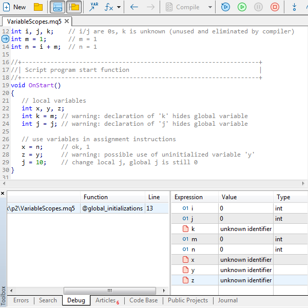
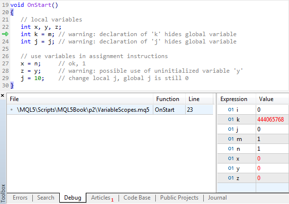
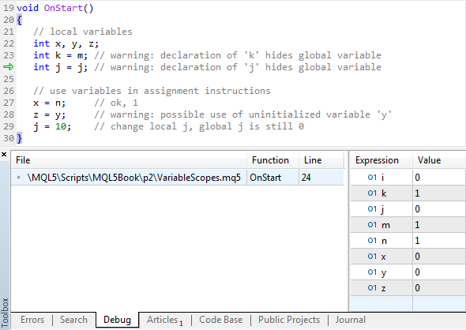

# Initialization

In describing variables, there is a possibility to set the initial value; it is specified following the variable name and symbol '=' and must correspond with the variable type or be cast to it (typecasting can be found in the relevant [section](/en/book/basis/conversion)).

```
int i = 3, j, k = 10;

```

Here i and k are initialized explicitly, while j is not.

Both a constant (literal of the relevant type) and an expression (a kind of formula for calculations) can be specified as the initial value. We will set out [expressions](/en/book/basis/expressions) separately. In the meantime, a simple example:

```
int i = 3, j = i, k = i + j;

```

Here, variable j takes the same value as variable i, while variable k takes the sum of i and j. Strictly speaking, in all three cases, we see expressions here. However, constant (3) is a special, degenerate expression option. In the second case, the only variable name is an expression, i.e., the expression result will be the value of this variable without any transformations. In the third case, two variables, i and j, are accessed in the expression, the addition operation is executed with their values, and after that, the result gets into variable k.

Since the statement containing the description of several variables is processed from left to right, the compiler already knows the names of previous variables when analyzing yet another description.

A program usually contains many statements with variable descriptions. They are read by the compiler in a natural top-down manner. In later initializations, names can be used taken from earlier descriptions. Here are the same variables described by two separate statements.

```
int i = 3, j = i;
int k = i + j;

```

Variables without an explicit initialization also get some initial values, but they depend on the place where the variable was described, i.e., on its context.

Where there is no initialization, local variables take random values at the moment of their generation: The compiler just allocates memory for them according to the type size, while it is unknown what will be at a specific address (various computer memory areas are often re-allocated to be used in different programs after they have become unnecessary for those executed earlier).

It is usually suggested that working values will be entered in local variables without initialization somewhere later in the algorithm code, such as using [assignment operations](/en/book/basis/expressions/operator_assignment) we will talk about later on. Syntactically, it is similar to initialization, since it also uses the equal sign, '=', to transfer the value from the "structure" placed on the right of it (it can be a constant, variable, expression, or function call, into the variable on the left. Only a variable can be to the left of '='.

The programmer should ensure that reading from the uninitialized variable only takes place upon a meaningful value is assigned to it. Compiler gives a warning if this is not the case ("possible use of uninitialized variable").

Everything is different with global variables.

An example of global variables is the GreetingHour input parameter of the GoodTime2 script from Part 2. The fact that the variable was described with keyword input does not affect its other properties as a variable. We could exclude its initialization and describe it as follows:

```
input uint GreetingHour;

```

This would not change anything in the program, because global variables are implicitly initialized by the compiler using zero if there is no explicit initialization (while we also had explicit initialization with zero before).

Whatever the variable type is, implicit initialization is always performed by a value equivalent to zero. For example, for a bool variable, false will be set, while for a datetime variable there will be D'1970.01.01 00:00:00'. There is a special value, NULL, for strings. It is, if you like, an even "emptier" string than empty quotes "" because there is still some memory allocated for them, where the only terminal null character is placed.

Along with local and global variables, there is another type, i.e., static variables. The compiler initializes them with zero implicitly, too, if the programmer has not written an explicitly initial value. They will be considered in the [next section](/en/book/basis/variables/static_variables).

Let's create a new script, VariableScopes.mq5, with examples of describing local and global variables (MQL5/Scripts/MQL5Book/VariableScopes.mq5).

```
// global variables
int i, j, k;    // all are 0s
int m = 1;      // m = 1                (place breakpoint on this line)
int n = i + m;  // n = 1
void OnStart()
{
  // local variables
  int x, y, z;
  int k = m; // warning: declaration of 'k' hides global variable
  int j = j; // warning: declaration of 'j' hides global variable
  // use variables in assignment statements  
  x = n;     // ok, 1
  z = y;     // warning: possible use of uninitialized variable 'y'
  j = 10;    // change local j, global j is still 0
}
// compilation error
// int bad = x; // 'x' - undeclared identifier

```

It should be remembered that, at launching an MQL program, the terminal first initializes all global variables and then calls a function that is the starting point for the programs of a relevant type. In this case, it is OnStart for scripts.

Here, only variables i, j, k, m, n are global since they are described outside the function (in our case, we only have one function, OnStart, which is necessary for scripts). i, j, k take the value of 0 implicitly. m and n contain 1.

You can run the script in the debugging mode on a step-by-step basis and make sure that the values of variables change exactly in this manner. For this purpose, you should preliminarily set a [breakpoint](https://www.metatrader5.com/en/metaeditor/help/development/debug#breakpoint) onto the string with the initialization of one of the global variables, such as m. Put the text cursor onto this string and execute Debug -> Toggle Breakpoint (F9), and the string will be highlighted with a blue sign in the left field, which signals that the program execution will stop here if it starts working on the debugger.

Then you should actually run the program for debugging, for which purpose execute command Debug -> Start on real data (F5). At this moment, a new chart will open in the terminal, in which this script starts being executed (caption "VariableScopes (Debugging)" in the upper right corner), but it suspends immediately, and we get back to MetaEditor. We should see a picture in it as follows.



Step-by-step debugging and viewing variables in MetaEditor

A string containing a breakpoint is now marked with an arrow sign — it is the current statement the program is preparing to execute but has not executed yet. The current stack of the program is shown lower left, which consists so far of only one entry: @global_initializations. You can enter expressions lower right to monitor their real-time values. We are interested in the values of variables; therefore, let's consecutively enter i, j, k, m, n, x, y, z (each in a separate string).

You will see further that MetaEditor automatically adds variables from the current context for viewing (for instance, local variables and the function inputs, where statements are executed inside the function). But now, we are going to add x, y, and z manually and in advance, just to show that they are not defined outside the function.

Please note that, for local variables, it is written "Unknown identifier" instead of a value, because there has not been the OnStart function block yet, where they are located. Global variables i and j will first have zero values. Global variable k is not used anywhere and, therefore, it is excluded by the compiler.

If we execute one step of the program execution (execute the statement on the current code line) using commands Step Into (F11) or Step Over (F10), we will see how variable m takes value 1. Another step will continue initialization for variable n, and it will also become 1.

Here, the descriptions of global variables end and, as we know, terminal calls function OnStart upon completion of the initialization of global variables. In this case, to step into function OnStart in the stepwise mode, press F11 once again (or you can set another breakpoint in the beginning of the OnStart function).

Local variables are initialized when the execution of the program statements reaches the code block where they have been defined. Therefore, variables x, y, z are only created upon stepping into the OnStart function.

When the debugger gets inside the OnStart function, with a little luck, you will be able to see that there are really initially random values in x, y, and z. "Luck" here consists in the fact that these random values may well be zero ones. Then it will be impossible to differ them from the implicit initialization with zero, compiler performs for global variables. If the script is launched repeatedly, the "garbage" in local variables will likely be different and more illustrative. They are not initialized explicitly and, therefore, their contents may be of any kind.

In the sequence of images below, you can see the evolution of variables using the step-by-step mode of the debugger. The current string to be executed (but not executed yet) is marked with a green arrow on the fields with enumeration.



Step-by-step debugging and viewing variables in MetaEditor (string 23)



Step-by-step debugging and viewing variables in MetaEditor (string 24)

It is demonstrated further in the code how these variables could be used in the simplest manner in assignment operators. The value of the global variable n is copied into the local x without any problems since n has been initialized. However, in the string where the contents of variable y are copied to variable z, a warning from the compiler appears, because y is local and, as of this moment, nothing has been written in it; i.e., there is not an explicit initialization, as well as other operators that can set its value.

Inside a function, it is permitted to describe variables with the same names as already used for global variables. A similar situation may occur in nested local blocks if a variable is created in an internal block with the name existing in an external block. However, this practice is not recommended, since it may lead to logical errors. In such cases, the compiler gives a warning ("declaration hides global/local variable").

Due to such redefining, a local variable, such as k in the example above, overlaps the homonym global one inside the function. Although they have the same name, these are two different variables. Local k is known inside OnStart, while global k is known everywhere apart from OnStart. In other words, any inside-the-block operations with variable k will only affect the local variable. Therefore, upon exiting function OnStart (as if it were not the only and core function of the script), we would discover that global variable k is still equal to zero.

Local variable j does not only overlap global variable j but is also initialized by the value of the latter one. In the string containing the description of j inside OnStart, the local version of j is still being created when the initial value for it is read from the global version of j. Upon a successful definition of local j, this name overlaps the global version, and it is the local version, to which the subsequent changes in j belong.

At the end of the source code, we have commented on the attempt to declare one more global variable, bad, in the initialization of which the value of variable x is called. This string causes a compiler error since variable x is unknown beyond the OnStart function, in which it has been defined.
