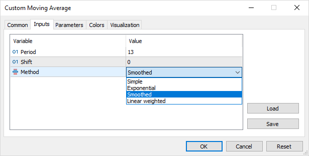

# Input variables

When launched, all programs in MQL5 can inquire parameters from the user. The only exception is libraries that are not executed independently, but as parts of another program (see the relevant section to know more about [Libraries](/en/book/advanced/libraries)).

Input parameters of MQL programs are global variables described in the code having a special modifier of input or sinput. They become available in the dialog of program properties for the user to enter values. We saw a description of the GreetingHour input variable in the scripts of Part 1.

A special feature of input variables is the fact that their value cannot be changed in the program code, i.e., it behaves like a constant.

Input variables can only be of simple built-in types or enumerations. For enumerations, you enter the values via a drop-down list; while you use input fields in all other cases. It is not permitted to describe as input: [Arrays](/en/book/basis/arrays), [structures or unions](/en/book/oop/structs_and_unions), and [classes](/en/book/oop/classes_and_interfaces).

The developer can set the input parameter name other than the variable identifier. This name will be shown to the user in the program properties dialog. A detailed description should be added as a sing-string comment upon the definition of the input parameter.

```
input int HourStart = 0; // Start of trading (hour, including):
input int HourStop = 0;  // End of trading (hour, excluding):

```

This allows making the interface user-friendlier, detailed, and free of syntactic constraints imposed by MQL5 on [identifiers](/en/book/basis/identifiers). Moreover, names (as well as comments) can be in your native language.

For example, MetaTrader 5 comes with the source code of indicator MQL5/Indicators/Examples/Custom Moving Average.mq5 with input variables:

```
input int            InpMAPeriod = 13;        // Period
input int            InpMAShift  = 0;         // Shift
input ENUM_MA_METHOD InpMAMethod = MODE_SMMA; // Method

```

This description generates the properties dialog below.



Sample dialog of the MQL program properties

The maximum length of the text representation of an input variable as an identifier=value pair, including character "=", may not exceed 255 characters (This constraint is imposed by the internal data exchange protocols of the terminal and testing agents). This limit is especially important for string variables since the values of other types never go beyond it. As we know, the length of an identifier is limited to 63 characters; therefore, depending on the identifier length, 191-253 characters are left for the value of the input string variable. The entire text exceeding the combined threshold of 255 chars may be cropped when being transferred to the tester. If a longer string has to be entered into your MQL program, use multiple input fields (to be continued) or allow the user to specify the name of the file, from which the text should be read.

For convenience in operating MQL programs, inputs can be combined in named blocks using keyword group (semicolon in the group string end is not necessary).

```
input group "group_name"
input type identifier = value;
...

```

All variables with modifier input following the group description (up to the description of another group or to the file end) are visually displayed as a nested list under the group header in the properties dialog of the MQL program. Moreover, groups of parameters can be deployed or collapsed by a mouse click in the strategy tester applicable to both indicators and EAs.

The sinput keyword is the abbreviation of static input, both forms being equivalent.

Variables described with modifiers sinput and static input cannot be involved in optimization. It only makes sense to use them in Expert Advisors being the only MQL program type supporting optimization. For more details, see the section dealing with [Testing and optimizing Expert Advisors](/en/book/automation/tester).
