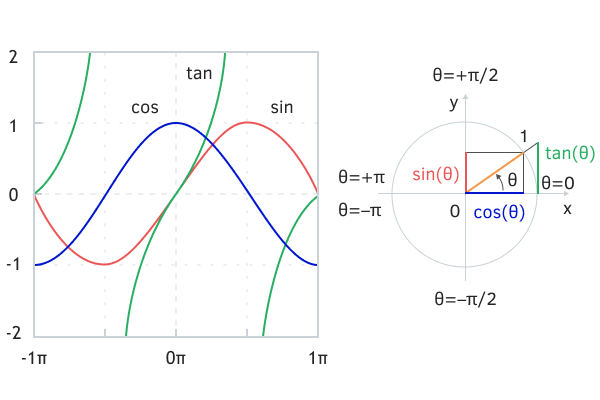

# Trigonometric functions

MQL5 provides the three main trigonometric functions (MathCos, MathSin, MathTan) and their inverses (MathArccos, MathArcsin, MathArctan). They all work with angles in radians. For angles in degrees, use the formula:

```
radians = degrees * M_PI / 180

```

Here M_PI is one of several constants with trigonometric quantities (pi and its derivatives) built into the language.

| Constant | Description | Value |
| --- | --- | --- |
| M_PI | π | 3.14159265358979323846 |
| M_PI_2 | π/2 | 1.57079632679489661923 |
| M_PI_4 | π/4 | 0.785398163397448309616 |
| M_1_PI | 1/π | 0.318309886183790671538 |
| M_2_PI | 2/π | 0.636619772367581343076 |

The arc tangent can also be calculated for a quantity represented by the ratio of two coordinates y and x: this extended version is called MathArctan2; it is able to restore angles in the full range of the circle from -M_PI to +M_PI, unlike MathArctan, which is limited to -M_PI_2 to +M_PI_2.



Trigonometric functions and quadrants of the unit circle

Examples of calculations are given in the script MathTrig.mq5 (see after the descriptions).

double MathCos(double value) ≡ double cos(double value)

double MathSin(double value) ≡ double sin(double value)

The functions return, respectively, the cosine and sine of the passed number (the angle is in radians).

double MathTan(double value) ≡ double tan(double value)

The function returns the tangent of the passed number (the angle is in radians).

double MathArccos(double value) ≡ double acos(double value)

double MathArcsin(double value) ≡ double asin(double value)

The functions return the value, respectively, of the arc cosine and arc sine of the passed number, i.e., the angle in radians. If x = MathCos(t), then t = MathArccos(x). The sine and arcsine have a similar scheme. If y = MathSin(t), then t = MathArcsin(y).

The parameter must be between -1 and +1. Otherwise, the function will return NaN.

The result of the arccosine is in the range from 0 to M_PI, and the result of the arcsine is from -M_PI_2 to +M_PI_2. The indicated ranges are called the main ranges, since the functions are multi-valued, i.e., their values are periodically repeated. The selected half-periods completely cover the definition area from -1 to +1.

The resulting angle for the cosine lies in the upper semicircle, and the symmetric solution in the lower semicircle can be obtained by adding a sign, i.e.t=-t. For the sine, the resulting angle is in the right semicircle, and the second solution in the left semicircle is M_PI-t (if for negative t it is also required to obtain a negative additional angle, then -M_PI-t).

double MathArctan(double value) ≡ double atan(double value)

The function returns the value of the arc tangent for the passed number, i.e., the angle in radians, in the range from -M_PI_2 to +M_PI_2.

The function is inverse to MathTan, but with one caveat.

Please note that the period of the tangent is 2 times less than the full period (circumference) due to the fact that the ratio of sine and cosine is repeated in opposite quadrants (quarters of a circle) due to superposition of signs. As a result, the tangent value alone is not sufficient to uniquely determine the original angle over the full range from -M_PI to +M_PI. This can be done using the function MathArctan2, in which the tangent is represented by two separate components.

double MathArctan2(double y, double x) ≡ double atan2(double y, double x)

The function returns in radians the value of the angle, the tangent of which is equal to the ratio of two specified numbers: coordinates along the y axis and along the x axis.

The result (let's denote it as r) lies in the range from -M_PI to +M_PI, and the condition MathTan(r) = y / x is met for it.

The function takes into account the sign of both arguments to determine the correct quadrant (subject to boundary conditions, when either x, or y are equal to 0, that is, they are on the border of the quadrants).

- 1 – x >= 0, y >= 0, 0 <= r <= M_PI_2
- 2 – x < 0, y >= 0, M_PI_2 < r <= M_PI
- 3 – x < 0, y < 0, -M_PI < r < -M_PI_2
- 4 – x >= 0, y < 0, -M_PI_2 <= r < 0

Below are the results of calling trigonometric functions in the script MathTrig.mq5.

```
void OnStart()
{
   PRT(MathCos(1.0));     // 0.5403023058681397
   PRT(MathSin(1.0));     // 0.8414709848078965
   PRT(MathTan(1.0));     // 1.557407724654902
   PRT(MathTan(45 * M_PI / 180.0)); // 0.9999999999999999
   
   PRT(MathArccos(1.0));         // 0.0
   PRT(MathArcsin(1.0));         // 1.570796326794897 == M_PI_2
   PRT(MathArctan(0.5));         // 0.4636476090008061, Q1
   PRT(MathArctan2(1.0, 2.0));   // 0.4636476090008061, Q1
   PRT(MathArctan2(-1.0, -2.0)); // -2.677945044588987, Q3
}

```
