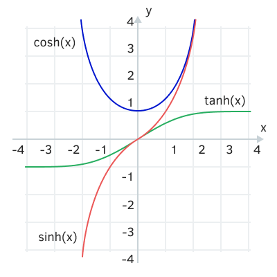

# Hyperbolic functions

The MQL5 API includes a set of direct and inverse hyperbolic functions.



Hyperbolic functions

double MathCosh(double value) ≡ double cosh(double value)

double MathSinh(double value) ≡ double sinh(double value)

double MathTanh(double value) ≡ double tanh(double value)

The three basic functions calculate the hyperbolic cosine, sine and tangent.

double MathArccosh(double value) ≡ double acosh(double value)

double MathArcsinh(double value) ≡ double asinh(double value)

double MathArctanh(double value) ≡ double atanh(double value)

The three inverse functions calculate the hyperbolic inverse cosine, inverse sine, and arc tangent.

For the arc cosine, the argument must be greater than or equal to +1. Otherwise, the function will return NaN.

The arc tangent is defined from -1 to +1. If the argument is beyond these limits, the function will return NaN.

Examples of hyperbolic functions are shown in the MathHyper.mq5 script.

```
void OnStart()
{
   PRT(MathCosh(1.0));    // 1.543080634815244
   PRT(MathSinh(1.0));    // 1.175201193643801
   PRT(MathTanh(1.0));    // 0.7615941559557649
   
   PRT(MathArccosh(0.5)); // nan
   PRT(MathArcsinh(0.5)); // 0.4812118250596035
   PRT(MathArctanh(0.5)); // 0.5493061443340549
   
   PRT(MathArccosh(1.5)); // 0.9624236501192069
   PRT(MathArcsinh(1.5)); // 1.194763217287109
   PRT(MathArctanh(1.5)); // nan
}

```
