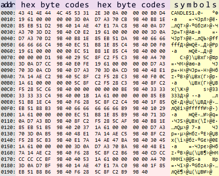

# Writing and reading structures (binary files)

In the previous section, we learned how to perform I/O operations on arrays of structures. When reading or writing is related to a separate structure, it is more convenient to use the pair of functions FileWriteStruct and FileReadStruct.

uint FileWriteStruct(int handle, const void &data, int size = -1)

The function writes the contents of a simple data structure to a binary file with the handle descriptor. As we know, such structures can only contain fields of built-in non-string types and nested simple structures.

The main feature of the function is the size parameter. It helps to set the number of bytes to be written, which allows us to discard some part of the structure (its end). By default, the parameter is -1, which means that the entire structure is saved. If size is greater than the size of the structure, the excess is ignored, i.e., only the structure is written, sizeof(data) bytes.

On success, the function returns the number of bytes written, on error it returns 0.

uint FileReadStruct(int handle, void &data, int size = -1)

The function reads content from a binary file with the handle descriptor to the data structure. The size parameter specifies the number of bytes to be read. If it is not specified or exceeds the size of the structure, then the exact size of the specified structure is used.

On success, the function returns the number of bytes read, on error it returns 0.

The option to cut off the end of the structure is present only in the FileWriteStruct and FileReadStruct functions. Therefore, their use in a loop becomes the most suitable alternative for saving and reading an array of trimmed structures: the FileWriteArray and FileReadArray functions do not have this capability, and writing and reading by individual fields can be more resource-intensive (we will look at the corresponding functions in the following sections).

It should be noted that in order to use this feature, you should design your structures in such a way that all temporary and intermediary calculation fields that should not be saved are located at the end of the structure.

Let's look at examples of using these two functions in the script FileStruct.mq5.

Suppose we want to archive the latest quotes from time to time, in order to be able to check their invariance in the future or to compare with similar periods from other providers. Basically, this can be done manually through the Symbols dialog (in the Bars tab) in MetaTrader 5. But this would require extra effort and adherence to a schedule. It is much easier to do this automatically, from the program. In addition, manual export of quotes is done in CSV text format, and we may need to send files to an external server. Therefore, it is desirable to save them in a compact binary form. In addition to this, let's assume that we are not interested in information about ticks, spread and real volumes (which are always empty for Forex symbols).

In the section [Comparing, sorting, and searching in arrays](/en/book/common/arrays/arrays_compare_sort_search), we considered the MqlRates structure and the CopyRates function. They will be described in detail [later](/en/book/applications/timeseries/timeseries_mqlrates), while now we will use them once more as a testing ground for file operations.

Using the size parameter in FileWriteStruct, we can save only part of the MqlRates structure, without the last fields.

At the beginning of the script, we define the macros and the name of the test file.

```
#define BARLIMIT 10 // number of bars to write
#define HEADSIZE 10 // size of the header of our format 
const string filename = "MQL5Book/struct.raw";

```

Of particular interest is the HEADSIZE constant. As mentioned earlier, file functions as such are not responsible for the consistency of the data in the file, and the types of structures into which this data is read. The programmer must provide such control in their code. Therefore, a certain header is usually written at the beginning of the file, with the help of which you can, firstly, make sure that this is a file of the required format, and secondly, save the meta-information in it that is necessary for proper reading.

In particular, the title may indicate the number of entries. Strictly speaking, the latter is not always necessary, because we can read the file gradually until it ends. However, it is more efficient to allocate memory for all expected records at once, based on the counter in the header.

For our purposes, we have developed a simple structure FileHeader.

```
struct FileHeader
{
   uchar signature[HEADSIZE];
   int n;
   FileHeader(const int size = 0) : n(size)
   {
      static uchar s[HEADSIZE] = {'C','A','N','D','L','E','S','1','.','0'};
      ArrayCopy(signature, s);
   }
};

```

It starts with the text signature "CANDLES" (in the signature field), the version number "1.0" (same location), and the number of entries (the n field). Since we cannot use a string field for the signature (then the structure would no longer be simple and meet the requirements of file functions), the text is actually packed into the uchar array of the fixed size HEADSIZE. Its initialization in the instance is done by the constructor based on the local static copy.

In the OnStart function, we request the BARLIMIT of the last bars, open the file in FILE_WRITE mode, and write the header followed by the resulting quotes in a truncated form to the file.

```
void OnStart()
{
   MqlRates rates[], candles[];
   int n = PRTF(CopyRates(_Symbol, _Period, 0, BARLIMIT, rates)); // 10 / ok
   if(n < 1) return;
  
   // create a new file or overwrite the old one from scratch
   int handle = PRTF(FileOpen(filename, FILE_BIN | FILE_WRITE)); // 1 / ok
  
 FileHeaderfh(n);// header with the actual number of entries
  
   // first write the header
   PRTF(FileWriteStruct(handle, fh)); // 14 / ok
  
   // then write the data
   for(int i = 0; i < n; ++i)
   {
      FileWriteStruct(handle, rates[i], offsetof(MqlRates, tick_volume));
   }
   FileClose(handle);
   ArrayPrint(rates);
   ...

```

As the size parameter value in the FileWriteStruct function, we use an expression with a familiar operator [offsetof](/en/book/oop/structs_and_unions/structs_pack_dll): offsetof(MqlRates, tick_volume), i.e., all fields starting with tick_volume are discarded when writing to the file.

To test the data reading, let's open the same file in FILE_READ mode and read the FileHeader structure.

```
   handle = PRTF(FileOpen(filename, FILE_BIN | FILE_READ)); // 1 / ok
   FileHeader reference, reader;
   PRTF(FileReadStruct(handle, reader)); // 14 / ok
   // if the headers don't match, it's not our data
   if(ArrayCompare(reader.signature, reference.signature))
   {
      Print("Wrong file format; 'CANDLES' header is missing");
      return;
   }

```

The reference structure contains the unchanged default header (signature). The reader structure got 14 bytes from the file. If the two signatures match, we can continue to work, since the file format turned out to be correct, and the reader.n field contains the number of entries read from the file. We allocate and zero out the required size memory for the receiving array candles, and then read all entries into it.

```
   PrintFormat("Reading %d candles...", reader.n);
 ArrayResize(candles, reader.n);// allocate memory for the expected data in advance
   ZeroMemory(candles);
   
   for(int i = 0; i < reader.n; ++i)
   {
      FileReadStruct(handle, candles[i], offsetof(MqlRates, tick_volume));
   }
   FileClose(handle);
   ArrayPrint(candles);
}

```

Zeroing was required because the MqlRates structures are read partially, and the remaining fields would contain garbage without zeroing.

Here is the log showing the initial data (as a whole) for XAUUSD,H1.

```
                 [time]  [open]  [high]   [low] [close] [tick_volume] [spread] [real_volume]
[0] 2021.08.16 03:00:00 1778.86 1780.58 1778.12 1780.56          3049        5             0
[1] 2021.08.16 04:00:00 1780.61 1782.58 1777.10 1777.13          4633        5             0
[2] 2021.08.16 05:00:00 1777.13 1780.25 1776.99 1779.21          3592        5             0
[3] 2021.08.16 06:00:00 1779.26 1779.26 1776.67 1776.79          2535        5             0
[4] 2021.08.16 07:00:00 1776.79 1777.59 1775.50 1777.05          2052        6             0
[5] 2021.08.16 08:00:00 1777.03 1777.19 1772.93 1774.35          3213        5             0
[6] 2021.08.16 09:00:00 1774.38 1775.41 1771.84 1773.33          4527        5             0
[7] 2021.08.16 10:00:00 1773.26 1777.42 1772.84 1774.57          4514        5             0
[8] 2021.08.16 11:00:00 1774.61 1776.67 1773.69 1775.95          3500        5             0
[9] 2021.08.16 12:00:00 1775.96 1776.12 1773.68 1774.44          2425        5             0

```

Now let's see what was read.

```
                 [time]  [open]  [high]   [low] [close] [tick_volume] [spread] [real_volume]
[0] 2021.08.16 03:00:00 1778.86 1780.58 1778.12 1780.56             0        0             0
[1] 2021.08.16 04:00:00 1780.61 1782.58 1777.10 1777.13             0        0             0
[2] 2021.08.16 05:00:00 1777.13 1780.25 1776.99 1779.21             0        0             0
[3] 2021.08.16 06:00:00 1779.26 1779.26 1776.67 1776.79             0        0             0
[4] 2021.08.16 07:00:00 1776.79 1777.59 1775.50 1777.05             0        0             0
[5] 2021.08.16 08:00:00 1777.03 1777.19 1772.93 1774.35             0        0             0
[6] 2021.08.16 09:00:00 1774.38 1775.41 1771.84 1773.33             0        0             0
[7] 2021.08.16 10:00:00 1773.26 1777.42 1772.84 1774.57             0        0             0
[8] 2021.08.16 11:00:00 1774.61 1776.67 1773.69 1775.95             0        0             0
[9] 2021.08.16 12:00:00 1775.96 1776.12 1773.68 1774.44             0        0             0

```

The quotes match, but the last three fields in each structure are empty.

You can open the MQL5/Files/MQL5Book folder and examine the internal representation of the struct.raw file (use a viewer that supports binary mode; an example is shown below).



Options for presenting a binary file with quotes archive in an external viewer

Here is a typical way to display binary files: the left column shows addresses (offsets from the beginning of the file), byte codes are in the middle column, and the symbolic representations of the corresponding bytes are shown in the right column. The first and second columns use the hexadecimal notation for numbers. The characters in the right column may differ depending on the selected ANSI code page. It makes sense to pay attention to them only in those fragments where the presence of text is known. In our case, the signature "CANDLES1.0" is clearly "manifested" at the very beginning. Numbers should be analyzed by the middle column. In this column for example, after the signature, you can see the 4-byte value 0x0A000000, i.e., 0x0000000A in an inverted form (remember the section [Endianness control in integers](/en/book/common/maths/maths_byte_swap)): this is 10, the number of structures written.
