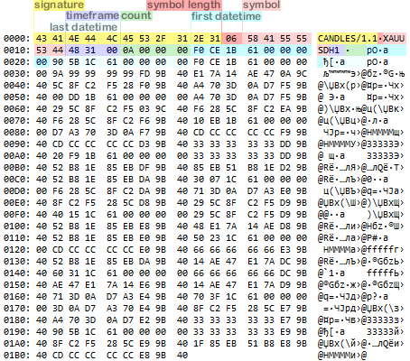

# Writing and reading variables (binaries)

If a structure contains fields of types that are prohibited for simple structures (strings, dynamic arrays, pointers), then it will not be possible to write it to a file or read from a file using the functions considered earlier. The same goes for class objects. However, such entities usually contain most of the data in programs and also require saving and restoring their state.

Using the example of the header structure in the previous section, it was clearly shown that strings (and other types of variable length) can be avoided, but in this case, one has to invent alternative, more cumbersome implementations of algorithms (for example, replacing a string with an array of characters).

To write and read data of arbitrary complexity, MQL5 provides sets of lower-level functions which operate on a single value of a particular type: double, float, int/uint, long/ulong, or string. All other built-in MQL5 types are equivalent to integers of different sizes: char/uchar is 1 byte, short/ushort is 2 bytes, color is 4 bytes, enumerations are 4 bytes, and datetime is 8 bytes. Such functions can be called atomic (i.e., indivisible), because the functions for reading and writing to files at the bit level no longer exist.

Of course, element-by-element writing or reading also removes the restriction on file operations with dynamic arrays.

As for pointers to objects, in the spirit of the OOP paradigm, we can allow them to save and restore objects: it is enough to implement in each class an interface (a set of methods) that is responsible for transferring important content to files and back, and using low-level functions. Then, if we come across a pointer field to another object as part of the object, we simply delegate saving or reading to it, and in turn, it will deal with its fields, among which there may be other pointers, and the delegation will continue deeper until will cover all elements.

Please note that in this section we will look at atomic functions for binary files. Their counterparts for text files will be presented in the [next section](/en/book/common/files/files_txt_atomic). All functions in this section return the number of bytes written, or 0 in case of an error.

uint FileWriteDouble(int handle, double value)

uint FileWriteFloat(int handle, float value)

uint FileWriteLong(int handle, long value)

The functions write the value of the corresponding type passed in the parameter value (double, float, long) to a binary file with the handle descriptor.

uint FileWriteInteger(int handle, int value, int size = INT_VALUE)

The function writes the value integer to a binary file with the handle descriptor. The size of the value in bytes is set by the size parameter and can be one of the predefined constants: CHAR_VALUE (1), SHORT_VALUE (2), INT_VALUE (4, default), which corresponds to types char, short and int (signed and unsigned).

The function supports an undocumented writing mode of a 3-byte integer. Its use is not recommended.

The file pointer moves by the number of bytes written (not by the int size).

uint FileWriteString(int handle, const string value, int length = -1)

The function writes a string from the value parameter to a binary file with the handle descriptor. You can specify the number of characters to write the length parameter. If it is less than the length of the string, only the specified part of the string will be included in the file. If length is -1 or is not specified, the entire string is transferred to the file without the terminal null. If length is greater than the length of the string, extra characters are filled with zeros.

Note that when writing to a file opened with the FILE_UNICODE flag (or without the FILE_ANSI flag), the string is saved in the Unicode format (each character takes up 2 bytes). When writing to a file opened with the FILE_ANSI flag, each character occupies 1 byte (foreign language characters may be distorted).

The FileWriteString function can also work with text files. This aspect of its application is described in the next section.

double FileReadDouble(int handle)

float FileReadFloat(int handle)

long FileReadLong(int handle)

The functions read a number of the appropriate type, double, float or long, from a binary file with the specified descriptor. If necessary, convert the result to ulong (if an unsigned long is expected in the file at that position).

int FileReadInteger(int handle, int size = INT_VALUE)

The function reads an integer value from a binary file with the handle descriptor. The value size in bytes is specified in the size parameter.

Since the result of the function is of type int, it must be explicitly converted to the required target type if it is different from int (i.e. to uint, or short/ushort, or char/uchar). Otherwise, you will at least get a compiler warning and at most a loss of sign.

The fact is that when reading CHAR_VALUE or SHORT_VALUE, the default result is always positive (i.e. corresponds to uchar and ushort, which are wholly "fit" in int). In these cases, if the numbers are actually of types uchar and ushort, the compiler warnings are purely nominal, since we are already sure that inside the value of type int only 1 or 2 low bytes are filled, and they are unsigned. This happens without distortion.

However, when storing signed values (types char and short) in the file, conversion becomes necessary because, without it, negative values will turn into inverse positive ones with the same bit representation (see the 'Signed and unsigned integers' part in the [Arithmetic type conversions](/en/book/basis/conversion/conversion_arithmetic) section).

In any case, it is better to avoid warnings by explicit type conversion.

The function supports 3-byte integer reading mode. Its use is not recommended.

The file pointer moves by the number of bytes read (not by the size int).

string FileReadString(int handle, int size = -1)

The function reads a string of the specified size in characters from a file with the handle descriptor. The size parameter must be set when working with a binary file (the default value is only suitable for text files that use separator characters). Otherwise, the string is not read (the function returns an empty string), and the internal error code _LastError is 5016 (FILE_BINSTRINGSIZE).

Thus, even at the stage of writing a string to a binary file, you need to think about how the string will be read. There are three main options:

- Write strings with a null terminal character at the end. In this case, they will have to be analyzed character by character in a loop and combine characters into a string until 0 is encountered.
- Always write a string of the fixed (predefined) length. The length should be chosen with a margin for most scenarios, or according to the specification (terms of reference, protocol, etc.), but this is uneconomical and does not give a 100% guarantee that some rare string will not be shortened when writing to a file.
- Write the length as an integer before the string.

The FileReadString function can also work with text files. This aspect of its application is described in the next section.

Also note that if the size parameter is 0 (which can happen during some calculations), then the function does not read: the file pointer remains in the same place and the function returns an empty string.

As an example for this section, we will improve the FileStruct.mq5 script from the previous section. The new program name is FileAtomic.mq5.

The task remains the same: save a given number of truncated [MqlRates](/en/book/applications/timeseries/timeseries_mqlrates) structures with quotes to a binary file. But now the FileHeader structure will become a class (and the format signature will be stored in a string, not in an array of characters). A header of this type and an array of quotes will be part of another control class Candles, and both classes will be inherited from the Persistent interface for writing arbitrary objects to a file and reading from a file.

Here is the interface:

```
interface Persistent
{
   bool write(int handle);
   bool read(int handle);
};

```

In the FileHeader class, we will implement the saving and checking of the format signature (let's change it to "CANDLES/1.1") and of the names of the current symbol and chart timeframe (more about [_Symbol](/en/book/applications/charts/charts_main_properties) and [_Period](/en/book/applications/charts/charts_main_properties)).

Writing is done in the implementation of the write method inherited from the interface.

```
class FileHeader : public Persistent
{
   const string signature;
public:
   FileHeader() : signature("CANDLES/1.1") { }
   bool write(int handle) override
   {
      PRTF(FileWriteString(handle, signature, StringLen(signature)));
      PRTF(FileWriteInteger(handle, StringLen(_Symbol), CHAR_VALUE));
      PRTF(FileWriteString(handle, _Symbol));
      PRTF(FileWriteString(handle, PeriodToString(), 3));
      return true;
   }

```

The signature is written exactly according to its length since the sample is stored in the object and the same length will be set when reading.

For the instrument of the current chart, we first save the length of its name in the file (1 byte is enough for lengths up to 255), and only then we save the string itself.

The name of the timeframe never exceeds 3 symbols, if the constant prefix "PERIOD_" is excluded from it, therefore a fixed length is chosen for this string. The timeframe name without a prefix is obtained in the auxiliary function PeriodToString: it is in a separate header file Periods.mqh (it will be discussed in more detail in the section [Symbols and timeframes](/en/book/applications/timeseries/timeseries_symbol_period)).

Reading is performed in read method in the reverse order (of course, it is assumed that the reading will be performed in a different, new object).

```
   bool read(int handle) override
   {
      const string sig = PRTF(FileReadString(handle, StringLen(signature)));
      if(sig != signature)
      {
         PrintFormat("Wrong file format, header is missing: want=%s vs got %s", 
            signature, sig);
         return false;
      }
      const int len = PRTF(FileReadInteger(handle, CHAR_VALUE));
      const string sym = PRTF(FileReadString(handle, len));
      if(_Symbol != sym)
      {
         PrintFormat("Wrong symbol: file=%s vs chart=%s", sym, _Symbol);
         return false;
      }
      const string stf = PRTF(FileReadString(handle, 3));
      if(_Period != StringToPeriod(stf))
      {
         PrintFormat("Wrong timeframe: file=%s(%s) vs chart=%s", 
            stf, EnumToString(StringToPeriod(stf)), EnumToString(_Period));
         return false;
      }
      return true;
   }

```

If any of the properties (signature, symbol, timeframe) does not match in the file and on the current chart, the function returns false to indicate an error.

The reverse transformation of the timeframe name into the ENUM_TIMEFRAMES enumeration is done by the function StringToPeriod, also from the file Periods.mqh.

The main Candles class for requesting, saving and reading the archive of quotes is as follows.

```
class Candles : public Persistent
{
   FileHeader header;
   int limit;
   MqlRates rates[];
public:
   Candles(const int size = 0) : limit(size)
   {
      if(size == 0) return;
      int n = PRTF(CopyRates(_Symbol, _Period, 0, limit, rates));
      if(n < 1)
      {
 limit =0; // initialization failed
      }
 limit =n; // may be less than requested
   }

```

The fields are the header of the FileHeader type, the requested number of bars limit, and an array receiving MqlRates structures from MetaTrader 5. The array is filled in the constructor. In case of an error, the limit field is reset to zero.

Being derived from the Persistent interface, the Candles class requires the implementation of methods write and read. In the write method, we first instruct the header object to save itself, and then append the number of quotes, the date range (for reference), and the array itself to the file.

```
   bool write(int handle) override
   {
      if(!limit) return false; // no data
      if(!header.write(handle)) return false;
      PRTF(FileWriteInteger(handle, limit));
      PRTF(FileWriteLong(handle, rates[0].time));
      PRTF(FileWriteLong(handle, rates[limit - 1].time));
      for(int i = 0; i < limit; ++i)
      {
         FileWriteStruct(handle, rates[i], offsetof(MqlRates, tick_volume));
      }
      return true;
   }

```

Reading is done in reverse order:

```
   bool read(int handle) override
   {
      if(!header.read(handle))
      {
         return false;
      }
      limit = PRTF(FileReadInteger(handle));
      ArrayResize(rates, limit);
      ZeroMemory(rates);
      // dates need to be read: they are not used, but this shifts the position in the file;
      // it was possible to explicitly change the position, but this function has not yet been studied
      datetime dt0 = (datetime)PRTF(FileReadLong(handle));
      datetime dt1 = (datetime)PRTF(FileReadLong(handle));
      for(int i = 0; i < limit; ++i)
      {
         FileReadStruct(handle, rates[i], offsetof(MqlRates, tick_volume));
      }
      return true;
   }

```

In a real program for archiving quotes, the presence of a range of dates would allow building their correct sequence over a long history by the file headers and, to some extent, would protect against arbitrary renaming of files.

There is a simple print method to control the process:

```
   void print() const
   {
      ArrayPrint(rates);
   }

```

In the main function of the script, we create two Candles objects, and using one of them, we first save the quotes archive and then restore it with the help of the other. Files are managed by the wrapper FileHandle that we already know (see section [File descriptor management](/en/book/common/files/files_handles)).

```
const string filename = "MQL5Book/atomic.raw";
  
void OnStart()
{
   // create a new file and reset the old one
   FileHandle handle(PRTF(FileOpen(filename, 
      FILE_BIN | FILE_WRITE | FILE_ANSI | FILE_SHARE_READ)));
   // form data
   Candles output(BARLIMIT);
   // write them to a file
   if(!output.write(~handle))
   {
      Print("Can't write file");
      return;
   }
   output.print();
  
   // open the newly created file for checking
   handle = PRTF(FileOpen(filename, 
      FILE_BIN | FILE_READ | FILE_ANSI | FILE_SHARE_READ | FILE_SHARE_WRITE));
   // create an empty object to receive quotes
   Candles inputs;
   // read data from the file into it
   if(!inputs.read(~handle))
   {
      Print("Can't read file");
   }
   else
   {
      inputs.print();
   }

```

Here is an example of logs of initial data for XAUUSD,H1:

```
FileOpen(filename,FILE_BIN|FILE_WRITE|FILE_ANSI|FILE_SHARE_READ)=1 / ok
CopyRates(_Symbol,_Period,0,limit,rates)=10 / ok
FileWriteString(handle,signature,StringLen(signature))=11 / ok
FileWriteInteger(handle,StringLen(_Symbol),CHAR_VALUE)=1 / ok
FileWriteString(handle,_Symbol)=6 / ok
FileWriteString(handle,PeriodToString(),3)=3 / ok
FileWriteInteger(handle,limit)=4 / ok
FileWriteLong(handle,rates[0].time)=8 / ok
FileWriteLong(handle,rates[limit-1].time)=8 / ok
                 [time]  [open]  [high]   [low] [close] [tick_volume] [spread] [real_volume]
[0] 2021.08.17 15:00:00 1791.40 1794.57 1788.04 1789.46          8157        5             0
[1] 2021.08.17 16:00:00 1789.46 1792.99 1786.69 1789.69          9285        5             0
[2] 2021.08.17 17:00:00 1789.76 1790.45 1780.95 1783.30          8165        5             0
[3] 2021.08.17 18:00:00 1783.30 1783.98 1780.53 1782.73          5114        5             0
[4] 2021.08.17 19:00:00 1782.69 1784.16 1782.09 1782.49          3586        6             0
[5] 2021.08.17 20:00:00 1782.49 1786.23 1782.17 1784.23          3515        5             0
[6] 2021.08.17 21:00:00 1784.20 1784.85 1782.73 1783.12          2627        6             0
[7] 2021.08.17 22:00:00 1783.10 1785.52 1782.37 1785.16          2114        5             0
[8] 2021.08.17 23:00:00 1785.11 1785.84 1784.71 1785.80           922        5             0
[9] 2021.08.18 01:00:00 1786.30 1786.34 1786.18 1786.20            13        5             0

```

And here is an example of the recovered data (recall that the structures are saved in a truncated form according to our hypothetical technical task):

```
FileOpen(filename,FILE_BIN|FILE_READ|FILE_ANSI|FILE_SHARE_READ|FILE_SHARE_WRITE)=2 / ok
FileReadString(handle,StringLen(signature))=CANDLES/1.1 / ok
FileReadInteger(handle,CHAR_VALUE)=6 / ok
FileReadString(handle,len)=XAUUSD / ok
FileReadString(handle,3)=H1 / ok
FileReadInteger(handle)=10 / ok
FileReadLong(handle)=1629212400 / ok
FileReadLong(handle)=1629248400 / ok
                 [time]  [open]  [high]   [low] [close] [tick_volume] [spread] [real_volume]
[0] 2021.08.17 15:00:00 1791.40 1794.57 1788.04 1789.46             0        0             0
[1] 2021.08.17 16:00:00 1789.46 1792.99 1786.69 1789.69             0        0             0
[2] 2021.08.17 17:00:00 1789.76 1790.45 1780.95 1783.30             0        0             0
[3] 2021.08.17 18:00:00 1783.30 1783.98 1780.53 1782.73             0        0             0
[4] 2021.08.17 19:00:00 1782.69 1784.16 1782.09 1782.49             0        0             0
[5] 2021.08.17 20:00:00 1782.49 1786.23 1782.17 1784.23             0        0             0
[6] 2021.08.17 21:00:00 1784.20 1784.85 1782.73 1783.12             0        0             0
[7] 2021.08.17 22:00:00 1783.10 1785.52 1782.37 1785.16             0        0             0
[8] 2021.08.17 23:00:00 1785.11 1785.84 1784.71 1785.80             0        0             0
[9] 2021.08.18 01:00:00 1786.30 1786.34 1786.18 1786.20             0        0             0

```

It is easy to make sure that the data is stored and read correctly. And now let's see how they look inside the file:



Viewing the internal structure of a binary file with an archive of quotes in an external program

Here, various fields of our header are highlighted with color: signature, symbol name length, symbol name, timeframe name, etc.
