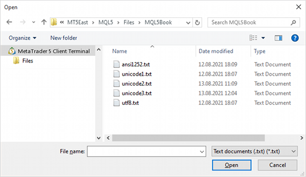

# File or folder selection dialog

In the group of functions for working with files and folders, there is one that allows to interactively request the name of a file or folder, as well as a group of files from the user in order to pass this information to an MQL program. Calling the FileSelectDialog function causes a standard Windows window for selecting files and folders to appear in the terminal.

Since the dialog interrupts the execution of the MQL program until it is closed, the function call is allowed only in two types of MQL programs that are executed in separate threads: EAs and scripts (see [Types of MQL programs](/en/book/applications/runtime/runtime_features_by_progtype)). Using this function is prohibited in indicators and services: the former are executed in the terminal's interface thread (and stopping them would freeze updating the charts of the corresponding instruments), while the latter are executed in the background and cannot access the user interface.

All elements of the file system that the function works with are located inside the sandbox, i.e., in the directory of the current copy of the terminal or testing agent (if the program is running in the tester), in the subfolder MQL5/Files.

If the FSD_COMMON_FOLDER flag is present in the flags parameter (see further), a common sandbox of all terminals Users/<user>...MetaQuotes/Terminal/Common/Files is used.

The appearance of the dialog depends on the Windows operating system. One of the possible interface options is shown below.



Windows file and folder selection dialog

int FileSelectDialog(const string caption, const string initDir, const string filter,  

     uint flags, string &filenames[], const string defaultName)

The function displays a standard Windows dialog for opening or creating a file or selecting a folder. The title is specified in the caption parameter. If the value is NULL, the standard title is used: "Open" for reading or "Save as" for writing a file, or "Select folder", depending on the flags in the flags parameter.

The initDir parameter allows you to set the initial folder for which the dialog will open. If set to NULL, the contents of the MQL5/Files folder will be shown. The same folder is used if a non-existent path is specified in initDir.

Using the filter parameter, you can limit the set of file extensions that will be shown in the dialog box. Files of other formats will be hidden. NULL means no restrictions.

The format of the filter string is as follows:

```
"<description 1>|<extension 1>|<description 2>|<extension 2>..."

```

Any string is allowed as description. You can write any filter with the substituted characters '*' and '?' that we discussed in the section [Finding files and folders](/en/book/common/files/files_find) as extensions. Symbol '|' is a delimiter.

Since the adjacent description and extension form a logically related pair, the total number of elements in the line must be even, and the number of delimiters must be odd.

Each combination of description and extension generates a separate selection in the dialog's drop-down list. The description is shown to the user and the extension is used for filtering.

For example, "Text documents (*.txt)|*.txt|All files (*.*)|*.*", while the first extension "Text documents (*.txt)|*.txt" will be selected as the default file type.

In the flags parameter, you can indicate a bit mask specifying the operating modes using the '|' operator. The following constants are defined for it:

- FSD_WRITE_FILE — file writing mode ("Save as"). In the absence of this flag, the read mode ("Open") is used by default. If this flag is present, the input of an arbitrary new name is always allowed, regardless of the FSD_FILE_MUST_EXIST flag.
- FSD_SELECT_FOLDER — folder selection mode (only one and only existing). With this flag, all other flags except FSD_COMMON_FOLDER are ignored or cause an error. You cannot explicitly request the creation of a folder, but it is possible to create a folder interactively in the dialog and immediately select it.
- FSD_ALLOW_MULTISELECT — permission to select multiple files in read mode. This flag is ignored if FSD_WRITE_FILE or FSD_SELECT_FOLDER is specified.
- FSD_FILE_MUST_EXIST — the selected files must exist. If the user tries to specify an arbitrary name, the dialog will display a warning and remain open. This flag is ignored if FSD_WRITE_FILE mode is specified.
- FSD_COMMON_FOLDER — the dialog is opened for a common sandbox of all client terminals.

The function will fill an array of strings filenames with the names of the selected files or folder. If the array is dynamic, its size changes to fit the actual amount of data, in particular, expands or truncates down to 0 if nothing was selected. If the array is fixed, it must be large enough to accept the expected data. Otherwise, an error 4007 (ARRAY_RESIZE_ERROR) will occur.

The defaultName parameter specifies the default file/folder name, which will be substituted into the corresponding input field immediately after opening the dialog. If the parameter is NULL, the field will be initially empty.

If the defaultName parameter is set, then during non-visual testing of the MQL program, FileSelectDialog call will return 1 and the defaultName value itself will be copied to the filenames array.

The function returns the number of items selected (0 if the user didn't select anything), or -1 if there was an error.

Consider examples of how the function works in the script FileSelect.mq5. In the OnStart function, we will sequentially call FileSelectDialog with different settings. As long as the user selects something (doesn't click the "Cancel" button in the dialog), the test continues all the way to the last step (even if the function executes with an error code).

```
void OnStart()
{
 string filenames[]; // a dynamic array suitable for any call
 string fixed[1]; // too small array if there are more than 1 files
 const stringfilter = // filter example
      "Text documents (*.txt)|*.txt"
      "|Files with short names|????.*"
      "|All files (*.*)|*.*";

```

First, we will ask the user for one file from the "MQL5Book" folder. You can select an existing file or enter a new name (because there is no FSD_FILE_MUST_EXIST flag).

```
   Print("Open a file");
   if(PRTF(FileSelectDialog(NULL, "MQL5book", filter, 
      0, filenames, NULL)) == 0) return;             // 1
   ArrayPrint(filenames);                            // "MQL5Book\utf8.txt"

```

Assuming that the folder contains at least 5 files from the book delivery, one of them is selected here.

Then we will make a similar request in "for writing" mode (with the FSD_WRITE_FILE flag).

```
   Print("Save as a file");
   if(PRTF(FileSelectDialog(NULL, "MQL5book", NULL, 
      FSD_WRITE_FILE, filenames, NULL)) == 0) return;// 1 
   ArrayPrint(filenames);                            // "MQL5Book\newfile"

```

Here the user will also be able to select both an existing file and enter a new name. A check of whether the user is going to overwrite an existing file must be done by the programmer (the dialog does not generate warnings).

Now let's check the selection of multiple files (FSD_ALLOW_MULTISELECT) in a dynamic array.

```
   if(PRTF(FileSelectDialog(NULL, "MQL5book", NULL, 
     FSD_FILE_MUST_EXIST | FSD_ALLOW_MULTISELECT, filenames, NULL)) == 0) return; // 5
   ArrayPrint(filenames);
   // "MQL5Book\ansi1252.txt" "MQL5Book\unicode1.txt" "MQL5Book\unicode2.txt"
   // "MQL5Book\unicode3.txt" "MQL5Book\utf8.txt"

```

The presence of the FSD_FILE_MUST_EXIST flag means that the dialog will display a warning and remain open if you try to enter a new name.

If we try to select more than one file in a fixed-size array in a similar way, we will get an error.

```
   Print("Open multiple files (fixed, choose more than 1 file for error)");
   if(PRTF(FileSelectDialog(NULL, "MQL5book", NULL, 
      FSD_FILE_MUST_EXIST | FSD_ALLOW_MULTISELECT, fixed, NULL)) == 0) return;
   // -1 / ARRAY_RESIZE_ERROR(4007)
   ArrayPrint(fixed); // null

```

Finally, let's check folder operations (FSD_SELECT_FOLDER).

```
   Print("Select a folder");
   if(PRTF(FileSelectDialog(NULL, "MQL5book/nonexistent", NULL, 
      FSD_SELECT_FOLDER, filenames, NULL)) == 0) return; // 1
   ArrayPrint(filenames); // "MQL5Book"

```

In this case, the non-existent subfolder "nonexistent" is specified as the start path, so the dialog will open in the root of the sandbox MQL5/Files. There we chose "MQL5book".

If we combine an invalid combination of flags, we get another error.

```
   if(PRTF(FileSelectDialog(NULL, "MQL5book", NULL, 
      FSD_SELECT_FOLDER | FSD_WRITE_FILE, filenames, NULL)) == 0) return;
   // -1 / INTERNAL_ERROR(4001)
   ArrayPrint(filenames); // "MQL5Book"
}

```

Due to an error, the function did not modify the passed array, and the old "MQL5Book" element remained in it.

In this test, we deliberately checked the results only for 0 in order to demonstrate all options, regardless of the presence of errors. In a real program, check the result of the function taking into account errors, i.e. with conditions for three outcomes: choice made (>0), choice not made (==0), and error (<0).
