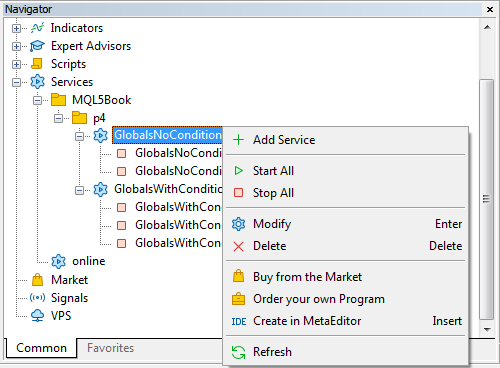

# Synchronizing programs using global variables

Since global variables exist outside of MQL programs, they are useful for organizing external flags that control multiple copies of the same program or pass signals between different programs. The simplest example is to limit the number of copies of a program that can be run. This may be necessary to prevent accidental duplication of the Expert Advisor on different charts (due to which trade orders may double), or to implement a demo version.

At first glance, such a check could be done in the source code as follows.

```
void OnStart()
{
   const string gv = "AlreadyRunning";
   // if the variable exists, then one instance is already running
   if(GlobalVariableCheck(gv)) return;
   // create a variable as a flag signaling the presence of a working copy
   GlobalVariableSet(gv, 0);
   
   while(!IsStopped())
   {
       // work cycle
   }
   // delete variable before exit
   GlobalVariableDel(gv);
}

```

The simplest version is shown here using a script as an example. For other types of MQL programs, the general concept of checking will be the same, although the location of instructions may differ: instead of an endless work cycle, Expert Advisors and indicators use their characteristic event handlers repeatedly called by the terminal. We will study these problems later.

The problem with the presented code is that it does not take into account the parallel execution of MQL programs.

An MQL program usually runs in its own thread. For three out of four types of MQL programs, namely for Expert Advisors, scripts, and services, the system definitely allocates separate threads. As for indicators, one common thread is allocated to all their instances, working on the same combination of working symbol and timeframe. But indicators on different combinations still belong to different threads.

Almost always, a lot of threads are running in the terminal — much more than the number of processor cores. Because of this, each thread from time to time is suspended by the system to allow other threads to work. Since all such switching between threads happens very quickly, we, as users, do not notice this "inner organization". However, each suspension can affect the sequence in which different threads access the shared resources. Global variables are such resources.

From the program's point of view, a pause can occur between any adjacent instructions. If knowing this, we look again at our example, it is not difficult to see a place where the logic of working with a global variable can be broken.

Indeed, the first copy (thread) can perform a check and find no variable but be immediately suspended. As a result, before it has time to create the variable with its next instruction, the execution context switches to the second copy. That one also won't find the variable and will decide to continue working, like the first one. For clarity, the identical source code of the two copies is shown below as two columns of instructions in the order of their interleaved execution.

```
Copy 1

Copy 2

void OnStart()              
{                                      
   const string gv = "AlreadyRunning"; 
                                       
   if(GlobalVariableCheck(gv)) return; 
   // no variable
                                       
   GlobalVariableSet(gv, 0);           
   // "I am the first and only"
   while(!IsStopped())                 
                                       
   {                                   
      ;                                
                                       
   }                                   
   GlobalVariableDel(gv);              
                                       
}                                      

void OnStart()              
{                                      
   const string gv = "AlreadyRunning"; 
                                       
   if(GlobalVariableCheck(gv)) return; 
   // no variable
                                       
   GlobalVariableSet(gv, 0);           
   // "I am the first and only"
   while(!IsStopped())                 
                                       
   {                                   
      ;                                
                                       
   }                                   
   GlobalVariableDel(gv);              
                                       
}                                      

void OnStart()              
{                                      
                                       
   const string gv = "AlreadyRunning"; 
                                       
   if(GlobalVariableCheck(gv)) return; 
   // still no variable
                                       
   GlobalVariableSet(gv, 0);           
   // "No, I'm the first and only one"
   while(!IsStopped())                 
   {                                   
                                       
      ;                                
   }                                   
                                       
   GlobalVariableDel(gv);              
}                                      

void OnStart()              
{                                      
                                       
   const string gv = "AlreadyRunning"; 
                                       
   if(GlobalVariableCheck(gv)) return; 
   // still no variable
                                       
   GlobalVariableSet(gv, 0);           
   // "No, I'm the first and only one"
   while(!IsStopped())                 
   {                                   
                                       
      ;                                
   }                                   
                                       
   GlobalVariableDel(gv);              
}                                      

void OnStart()              
{                                      
   const string gv = "AlreadyRunning"; 
                                       
   if(GlobalVariableCheck(gv)) return; 
   // no variable
                                       
   GlobalVariableSet(gv, 0);           
   // "I am the first and only"
   while(!IsStopped())                 
                                       
   {                                   
      ;                                
                                       
   }                                   
   GlobalVariableDel(gv);              
                                       
}                                      

void OnStart()              
{                                      
                                       
   const string gv = "AlreadyRunning"; 
                                       
   if(GlobalVariableCheck(gv)) return; 
   // still no variable
                                       
   GlobalVariableSet(gv, 0);           
   // "No, I'm the first and only one"
   while(!IsStopped())                 
   {                                   
                                       
      ;                                
   }                                   
                                       
   GlobalVariableDel(gv);              
}                                      

```

Of course, such a scheme for switching between threads has a fair amount of conventionality. But in this case, the very possibility of violating the logic of the program is important, even in one single string. When there are many programs (threads), the probability of unforeseen actions with common resources increases. This may be enough to take the EA to a loss at the most unexpected moment or to get distorted technical analysis estimates.

The most frustrating thing about errors of this kind is that they are very difficult to detect. The compiler is not able to detect them, and they manifest themselves sporadically at runtime. But if the error does not reveal itself for a long time, this does not mean that there is no error.

To solve such problems, it is necessary to somehow synchronize the access of all copies of programs to shared resources (in this case, to global variables).

In computer science, there is a special concept — a mutex (mutual exclusion) — which is an object for providing exclusive access to a shared resource from parallel programs. A mutex prevents data from being lost or corrupted due to asynchronous changes. Usually, accessing a mutex synchronizes different programs due to the fact that only one of them can edit protected data by capturing the mutex at a particular moment, and the rest are forced to wait until the mutex is released.

There are no ready-made mutexes in MQL5 in their pure form. But for global variables, a similar effect can be obtained by the following function, which we will consider.

bool GlobalVariableSetOnCondition(const string name, double value, double precondition)

The function sets a new value of the existing global variable name provided that its current value is equal to precondition.

On success, the function returns true. Otherwise, it returns false, and the error code will be available in [_LastError](/en/book/common/environment/env_last_error). In particular, if the variable does not exist, the function will generate an ERR_GLOBALVARIABLE_NOT_FOUND (4501) error.

The function provides atomic access to a global variable, that is, it performs two actions in an inseparable way: it checks its current value, and if it matches the condition, it assigns to the variable a new value.

The equivalent function code can be represented approximately as follows (why it is "approximately" we will explain later):

```
bool GlobalVariableZetOnCondition(const string name, double value, double precondition)
{
   bool result = false;
   { /* enable interrupt protection */ }
   if(GlobalVariableCheck(name) && (GlobalVariableGet(name) == precondition))
   {
      GlobalVariableSet(name, value);
      result = true;
   }
   { /* disable interrupt protection */ }
   return result;
}

```

Implementing code like this, which works as intended, is impossible for two reasons. First, there is nothing to implement blocks that enable and disable interrupt protection in pure MQL5 (inside the built-in GlobalVariableSetOnCondition function this is provided by the kernel itself). Second, the GlobalVariableGet function call changes the last time the variable was used, while the GlobalVariableSetOnCondition function does not change it if the precondition was not met.

To demonstrate how to use GlobalVariableSetOnCondition, we will turn to a new MQL program type: services. We will study them in detail in a separate [section](/en/book/applications/script_service/services). For now, it should be noted that their structure is very similar to scripts: for both, there is only one main function (entry point), OnStart. The only significant difference is that the script runs on the chart, while the service runs by itself (in the background).

The need to replace scripts with services is explained by the fact that the applied meaning of the task in which we use GlobalVariableSetOnCondition, consists in counting the number of running instances of the program, with the possibility of setting a limit. In this case, collisions with simultaneous modification of the shared counter can occur only at the moment of launching multiple programs. However, with scripts, it is quite difficult to run several copies of them on different charts in a relatively short period of time. For services, on the contrary, the terminal interface has a convenient mechanism for batch (group) launch. In addition, all activated services will automatically start at the next boot of the terminal.

The proposed mechanism for counting the number of copies will also be in demand for MQL programs of other types. Since Expert Advisors and indicators remain attached to the charts even when the terminal is turned off, the next time it is turned on, all programs read their settings and shared resources almost simultaneously. Therefore, if a limit on the number of copies is built into some Expert Advisors and indicators, it is critical to synchronize the counting based on global variables.

First, let's consider a service that implements copy control in a naive mode, without using GlobalVariableSetOnCondition, and make sure that the problem of counter failures is real. The services are located in a dedicated subdirectory in the general source code directory, so here is the expanded path − MQL5/Services/MQL5Book/p4/GlobalsNoCondition.mq5.

At the beginning of the service file there should be a directive:

```
#property service

```

In the service, we will provide 2 input variables to set a limit on the number of allowed copies running in parallel and a delay to emulate execution interruption due to a massive load on the disk and CPU of the computer, which often happens when the terminal is launched. This will make it easier to reproduce the problem without having to restart the terminal many times hoping to get out of sync. So, we are going to catch a bug that can only occur sporadically, but at the same time, if it happens, it is fraught with serious consequences.

```
input int limit = 1;       // Limit
input int startPause = 100;// Delay(ms)

```

Delay emulation is based on the [Sleep](/en/book/common/timing/timing_sleep) function.

```
void Delay()
{
   if(startPause > 0)
   {
      Sleep(startPause);
   }
}

```

First of all, a temporary global variable is declared inside the OnStart function. Since it is designed to count running copies of the program, it makes no sense to make it constant: every time you start the terminal, you need to count again.

```
void OnStart()
{
   PRTF(GlobalVariableTemp(__FILE__));
   ...

```

To avoid the case when a user creates a variable of the same name in advance and assigns a negative value to it, we introduce protection.

```
   int count = (int)GlobalVariableGet(__FILE__);
   if(count < 0)
   {
      Print("Negative count detected. Not allowed.");
      return;
   }

```

Next, the fragment with the main functionality begins. If the counter is already greater than or equal to the maximum allowable quantity, we interrupt the program launch.

```
   if(count >= limit)
   {
      PrintFormat("Can't start more than %d copy(s)", limit);
      return;
   }

```

Otherwise, we increase the counter by 1 and write it to the global variable. In advance, we emulate the delay in order to provoke a situation when another program could intervene between reading a variable and writing it in our program.

```
   Delay();
   PRTF(GlobalVariableSet(__FILE__, count + 1));

```

If this really happens, our copy of the program will increment and assign an already obsolete, incorrect value. It will result in a situation where in another copy of the program running in parallel with ours, the same count value has already been processed or will be processed again.

The useful work of the service is represented by the following loop.

```
   int loop = 0;
   while(!IsStopped())
   {
      PrintFormat("Copy %d is working [%d]...", count, loop++);
      // ...
      Sleep(3000);
   }

```

After the user stops the service (for this, the interface has a context menu; more on that will follow), the cycle will end, and we need to decrement the counter.

```
   int last = (int)GlobalVariableGet(__FILE__);
   if(last > 0)
   {
      PrintFormat("Copy %d (out of %d) is stopping", count, last);
      Delay();
      PRTF(GlobalVariableSet(__FILE__, last - 1));
   }
   else
   {
      Print("Count underflow");
   }
}

```

Compiled services fall into the corresponding branch of the "Navigator".



Services in the "Navigator" and their context menu

By right-clicking, we will open the context menu and create two instances of the service GlobalsNoCondition.mq5 by calling the Add service command twice. In this case, each time a dialog will open with the service settings, where you should leave the default values for the parameters.

It is important to note that the Add service command starts the created service immediately. But we don't need this. Therefore, immediately after launching each copy, we have to call the context menu again and execute the Stop command (if a specific instance is selected), or Stop everything (if the program, i.e., the entire group of generated instances, is selected).

The first instance of the service will by default have a name that completely matches the service file ("GlobalsNoCondition"), and in all subsequent instances, an incrementing number will be automatically added. In particular, the second instance is listed as "GlobalsNoCondition 1". The terminal allows you to rename instances to arbitrary text using the Rename command, but we won't do that.

Now everything is ready for the experiment. Let's try to run two instances at the same time. To do this, let's run the Run All command for the corresponding GlobalsNoCondition branch.

Let's remind that a limit of 1 instance was set in the parameters. However, according to the logs, it didn't work.

```
GlobalsNoCondition    GlobalVariableTemp(GlobalsNoCondition.mq5)=true / ok
GlobalsNoCondition 1  GlobalVariableTemp(GlobalsNoCondition.mq5)=false / GLOBALVARIABLE_EXISTS(4502)
GlobalsNoCondition    GlobalVariableSet(GlobalsNoCondition.mq5,count+1)=2021.08.31 17:47:17 / ok
GlobalsNoCondition    Copy 0 is working [0]...
GlobalsNoCondition 1  GlobalVariableSet(GlobalsNoCondition.mq5,count+1)=2021.08.31 17:47:17 / ok
GlobalsNoCondition 1  Copy 0 is working [0]...
GlobalsNoCondition    Copy 0 is working [1]...
GlobalsNoCondition 1  Copy 0 is working [1]...
GlobalsNoCondition    Copy 0 is working [2]...
GlobalsNoCondition 1  Copy 0 is working [2]...
GlobalsNoCondition    Copy 0 is working [3]...
GlobalsNoCondition 1  Copy 0 is working [3]...
GlobalsNoCondition    Copy 0 (out of 1) is stopping
GlobalsNoCondition    GlobalVariableSet(GlobalsNoCondition.mq5,last-1)=2021.08.31 17:47:26 / ok
GlobalsNoCondition 1  Count underflow

```

Both copies "think" that they are number 0 (output "Copy 0" out of the work loop) and their total number is erroneously equal to 1 because that is the value that both copies have stored in the counter variable.

It is because of this that when services are stopped (the Stop everything command), we received a message about an incorrect state ("Count underflow"): after all, each of the copies is trying to decrease the counter by 1, and as a result, the one that was executed second received a negative value.

To solve the problem, you need to use the GlobalVariableSetOnCondition function. Based on the source code of the previous service, an improved version GlobalsWithCondition.mq5 was prepared. In general, it reproduces the logic of its predecessor, but there are significant differences.

Instead of just calling GlobalVariableSet to increase the counter, a more complex structure had to be written.

```
   const int maxRetries = 5;
   int retry = 0;
   
   while(count < limit && retry < maxRetries)
   {
      Delay();
      if(PRTF(GlobalVariableSetOnCondition(__FILE__, count + 1, count))) break;
      // condition is not met (count is obsolete), assignment failed,
      // let's try again with a new condition if the loop does not exceed the limit
      count = (int)GlobalVariableGet(__FILE__);
      PrintFormat("Counter is already altered by other instance: %d", count);
      retry++;
   }
   
   if(count == limit || retry == maxRetries)
   {
      PrintFormat("Start failed: count: %d, retries: %d", count, retry);
      return;
   }
   ...

```

Since the GlobalVariableSetOnCondition function may not write a new counter value, if the old one is already obsolete, we read the global variable again in the loop and repeat attempts to increment it until the maximum allowable counter value is exceeded. The loop condition also limits the number of attempts. If the loop ends with a violation of one of the conditions, then the counter update failed, and the program should not continue to run.

Synchronization strategies  

   

 In theory, there are several standard strategies for implementing shared resource capture.  

   

The first is to soft-check if the resource is free and then lock it only if it is free at that moment. If it is busy, the algorithm plans the next attempt after a certain period, and at this time it is engaged in other tasks (which is why this approach is preferable for programs that have several areas of activity/responsibility). An analog of this scheme of behavior in the transcription for the GlobalVariableSetOnCondition function is a single call, without a loop, exiting the current block on failure. Variable change is postponed "until better times".  

   

The second strategy is more persistent, and it is applied in our script. This is a loop that repeats a request for a resource for a given number of times, or a predefined time (the allowable timeout period for the resource). If the loop expires and a positive result is not reached (calling the function GlobalVariableSetOnCondition never returned true), the program also exits the current block and probably plans to try again later.  

   

Finally, the third strategy, the toughest one, involves requesting a resource "to the bitter end". It can be thought of as an infinite loop with a function call. This approach makes sense to use in programs that are focused on one specific task and cannot continue to work without a seized resource. In MQL5, use the loop while(!IsStopped()) for this and don't forget to call Sleep inside.  

   

It's important to note here the potential problem with "hard" grabbing multiple resources. Imagine that an MQL program modifies several global variables (which is, in theory, a common situation). If one copy of it captures one variable, and the second copy captures another, and both will wait for the release, their mutual blocking (deadlock) will come.  

   

Based on the foregoing, sharing of global variables and other resources (for example, files) should be carefully designed and analyzed for locks and the so-called "race conditions", when the parallel execution of programs leads to an undefined result (depending on the order of their work).

After the completion of the work cycle in the new version of the service, the counter decrement algorithm has been changed in a similar way.

```
   retry = 0;
   int last = (int)GlobalVariableGet(__FILE__);
   while(last > 0 && retry < maxRetries)
   {
      PrintFormat("Copy %d (out of %d) is stopping", count, last);
      Delay();
      if(PRTF(GlobalVariableSetOnCondition(__FILE__, last - 1, last))) break;
      last = (int)GlobalVariableGet(__FILE__);
      retry++;
   }
   
   if(last <= 0)
   {
      PrintFormat("Unexpected exit: %d", last);
   }
   else
   {
      PrintFormat("Stopped copy %d: count: %d, retries: %d", count, last, retry);
   }

```

As an experiment, let's create three instances for the new service. In the settings of each of them, in the Limit parameter, we specify 2 instances (to conduct a test under changed conditions). Recall that creating each instance immediately launches it, which we do not need, and therefore each newly created instance should be stopped.

The instances will get the default names "GlobalsWithCondition", "GlobalsWithCondition 1", and "GlobalsWithCondition 2".

When everything is ready, we run all instances at once and get something like this in the log.

```
GlobalsWithCondition 2  GlobalVariableTemp(GlobalsWithCondition.mq5)= »
                        » false / GLOBALVARIABLE_EXISTS(4502)
GlobalsWithCondition 1  GlobalVariableTemp(GlobalsWithCondition.mq5)= »
                        » false / GLOBALVARIABLE_EXISTS(4502)
GlobalsWithCondition    GlobalVariableTemp(GlobalsWithCondition.mq5)=true / ok
GlobalsWithCondition    GlobalVariableSetOnCondition(GlobalsWithCondition.mq5,count+1,count)= »
                        » true / ok
GlobalsWithCondition 1  GlobalVariableSetOnCondition(GlobalsWithCondition.mq5,count+1,count)= »
                        » false / GLOBALVARIABLE_NOT_FOUND(4501)
GlobalsWithCondition 2  GlobalVariableSetOnCondition(GlobalsWithCondition.mq5,count+1,count)= »
                        » false / GLOBALVARIABLE_NOT_FOUND(4501)
GlobalsWithCondition 1  Counter is already altered by other instance: 1
GlobalsWithCondition    Copy 0 is working [0]...
GlobalsWithCondition 2  Counter is already altered by other instance: 1
GlobalsWithCondition 1  GlobalVariableSetOnCondition(GlobalsWithCondition.mq5,count+1,count)=true / ok
GlobalsWithCondition 1  Copy 1 is working [0]...
GlobalsWithCondition 2  GlobalVariableSetOnCondition(GlobalsWithCondition.mq5,count+1,count)= »
                        » false / GLOBALVARIABLE_NOT_FOUND(4501)
GlobalsWithCondition 2  Counter is already altered by other instance: 2
GlobalsWithCondition 2  Start failed: count: 2, retries: 2
GlobalsWithCondition    Copy 0 is working [1]...
GlobalsWithCondition 1  Copy 1 is working [1]...
GlobalsWithCondition    Copy 0 is working [2]...
GlobalsWithCondition 1  Copy 1 is working [2]...
GlobalsWithCondition    Copy 0 is working [3]...
GlobalsWithCondition 1  Copy 1 is working [3]...
GlobalsWithCondition    Copy 0 (out of 2) is stopping
GlobalsWithCondition    GlobalVariableSetOnCondition(GlobalsWithCondition.mq5,last-1,last)=true / ok
GlobalsWithCondition    Stopped copy 0: count: 2, retries: 0
GlobalsWithCondition 1  Copy 1 (out of 1) is stopping
GlobalsWithCondition 1  GlobalVariableSetOnCondition(GlobalsWithCondition.mq5,last-1,last)=true / ok
GlobalsWithCondition 1  Stopped copy 1: count: 1, retries: 0

```

First of all, pay attention to the random, but at the same time visual demonstration of the described effect of context switching for parallel running programs. The first instance that created a temporary variable was "GlobalsWithCondition" without a number: this can be seen from the result of the function GlobalVariableTemp which is true. However, in the log, this line occupies only the third position, and the two previous ones contain the results of calling the same function in copies under the names with numbers 1 and 2; in those the function GlobalVariableTemp returned false. This means that these copies checked the variable later, although their threads then overtook the unnumbered "GlobalsWithCondition" thread and ended up in the log earlier.

But let's get back to our main program counting algorithm. The instance "GlobalsWithCondition" was the first to pass the check, and started working under the internal identifier "Copy 0" (we cannot find out from the service code how the user named the instance: there is no such function in the MQL5 API, at least not at the moment).

Thanks to the function GlobalVariableSetOnCondition, in instances 1 and 2 ("GlobalsWithCondition 1", "GlobalsWithCondition 2"), the fact of modifying the counter was detected: it was 0 at the start, but GlobalsWithCondition increased it by 1. Both late instances output the message "Counter is already altered by other instance: 1". One of these instances ("GlobalsWithCondition 1") ahead of number 2, managed to get a new value of 1 from the variable and increase it to 2. This is indicated by a successful call GlobalVariableSetOnCondition (it returned true). And that, there was a message about it starting to work, "Copy 1 is working".

The fact that the value of the internal counter is the same as the external instance number, is purely coincidental. It could well be that "GlobalsWithCondition 2" had started before "GlobalsWithCondition 1" (or in some other sequence, given that there are three copies). Then the outer and inner numbering would be different. You can repeat the experiment starting and stopping all services many times, and the sequence in which the instances increment the counter variable will most likely be different. But in any case, the limit on the total number will cut off one extra instance.

When the last instance of "GlobalsWithCondition 2" is granted access to a global variable, value 2 is already stored there. Since this is the limit we set, the program does not start.

```
GlobalVariableSetOnCondition(GlobalsWithCondition.mq5,count+1,count)= »
» false / GLOBALVARIABLE_NOT_FOUND(4501)
Counter is already altered by other instance: 2
Start failed: count: 2, retries: 2

```

Further along, copies of "GlobalsWithCondition" and "GlobalsWithCondition 1" "spin" in the work cycle until the services are stopped.

You can try to stop only one instance. Then it will be possible to launch another one that previously received a ban on execution due to exceeding the quota.

Of course, the proposed version of protection against parallel modification is effective only for coordinating the behavior of your own programs, but not for limiting a single copy of the demo version, since the user can simply delete the global variable. For this purpose, global variables can be used in a different way - in relation to the chart ID: an MQL program works only for as long as its created global variable contains its ID [graphic arts](/en/book/applications/charts). Other ways to control shared data (counters and other information) is provided by [resources](/en/book/advanced/resources) and [database](/en/book/advanced/sqlite).
