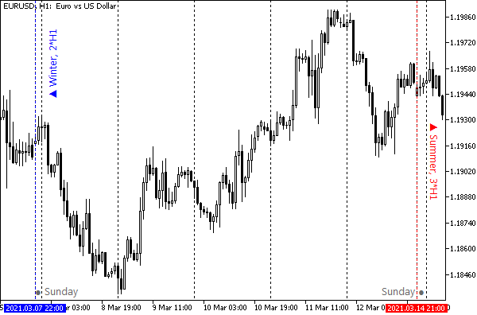

# Daylight saving time (local)

To determine whether local clocks are switched to daylight saving time, MQL5 provides the TimeDaylightSavings function. It takes settings from your operating system.

Determining the daylight saving time on a server is not as easy. To do this, you need to implement MQL5 analysis of [quotes](/en/book/applications/timeseries/timeseries_mqlrates), [economic calendar](/en/book/advanced/calendar) events, or a rollover/swap time in the [account trading history](/en/book/automation/experts/experts_historydealget_funcs). In the example below, we will show one of the options.

int TimeDaylightSavings()

The function returns the correction in seconds if daylight savings time has been applied. Winter time is standard for each time zone, so the correction for this period is zero. In conditional form, the formula for obtaining the correction can be written as follows:

```
TimeDaylightSavings() = TimeLocal winter() - TimeLocal summer()

```

For example, if the standard timezone (winter) is equal to UTC+3 (that is, the zone time is 3 hours ahead of UTC), then during the transition to daylight saving time (summer) we add 1 hour and get UTC+4. Wherein TimeDaylightSavings will return -3600.

An example of using the function is given in the script TimeSummer.mq5, which also suggests one of the possible empirical ways to identify the appropriate mode on the server.

```
void OnStart()
{
   PRTF(TimeLocal());          // local time of the terminal
   PRTF(TimeCurrent());        // last known server time
   PRTF(TimeTradeServer());    // estimated server time
   PRTF(TimeGMT());            // GMT time (calculation from local via time zone shift)
   PRTF(TimeGMTOffset());      // time zone shift compare to GMT, in seconds
   PRTF(TimeDaylightSavings());// correction for summer time in seconds
   ...

```

First, let's display all types of time and its correction provided by MQL5 (functions TimeGMT and TimeGMTOffset will be presented in the next section on [Universal Time](/en/book/common/timing/timing_gmt), but their meaning should already be generally clear from the previous description).

The script is supposed to run on trading days. The entries in the log will correspond to the settings of your computer and the broker's server.

```
TimeLocal()=2021.09.09 22:06:17 / ok
TimeCurrent()=2021.09.09 22:06:10 / ok
TimeTradeServer()=2021.09.09 22:06:17 / ok
TimeGMT()=2021.09.09 19:06:17 / ok
TimeGMTOffset()=-10800 / ok
TimeDaylightSavings()=0 / ok

```

In this case, the client's time zone is 3 hours off from GMT (UTC+3), there is no adjustment for daylight saving time.

Now let's take a look at the server. Based on the value of the TimeCurrent function, we can determine the current time of the server, but not its standard time zone, since this time may involve the transition to daylight saving time (MQL5 does not provide information about whether it is used at all and whether it is currently enabled).

To determine the real time zone of the server and the daylight saving time, we will use the fact that the server time translation affects quotes. Like most empirical methods for solving problems, this one may not give completely correct results in certain circumstances. If a comparison with other sources shows discrepancies, a different method should be chosen.

The Forex market opens on Sunday at 22:00 UT (this corresponds to the beginning of morning trading in the Asia-Pacific region) and closes on Friday at 22:00 (the close of trading in America). This means that on servers in the UTC+2 zone (Eastern Europe), the first bars will appear at exactly 0 hours 0 minutes on Monday. According to Central European time, which corresponds to UTC+1, the trading week starts at 23:00 on Sunday.

Having calculated the statistics of the intraday shift of the first bar H1 after each weekend break, we will get an estimate of the server's time zone. Of course, for this, it is better to use the most liquid Forex instrument, which is EURUSD.

If two maximum intraday shifts are found in the statistics for an annual period, and they are located next to each other, this will mean that the broker is switching to daylight saving time and vice versa.

Note that the summer and winter time periods are not equal. So, when switching to summer time in early March and returning to winter time in early November, we get about 8 months of summer time. This will affect the ratio of maximums in the statistics.

Having two time zones, we can easily determine which of them is active at the moment and, thereby, find out the current presence or absence of a correction for daylight saving time.

When switching clocks to daylight saving time, the broker's timezone will change from UTC+2 to UTC+3, which will shift the beginning of the week from 22:00 to 21:00. This will affect the structure of H1 bars: visually on the chart, we will see three bars on Sunday evening instead of two.



Changing hours from winter (UTC+2) to summer (UTC+3) time on the EURUSD H1 chart

To implement this, we have a separate function, ServerTimeZone. The call of the built-in CopyTime function is responsible for getting quotes, or bar timestamps, to be more precise (we will study this function in the section on [access to timeseries](/en/book/applications/timeseries/timeseries_copy_funcs_overview)).

```
ServerTime ServerTimeZone(const string symbol = NULL)
{
  const int year = 365 * 24 * 60 * 60;
  datetime array[];
  if(PRTF(CopyTime(symbol, PERIOD_H1, TimeCurrent() - year, TimeCurrent(), array)) > 0)
  {
     // here we get about 6000 bars in the array
     const int n = ArraySize(array);
     PrintFormat("Got %d H1 bars, ~%d days", n, n / 24);
     // (-V-) loop through H1 bars
     ...
  }
}

```

The CopyTime function receives the working instrument, H1 timeframe, and the range of dates for the last year, as parameters. The NULL value instead of the instrument means the symbol of the current chart where the script will be placed, so it is recommended to select the window with EURUSD. The PERIOD_H1 constant corresponds to H1, as you might guess. We are already familiar with the TimeCurrent function: it will return the current, latest known time of the server. And if we subtract from it the number of seconds in a year, which is placed into the year variable, we will get the date and time exactly one year ago. The results will go into the array.

To calculate statistics on how many times a week was opened by a bar at a specific hour, we reserve the hours[24] array. The calculation will be performed in a loop through the resulting array, that is, by bars from the past to the present. At each iteration, the opening hour of the week being viewed will be stored in the current variable. When the loop ends, the server's current time zone will remain in current, since the current week will be processed last.

```
     // (-v-) cycle through H1 bars
     int hours[24] = {};
     int current = 0;
     for(int i = 0; i < n; ++i)
     {
     // (-V-) processing of the i-th bar H1
        ...
     }
     
     Print("Week opening hours stats:");
     ArrayPrint(hours);

```

Inside the days loop, we will use the datetime class from the header file MQL5Book/DateTime.mqh (see [Date and time](/en/book/common/conversions/conversions_datetime)).

```
        // (-v-) processing the i-th bar H1
        // find the day of the week of the bar
        const ENUM_DAY_OF_WEEK weekday = TimeDayOfWeek(array[i]);
        // skip all days except Sunday and Monday
        if(weekday > MONDAY) continue;
        // analyze the first bar H1 of the next trading week
        // find the hour of the first bar after the weekend
        current = _TimeHour();
        // calculate open hours statistics
        hours[current]++;
        
        // skip next 2 days
        // (because the statistics for the beginning of this week have already been updated)
        i += 48;

```

The proposed algorithm is not optimal, but it does not require understanding the technical details of timeseries organization, which are not yet known to us.

Some weeks are unformatted (begin after the holidays). If this situation happens in the last week, the current variable will contain an unusual offset. This can be verified by statistics: for the resulting hour, there will be a very small number of recorded "openings" of the week. In the test script, in this case, a message is simply displayed in the log. In practice, you should clarify the standard opening for the previous one to two weeks.

```
     // (-V-) cycle through H1 bars
     ...
     if(hours[current] <= 52 / 4)
     {
        // TODO: check for previous weeks
        Print("Extraordinary week detected");
     }

```

If the broker does not switch to daylight saving time, the statistics will have one maximum, which will include all or almost all weeks. If the broker practices a time zone change, there will be two highs in the statistics.

```
     // find the most frequent time shift
     int max = ArrayMaximum(hours);
     // then check if there is another regular shift
     hours[max] = 0;
     int sub = ArrayMaximum(hours);

```

We need to determine how significant the second extreme is (i.e. different from random holidays that could shift the start of the week). To do this, we evaluate the statistics for a quarter of the year (52 weeks / 4). If this limit is exceeded, the broker supports daylight saving time.

```
     int DST = 0;
     if(hours[sub] > 52 / 4)
     {
        // basically, DST is supported 
        if(current == max || current == sub)
        {
           if(current == MathMin(max, sub))
              DST =fabs(max -sub); // DST is enabled now
        }
     }

```

If the offset of the opening of the current week (in the current variable) coincides with one of the two main extremes, then the current week opened normally, and it can be used to draw a conclusion about the time zone (this protective condition is necessary because we do not have a correction for the non-standard weeks and only a warning is issued instead).

Now everything is ready to form the response of our function: the server time zone and the sign of the enabled daylight saving time.

```
 current +=2 +DST;// +2 to get offset from UTC
     current %= 24;
 // timezones are always in the range [UTC-12,UTC+12]
     if(current > 12) current = current - 24;

```

Since we have two characteristics to return from a function (current and DST), and besides that, we can tell the called code whether the broker uses daylight saving time to begin with (even if it is winter now), it makes sense to declare a special structure ServerTime with all required fields.

```
struct ServerTime
{
 intoffsetGMT;      // timezone in seconds relative to UTC/GMT
 intoffsetDST;      // DST correction in seconds (included in offsetGMT)
 boolsupportDST;    // DST correction detected in quotes in principle
 stringdescription; // result description
};

```

Then, in the ServerTimeZone function, we can fill in and return such a structure as a result of the work.

```
     ServerTime st = {};
     st.description = StringFormat("Server time offset: UTC%+d, including DST%+d", current, DST);
     st.offsetGMT = -current * 3600;
     st.offsetDST = -DST * 3600;
     return st;

```

If for some reason the function cannot get quotes, we will return an empty structure.

```
ServerTime ServerTimeZone(const string symbol = NULL)
{
  const int year = 365 * 24 * 60 * 60;
  datetime array[];
  if(PRTF(CopyTime(symbol, PERIOD_H1, TimeCurrent() - year, TimeCurrent(), array)) > 0)
  {
     ...
     return st;
  }
  ServerTime empty = {-INT_MAX, -INT_MAX, false};
  return empty;
}

```

Let's check the new function in action, for which in OnStart we add the following instructions:

```
   ...
   ServerTime st = ServerTimeZone();
   Print(st.description);
   Print("ServerGMTOffset: ", st.offsetGMT);
   Print("ServerTimeDaylightSavings: ", st.offsetDST);
}

```

Let's look at the possible results.

```
CopyTime(symbol,PERIOD_H1,TimeCurrent()-year,TimeCurrent(),array)=6207 / ok
Got 6207 H1 bars, ~258 days
Week opening hours stats:
52  0  0  0  0  0  0  0  0  0  0  0  0  0  0  0  0  0  0  0  0  0  0  0
Server time offset: UTC+2, including DST+0
ServerGMTOffset: -7200
ServerTimeDaylightSavings: 0

```

According to the collected statistics of H1 bars, the week for this broker opens strictly at 00:00 on Monday. Thus, the real time zone is equal to UTC+2, and there is no correction for summer time, i.e., the server time must match EET (UTC+2). However, in practice, as we saw in the first part of the log, the time on the server differs from GMT by 3 hours.

Here we can assume that we met a server that works all year round in summer time. In that case, the function ServerTimeZone will not be able to distinguish the correction from the additional hour in the "time zone": as a result, the DST mode will be equal to zero, and the GMT time calculated from the server quotes will shift to the right by an hour from the real one. Or our initial assumption that quotes start arriving at 22:00 on Sunday does not correspond to the mode of operation of this server. Such points should be clarified with the broker's support service.
