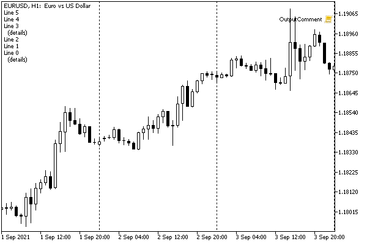

# Displaying messages in the chart window

As we have seen in the previous sections, MQL5 allows you to output messages to the log or alert window. The first method is primarily for technical information and cannot guarantee that the user will notice the message (because the log window may be hidden). At the same time, the second method can seem too intrusive if used to display frequently changing program status. An intermediate option offers the function Comment.

void Comment(argument, ...)

The function displays a message composed of all the passed arguments in the upper left corner of the chart. The message remains there until this or some other program removes it or replaces it with another one.

The window can contain only one comment: on each call of Comment the old content (if any) is replaced with the new one.

To clear a comment, just call the function with an empty string: Comment("").

The number of parameters must not exceed 64. Only built-in type arguments are supported. The concepts of forming the resulting string from the passed values are similar to those described for the function [Print](/en/book/common/output/output_print).

The total length of the displayed message is limited to 2045 characters. If the limit is exceeded, the end of the line will be cut off.

The current content of a comment is one of the string properties of the chart, which can be found by calling the function ChartGetString(NULL, CHART_COMMENT). We will talk about this and other properties of charts (not only string ones) in a separate [chapter](/en/book/applications/charts).

Same as in the Print, PrintFormat, and Alert functions, the string arguments may contain a newline character ('\n' or '\r\n'), which will cause the message to be split into the appropriate number of strings. For Comment this is the only way to show a multi-line message. If you can call them several times to get the same effect using the print and signal functions, then with Comment this cannot be done, since each call will replace the old string with the new one.

An example of work of the function Comment is shown in the image of the window with the welcome script from the first chapter, in the section [Data output](/en/book/intro/a_data_output).

Additionally, we will develop a class and simplified functions for displaying multi-line comments based on a ring buffer of a given size. The test script (OutputComment.mq5) and the header file with the class code (Comments.mqh) are included in the book.

```
class Comments
{
 const int capacity; // maximum number of strings
 const bool reverse; // display order (new ones on top if true)
 string lines[];     // text buffer
 int cursor;         // where to put the next string
 int size;           // actual number of strings saved
   
public:
   Comments(const int limit = N_LINES, const bool r = false):
      capacity(limit), reverse(r), cursor(0), size(0)
   {
      ArrayResize(lines, capacity);
   }
   
   void add(const string line);
   void clear();
};

```

The main work is done by the method add.

```
void Comments::add(const string line)
{
   ...
   // if the passed text contains multiple strings,
   // split it into elements by newline character
   string inputs[];
   const int n = StringSplit(line, '\n', inputs);
   
   // add all new elements to the ring buffer
   // overwriting the oldest entries at the cursor
   // cursor increases by capacity module (reset to 0 on overflow)
   for(int i = 0; i < n; ++i)
   {
      lines[cursor] = inputs[reverse ? n - i - 1 : i];
      cursor = (cursor + 1) % capacity;
      if(size < capacity) size++;
   }
   // concatenate all text entries in forward or reverse order
   // gluing with newline characters
   string result = "";
   for(int i = 0, k = size == capacity ? cursor % capacity : 0;
      i < size; ++i, k = ++k % capacity)
   {
      if(reverse)
      {
         result = lines[k] + "\n" + result;
      }
      else
      {
         result += lines[k] + "\n";
      }
   }
   
   // output the result
   Comment(result);
}

```

If necessary, the comment, and text buffer can be cleared by the method clear, or by calling add(NULL).

```
void Comments::clear()
{
   Comment("");
   cursor = 0;
   size = 0;
}

```

Given such a class, you can define an object with the required buffer capacity and output direction, and then use its methods.

```
Comments c(30/*capacity*/, true/*order*/);
   
void function()
{
   ...
   c.add("123");
}

```

But to simplify the generation of comments in the usual functional style, by analogy with the function Comment, a couple of helper functions are implemented.

```
void MultiComment(const string line = NULL)
{
   static Comments com(N_LINES, true);
   com.add(line);
}
 
void ChronoComment(const string line = NULL)
{
   static Comments com(N_LINES, false);
   com.add(line);
}

```

They differ only in the direction of the buffer output. MultiComment displays rows in reverse chronological order, i.e. most recent at the top, like on a bulletin board. This function is recommended for an indefinitely long episodic display of information with the preservation of history. ChronoComment displays rows in forward order, i.e. new ones are added at the bottom. This function is recommended for batch output of multi-line messages.

The number of buffer lines is N_LINES (10) by default. If you define this macro with a different value before including the header file, it will resize.

The test script contains a loop in which messages are periodically generated.

```
void OnStart()
{
   for(int i = 0; i < 50 && !IsStopped(); ++i)
   {
      if((i + 1) % 10 == 0) MultiComment();
      MultiComment("Line " + (string)i + ((i % 3 == 0) ? "\n  (details)" : ""));
      Sleep(1000);
   }
   MultiComment();
}

```

At every tenth iteration, the comment is cleared. At every third iteration, a message is created from two lines (for the rest - from one). A delay of 1 second allows you to see the dynamics in action.

Here is an example of the window while the script is running (in "new messages on top" mode).



Multi-line comments on the chart

Displaying multi-line information in a comment has rather limited capabilities. If you need to organize data output by columns, highlighting with color or different fonts, reaction to mouse clicks, or arbitrary locations on the chart, you should use graphical [objects](/en/book/applications/objects).
