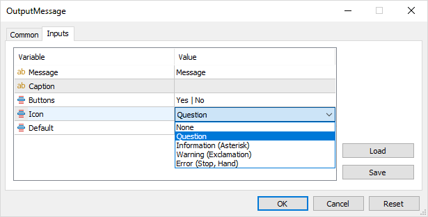
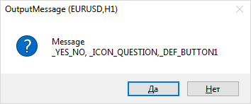

# Message dialog box

The MQL5 API provides the MessageBox function to interactively prompt the user to confirm actions or select an option for handling a particular situation.

int MessageBox(const string message, const string caption = NULL, int flags = 0)

The function opens a modeless dialog box with the given message (message), header (caption), and settings (flags). The window remains visible on top of the main terminal window until the user closes it by clicking on one of the available buttons (see further along).

The message is also displayed in the expert log with the "Message" mark.

If the caption parameter is NULL, the name of the MQL program is used as the title.

The flags parameter must contain a combination of bit flags combined with an OR ('|') operation. The general set of supported flags is divided into 3 groups that define:

- a set of buttons in the dialog
- icon image in the dialog
- selection of the active button by default

The following table lists the constants and flag values for defining dialog buttons.

| Constant | Value | Description |
| --- | --- | --- |
| MB_OK | 0x0000 | 1 OK button (default) |
| MB_OKCANCEL | 0x0001 | 2 buttons: OK and Cancel |
| MB_ABORTRETRYIGNORE | 0x0002 | 3 buttons: Abort, Retry, Ignore |
| MB_YESNOCANCEL | 0x0003 | 3 buttons: Yes, No, Cancel |
| MB_YESNO | 0x0004 | 2 buttons: Yes and No |
| MB_RETRYCANCEL | 0x0005 | 2 buttons: Retry and Cancel |
| MB_CANCELTRYCONTINUE | 0x0006 | 3 buttons: Cancel, Try Again, Continue |

The following table lists the available images (displayed to the left of the message).

| Constant | Value | Description |
| --- | --- | --- |
| MB_ICONSTOP 
 MB_ICONERROR 
 MB_ICONHAND | 0x0010 | STOP sign | STOP sign |  |
| STOP sign |  |  |
| MB_ICONQUESTION | 0x0020 | Question mark | Question mark |  |
| Question mark |  |  |
| MB_ICONEXCLAMATION 
 MB_ICONWARNING | 0x0030 | Exclamation point | Exclamation point |  |
| Exclamation point |  |  |
| MB_ICONINFORMATION 
 MB_ICONASTERISK | 0x0040 | Information sign | Information sign |  |
| Information sign |  |  |

All icons depend on the operating system version. The examples shown may differ on your computer.

The following values are reserved for selecting the active button.

| Constant | Value | Description |
| --- | --- | --- |
| MB_DEFBUTTON1 | 0x0000 | The first button (default) if none of the other constants are selected |
| MB_DEFBUTTON2 | 0x0100 | The second button |
| MB_DEFBUTTON3 | 0x0200 | The third button |
| MB_DEFBUTTON4 | 0x0300 | The fourth button |

The question may arise about what this fourth button is if the above constants allow you to set no more than three. The fact is that among the flags there is also MB_HELP (0x00004000). It instructs to show the Help button in the dialog. Then it can become the fourth in a row if there are three main buttons. However, clicking on the Help button does not close the dialog, unlike other buttons. According to the Windows standard, a help file can be associated with the program, which should open with the necessary help when the Help button is pressed. However, MQL programs do not currently support this technology.

The function returns one of the predefined values depending on how the dialog was closed (which button was pressed).

| Constant | Value | Description |
| --- | --- | --- |
| IDOK | 1 | OK button |
| IDCANCEL | 2 | Cancel button |
| IDABORT | 3 | Abort button |
| IDRETRY | 4 | Retry button |
| IDIGNORE | 5 | Ignore button |
| IDYES | 6 | Yes button |
| IDNO | 7 | No button |
| IDTRYAGAIN | 10 | Try Again button |
| IDCONTINUE | 11 | Continue button |

If the message box has a Cancel button, then the function returns IDCANCEL when the ESC key is pressed (in addition to the Cancel button). If the message box does not have a Cancel button, pressing ESC has no effect.

Calling MessageBox suspends the execution of the current MQL program until the user closes the dialog. For this reason, using MessageBox is prohibited in [indicators](/en/book/applications/indicators_make), since the indicators are executed in the interface thread of the terminal, and waiting for the user's response would slow down the update of the charts.

Also, the function cannot be used in [services](/en/book/applications/script_service/services), because they have no connection with the user interface, while other types of MQL programs are executed in the context of the chart.

When working in the strategy tester, the MessageBox function has no effect and returns 0.

After getting the result from the function call, you can process it in the way you want, for example:

```
   int result = MessageBox("Continue?", NULL, MB_YESNOCANCEL);
 // use 'switch' or 'if' as needed
   switch(result)
   {
   case IDYES:
     // ...
     break;
   case IDNO:
     // ...
     break;
   case IDCANCEL:
     // ...
     break;
   }

```

The MessageBox function can be tested using the OutputMessage.mq5 script, in which the user can select the parameters of the dialog using input variables and see it in action.

Groups of settings for buttons, icons, and the default selected button, as well as return codes, are described in special enumerations: ENUM_MB_BUTTONS, ENUM_MB_ICONS, ENUM_MB_DEFAULT, ENUM_MB_RESULT. This provides visual input through drop-down lists and simplifies their conversion to strings using EnumToString.

For example, here is how the first two enumerations are defined.

```
enum ENUM_MB_BUTTONS
{
   _OK = MB_OK,                                      // Ok
   _OK_CANCEL = MB_OKCANCEL,                         // Ok | Cancel
   _ABORT_RETRY_IGNORE = MB_ABORTRETRYIGNORE,        // Abort | Retry | Ignore
   _YES_NO_CANCEL = MB_YESNOCANCEL,                  // Yes | No | Cancel
   _YES_NO = MB_YESNO,                               // Yes | No
   _RETRY_CANCEL = MB_RETRYCANCEL,                   // Retry | Cancel
   _CANCEL_TRYAGAIN_CONTINUE = MB_CANCELTRYCONTINUE, // Cancel | Try Again | Continue
};
   
enum ENUM_MB_ICONS
{
   _ICON_NONE = 0,                                  // None
   _ICON_QUESTION = MB_ICONQUESTION,                // Question
   _ICON_INFORMATION_ASTERISK = MB_ICONINFORMATION, // Information (Asterisk)
   _ICON_WARNING_EXCLAMATION = MB_ICONWARNING,      // Warning (Exclamation)
   _ICON_ERROR_STOP_HAND = MB_ICONERROR,            // Error (Stop, Hand)
};

```

The rest can be found in the source code.

They are then used as input variable types (with element comments providing a more user-friendly presentation in the user interface).

```
input string Message = "Message";
input string Caption = "";
input ENUM_MB_BUTTONS Buttons = _OK;
input ENUM_MB_ICONS Icon = _ICON_NONE;
input ENUM_MB_DEFAULT Default = _DEF_BUTTON1;
   
void OnStart()
{
   const string text = Message + "\n"
      + EnumToString(Buttons) + ", "
      + EnumToString(Icon) + ","
      + EnumToString(Default);
   ENUM_MB_RESULT result = (ENUM_MB_RESULT)
      MessageBox(text, StringLen(Caption) ? Caption : NULL, Buttons | Icon | Default);
   Print(EnumToString(result));
}

```

The script displays the specified message in the window, along with the specified dialog settings. The result of the dialogue is displayed in the log.

A screenshot of the selection of options and the resulting dialog are shown in the following images.



Window properties dialog



Received message dialog box
