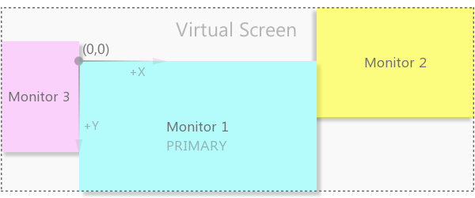

# Screen specifications

Several properties provided by the function TerminalInfoInteger, refer to the video subsystem of the computer.

| Identifier | Description |
| --- | --- |
| TERMINAL_SCREEN_DPI | Resolution of information output to the screen is measured in the number of dots per linear inch (DPI, Dots Per Inch) |
| TERMINAL_SCREEN_LEFT | Left coordinate of the virtual screen |
| TERMINAL_SCREEN_TOP | Top coordinate of the virtual screen |
| TERMINAL_SCREEN_WIDTH | Virtual screen width |
| TERMINAL_SCREEN_HEIGHT | Virtual screen height |
| TERMINAL_LEFT | Left coordinate of the terminal relative to the virtual screen |
| TERMINAL_TOP | Top coordinate of the terminal relative to the virtual screen |
| TERMINAL_RIGHT | Right coordinate of the terminal relative to the virtual screen |
| TERMINAL_BOTTOM | Bottom coordinate of the terminal relative to the virtual screen |

Knowing the TERMINAL_SCREEN_DPI parameter, you can set the dimensions of [graphic objects](/en/book/applications/objects) so that they look the same on monitors with different resolutions. For example, if you want to create a button with a visible size of X centimeters, then you can specify it as the number of screen dots (pixels) using the following function:

```
int cm2pixels(const double x)
{
   static const double inch2cm = 2.54; // 1 inch equals 2.54 cm
   return (int)(x / inch2cm * TerminalInfoInteger(TERMINAL_SCREEN_DPI));
}

```

The virtual screen is a bounding box of all monitors. If there is more than one monitor in the system and the order of their arrangement differs from strictly left to right, then the left coordinate of the virtual screen may turn out to be negative, and the center (reference point) will be on the border of two monitors (in the upper left corner of the main monitor).



Virtual screen from multiple monitors

If the system has one monitor, then the size of the virtual screen fully corresponds to it.

The terminal coordinates do not take into account its possible current maximization (that is, if the main window is maximized, the properties return the unmaximized size, although the terminal is expanded to the entire monitor).

In the EnvScreen.mq5 script, check reading screen properties.

```
void OnStart()
{
   PRTF(TerminalInfoInteger(TERMINAL_SCREEN_DPI));
   PRTF(TerminalInfoInteger(TERMINAL_SCREEN_LEFT));
   PRTF(TerminalInfoInteger(TERMINAL_SCREEN_TOP));
   PRTF(TerminalInfoInteger(TERMINAL_SCREEN_WIDTH));
   PRTF(TerminalInfoInteger(TERMINAL_SCREEN_HEIGHT));
   PRTF(TerminalInfoInteger(TERMINAL_LEFT));
   PRTF(TerminalInfoInteger(TERMINAL_TOP));
   PRTF(TerminalInfoInteger(TERMINAL_RIGHT));
   PRTF(TerminalInfoInteger(TERMINAL_BOTTOM));
}

```

Here is an example of the resulting log entries.

```
TerminalInfoInteger(TERMINAL_SCREEN_DPI)=96 / ok
TerminalInfoInteger(TERMINAL_SCREEN_LEFT)=0 / ok
TerminalInfoInteger(TERMINAL_SCREEN_TOP)=0 / ok
TerminalInfoInteger(TERMINAL_SCREEN_WIDTH)=1440 / ok
TerminalInfoInteger(TERMINAL_SCREEN_HEIGHT)=900 / ok
TerminalInfoInteger(TERMINAL_LEFT)=126 / ok
TerminalInfoInteger(TERMINAL_TOP)=41 / ok
TerminalInfoInteger(TERMINAL_RIGHT)=1334 / ok
TerminalInfoInteger(TERMINAL_BOTTOM)=836 / ok

```

In addition to the general sizes of the screen and the terminal window, MQL programs quite often need to analyze the current size of the chart (daughter window inside the terminal). For these purposes, there is a special set of functions (in particular, ChartGetInteger), which we will discuss in the [Charts](/en/book/applications/charts) section.
