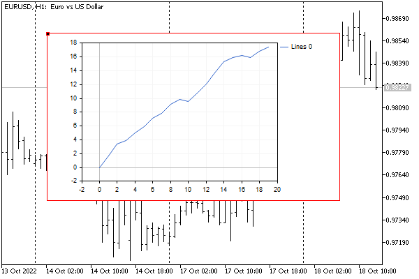
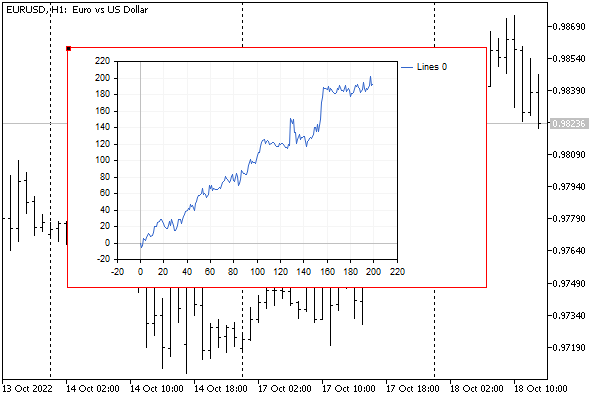

# Solving equations

In machine learning methods and optimization problems, it is often required to find a solution to a system of linear equations. MQL5 contains four methods that allow solving such equations depending on the matrix type.

- Solve solves a linear matrix equation or a system of linear algebraic equations
- LstSq  solves a system of linear algebraic equations approximately (for non-square or degenerate matrices)
- Inv calculates a multiplicative inverse matrix relative to a square non-singular matrix using the Jordan-Gauss method
- PInv calculates the pseudo-inverse matrix by the Moore-Penrose method

Following are the method prototypes.

vector<T> matrix<T>::Solve(const vector<T> b)

vector<T> matrix<T>::LstSq(const vector<T> b)

matrix<T> matrix<T>::Inv()

matrix<T> matrix<T>::PInv()

The Solve and LstSq methods imply the solution of a system of equations of the form A*X=B, where A is a matrix, B is a vector passed through a parameter with the values of the function (or "dependent variable").

Let's try to apply the LstSq method to solve a system of equations, which is a model of ideal portfolio trading (in our case, we will analyze a portfolio of the main Forex currencies). To do this, on a given number of "historical" bars, we need to find such lot sizes for each currency, with which the balance line tends to be a constantly growing straight line.

Let's denote the i-th currency pair as Si. Its quote at the bar with the k index is equal to Si[k]. The numbering of bars will go from the past to the future, as in matrices and vectors populated by the [CopyRates](/en/book/common/matrices/matrices_copyrates) method. Thus, the beginning of the collected quotes for training the model corresponds to the bar marked with the number 0, but on the timeline, it will be the oldest historical bar (of those that we process, according to the algorithm settings). The bars on the right (to the future) from it are numbered 1, 2, and so on, up to the total number of bars on which the user will order the calculation.

A change in the price of a symbol between the 0th bar and the Nth bar determines the profit (or loss) by the time of the Nth bar.

Taking into account the set of currencies, we get, for example, the following profit equation for the 1st bar:

```
(S1[1] - S1[0]) * X1 + (S2[1] - S2[0]) * X2 + ... + (Sm[1] - Sm[0]) * Xm = B

```

Here m is the total number of characters, Xi is the lot size of each symbol, and B is the floating profit (conditional balance, if you lock in the profit).

For simplicity, let's shorten the notation. Let's move from absolute values to price increments (Ai [k] = Si [k]-Si [0]). Taking into account the movement through bars, we will obtain several expressions for the virtual balance curve:

```
A1[1] * X1 + A2[1] * X2 + ... + Am[1] * Xm = B[1]
A1[2] * X1 + A2[2] * X2 + ... + Am[2] * Xm = B[2]
...
A1[K] * X1 + A2[K] * X2 + ... + Am[K] * Xm = B[K]

```

Successful trading is characterized by a constant profit on each bar, i.e., the model for the right-handed vector B is a monotonically increasing function, ideally a straight line.

Let's implement this model and select the X coefficients for it based on quotes. Since we do not yet know the application APIs, we will not code a full-fledged trading strategy. Let's just build a virtual balance chart using the GraphPlot function from the standard header file Graphic.mqh (we have already used it to demonstrate [mathematical functions](/en/book/common/maths)).

The full source code for the new example is in the script MatrixForexBasket.mq5.

In the input parameters, let the user choose the total number of bars for data sampling (BarCount), as well as the bar number within this selection (BarOffset) on which the conditional past ends and the conditional future begins.

A model will be built on the conditional past (the above system of linear equations will be solved), and a forward test will be performed on the conditional future.

```
input int BarCount = 20;  // BarCount (known "history" and "future")
input int BarOffset = 10; // BarOffset (where "future" starts)
input ENUM_CURVE_TYPE CurveType = CURVE_LINES;

```

To fill the vector with an ideal balance, we write the ConstantGrow function: it will be used later during initialization.

```
void ConstantGrow(vector &v)
{
   for(ulong i = 0; i < v.Size(); ++i)
   {
      v[i] = (double)(i + 1);
   }
}

```

The list of traded instruments (major Forex pairs) is hard-set at the beginning of the OnStart function – edit it to suit your requirements and trading environment.

```
void OnStart()
{
   const string symbols[] =
   {
      "EURUSD", "GBPUSD", "USDJPY", "USDCAD", 
      "USDCHF", "AUDUSD", "NZDUSD"
   };
   const int size = ArraySize(symbols);
   ...

```

Let's create the rates matrix in which symbol quotes will be added, the model vector with desired balance curve, and the auxiliary close vector for a symbol-by-symbol request for bar closing prices (the data from it will be copied into the columns of the rates matrix).

```
   matrix rates(BarCount, size);
   vector model(BarCount - BarOffset, ConstantGrow);
   vector close;

```

In a symbol loop, we copy the closing prices into the close vector, calculate price increments, and write them in the corresponding column of the rates matrix.

```
   for(int i = 0; i < size; i++)
   {
      if(close.CopyRates(symbols[i], _Period, COPY_RATES_CLOSE, 0, BarCount))
      {
         // calculate increments (profit on all and on each bar in one line)
         close -= close[0];
         // adjust the profit to the pip value
         close *= SymbolInfoDouble(symbols[i], SYMBOL_TRADE_TICK_VALUE) /
            SymbolInfoDouble(symbols[i], SYMBOL_TRADE_TICK_SIZE);
         // place the vector in the matrix column
         rates.Col(close, i);
      }
      else
      {
         Print("vector.CopyRates(%d, COPY_RATES_CLOSE) failed. Error ", 
            symbols[i], _LastError);
         return;
      }
   }
   ...

```

We will consider the calculation of one price point value (in the deposit currency) in Part 5.

It is also important to note, that bars with the same indexes may have different timestamps on different financial instruments, for example, if there was a holiday in one of the countries and the market was closed (outside of Forex, symbols may, in theory, have different trading session schedules). To solve this problem, we would need a deeper analysis of quotes, taking into account bar times and their synchronization before inserting them into the rates matrix. We do not do this here to maintain simplicity, and also because the Forex market operates according to the same rules most of the time.

We split the matrix into two parts: the initial part will be used to find a solution (this emulates optimization on history), and the subsequent part will be used for a forward test (calculation of subsequent balance changes).

```
   matrix split[];
   if(BarOffset > 0)
   {
      // training on BarCount - BarOffset bars
      // check on BarOffset bars
      ulong parts[] = {BarCount - BarOffset, BarOffset};
      rates.Split(parts, 0, split);
   }
  
   // solve the system of linear equations for the model
   vector x = (BarOffset > 0) ? split[0].LstSq(model) : rates.LstSq(model);
   Print("Solution (lots per symbol): ");
   Print(x);
   ...

```

Now, when we have a solution, let's build the balance curve for all bars of the sample (the ideal "historical" part will be at the beginning, and then the "future" part will begin, which was not used to adjust the model).

```
   vector balance = vector::Zeros(BarCount);
   for(int i = 1; i < BarCount; ++i)
   {
      balance[i] = 0;
      for(int j = 0; j < size; ++j)
      {
         balance[i] += (float)(rates[i][j] * x[j]);
      }
   }
   ...

```

Let's estimate the quality of the solution by the R2 criterion.

```
   if(BarOffset > 0)
   {
      // make a copy of the balance
      vector backtest = balance;
      // select only "historical" bars for backtesting
      backtest.Resize(BarCount - BarOffset);
      // bars for the forward test have to be copied manually
      vector forward(BarOffset);
      for(int i = 0; i < BarOffset; ++i)
      {
         forward[i] = balance[BarCount - BarOffset + i];
      }
      // compute regression metrics independently for both parts
      Print("Backtest R2 = ", backtest.RegressionMetric(REGRESSION_R2));
      Print("Forward R2 = ", forward.RegressionMetric(REGRESSION_R2));
   }
   else
   {
      Print("R2 = ", balance.RegressionMetric(REGRESSION_R2));
   }
   ...

```

To display the balance curve on a chart, you need to transfer data from a vector to an array.

```
   double array[];
   balance.Swap(array);
   
   // print the values of the changing balance with an accuracy of 2 digits
   Print("Balance: ");
   ArrayPrint(array, 2);
  
   // draw the balance curve in the chart object ("backtest" and "forward")
   GraphPlot(array, CurveType);
}

```

Here is an example of a log obtained by running the script on EURUSD,H1.

```
Solution (lots per symbol): 
[-0.0057809334,-0.0079846876,0.0088985749,-0.0041461736,-0.010710154,-0.0025694175,0.01493552]
Backtest R2 = 0.9896645616246145
Forward R2 = 0.8667852183780984
Balance: 
 0.00  1.68  3.38  3.90  5.04  5.92  7.09  7.86  9.17  9.88 
 9.55 10.77 12.06 13.67 15.35 15.89 16.28 15.91 16.85 16.58

```

And here is what the virtual balance curve looks like.



Virtual balance of trading a portfolio of currencies by lots according to the  decision

The left half has a more even shape and a higher R2, which is not surprising because the model (X variables) was adjusted specifically for it.

Just out of interest, we will increase the depth of training and verification by 10 times, that is, we will set in the parameters BarCount = 200 and BarOffset = 100. We will get a new picture.



Virtual balance of trading a portfolio of currencies by lots according to the decision

The "future" part looks less smooth, and we can even say that we are lucky that it continues to grow, despite such a simple model. As a rule, during the forward test, the virtual balance curve significantly degrades and starts to go down.

It is important to note that to test the model, we took the obtained X values from the "as is" solution of the system, while in practice we will need to normalize them to the minimum lots and lot step, which will negatively affect the results and bring them closer to reality.
