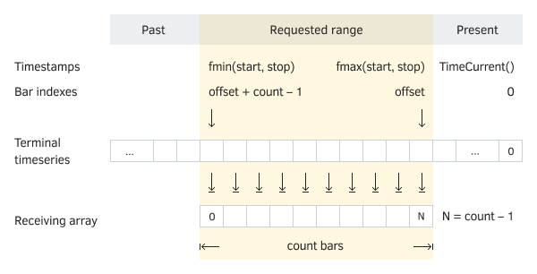

# Overview of Copy functions for obtaining arrays of quotes

The MQL5 API contains several functions for reading quote timeseries into arrays. Their names are given in the following table.

| Function | Action |
| --- | --- |
| CopyRates | Get the history of quotes into an array of  MqlRates  structures |
| CopyTime | Get the history of bar opening times into an array of type  datetime |
| CopyOpen | Get the history of bar opening prices into an array of type  double |
| CopyHigh | Get the history of bar high prices into an array of type  double |
| CopyLow | Get the history of bar low prices into an array of type  double |
| CopyClose | Get the history of bar closing prices into an array of type  double |
| CopyTickVolume | Get the history of tick volumes into an array of type  long |
| CopyRealVolume | Get the history of exchange volumes into an array of type  long |
| CopySpread | Get the history of spreads into an array of type  int |

All functions take as the first two parameters the name of the desired symbol and period, which can be conditionally represented by the following pseudocode:

```
int Copy***(const string symbol, ENUM_TIMEFRAMES timeframe, ...)

```

Also, all functions have three variants of the prototype, which differ in the way the requested range is set:

- Initial bar index and number of bars: Copy***(..., int offset, int count, ...)
- Range start time and number of bars: Copy***(..., datetime start, int count, ...)
- Range start and end times: Copy***(..., datetime start, datetime stop, ...)

At the same time, the parameter notation implies that the requested data has an indexing direction as in a timeseries, that is, the offset position with index 0 stores the data of the current incomplete bar, and the increase in indexes corresponds to moving deeper into the price history. Because of this, in particular of the second option, the indicated number of bars count will count backward from the start of the offset range, that is, in the time decrease direction.

The third option provides additional flexibility: it does not matter in which order the start and finish dates are specified (start/stop), as the functions will in any case return data in the range from the smaller date to the larger one. Suitable bars are selected in such a way that their opening time is between time counts start/stop or is equal to one of them, that is, range [start; stop] is considered including boundaries.

Which function option to choose is determined by the developer based on what is more important: to get a guaranteed number of elements (for example, for machine learning algorithms) or to cover a specific date interval (for example, with a predetermined uniform market behavior).

The time representation accuracy in the datetime type is 1 second. Values start/stop do not have to be rounded to the size of the period. For example, the range from 14:59 to 16:01 will allow you to select two bars on the H1 timeframe for 15:00 and 16:00. A degenerate range with equal and rounded labels, for example, 15:00 in H1 quotes, corresponds to one bar.

You can request bars on the daily timeframe even if there are non-zero hours/minutes/seconds in the start/stop parameters (despite the fact that the bar labels on the D1 timeframe have the time 00:00). In this case, only those D1 bars that have an opening time after the minimum of start/stop and up to the maximum start/stop (equality with labels of daily bars is impossible in this case since the required time contains hours/minutes/seconds). For example, between D'2021.09.01 12:00' and D'2021.09.03 07:00', there are two opening times of D1 bars — D'2021.09.02' and D'2021.09.03'. These bars will be included in the result. Bar D'2021.09.01' has an opening time of 00:00 which is earlier than the beginning of the range and is therefore discarded. Bar D'2021.09.03' is included in the result, despite the fact that only 7 hours of the morning from that day fell into the range. On the other hand, a request for several hours within a day, for example, between D'2021.09.01 12:00' and D'2021.09.01 15:00' will not cover a single day bar (the opening time of the D'2021.09.01' bar does not fall into this range), and therefore the receiving array will be empty.

The only difference between all the functions from the table is the type of the array that receives the data, which is passed as the last parameter by reference. For example, the CopyRates function puts the requested data into an array of structures [MqlRates](/en/book/applications/timeseries/timeseries_mqlrates), and the CopyTime function places the bar opening times into an array of type datetime, and so on.

Thus, common function prototypes can be represented as follows:

int Copy***(const string symbol, ENUM_TIMEFRAMES timeframe, int offset, int count, type &result[])

int Copy***(const string symbol, ENUM_TIMEFRAMES timeframe, datetime start, int count, type &result[])

int Copy***(const string symbol, ENUM_TIMEFRAMES timeframe, datetime start, datetime stop, type &result[])

Here, the type matches any of the types MqlRates, datetime, double, long or int, depending on the specific function.

The functions return the number of elements copied into the array or -1 on error. In particular, we will get -1 if there is no data on the server in the requested interval, or the interval is outside the maximum number of bars on the chart (TerminalInfoInteger(TERMINAL_MAXBARS)).

It is important to note that in the receiving array, the received data is always physically placed in chronological order, from the past to the future. Thus, if the standard indexing is used for the receiving array (that is, the function [ArraySetAsSeries](/en/book/common/arrays/arrays_as_series)), then the element at index 0 will be the oldest and the last element the newest. If the instruction was executed for the array ArraySetAsSeries(result, true), then the numbering will be carried out in reverse order, as in a timeseries: the 0th element will be the newest in the range, and the last element will be the oldest. This is illustrated in the following figure.



Terminal timeseries and receiving array

If successful, the specified number of elements from the terminal's own (internal) timeseries will be copied to the destination array. When requesting data by date range (start/stop), the number of elements in the resulting array will be determined indirectly, based on the contents of the history in this range. Therefore, to copy a previously unknown number of values, it is recommended to use dynamic arrays: the copy functions independently allocate the required size of the destination arrays (the size can be either increased or decreased).

If you need to copy a known number of elements or do it frequently, such as every time you call [OnTick](/en/book/automation/experts/experts_ontick) in Expert Advisors or [OnCalculate](/en/book/applications/indicators_make/indicators_oncalculate) in indicators, it is better to use statically distributed arrays. The fact is that memory allocation operations for dynamic arrays require additional time and can affect performance, especially during testing and optimization.

Timeseries are accessed differently for different types of MQL programs if the requested data is not yet ready. For example, in custom [indicators](/en/book/applications/indicators_make), Copy functions immediately return an error, since the indicators are executed in the common interface thread of the terminal and cannot wait for data to be received (it is assumed that the indicators will request data during the next calls of their event handlers, and the timeseries will have already been downloaded and built by that time). In addition, in the chapter on indicators, we will learn that to access the quotes of the "native" chart on which the indicator is placed, it does not need to use Copy functions, because all time series are automatically passed through array parameters of the handler [OnCalculate](/en/book/applications/indicators_make/indicators_oncalculate).

When accessed from Expert Advisors and scripts, several attempts are made to receive data with a short pause (with a wait inside the function), which gives time to load and calculate the missing timeseries. The function will return the amount of data that will be ready by the time this timeout expires, but the history loading will continue, and the next similar request will return more data.

In any case, you should be prepared that the Copy function will return an error instead of data (there are different reasons: connection failure, lack of requested data, processor load if many new timeseries are requested in parallel): analyze the cause of the problem in the code ([_LastError](/en/book/common/environment/env_last_error)) and try again later, correct the settings, or inform the user.

The presence of a symbol in Market Watch is not a necessary condition for requesting timeseries using Copy functions, however, for symbols included in this window, queries tend to run faster because some data has already been downloaded from the server and probably calculated for the requested periods. How to add characters to Market Watch programmatically, we will learn in the section [Editing the Market Watch list](/en/book/automation/symbols/symbols_select).

To explain the principles of how the functions work in practice, let's consider the script SeriesCopy.mq5. It contains multiple calls to the function CopyTime, which allows you to visually see how the timestamps and bar numbers correlate.

The script defines a dynamic array times to receive data. All requests are made for the "EURUSD" symbol and the H1 timeframe.

```
void OnStart()
{
   datetime times[];

```

To begin with, a request is made for 10 bars, starting from September 5, 2021, into the past. Since this day is Sunday, the previous bars were on Friday the 3rd (see the log below).

```
   PRTF(CopyTime("EURUSD", PERIOD_H1, D'2021.09.05', 10, times)); // 10 / ok
   ArrayPrint(times);
   /*
   [0] 2021.09.03 14:00 2021.09.03 15:00 2021.09.03 16:00 2021.09.03 17:00 2021.09.03 18:00
   [5] 2021.09.03 19:00 2021.09.03 20:00 2021.09.03 21:00 2021.09.03 22:00 2021.09.03 23:00
   */

```

The output of the array is done by default in chronological order (despite the fact that the function parameters are set in the reverse coordinate system: as in a timeseries). Let's change the indexing order in the receiving array and output it again.

```
   PRTF(ArraySetAsSeries(times, true)); // true / ok
   ArrayPrint(times);
   /*
   [0] 2021.09.03 23:00 2021.09.03 22:00 2021.09.03 21:00 2021.09.03 20:00 2021.09.03 19:00
   [5] 2021.09.03 18:00 2021.09.03 17:00 2021.09.03 16:00 2021.09.03 15:00 2021.09.03 14:00
   */

```

For the next experiments, we will restore the usual order.

```
   PRTF(ArraySetAsSeries(times, false)); // true / ok

```

Now let's request an indefinite number of bars between two time points (the number is unknown, because holidays may be in the range, for example). We will do this in two ways: in the first case, we indicate the range from the future to the past, and in the second, from the past to the future. The results match.

```
   //                                      FROM                 TO
   PRTF(CopyTime("EURUSD", PERIOD_H1, D'2021.09.06 03:00', D'2021.09.05 03:00', times));
   ArrayPrint(times)  //                   FROM                 TO
   PRTF(CopyTime("EURUSD", PERIOD_H1, D'2021.09.05 03:00', D'2021.09.06 03:00', times));
   ArrayPrint(times);
   /*
   CopyTime(EURUSD,PERIOD_H1,D'2021.09.06 03:00',D'2021.09.05 03:00',times)=4 / ok
   2021.09.06 00:00 2021.09.06 01:00 2021.09.06 02:00 2021.09.06 03:00
   CopyTime(EURUSD,PERIOD_H1,D'2021.09.05 03:00',D'2021.09.06 03:00',times)=4 / ok
   2021.09.06 00:00 2021.09.06 01:00 2021.09.06 02:00 2021.09.06 03:00
   */

```

By printing the arrays, we can see that they are identical. Let's return to the timeseries indexing mode and discuss one more point.

```
   PRTF(ArraySetAsSeries(times, true)); // true / ok
   ArrayPrint(times);
   // 2021.09.06 03:00 2021.09.06 02:00 2021.09.06 01:00 2021.09.06 00:00

```

Although the two timestamps are 24 hours apart, which implies getting 25 elements in the array (remember that the beginning and end are processed inclusively), the result contains only 4 bars. The fact is that September 5th falls on a Sunday, and therefore, out of the entire range, trading was carried out only in the morning hours of the 6th.

Also, note that the receiving array has been automatically reduced in size from 10 to 4 elements.

Finally, we will request 10 bars, starting from the 100th bar (the results obtained will depend on your current time and available history).

```
   PRTF(CopyTime("EURUSD", PERIOD_H1, 100, 10, times)); // 10 / ok
   ArrayPrint(times);
   /*
   [0] 2021.10.04 19:00 2021.10.04 18:00 2021.10.04 17:00 2021.10.04 16:00 2021.10.04 15:00
   [5] 2021.10.04 14:00 2021.10.04 13:00 2021.10.04 12:00 2021.10.04 11:00 2021.10.04 10:00
   */
}

```

Due to indexing as in a timeseries, the array is displayed in reverse chronological order.
