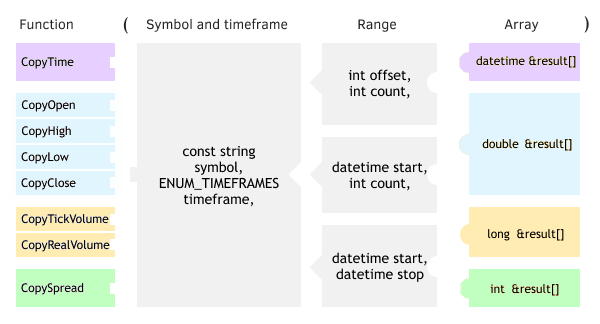

# Separate request for arrays of prices, volumes, spreads, time

Instead of querying all encoding characteristics as an array MqlRates, you can read only the data of a particular field (price, volume, spread, or time) into a separate array. To do this, several functions are defined, operating on the general principles discussed in the section [Overview of Copy functions for obtaining arrays of quotes](/en/book/applications/timeseries/timeseries_copy_funcs_overview).

The following diagram combines descriptions of all prototypes.



Prototype diagram of copy functions

The script SeriesRates.mq5 uses the functions of copying OHLC prices to compare them with the result of the call to CopyRates.

```
void OnStart()
{
   const int N = 10;
   MqlRates rates[];
   
   // request and display all information about N bars from the MqlRates array
   PRTF(CopyRates("EURUSD", PERIOD_D1, D'2021.10.01', N, rates));
   ArrayPrint(rates);
   
   // now request OHLC prices separately
   double open[], high[], low[], close[];
   PRTF(CopyOpen("EURUSD", PERIOD_D1, D'2021.10.01', N, open));
   PRTF(CopyHigh("EURUSD", PERIOD_D1, D'2021.10.01', N, high));
   PRTF(CopyLow("EURUSD", PERIOD_D1, D'2021.10.01', N, low));
   PRTF(CopyClose("EURUSD", PERIOD_D1, D'2021.10.01', N, close));
   
   // compare prices obtained by different methods
   for(int i = 0; i < N; ++i)
   {
      if(rates[i].open != open[i]
      || rates[i].high != high[i]
      || rates[i].low != low[i]
      || rates[i].close != close[i])
      {
         // we shouldn't be here
         Print("Data mismatch at ", i);
         return;
      }
   }
   
   Print("Copied OHLC arrays match MqlRates array"); // success: there is a match
}

```

After running the script, we get the following entries in the log.

```
CopyRates(EURUSD,PERIOD_D1,D'2021.10.01',N,rates)=10 / ok
                 [time]  [open]  [high]   [low] [close] [tick_volume] [spread] [real_volume]
[0] 2021.09.20 00:00:00 1.17272 1.17363 1.17004 1.17257         58444        0             0
[1] 2021.09.21 00:00:00 1.17248 1.17486 1.17149 1.17252         58514        0             0
[2] 2021.09.22 00:00:00 1.17240 1.17555 1.16843 1.16866         72571        0             0
[3] 2021.09.23 00:00:00 1.16860 1.17501 1.16835 1.17381         68536        0             0
[4] 2021.09.24 00:00:00 1.17379 1.17476 1.17007 1.17206         51401        0             0
[5] 2021.09.27 00:00:00 1.17255 1.17255 1.16848 1.16952         57807        0             0
[6] 2021.09.28 00:00:00 1.16940 1.17032 1.16682 1.16826         64793        0             0
[7] 2021.09.29 00:00:00 1.16825 1.16901 1.15894 1.15969         68964        0             0
[8] 2021.09.30 00:00:00 1.15963 1.16097 1.15626 1.15769         68517        0             0
[9] 2021.10.01 00:00:00 1.15740 1.16075 1.15630 1.15927         66777        0             0
CopyOpen(EURUSD,PERIOD_D1,D'2021.10.01',N,open)=10 / ok
CopyHigh(EURUSD,PERIOD_D1,D'2021.10.01',N,high)=10 / ok
CopyLow(EURUSD,PERIOD_D1,D'2021.10.01',N,low)=10 / ok
CopyClose(EURUSD,PERIOD_D1,D'2021.10.01',N,close)=10 / ok
Copied OHLC arrays match MqlRates array

```

Recall that the tick volume in the field tick_volume is a simple counter of ticks for a period. Exchange volume in the field real_volume is equal to zero for non-exchange instruments (as well as for EURUSD, in this case).

Another example of using the function CopyTime was provided in the script SeriesCopy.mq5 in the section [Overview of Copy-functions for obtaining arrays of quotes](/en/book/applications/timeseries/timeseries_copy_funcs_overview).
