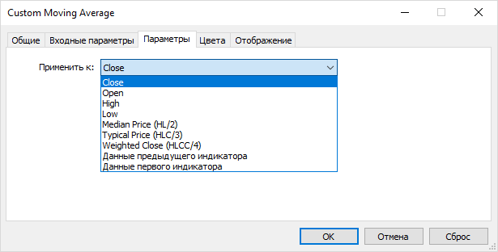

# Main indicator event: OnCalculate

The OnCalculate function is the main entry point to the MQL5 indicator code. It is called whenever the OnCalculate event occurs, which is generated when price data changes. For example, it can happen when a new tick for a symbol arrives or when old prices change (filling a gap in the history or downloading missing data from the server).

There are two variants of the function, which differ in the source material for calculations:

- Full — provides a set of standard price timeseries in the parameters (OHLC prices, volumes, spreads)
- Reduced — for one arbitrary timeseries (not necessarily standard)

An indicator should use only one of the two options, while it is impossible to combine them in one indicator.

In the case of using the reduced form of OnCalculate, when placing an indicator on a chart, an additional tab becomes available in its properties dialog. It provides a drop-down list Apply to, in which you should select the initial timeseries on the basis of which the indicator will be calculated. By default, if no timeseries is selected, the calculation is based on Close price values.



Selecting the initial timeseries for the indicator with the short form OnCalculate

The list always offers standard types of prices, but if there are other indicators on the chart, this setting allows you to select one of them as the data source for another indicator, thereby building a processing chain from indicators. We will try to build one indicator from another in the section [Skip drawing on initial bars](/en/book/applications/indicators_make/indicators_begin). When using the full form, this option is not available.

It is forbidden to apply indicators to the following built-in indicators: Fractals, Gator, Ichimoku, and Parabolic SAR.

The short form of OnCalculate has the following prototype.

int OnCalculate(const int rates_total, const int prev_calculated, const int begin,  

   const double &data[])

The data array contains the initial data for the calculation. This can be one of the price timeseries or a calculated buffer of another indicator. The rates_total parameter specifies the size of the data array. ArraySize(data) or iBars(NULL, 0) calls should give the same value as rates_total.

The prev_calculated parameter is designed to effectively recalculate the indicator on a small number of new bars (usually on one, the last one), instead of a full calculation on all bars. The prev_calculated value is equal to the result of the OnCalculate function returned to the runtime from a previous function call. For example, if upon receipt of the next tick, the indicator has calculated the formula for all bars, it should return the value of rates_total A  from OnCalculate (here the index A means the initial moment). Then, on the next tick, upon receiving the OnCalculate event, the terminal will set prev_calculated to the previous value rates_totalA. However, the number of bars during this time may already have changed, and the new value rates_total will increase; let's call it rates_totalB. Thus, only bars from prev_calculated (aka rates_totalA) till rates_totalB will be calculated.

However, the most common situation is when new ticks fit into the current zero bar, that is, rates_total does not change, and therefore in most OnCalculate calls, we have the equality prev_calculated == rates_total. Do we need to recalculate something in this case? It depends on the nature of the calculations. For example, if the indicator is calculated based on the bar opening prices, which do not change, then there is no point in recalculating anything. However, if the indicator uses the closing price (in fact, the price of the last known tick) or any other summary price that depends on Close, then the last bar should always be recalculated.

The first time the OnCalculate function is called, the value of prev_calculated equals 0.

If since the last call of the OnCalculate function, the price data has changed (for example, a deeper history has been uploaded or gaps have been filled in), then the value of the prev_calculated parameter will also be set to 0 by the terminal. Thus, the indicator will be given a signal for a complete recalculation over the entire available history.

If the OnCalculate function returns a null value, the indicator is not drawn, and the names and values of its buffers in the Data window will be hidden.

Please note that the return of the full number of bars rates_total is the only standard way to tell the terminal and other MQL programs which will use the indicator that its data is ready. Even if an indicator is designed to calculate and show only a limited amount of data, it should return rates_total.

The indexing direction of the data array can be selected by calling [ArraySetAsSeries](/en/book/common/arrays/arrays_as_series) (the default is false, which can be verified by calling ArrayGetAsSeries). At the same time, if we apply the [ArrayIsSeries](/en/book/common/arrays/arrays_as_series) function to the array, it will return true. This means that this array is an internal array, managed by the terminal. The indicator cannot change it in any way, but only read it, especially since there is a const modifier in the parameter description.

The begin parameter reports the number of initial values of the data array which should be excluded from the calculation. The parameter is set by the system when our indicator is configured by the user in such a way that it receives data from another indicator (see image above). For example, if the selected data source indicator calculates a moving average period N, then the first N - 1 bars, by definition, do not contain source data, since there it is impossible to average over N bars. If the developer has set a special property in this source indicator, it will be correctly passed to us in the begin parameter. We will soon check this aspect in practice (see section [Skip drawing on initial bars](/en/book/applications/indicators_make/indicators_begin)).

Let's try to create an empty indicator with a shortened form of OnCalculate. It will not be able to do anything yet but will serve as a preparation for further experiments. The original file IndStub.mq5 can be found in the folder MQL5/Indicators/MQL5Book/p5/. To make sure the indicator works, let's add the following to OnCalculate: the possibility to output prev_calculated and rates_total values to the log and to count the number of function calls.

```
int OnCalculate(const int rates_total, 
                const int prev_calculated, 
                const int begin, 
                const double &data[])
{
   static int count = 0;
   ++count;
   // compare the number of bars on the previous call and the current one
   if(prev_calculated != rates_total)
   {
      // signal only if there is a difference
      PrintFormat("calculated=%d rates=%d; %d ticks", 
         prev_calculated, rates_total, count);
   }
   return rates_total; // return the number of processed bars
}

```

Condition for the inequality of prev_calculated and rates_total ensures that the message will only appear the first time the indicator is placed on the chart, and also as new bars appear. All ticks coming during the formation of the current bar will not change the number of bars, and therefore prev_calculated and rates_total will be equal. However, we will count the total number of ticks in the count variable.

The remaining parameters are still out of work, but we will gradually use all the possibilities.

This source code compiles successfully, but generates two warnings.

```
no indicator window property is defined, indicator_chart_window is applied
no indicator plot defined for indicator

```

They indicate the absence of some #property directives, which, although not mandatory, set the basic properties of the indicator. In particular, the first warning says that no binding method has been selected for the indicator: the main window or subwindow, and therefore the main chart window will be used by default. The second warning is related to the fact that we have not set the number of charts to display. As already mentioned, some indicators are purposely designed without buffers because they are designed to perform other actions but in our case this is a reminder to add a visual part later.

We will deal with the elimination of warnings in a couple of paragraphs, but for now, we will launch the indicator on the EURUSD,M1 chart. We use the M1 timeframe because this way we can quickly see the formation of new bars and the appearance of messages in the log.

```
calculated=0 rates=10002; 1 ticks
calculated=10002 rates=10003; 30 ticks
calculated=10003 rates=10004; 90 ticks
calculated=10004 rates=10005; 167 ticks
calculated=10005 rates=10006; 240 ticks

```

Thus, we see that the OnCalculate handler is called as expected, and you can perform calculations in it, both on each tick and on bars. The indicator can be removed from the chart by calling the Indicator List dialog from the chart context menu: select the desired indicator and press Delete.

Now let's get back to another prototype of the OnCalculate function. We have seen tried a reduced version in practice, but we could implement exactly the same blank for the full form.

The full form is designed for calculation based on standard price timeseries and has the following prototype.

int OnCalculate(const int rates_total, const int prev_calculated, const datetime &time[],  

   const double &open[], const double &high[], const double &low[], const double &close[],  

   const long &tick_volume[], const long &volume[], const int &spread[])

The rates_total and prev_calculated parameters have the same meaning as in the simple form of OnCalculate: rates_total sets the size of the transmitted timeseries (all arrays have the same length since this is the total number of bars on the chart), and prev_calculated contains the number of bars processed on the previous call (that is, the value that the OnCalculate function returned earlier to the terminal using the return statement).

Arrays open, high, low, and close contain the relevant prices for the current chart bars: the timeseries of the working symbol and timeframe. The time array contains the open time for each bar, and tick_volume and volume contain trading volumes (tick and exchange) per bar.

In the previous chapter, we studied [Timeseries](/en/book/applications/timeseries) with standard price and volume types provided by the terminal for MQL programs through a set of functions. So, for the convenience of calculating the indicator, these timeseries are passed to the OnCalculate handler directly by reference as arrays. This eliminates the need to call these functions and copy (duplicate) quotes to internal arrays. Of course, this technique is suitable only for those indicators that are calculated on one combination of a working symbol and a timeframe that matches the current chart. However, MQL5 allows you to create multi-currency, multi-timeframe indicators, as well as indicators for symbols and timeframes other than those of the current chart. In all such cases, it is already impossible to do without the functions of access to timeseries. A little later we will see how this is done.

If we check for all passed arrays if they belong to the terminal using [ArrayIsSeries](/en/book/common/arrays/arrays_as_series), this function will return true. All arrays are read-only. The const modifier in the parameter description also underlines it.

Choose between the full and reduced forms based on which data the computational algorithm needs. For example, to smooth an array using the moving average algorithm, only one input array is required, and therefore the indicator can be built for any price type the user chooses. However, well-known indicators ParabolicSAR or ZigZag demand High and Low prices and therefore must use the full version of OnCalculate. In the following sections, we will see examples of indicators for both, the simple version of OnCalculate, and the complete version.
