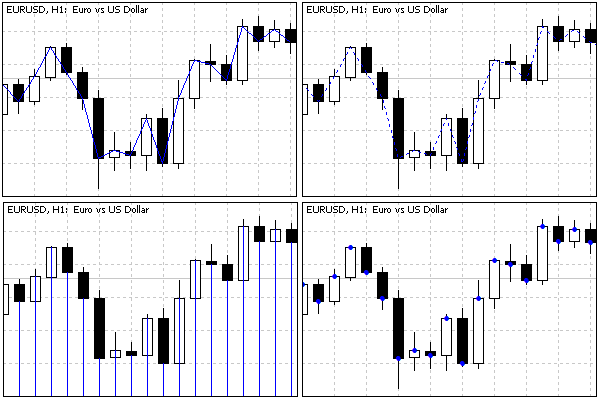
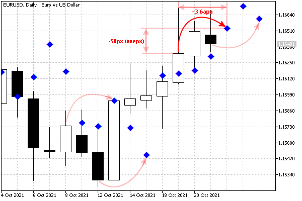

# Plot settings: PlotIndexSetInteger

The MQL5 API provides the following functions for configuring plots: PlotIndexSetInteger, PlotIndexSetDouble, and PlotIndexSetString. Integer properties can also be read via PlotIndexGetInteger. We are primarily interested in integer properties.

The PlotIndexSetInteger function has two forms. We will see their differences a little later.

bool PlotIndexSetInteger(int index, ENUM_PLOT_PROPERTY_INTEGER property, int value)

bool PlotIndexSetInteger(int index, ENUM_PLOT_PROPERTY_INTEGER property, int modifier,  

   int value)

The function sets the value of the property of a graphical plot at the specified index. The value of index must be between 0 and P - 1, where P is the number of plots specified by the directive [#property indicator_plots](/en/book/applications/indicators_make/indicators_buffers_plots). The property itself is identified by the property parameter: allowable values should be taken from the ENUM_PLOT_PROPERTY_INTEGER enumeration (see below). The property value is passed in the value parameter.

The second form of the function is used for properties that apply to multiple components (belonging to the same property, though). In particular, for some types of diagrams, it is possible to assign a set of colors rather than one color. In this case, you can use the modifier parameter to change any color in this set.

On success, the function returns true; otherwise, it returns false.

The following table provides the available ENUM_PLOT_PROPERTY_INTEGER properties.

| Identifier | Description | Property type |
| --- | --- | --- |
| PLOT_ARROW | Arrow code from Wingdings font for DRAW_ARROW charts | uchar |
| PLOT_ARROW_SHIFT | Vertical arrow offset for DRAW_ARROW charts | int |
| PLOT_DRAW_BEGIN | Index of the first bar (from left to right) where the data starts | int |
| PLOT_DRAW_TYPE | Plot (chart) type | ENUM_DRAW_TYPE |
| PLOT_SHOW_DATA | Flag for displaying plot values in the  Data window  ( true  — visible,  false  — not visible) | bool |
| PLOT_SHIFT | Shift of the indicator graphics along the time axis in bars (positive shifts to the right, negative to the left) | int |
| PLOT_LINE_STYLE | Line drawing style | ENUM_LINE_STYLE |
| PLOT_LINE_WIDTH | Line thickness in pixels (1 - 5) | int |
| PLOT_COLOR_INDEXES | Number of colors (1 - 64) | int |
| PLOT_LINE_COLOR | Rendering color | color (modifier — color number) |

Gradually we will learn all the properties, but for now, we will focus on the three main ones: PLOT_DRAW_TYPE, PLOT_LINE_STYLE, and PLOT_LINE_COLOR.

Indicators in MetaTrader 5 support several predefined plotting types. They determine the visual representation and the required structure of buffers with the initial data for display.

There are 10 such basic plots in total, and at the MQL5 level, they are described by identifiers in the ENUM_DRAW_TYPE enumeration. It is the PLOT_DRAW_TYPE property that should be assigned one of the ENUM_DRAW_TYPE values.

| Visualization type,  
 examples | Description | Number of  
 buffers |
| --- | --- | --- |
| DRAW_NONE 
 IndDeltaVolume.mq5 | Nothing is displayed on the chart, but the values of the corresponding buffer are available in the Data Window | 1 |
| DRAW_LINE 
 IndLabelHighLowClose.mq5 ,  IndWPR.mq5, IndUnityPercent.mq5 | Curved line by buffer values ("empty" elements form a gap in the line) | 1 |
| DRAW_SECTION | Straight segments forming a polyline between "non-empty" buffer elements (if no gaps, similar to DRAW_LINE) | 1 |
| DRAW_ARROW 
 IndReplica3.mq5 ,  IndFractals.mq5 | Characters (labels) | 1 |
| DRAW_HISTOGRAM 
 IndDeltaVolume.mq5 | Histogram from zero line to buffer values | 1 |
| DRAW_HISTOGRAM2 
 IndLabelHighLowClose.mq5 | Histogram between the values of paired elements of two indicator buffers | 2 |
| DRAW_ZIGZAG 
 IndFractalsZigZag.mq5 | Straight segments forming a polyline between successively occurring "non-empty" elements of two buffers (similar to DRAW_SECTION, but unlike it allows vertical segments on one bar) | 2 |
| DRAW_FILLING | Color filling of the channel between two lines by paired values in two buffers | 2 |
| DRAW_BARS 
 IndSubChartSimple.mq5 | Display as bars: four prices per bar are displayed in four adjacent buffers, in the OHLC order | 4 |
| DRAW_CANDLES 
 IndSubChartSimple.mq5 | Candlestick display: four prices per bar are shown in four adjacent buffers, in the OHLC order | 4 |

This table does not list all ENUM_DRAW_TYPE elements. There are analogs of the same plots with support for coloring individual elements (bars). We will present them in a separate section [Element-by-element coloring of diagrams](/en/book/applications/indicators_make/indicators_color). The MQL5 documentation provides [examples for all types](https://www.mql5.com/en/docs/customind/indicators_examples), and within the scope of this book, there are some exceptions: the presence of demonstration indicators is indicated next to the type names.

In all cases, including DRAW_NONE, data from the buffer is available in other programs through the [CopyBuffer](/en/book/applications/indicators_use/indicators_copybuffer) function.

An additional feature of the DRAW_NONE type is that the values of such a buffer do not participate in automatic chart scaling, which is enabled by default for indicators displayed in [subwindows](/en/book/applications/indicators_make/indicators_window_chart_separate).

The style of lines is determined by the PLOT_LINE_STYLE property, which also has an enumeration with valid ENUM_LINE_STYLE values.

| Identifier | Description |
| --- | --- |
| STYLE_SOLID | Solid line |
| STYLE_DASH | Dashed line |
| STYLE_DOT | Dotted line |
| STYLE_DASHDOT | Dot-dash line |
| STYLE_DASHDOTDOT | Dash-two dots |

Finally, the color of the line is set by the PLOT_LINE_COLOR property. In the simplest case, this property contains a single color for the entire chart. For some chart types, in particular DRAW_CANDLES, you can specify multiple colors using a modifier parameter. We will discuss this later (see example IndSubChartSimple.mq5 in section [Multicurrency and multitimeframe indicators](/en/book/applications/indicators_make/indicators_multisymbol)).

The above three properties are enough to demonstrate the indicator IndReplica2.mq5. Let's add two input parameters DrawType and LineStyle of ENUM_DRAW_TYPE and ENUM_LINE_STYLE types respectively, and then call the PlotIndexSetInteger function several times in OnInit to set the rendering properties of the indicator.

```
#property indicator_chart_window
#property indicator_buffers 1
#property indicator_plots 1
 
input ENUM_DRAW_TYPE DrawType = DRAW_LINE;
input ENUM_LINE_STYLE LineStyle = STYLE_SOLID;
 
double buffer[];
 
int OnInit()
{
   // register an array as an indicator buffer
   SetIndexBuffer(0, buffer);
   
   // set the properties of the chart numbered 0
   PlotIndexSetInteger(0, PLOT_DRAW_TYPE, DrawType);
   PlotIndexSetInteger(0, PLOT_LINE_STYLE, LineStyle);
   PlotIndexSetInteger(0, PLOT_LINE_COLOR, clrBlue);
   
   return INIT_SUCCEEDED;
}

```

For the PLOT_LINE_COLOR property, we did not create an input variable, since this and some other properties are directly available from the properties dialog of any indicator, in the Colors tab. By default, that is, immediately after the indicator is launched, the line color will be blue. But the color, as well as the line thickness and style, can be changed in the dialog (on the specified tab). Our LineStyle parameter partly duplicates the corresponding Style cell in the Colors table. However, it provides additional advantages. The standard controls of the dialog do not allow you to select a style when the line width is greater than 1. When using the input variable LineStyle, we can get, for example, a dash-dotted line with a given width of 3 pixels.

Filling the buffer with data in OnCalculate remains unchanged compared to IndReplica1.mq5.

After compiling and launching the indicator on the chart, we get the expected picture: a blue line at the closing prices on the chart, and the corresponding closing prices of the bars in the Data window.

By changing the DrawType input parameter, we can change how the data from the buffer is displayed. In this case, you should only select types that require a single buffer. Any other graphics type (DRAW_HISTOGRAM2, DRAW_ZIGZAG, DRAW_FILLING, DRAW_BARS, DRAW_CANDLES) simply cannot work on a single buffer and will not show anything. It also does not make sense to choose the types of constructions with coloring (beginning with the word "Color"), since they require an additional buffer with color numbers on each bar (as already mentioned, we will get acquainted with this possibility in the section [Element-by-element coloring of diagrams](/en/book/applications/indicators_make/indicators_color)).

The display options DRAW_LINE, DRAW_SECTION, DRAW_HISTOGRAM, and DRAW_ARROW are shown below.



One-buffer chart types

If it were not for specially chosen different styles, STYLE_SOLID for DRAW_LINE and STYLE_DOT for DRAW_SECTION, these drawing types would be the same, because all elements in our buffer have "non-empty" values. By default, the "empty" value means the special constant EMPTY_VALUE, which we did not use. Sections (segments) in DRAW_SECTION are drawn bypassing "empty" elements, and this becomes noticeable only if there are any. We will talk about the installation of "empty" elements in the section [Data gap visualization](/en/book/applications/indicators_make/indicators_empty_value).

The histogram from the zero line DRAW_HISTOGRAM is usually used in indicators with its own window, but here it is shown for demonstration purposes. We will create an indicator in a subwindow with this type of rendering in the section [Waiting for data and managing visibility](/en/book/applications/indicators_make/indicators_wait_none) (see example IndDeltaVolume.mq5).

For the DRAW_ARROW type, the system defaults to the filled circle character (code 159), but you can change it to something else by calling PlotIndexSetInteger(index, PLOT_ARROW, code).

Codes and appearance of [Wingdings](https://www.mql5.com/en/docs/constants/objectconstants/wingdings) font symbols can be found in the MQL5 Help.

In another modification of the IndReplica3.mq5 indicator, we add input parameters to select the "arrow" symbol (ArrowCode), as well as to shift these labels on the chart vertically (Arrow padding) and horizontally (TimeShift).

```
input uchar ArrowCode = 159;
input int ArrowPadding = 0;
input int TimeShift = 0;

```

The vertical shift along the price scale is specified in pixels (positive values mean shift down, negative values mean shift up). The horizontal shift along the time scale is set in bars (positive values are a shift to the right, to the future, and negative values are to the left, to the past). New input variables are passed to PlotIndexSetInteger calls in OnInit.

```
int OnInit()
{
   ...
   PlotIndexSetInteger(0, PLOT_DRAW_TYPE, DRAW_ARROW);
   PlotIndexSetInteger(0, PLOT_ARROW, ArrowCode);
   PlotIndexSetInteger(0, PLOT_ARROW_SHIFT, ArrowPadding);
   PlotIndexSetInteger(0, PLOT_SHIFT, TimeShift);
   ...
}

```

The following screenshot shows an example of IndReplica3.mq5 on a chart with settings 117 (diamond), -50 (50 points up), 3 (3 bars right/forward).



Scatter plot with vertical and horizontal label shifts

Our default indicator is based on the Close price type (although the user can change this in the properties dialog, in the drop-down Apply to list). If necessary, you can assign a different initial setting using the directive:

```
#property indicator_applied_price PRICE_TYPE

```

Here, instead of PRICE_TYPE, you should specify any constant from the [ENUM_APPLIED_PRICE](/en/book/common/conversions/conversions_enums) enumeration. It also includes PRICE_CLOSE, which corresponds to the default. For example, the following directive added to the source code will cause the indicator to be based on the typical price by default.

```
#property indicator_applied_price PRICE_TYPICAL

```

Once again, we note that this setting specifies only the default. The built-in [_AppliedTo](/en/book/common/environment/env_variables) variable allows you to find out the actual price type on which the indicator is built. If the indicator is built according to the descriptor of another indicator, then it will be possible to find out only this fact, but not the name of a specific indicator that provides the data.

To find out the current state of properties from the ENUM_PLOT_PROPERTY_INTEGER enumeration in the source code, use the PlotIndexGetInteger function.

int PlotIndexGetInteger(int index, ENUM_PLOT_PROPERTY_INTEGER property)

int PlotIndexGetInteger(int index, ENUM_PLOT_PROPERTY_INTEGER property, int modifier)

The function is often used along with PlotIndexSetInteger for copying drawing properties from one line to another, or for reading properties from the codes of universal mqh files included in the source code of various indicators.

Unfortunately, similar PlotIndexGetDouble and PlotIndexGetString functions are not provided.
