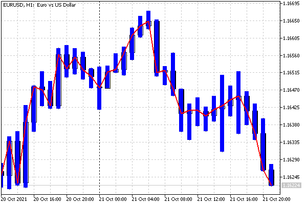

# Buffer and chart mapping rules

When registering diagrams using PlotIndexSetInteger(i, PLOT_DRAW_TYPE, type), each call sequentially assigns a certain number of buffers to the i-th diagram according to their required number for the rendering type (see table ENUM_DRAW_TYPE in the [previous section](/en/book/applications/indicators_make/indicators_plotindexsetinteger)). Thus, this number of buffers is taken out of consideration when linking buffers to the following diagrams (during the next PlotIndexSetInteger calls).

For example, if the first plot (under index 0) is DRAW_CANDLES, which requires 4 indicator buffers, then exactly this number will be associated with it. Thus, buffers indexed 0 through 3 inclusive will get bound, and the next free buffer to bind will be the buffer indexed 4.

If a simple line chart DRAW_LINE is registered next (its index in the chart sequence is 1), it will only take 1 buffer — just at index 4.

If a DRAW_ZIGZAG chart is further configured (the next chart index is 2), then since it uses two buffers, buffers with indexes 5 and 6 will go to it.

Of course, the number of buffers must be sufficient for all registered plots. The above example is illustrated in the following table. It has only 7 buffers and 3 plots (diagrams).

```
Buffer index in SetIndexBuffer

0

1

2

3

4

5

6

Chart Index in PlotIndexSetInteger

0

1

2

Rendering Type

DRAW_CANDLES

DRAW
_LINE

DRAW_ZIGZAG

```

Buffer and chart indexing is independent, that is, the buffer index does not have to be the same as the chart index. At the same time, as chart indexes increase, the indexes of the buffers bound to them increase, and the discrepancy in indexing can become larger and larger if you use rendering types that take more than one buffer for themselves.

Although it is customary to call functions SetIndexBuffer before PlotIndexSetInteger, it's not obligatory. The only important thing is the correct correspondence of buffer indexes and diagram indexes. When using directives (see the [next section](/en/book/applications/indicators_make/indicators_properties)), which are an alternative to calling PlotIndexSetInteger, directives are executed in any case before the OnInit handler.

To demonstrate the difference between buffer and chart indexing, consider a simple example of IndHighLowClose.mq5. In this file, we will draw the range of each candle between High and Low in the form of a histogram of the DRAW_HISTOGRAM2 type and underline the Close price with a simple line DRAW_LINE. To access timeseries of prices of different types, we also need to change the OnCalculate form from simplified to complete.

Since the histogram requires 2 buffers, then, together with the buffer for the Close line, we should describe three buffers.

```
#property indicator_chart_window
#property indicator_buffers 3
#property indicator_plots 2
   
double highs[];
double lows[];
double closes[];

```

Register them in OnInit in order of priority.

```
int OnInit()
{
   // arrays for buffers for 3 price types
   SetIndexBuffer(0, highs);
   SetIndexBuffer(1, lows);
   SetIndexBuffer(2, closes);
   
   // drawing a histogram between the High and Low candles under index 0
   PlotIndexSetInteger(0, PLOT_DRAW_TYPE, DRAW_HISTOGRAM2);
   PlotIndexSetInteger(0, PLOT_LINE_WIDTH, 5);
   PlotIndexSetInteger(0, PLOT_LINE_COLOR, clrBlue);
   
   // drawing the line Close at index 1
   PlotIndexSetInteger(1, PLOT_DRAW_TYPE, DRAW_LINE);
   PlotIndexSetInteger(1, PLOT_LINE_WIDTH, 2);
   PlotIndexSetInteger(1, PLOT_LINE_COLOR, clrRed);
   
   return INIT_SUCCEEDED;
}

```

Along the way, the histogram width is set to 5 pixels, and the line width is set to 2. Styles are not explicitly assigned, and default to STYLE_SOLID.

Now let's have a look at the actual OnCalculate function.

```
int OnCalculate(const int rates_total, 
                const int prev_calculated, 
                const datetime &time[],
                const double &open[],
                const double &high[],
                const double &low[],
                const double &close[],
                const long &tick_volume[],
                const long &volume[],
                const int &spread[])
{
   // on each new bar or set of bars (including the first calculation)
   if(prev_calculated != rates_total)
   {
      // fill in all new bars
      ArrayCopy(highs, high, prev_calculated, prev_calculated);
      ArrayCopy(lows, low, prev_calculated, prev_calculated);
      ArrayCopy(closes, close, prev_calculated, prev_calculated);
   }
   else // ticks on the current bar
   {
      // update the last bar
      highs[rates_total - 1] = high[rates_total - 1];
      lows[rates_total - 1] = low[rates_total - 1];
      closes[rates_total - 1] = close[rates_total - 1];
   }
   // return the number of processed bars for the next call
   return rates_total;
}

```

The result of this indicator is shown in the following image:



High-Low histogram and Close line

Pay attention to one important point. Diagrams are plotted on the chart in the order corresponding to their indexes, as a result of which some are visually higher than others (overlap them). In this case, a histogram with index 0 is drawn first, and then a line with index 1 is drawn on top of it. Sometimes it makes sense to change the order of registration of charts in order to provide better visibility of smaller graphical constructions, which may be covered by larger (wider) plots.

Setting such priorities along the imaginary Z-axis, going deep into the screen (perpendicular to the screen) is called the Z-order. We will encounter this technique again when studying [graphic objects](/en/book/applications/objects).

Also, recall that by default indicators are displayed on top of the price chart, but this behavior can be changed in the settings: Chart Properties dialog, Common tab, Chart on foreground option. There is a similar option in the software interface (ChartSetInteger(CHART_FOREGROUND), see section [Chart display modes](/en/book/applications/charts/charts_mode)).
