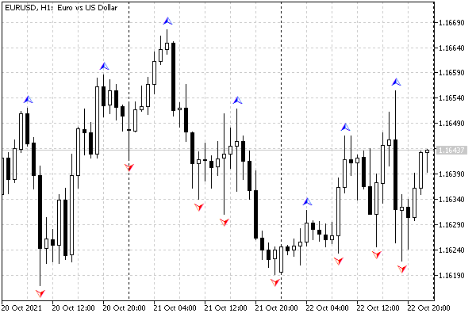
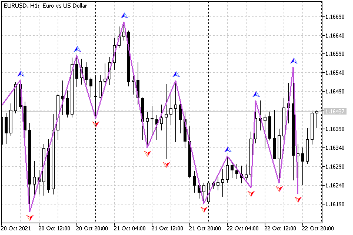

# Visualizing data gaps (empty elements)

In many cases, indicator readings should be displayed only on some bars, leaving the rest of the bars untouched (visually, without extra lines or labels). For example, many signal indicators display up or down arrows on those bars where a buy or sell recommendation appears. But signals are rare.

An empty value that is not displayed either on the chart or in the Data Window is set using the PlotIndexSetDouble function.

bool PlotIndexSetDouble(int index, ENUM_PLOT_PROPERTY_DOUBLE property, double value)

The function sets double properties for the plot at the specified index. The set of such properties is summarized in the ENUM_PLOT_PROPERTY_DOUBLE enumeration, but at the moment it has only one element: PLOT_EMPTY_VALUE. It also sets the empty value. The value itself is passed in the last parameter value.

As an example of an indicator with rare values, we will consider a fractal detector. It marks on the chart high prices (High) which are higher than N neighboring bars and low prices (Low) which are lower than N neighboring bars, in both directions. The indicator file is called IndFractals.mq5.

The indicator will have two buffers and two graphic plots of the DRAW_ARROW type.

```
#property indicator_chart_window
#property indicator_buffers 2
#property indicator_plots   2
   
// rendering settings
#property indicator_type1   DRAW_ARROW
#property indicator_type2   DRAW_ARROW
#property indicator_color1  clrBlue
#property indicator_color2  clrRed
#property indicator_label1  "Fractal Up"
#property indicator_label2  "Fractal Down"
   
// indicator buffers
double UpBuffer[];
double DownBuffer[];

```

The FractalOrder input variable will allow you to set the number of neighboring bars, by which the upper or lower extremum is determined.

```
input int FractalOrder = 3;

```

For arrow symbols, we will provide an indent of 10 pixels from the extremums for better visibility.

```
const int ArrowShift = 10;

```

In the OnInit function, declare arrays as buffers and bind them to graphical plots.

```
int OnInit()
{
   // binding buffers
   SetIndexBuffer(0, UpBuffer, INDICATOR_DATA);
   SetIndexBuffer(1, DownBuffer, INDICATOR_DATA);
   
   // up and down arrow character codes
   PlotIndexSetInteger(0, PLOT_ARROW, 217);
   PlotIndexSetInteger(1, PLOT_ARROW, 218);
   
   // padding for arrows
   PlotIndexSetInteger(0, PLOT_ARROW_SHIFT, -ArrowShift);
   PlotIndexSetInteger(1, PLOT_ARROW_SHIFT, +ArrowShift);
   
   // setting an empty value (can be omitted, since EMPTY_VALUE is the default)
   PlotIndexSetDouble(0, PLOT_EMPTY_VALUE, EMPTY_VALUE);
   PlotIndexSetDouble(1, PLOT_EMPTY_VALUE, EMPTY_VALUE);
   
   return FractalOrder > 0 ? INIT_SUCCEEDED : INIT_PARAMETERS_INCORRECT;
}

```

Note that the default empty value is the special constant EMPTY_VALUE, so the above PlotIndexSetDouble calls are optional.

In the OnCalculate handler, at the time of the first call, we initialize both arrays with EMPTY_VALUE, and then assign it to new elements as the bars form. The padding is necessary because the buffer-allocated memory can contain arbitrary data (garbage).

```
int OnCalculate(const int rates_total, 
                const int prev_calculated, 
                const datetime &time[],
                const double &open[],
                const double &high[],
                const double &low[],
                const double &close[],
                const long &tick_volume[],
                const long &volume[],
                const int &spread[])
{
   if(prev_calculated == 0)
   {
      // at the start, fill the arrays entirely
      ArrayInitialize(UpBuffer, EMPTY_VALUE);
      ArrayInitialize(DownBuffer, EMPTY_VALUE);
   }
   else
   {
      // on new bars we also clean the elements
      for(int i = prev_calculated; i < rates_total; ++i)
      {
         UpBuffer[i] = EMPTY_VALUE;
         DownBuffer[i] = EMPTY_VALUE;
      }
   }
   ...

```

In the main loop, barwise compare high and low prices with the same types of prices on neighboring bars and set marks where an extremum is found among FractalOrder bars on each side.

```
   // view all or new bars that have bars in the FractalOrder environment
   for(int i = fmax(prev_calculated - FractalOrder - 1, FractalOrder);
       i < rates_total - FractalOrder; ++i)
   {
      // check if the upper price is higher than neighboring bars
      UpBuffer[i] = high[i];
      for(int j = 1; j <= FractalOrder; ++j)
      {
         if(high[i] <= high[i + j] || high[i] <= high[i - j])
         {
            UpBuffer[i] = EMPTY_VALUE;
            break;
         }
      }
      
      // check if the lower price is lower than neighboring bars
      DownBuffer[i] = low[i];
      for(int j = 1; j <= FractalOrder; ++j)
      {
         if(low[i] >= low[i + j] || low[i] >= low[i - j])
         {
            DownBuffer[i] = EMPTY_VALUE;
            break;
         }
      }
   }
   
   return rates_total;
}

```

Let's see how this indicator looks on the chart.



Fractal indicator

Now let's change the drawing type from DRAW_ARROW to DRAW_ZIGZAG and compare the effect of empty values for both options. The result should be a zigzag on fractals. The modified version of the indicator is attached in the file IndFractalsZigZag.mq5.

One of the main changes concerns the number of diagrams: it is now one since DRAW_ZIGZAG "consumes" both buffers.

```
#property indicator_chart_window
#property indicator_buffers 2
#property indicator_plots   1
   
// rendering settings
#property indicator_type1   DRAW_ZIGZAG
#property indicator_color1  clrMediumOrchid
#property indicator_width1  2
#property indicator_label1  "ZigZag Up;ZigZag Down"
...

```

All function calls related to setting arrows are removed from OnInit.

```
int OnInit()
{
   SetIndexBuffer(0, UpBuffer, INDICATOR_DATA);
   SetIndexBuffer(1, DownBuffer, INDICATOR_DATA);
   
   PlotIndexSetDouble(0, PLOT_EMPTY_VALUE, EMPTY_VALUE);
   
   return FractalOrder > 0 ? INIT_SUCCEEDED : INIT_PARAMETERS_INCORRECT;
}

```

The rest of the source code is unchanged.

The following image shows a chart on which a zigzag is applied in addition to fractals: thus, you can visually compare their results. Both indicators work completely independently, but due to the same algorithm, the extremums found are the same.



Zig-Zag indicator by fractals

It is important to note that if extremums of the same type occur in a row, the ZigZag uses the first of them. This is a consequence of the fact that fractals are used as extremums. Of course, this cannot happen in a standard zigzag. If necessary, those who wish can improve the algorithm by first thinning out the sequences of fractals.

It should also be noted that for rendering DRAW_ZIGZAG (as well as DRAW_SECTION), visible segments connect non-empty elements and therefore, strictly speaking, some fragment of the segment is drawn on each bar, including those that have the value EMPTY_VALUE (or another appointed in its place). However, you can see in the Data Window that the empty elements are indeed empty: no values are displayed for them.
