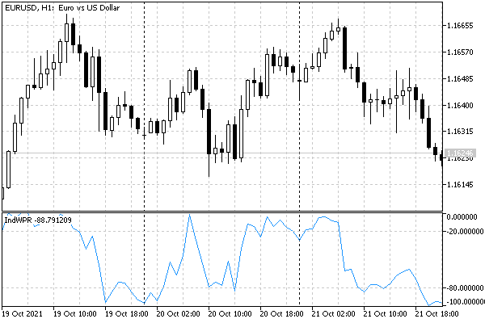

# Indicators in separate subwindows: sizes and levels

Until now, we have limited ourselves to indicators that work in the main chart window, that is, they have the directive #property indicator_chart_window. It's time now to study the indicators placed in separate a subwindow below the price chart. Recall that they should be declared with the directive #property indicator_separate_window.

Everything that we learned earlier applies to indicators in a subwindow, including describing and anchoring buffers, setting drawing types and styles, and using both full and shortened forms of OnCalculate, to choose from. However, they also have some features and additional settings.

Since the subwindow has its value scale, MQL5 allows you to set the maximum and minimum values for it (users can set similar restrictions in the indicator settings dialog, on the tab Scale). This is done programmatically using the function IndicatorSetDouble with the following prototype.

bool IndicatorSetDouble(ENUM_CUSTOMIND_PROPERTY_DOUBLE property, double value)

bool IndicatorSetDouble(ENUM_CUSTOMIND_PROPERTY_DOUBLE property, int modifier,  

   double value)

The function sets a double property value for an indicator. Two forms were required because some properties can be multiple, in particular, horizontal levels (they will be discussed a little later). The available properties are collected in the ENUM_CUSTOMIND_PROPERTY_DOUBLE enum.

| Identifier | Description |
| --- | --- |
| INDICATOR_MINIMUM | Minimum on the vertical axis |
| INDICATOR_MAXIMUM | Maximum on the vertical axis |
| INDICATOR_LEVELVALUE | Horizontal level value (the number is set in the modifier parameter) |

A fixed scale range is used in many oscillatory indicators, such as WPR. We will see an example with it, covering all the functions (properties) from this section.

The function returns true on success and false otherwise.

In addition to controlling the scale, indicators in the subwindow can, as we have already understood, have horizontal levels. To set their number and attributes, another function is used, IndicatorSetInteger. The user can perform similar actions in the indicator settings dialog on the tab Levels tab/

bool IndicatorSetInteger(ENUM_CUSTOMIND_PROPERTY_INTEGER property, int value)

bool IndicatorSetInteger(ENUM_CUSTOMIND_PROPERTY_INTEGER property, int modifier,  

   int value)

The function also has two forms and allows you to set the value of the type property for the indicator int or equivalent (for example, color or listing). The available properties are collected in the ENUM_CUSTOMIND_PROPERTY_INTEGER enumeration. In addition to the properties associated with levels, it contains the INDICATOR_DIGITS property, which is common for indicators of any type: we will consider it in the [next section](/en/book/applications/indicators_make/indicators_caption_digits).

| Identifier | Description |
| --- | --- |
| INDICATOR_DIGITS | Accuracy of displaying indicator values (digits after the decimal point) |
| INDICATOR_HEIGHT | Fixed height of the indicator's own window in pixels (preprocessor command  #property indicator_height ) |
| INDICATOR_LEVELS | Number of horizontal levels in the indicator window |
| INDICATOR_LEVELCOLOR | Level line color (has the  color  type, the  modifier  parameter sets the level number) |
| INDICATOR_LEVELSTYLE | Level line style (has a type  ENUM_LINE_STYLE , the  modifier  parameter sets the level number) |
| INDICATOR_LEVELWIDTH | Level line thickness (1-5) (the  modifier  parameter sets the level number) |

Levels can have text labels. To assign them, use the IndicatorSetString function.

bool IndicatorSetString(ENUM_CUSTOMIND_PROPERTY_STRING property, string value)

bool IndicatorSetString(ENUM_CUSTOMIND_PROPERTY_STRING property, int modifier,  

   string value)

ENUM_CUSTOMIND_PROPERTY_STRING contains the list of string indicator parameters. Pay attention to the INDICATOR_SHORTNAME property which is not related to levels: it is also common to all indicators and will be discussed in the [next section](/en/book/applications/indicators_make/indicators_caption_digits).

| Identifier | Description |
| --- | --- |
| INDICATOR_SHORTNAME | Indicator public title |
| INDICATOR_LEVELTEXT | Description of the level (the number is indicated in the modifier) |

All mentioned functions for numeric types int and double are duplicated by special directives (below is a summary table).

| Directives for  
 level properties | Analog functions | Type of  
 property | Description |
| --- | --- | --- | --- |
| indicator_levelN | IndicatorSetDouble( 
 INDICATOR_LEVELVALUE, 
 N-1, value) | double | Value for the horizontal level number N on the vertical axis |
| indicator_levelcolor | IndicatorSetInteger( 
 INDICATOR_LEVELCOLOR, 
 N-1, color) | color | Color of horizontal levels (different colors by numbers can only be set using the function) |
| indicator_levelwidth | IndicatorSetInteger( 
 INDICATOR_LEVELWIDTH, 
 N-1, width) | int | Line thickness of horizontal levels in pixels (different thickness by numbers can only be set using the function) |
| indicator_levelstyle | IndicatorSetInteger( 
 INDICATOR_LEVELSTYLE, 
 N-1, style) | ENUM 
 _LINE 
 _STYLE | Line styles of horizontal levels (different styles by number can only be set using the function) |
| indicator_minimum | IndicatorSetDouble( 
 INDICATOR_MINIMUM, minimum) | double | Fixed minimum value, lower scale limit on the vertical axis |
| indicator_maximum | IndicatorSetDouble( 
 INDICATOR_MAXIMUM, maximum) | double | Fixed maximum value, upper scale limit on the vertical axis |

Please note that the numbering of property instances (modifiers) when using #property directives starts from 1 (one), while functions use numbering from 0 (zero).

An attentive reader will notice that there are no directives for some properties. These include INDICATOR_LEVELTEXT, INDICATOR_SHORTNAME, INDICATOR_DIGITS. It is assumed that these properties should be filled dynamically from the MQL code, depending on the input variables and the chart on which the indicator is placed. INDICATOR_LEVELS is set indirectly by specifying several directives for levels.

Finally, the hallmark of indicators in a subwindow is that a program can "freeze" the vertical size of its window.

| Directive for  
 subwindow size | Analog function | Description |
| --- | --- | --- |
| indicator_height | IndicatorSetInteger( 
 INDICATOR_HEIGHT, height) | Fixed height of the indicator subwindow in pixels (the user will not be able to change the height) |

A fixed subwindow height is usually used only for control panels with controls (buttons, flags, input fields) implemented using [graphical objects](/en/book/applications/objects).

For property setting functions, unfortunately, there are no inverses (IndicatorGetInteger, IndicatorGetDouble, IndicatorGetString). Among other things, this does not allow, for example, finding the number and values of horizontal levels if they have been changed by the user.

As an example of working with a fixed scale and levels, consider the indicator IndWPR.mq5. In it, we will use the standard WPR algorithm: on a given number of past bars (WPR period), we will find the highs H and the lows L of the price (that is, its range). Then we calculate the ratio of the difference between the current price C and the low L, C - L (or the difference -(H - C), with a minus sign) to the entire range, and bring everything into the range from 0 to -100. Here is the canonical formula for calculating WPR:

```
R% = (-(H — C) / (H — L)) * 100

```

Let's add some directives at the beginning of the source code. In addition to the indicator location property in its own window, let's set the value scale from 0 to -100.

```
#property indicator_separate_window
#property indicator_maximum    0.0
#property indicator_minimum    -100.0

```

One buffer and one line chart are enough to store values and display the indicator.

```
#property indicator_buffers    1
#property indicator_plots      1
#property indicator_type1      DRAW_LINE
#property indicator_color1     clrDodgerBlue

```

In the WPR indicator, it is customary to single out two levels: -20 and -80, as the boundaries of overbought and oversold areas, respectively. Let's create a couple of horizontal lines for them.

```
#property indicator_level1     -20.0
#property indicator_level2     -80.0
#property indicator_levelstyle STYLE_DOT
#property indicator_levelcolor clrSilver
#property indicator_levelwidth 1

```

The only input variable allows you to set the calculation period for WPR.

```
input int WPRPeriod = 14; // Period

```

The array for the buffer is declared at the global level and registered with OnInit.

```
double WPRBuffer[];
   
void OnInit()
{
   // check for correct input
   if(WPRPeriod < 1)
   {
      Alert(StringFormat("Incorrect Period value (%d). Should be 1 or larger", 
         WPRPeriod));
   }
   
   // binding array as buffer
   SetIndexBuffer(0, WPRBuffer);
}

```

The handler OnInit is described with type void, which implicitly implies successful initialization. However, if the period is set to less than 1, it will not allow the calculation to be made and a warning is given to the user.

To simplify the function header OnCalculate, the header file IndCommon.mqh was prepared for indicators, with two macros describing the standard parameter lists of both forms of the event handler.

```
#define ON_CALCULATE_STD_FULL_PARAM_LIST \
const int rates_total,     \
const int prev_calculated, \
const datetime &time[],    \
const double &open[],      \
const double &high[],      \
const double &low[],       \
const double &close[],     \
const long &tick_volume[], \
const long &volume[],      \
const int &spread[]
   
#define ON_CALCULATE_STD_SHORT_PARAM_LIST \
const int rates_total,     \
const int prev_calculated, \
const int begin,           \
const double &data[]

```

Now we can use the concise definition of OnCalculate in this and other indicators (provided that we are satisfied with the proposed parameter names in macros).

```
#include <MQL5Book/IndCommon.mqh>
 
int OnCalculate(ON_CALCULATE_STD_FULL_PARAM_LIST)
{
   if(rates_total < WPRPeriod || WPRPeriod < 1) return 0;
   ...
   return rates_total;
}

```

At the beginning of OnCalculate, we check if it is possible to calculate using the current values of WPRPeriod and rates_total. If there is not enough data or the period is too short, it returns 0, which will leave the indicator window empty.

Next, we fill in the first few bars for which it is impossible to calculate the WPR of a given period with an empty value.

```
int OnCalculate(ON_CALCULATE_STD_FULL_PARAM_LIST)
{
   ...
   if(prev_calculated == 0)
   {
      ArrayFill(WPRBuffer, 0, WPRPeriod - 1, EMPTY_VALUE);
   }
   ...
}

```

Finally, we run the WPR calculations and buffer the results. Note that the last bar is updated on every tick: this is achieved by starting the loop with prev_calculated - 1.

```
int OnCalculate(ON_CALCULATE_STD_FULL_PARAM_LIST)
{
   ...
   for(int i = fmax(prev_calculated - 1, WPRPeriod - 1);
      i < rates_total && !IsStopped(); i++)
   {
      double max_high = high[fmax(ArrayMaximum(high, i - WPRPeriod + 1, WPRPeriod), 0)];
      double min_low = low[fmax(ArrayMinimum(low, i - WPRPeriod + 1, WPRPeriod), 0)];
      if(max_high != min_low)
      {
         WPRBuffer[i] = -(max_high - close[i]) * 100 / (max_high - min_low);
      }
      else
      {
         WPRBuffer[i] = WPRBuffer[i - 1];
      }
   }
   return rates_total;
}

```

ArrayMaximum and ArrayMinimum functions allow searching for the indexes of the highest high and the lowest low.

The indicator appears in a separate window as follows.



WPR indicator

In the following sections, we will continue to improve this indicator, gradually adding other commonly used properties.
