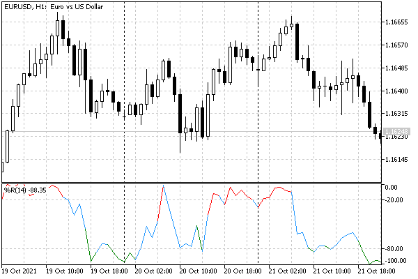

# Item-wise chart coloring

In addition to the standard drawing types listed earlier in ENUM_DRAW_TYPE, the platform provides their variants with the ability to individually colorize values on each bar. For these purposes, an additional indicator buffer is used, in which color numbers are stored. The numbers refer to elements in a special array containing a set of colors defined by the programmer. The maximum number of colors is 64.

The following table lists the ENUM_DRAW_TYPE elements with color support and the number of buffers required to draw them, including 1 buffer with color indexes.

| Visualization type | Description | Number of  
 buffers |
| --- | --- | --- |
| DRAW_COLOR_LINE | Multi-colored line | 1+1 |
| DRAW_COLOR_SECTION | Multi-colored segments | 1+1 |
| DRAW_COLOR_ARROW | Multi-colored arrows | 1+1 |
| DRAW_COLOR_HISTOGRAM | Multi-colored histogram from the zero line | 1+1 |
| DRAW_COLOR_HISTOGRAM2 | Multi-colored histogram between paired values of two indicator buffers | 2+1 |
| DRAW_COLOR_ZIGZAG | Multi-colored ZigZag | 2+1 |
| DRAW_COLOR_BARS | Multi-colored bars | 4+1 |
| DRAW_COLOR_CANDLES | Multi-colored candles | 4+1 |

When binding buffers to charts, keep in mind that an additional color buffer must be specified in the first parameter SetIndexBuffer under the number immediately following the data buffers. For example, for a line to be colored using one data buffer and a color buffer, the data is numbered 0 and its colors are numbered 1:

```
double ColorLineData[];
double ColorLineColors[];
   
void OnInit()
{
   SetIndexBuffer(0, ColorLineData, INDICATOR_DATA);
   SetIndexBuffer(1, ColorLineColors, INDICATOR_COLOR_INDEX);
   PlotIndexSetInteger(0, PLOT_DRAW_TYPE, DRAW_COLOR_LINE);
   ...
}

```

The initial set of colors in the palette for diagram N can be specified by the directive #property indicator_colorN. It specifies the required colors separated by commas as named constants or color literals. For example, the following entry in the indicator will select 6 standard colors for coloring the 0th chart (numbering starts from 1 in directives):

```
#property indicator_color1   clrRed,clrBlue,clrGreen,clrYellow,clrMagenta,clrCyan

```

Further in the program, you should specify not the color itself, which will display the graphical construction, but only its index. The numbering in the palette is carried out as in a regular array, starting from 0. So, if you need to set a green color for the i-th bar, then it is enough to set the index of the green color from the palette in the color buffer, that is, 2 in this case.

```
 ColorLineColors[i]=2;// reference to element with color clrGreen

```

The set of colors for coloring is not set once and for all, it can be changed dynamically using the function PlotIndexSetInteger(index, PLOT_LINE_COLOR, color).

For example, to replace the clrGreen color in the above palette with clrGray, use the following call:

```
   PlotIndexSetInteger(0, PLOT_LINE_COLOR, clrGray);

```

Let's apply coloring in our WPR indicator. The new file is IndColorWPR.mq5. The changes concern the following areas.

The number of buffers has been increased by 1. Three colors instead of one.

```
#property indicator_buffers    2
#property indicator_plots      1
#property indicator_type1      DRAW_COLOR_LINE
#property indicator_color1     clrDodgerBlue,clrGreen,clrRed

```

Added a new array under the color buffer and its registration in OnInit.

```
double WPRColors[];
 
void OnInit()
{
   ...
   SetIndexBuffer(1, WPRColors, INDICATOR_COLOR_INDEX);
   ...

```

If you do not set the INDICATOR_COLOR_INDEX buffer type (i.e. with a call SetIndexBuffer(1, WPRColors) it would be treated as INDICATOR_DATA by default), it will become visible in the Data Window.

In the OnCalculate function inside the working cycle, let's add coloring based on the analysis of the value of the i-th bar. By default, we use the color with the index 0, that is, the former clrDodgerBlue. If the indicator readings move into the upper zone, they are highlighted in color 2 (clrRed), and if they enter the lower zone, they are colored in 1 (clrGreen).

```
int OnCalculate(ON_CALCULATE_STD_FULL_PARAM_LIST)
{
   ...
   for(int i = fmax(prev_calculated - 1, WPRPeriod - 1);
      i < rates_total && !IsStopped(); i++)
   {
      ...
      WPRColors[i] = 0;
      if(WPRBuffer[i] > -20) WPRColors[i] = 2;
      else if(WPRBuffer[i] < -80) WPRColors[i] = 1;
   }
   return rates_total;
}

```

Here's how it looks on the screen.



WPR indicator with colored overbought and oversold zones

Please note that the line fragment is painted in an alternative color if its final point (bar) is in the upper or lower zone. In this case, the previous reading may be inside the central zone, which may give the impression that the color is wrong. However, this is correct behavior, consistent with the current implementation, and with how the platform uses color.

The color of the DRAW_COLOR_LINE line chart segment between two adjacent bars is determined by the color of the right (more recent) bar.

If you want to highlight with color only the fragments where both adjacent bars are in the same zone, modify the code to the following:

```
      WPRColors[i] = 0;
      if(WPRBuffer[i] > -20 && WPRBuffer[i - 1] > -20) WPRColors[i] = 2;
      else if(WPRBuffer[i] < -80 && WPRBuffer[i - 1] < -80) WPRColors[i] = 1;

```

Also, recall that we have added to the source code the setting of the title and the precision of the representation of values (2 characters). Comparing the new image with the old image will allow you to notice these visual differences. In particular, the title now looks like "%R(14)", and the vertical value scale is much more compact.

The last aspect that we will change in the indicator IndColorWPR.mq5 is we skip drawing on the initial bars.
