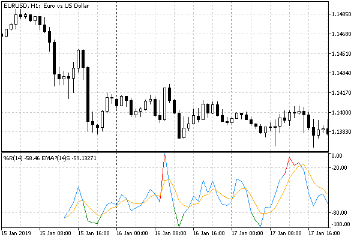
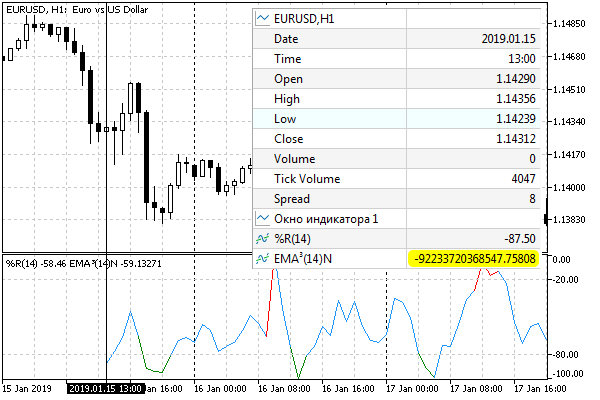

# Skip drawing on initial bars

In many cases, according to the conditions of the algorithm, the calculation of indicator values cannot be started from the first (leftmost available) bar, since it is required to ensure the minimum specified number of previous bars in the history. For example, many types of smoothing imply that the current value is calculated using an array of prices for the previous N bars.

In such cases, it may not be possible to calculate the indicator values on the very first bars, or these values are not intended to be displayed on the chart and are only auxiliary for calculating subsequent values.

To disable the indicator visualization on the first N-1 bars of the history, set the PLOT_DRAW_BEGIN property to N for the corresponding graphic plot index: PlotIndexSetInteger(index, PLOT_DRAW_BEGIN, N). By default, this property is 0, which means that the data is displayed from the very beginning.

Well, we can disable the line display on the necessary bars by setting them to an [empty value](/en/book/applications/indicators_make/indicators_empty_value) (EMPTY_VALUE by default). However, the call of the PlotIndexSetInteger function does something else with the PLOT_DRAW_BEGIN property. We thereby tell external programs the number of insignificant first values in our indicator buffer. In particular, other indicators that can potentially be built based on the timeseries of our indicator will receive the value of the PLOT_DRAW_BEGIN property in the begin parameter of their [OnCalculate](/en/book/applications/indicators_make/indicators_oncalculate) handler. Thus, they will have the opportunity to skip bars.

In the example of the IndColorWPR.mq5 indicator, let's add a similar setting to the OnInit function.

```
input int WPRPeriod = 14; // Period
   
void OnInit()
{
   ...
   PlotIndexSetInteger(0, PLOT_DRAW_BEGIN, WPRPeriod - 1);
   ...
}

```

Now, in the OnCalculate function, it would be possible to remove the forced clearing of the first bars, since they will always be hidden.

```
   if(prev_calculated == 0)
   {
      ArrayFill(WPRBuffer, 0, WPRPeriod - 1, EMPTY_VALUE);
   }

```

But this will work correctly only when the user has manually selected our indicator as a timeseries source for another indicator. If some programmer decides to use our indicator in their developments, then there is a different mechanism for obtaining data (we will talk about it in the next chapter), and it will not allow you to find out the PLOT_DRAW_BEGIN property. Therefore, it is better to use explicit buffer initialization.

To demonstrate how this property can be used in another indicator calculated using our indicator's data, let's prepare another indicator. This will be the well-known Triple Exponential Moving Average algorithm packed into the IndTripleEMA.mq5 indicator. When it is ready, it will be easy to apply it to both price time series and arbitrary indicators, such as the previous IndColorWPR.mq5 indicator.

In addition, we will get familiar with the technical possibility of describing auxiliary buffers for calculations (INDICATOR_CALCULATIONS).

The triple EMA formula consists of several computational steps. Simple exponential smoothing of the period P for the initial timeseries T is expressed as follows:

```
K = 2.0 / (P + 1)
A[i] = T[i] * K + A[i - 1] * (1 - K)

```

where K is the weighting factor for taking into account the elements of the original series, calculated after a given period P; (1 - K) is the inertia coefficient applied to the elements of the smoothed series A. To obtain the i-th element of the series A, we sum the K-th part of the i-th element of the original series T[i] and the (1 - K)-th part of the previous element A[i - 1].

If we denote the smoothing according to the indicated formulas as the E operator, then the triple EMA includes, as the name suggests, the application of E three times, after which the 3 resulting smoothed rows are combined in a special way.

```
EMA1 = E(A, P), for all i
EMA2 = E(EMA1, P), for all i
EMA3 = E(EMA2, P), for all i
TEMA = 3 * EMA1 - 3 * EMA2 + EMA3, for all i

```

The triple EMA provides a smaller lag behind the original series compared to the regular EMA of the same period. However, it is characterized by greater responsiveness, which can cause irregularities in the resulting line and give false signals.

EMA smoothing allows you to get a rough estimate of the average, already starting from the second element of the series, and this does not require changing the algorithm. This distinguishes EMA from other smoothing methods that require P previous elements or a modified algorithm for initial samples if less than P elements are available. Some developers prefer to invalidate the first P-1 elements of a smoothed row even when using EMA. However, it should be noted that the influence of the past elements of the series in the EMA formula is not limited to P elements, and it becomes negligible only when the number of elements tends to infinity (in other well-known MA algorithms, exactly P previous elements have an influence).  

   

For the purposes of this book, to investigate the impact of skipping initial data, we will not disable the output of initial EMA values.

To calculate the three EMA levels, we need auxiliary buffers and one more for the final series: it will be displayed as a line chart.

```
#property indicator_chart_window
#property indicator_buffers 4
#property indicator_plots   1
   
#property indicator_type1   DRAW_LINE
#property indicator_color1  Orange
#property indicator_width1  1
#property indicator_label1  "EMA³"
   
double TemaBuffer[];
double Ema[];
double EmaOfEma[];
double EmaOfEmaOfEma[];
   
void OnInit()
{
   ...
   SetIndexBuffer(0, TemaBuffer, INDICATOR_DATA);
   SetIndexBuffer(1, Ema, INDICATOR_CALCULATIONS);
   SetIndexBuffer(2, EmaOfEma, INDICATOR_CALCULATIONS);
   SetIndexBuffer(3, EmaOfEmaOfEma, INDICATOR_CALCULATIONS);
   ...
}

```

An input variable InpPeriodEMA allows you to set the smoothing period. The second variable, InpHandleBegin, is a mode switch with which we can explore how the indicator reacts to taking into account or ignoring the begin parameter in the OnCalculate handler. The available modes are summarized in the BEGIN_POLICY enumeration and mean the following (in the order they are arranged):

- strict shift according to begin
- custom validation of the initial data, without taking into account begin
- no handling, that is ignoring begin and straight calculation for all data

```
enum BEGIN_POLICY
{
   STRICT, // strict
   CUSTOM, // custom
   NONE,   // no
};
   
input int InpPeriodEMA = 14;                 // EMA period:
input BEGIN_POLICY InpHandleBegin = STRICT;  // Handle 'begin' parameter:

```

The second CUSTOM mode is based on a preliminary comparison of each source element with EMPTY_VALUE and replacing it with a value suitable for the algorithm. This will work correctly only with those indicators that honestly initialize the unused beginning of buffers without leaving garbage there. Our indicator IndColorWPR fills the buffer as required, and therefore you can expect almost identical results with STRICT and CUSTOM modes.

the K constant is prepared for calculating the EMA based on InpPeriodEMA.

```
const double K = 2.0 / (InpPeriodEMA + 1);

```

The EMA function itself is quite simple (the protection fragment for the CUSTOM variant with EMPTY_VALUE checks is omitted here).

```
void EMA(const double &source[], double &result[], const int pos, const int begin = 0)
{
   ...
   if(pos <= begin)
   {
      result[pos] = source[pos];
   }   
   else
   {
      result[pos] = source[pos] * K + result[pos - 1] * (1 - K);
   }
}

```

And here is the full calculation of triple smoothing in OnCalculate.

```
int OnCalculate(const int rates_total,
                const int prev_calculated,
                const int begin,
                const double &price[])
{
   const int _begin = InpHandleBegin == STRICT ? begin : 0;
   // fresh start, or history update
   if(prev_calculated == 0)
   {
      Print("begin=", begin, " ", EnumToString(InpHandleBegin));
      
      // we can change chart settings dynamically
      PlotIndexSetInteger(0, PLOT_DRAW_BEGIN, _begin);
      
      // preparing arrays
      ArrayInitialize(Ema, EMPTY_VALUE);
      ArrayInitialize(EmaOfEma, EMPTY_VALUE);
      ArrayInitialize(EmaOfEmaOfEma, EMPTY_VALUE);
      ArrayInitialize(TemaBuffer, EMPTY_VALUE);
      Ema[_begin] = EmaOfEma[_begin] = EmaOfEmaOfEma[_begin] = price[_begin];
   }
   
   // main loop, taking into account the start from _begin
   for(int i = fmax(prev_calculated - 1, _begin);
      i < rates_total && !IsStopped(); i++)
   {
      EMA(price, Ema, i, _begin);
      EMA(Ema, EmaOfEma, i, _begin);
      EMA(EmaOfEma, EmaOfEmaOfEma, i, _begin);
      
      if(InpHandleBegin == CUSTOM) // protection from empty elements at the beginning
      {
         if(Ema[i] == EMPTY_VALUE
         || EmaOfEma[i] == EMPTY_VALUE
         || EmaOfEmaOfEma[i] == EMPTY_VALUE)
            continue;
      }
      
      TemaBuffer[i] = 3 * Ema[i] - 3 * EmaOfEma[i] + EmaOfEmaOfEma[i];
   }
   return rates_total;
}

```

During the first start or when history is updated, the received value of the begin parameter along with the user-selected processing mode is written to the log.

After successful compilation, everything is ready for experiments.

First of all, let's run the IndColorWPR indicator (by default, its period is 14, which means, according to the source codes, setting the PLOT_DRAW_BEGIN property to 1 less since indexing starts from 0 and the 13th bar will be the first for which a value will appear). Then drag the IndTripleEMA indicator to the subwindow that displays WPR. In the property settings dialog that opens, on the Options tab, select Previous indicator data in the Apply to dropdown list. Leave default values on the Inputs tab.

The following image shows the beginning of the chart. The log will have the following entry: begin=13 STRICT.



Triple EMA indicator applied to the WPR given the beginning of the data

Note that the averaged line starts at a distance from the start, as well as WPR.

Attention! The number of available bars for indicator calculation rates_total (or iBars(_Symbol, _Period)) may exceed the maximum allowed number of bars on the chart from the terminal settings if there is a longer local history of quotes. In this case, the empty elements at the beginning of the WPR line (or any other indicator that skips the first elements, such as MA) will become invisible — they will be hidden behind the left border of the chart. To reproduce the situation with the absence of lines on the initial bars, you will either need to increase the number of bars on the chart, or close the terminal and delete the local history for a particular symbol.

Now let's switch to the CUSTOM mode in the IndTripleEMA indicator settings (the log will show begin=0 CUSTOM). There should be no serious change in the indicator readings.

Finally, we activate the NONE mode. The log will output: begin=0 NONE.

Here the situation on the chart will look strange, as the line will actually disappear. In the Data Window, you can see that the element values are very large.



Triple EMA indicator applied to WPR without data start

This is because the values of EMPTY_VALUE are equal to the maximum real number DBL_MAX. Therefore, without taking into account the begin parameter, calculations with such values also generate very large numbers. Depending on the specifics of the calculation, the overflow can cause us to receive a special NaN (Not A Number, see [Checking real numbers for normality](/en/book/common/maths/maths_nan)). One of them -nan(ind) is highlighted in thr image (Data Window already knows how to output some kinds of NaNs, for example, "inf" and "-inf", but this does not yet apply to "-nan(ind)"). As we know, such NaN values are dangerous, since calculations involving them will also continue to give NaN. If no NaN is generated, then, as you move to the right across the bars, the "transient process" in the calculation of large numbers fades (due to the reduction factor (1 - K) in the EMA formula), and the result stabilizes, becoming reasonable. If you scroll the chart to the present time, you will see a normal triple EMA.

Accounting for the begin parameter is a good practice, but it does not guarantee that the data provider (if it is a third-party indicator) correctly filled in this property. Therefore, it is desirable to provide some protection in your code. In this implementation of IndTripleEMA, it is implemented at the initial level.

If we run the IndTripleEMA indicator on the price chart, you will always receive begin = 0, because the price timeseries are filled with real data from the very beginning, even on the oldest bars.
