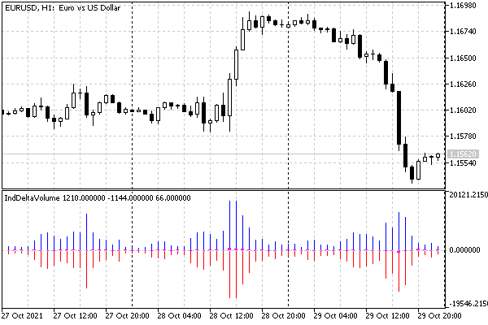
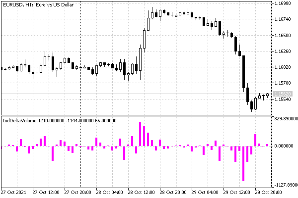

# Waiting for data and managing visibility (DRAW_NONE)

In the previous chapter, in the section [Working with real tick arrays](/en/book/applications/timeseries/timeseries_ticks_mqltick) in MqlTick structures, we worked with the script SeriesTicksDeltaVolume.mq5, which calculates the delta volume on each bar. At that time, we displayed the results in a log, but a much more convenient and logical way to analyze such technical information is an indicator. In this section, we will create such an indicator — IndDeltaVolume.mq5.

Here we will have to deal with two factors which we often encounter when developing indicators but which were not discussed in previous examples.

The first of them is that tick data does not refer to standard price timeseries, which the terminal sends to the indicator in OnCalculate parameters. This means that the indicator itself must request them and wait before it becomes possible to display something in the window.

The second factor is related to the fact that the volumes of buys and sells, as a rule, are much larger than their delta, and when displayed in one window, it will be difficult to distinguish between the latter. However, it is the delta that is an indicative value, which is usually analyzed together with the price movement. For example, there are 4 most obvious combinations of bar and delta volume configurations:

- Bullish bar and positive delta = confirmation of an uptrend
- Bearish bar and negative delta = confirmation of the downtrend
- Bullish bar and negative delta = downward reversal is possible
- Bearish bar and positive delta = an upward reversal is possible

To see the histogram of deltas, we need to provide a mode for disabling "large" histograms (buys and sales), for which we will use the DRAW_NONE type. It disables the drawing of a specific plot and prevents its influence on the automatically selected window scale (but leaves the buffer in the Data Window). Thus, by removing large plots from consideration, we will achieve a larger autoscale for the remaining delta diagram. Another way to hide buffers by marking them as auxiliary (mode [INDICATOR_CALCULATIONS](/en/book/applications/indicators_make/indicators_setindexbuffer)) will be discussed in the next section.

The idea of the volume delta is to separately calculate the buy and sell volumes in ticks, after which we can find the difference between these volumes. Accordingly, we get three timeseries with buy volumes, sell volumes, and the differences between them. Since this information does not fit into the price scale, the indicator should be displayed in its own window, and we will choose histograms from zero (DRAW_HISTOGRAM) as the way to display three timeseries.

According to this, let's describe the indicator properties in directives: location, number of buffers and plots, as well as their types.

```
#property indicator_separate_window
#property indicator_buffers 3
#property indicator_plots   3
#property indicator_type1   DRAW_HISTOGRAM
#property indicator_color1  clrBlue
#property indicator_width1  1
#property indicator_label1  "Buy"
#property indicator_type2   DRAW_HISTOGRAM
#property indicator_color2  clrRed
#property indicator_width2  1
#property indicator_label2  "Sell"
#property indicator_type3   DRAW_HISTOGRAM
#property indicator_color3  clrMagenta
#property indicator_width3  3
#property indicator_label3  "Delta"

```

Let's use the input variables from the previous script. Since ticks represent rather massive data, we will limit the number of bars for calculation on history (BarCount). In addition, depending on the presence or absence of real volumes in ticks of a particular financial instrument, we can calculate the delta in two different ways, for which we will use the tick type parameter (the COPY_TICKS enumeration is defined in the header file TickEnum.mqh, which we already used in the script).

```
#include <MQL5Book/TickEnum.mqh>
 
input int BarCount = 100;
input COPY_TICKS TickType = INFO_TICKS;
input bool ShowBuySell = true;

```

In the OnInit handler, we switch the operation mode of the first two histograms between DRAW_HISTOGRAM and DRAW_NONE, depending on the ShowBuySell parameter selected by the user (the default true means to show all three histograms). Note that dynamic configuration via PlotIndexSetInteger overwrites static settings (in this case, only some of them) embedded in the executable file using #property directives.

```
int OnInit()
{
   PlotIndexSetInteger(0, PLOT_DRAW_TYPE, ShowBuySell ? DRAW_HISTOGRAM : DRAW_NONE);
   PlotIndexSetInteger(1, PLOT_DRAW_TYPE, ShowBuySell ? DRAW_HISTOGRAM : DRAW_NONE);
   
   return INIT_SUCCEEDED;
}

```

But where is the registration of indicator buffers? We'll come back to it in a couple of paragraphs. Now let's start preparing the OnCalculate function.

```
int OnCalculate(ON_CALCULATE_STD_FULL_PARAM_LIST)
{
   if(prev_calculated == 0)
   {
      // TODO(1): initialization, padding with zeros
   }
   
   // on each new bar or set of new bars on first run
   if(prev_calculated != rates_total)
   {
      // process all or new bars
      for(int i = fmax(prev_calculated, fmax(1, rates_total - BarCount));
         i < rates_total && !IsStopped(); ++i)
      {
         // TODO(2): try to get the data and calculate the i-th bar,
         // if it doesn't work, do something! 
      }
   }
   else // ticks on the current bar
   {
      // TODO(3): updating the current bar
   }
   
   return rates_total;
}

```

The main technical problem is in the block labeled TODO(2). The tick requesting algorithm, which was used in the script and will be transferred to the indicator with minimal changes, requests them using the CopyTicksRange function. Such a call returns the data available in the tick database. But if it is not yet available for the given historical bar, the request causes the tick data to be downloaded and synchronized asynchronously (in the background mode). In this case, the calling code receives 0 ticks. In this regard, having received such an "empty" response, the indicator should interrupt the calculations with a sign of failure (but not an error) and re-request ticks after a while. In a normal open market situation, we regularly receive ticks, so the OnCalculate function should probably be called soon and recalculated with the updated tick base. But what to do on weekends when there are no ticks?

For the correct handling of such a situation, MQL5 provides a [timer](/en/book/applications/timer). We will study it in one of the following chapters, but for now, we will use it as a "black box". The special [EventSetTimer](/en/book/applications/timer/timer_event_set) function "requests" the kernel to call our MQL program after a specified number of seconds. The entry point for such a call is a reserved OnTimer handler, which we have seen in the general table in the section [Overview of event handling functions](/en/book/applications/runtime/runtime_events_overview). Thus, if there is a delay in receiving tick data, you should start the timer using EventSetTimer (a minimum period of 1 second is enough) and return zero from OnCalculate.

```
int OnCalculate(ON_CALCULATE_STD_FULL_PARAM_LIST)
{
      ...
      for(int i = fmax(prev_calculated, fmax(1, rates_total - BarCount));
         i < rates_total && !IsStopped(); ++i)
      {
         // TODO(2): try to get the data and calculate the i-th bar,
         if(/*if no data*/)
         {
            Print("No data on bar ", i, ", at ", TimeToString(time[i]),
               ". Setting up timer for refresh...");
            EventSetTimer(1); // please call us in 1 second
            return 0; // don't show anything in the window yet
         }
      }
      ...
}

```

In the OnTimer handler, we use the [EventKillTimer](/en/book/applications/timer/timer_event_set) function to stop the timer (if this is not done, the system will continue to call our handler every second). In addition, we need to somehow start the indicator recalculation. For this purpose, we will apply another function that we have yet to learn in the chapter on charts — ChartSetSymbolPeriod (see section [Switch symbol and timeframe](/en/book/applications/charts/charts_set_symbol_period)). It allows you to set a new combination of a symbol and a timeframe for a chart with a given identifier (0 means the current chart). However, if they are not changed by passing _Symbol and _Period (see [Predefined variables](/en/book/common/environment/env_variables)), then the chart will simply be updated (the indicators are recalculated).

```
void OnTimer()
{
   EventKillTimer();
   ChartSetSymbolPeriod(0, _Symbol, _Period); // auto-updating of the chart
}

```

Another point to note here is that in the open market, the timer event and chart auto-updating may be redundant if the next tick appears before the OnTimer call. Therefore, we will create a global variable (calcDone) to switch the flag of the readiness of calculations. At the beginning of OnCalculate, we will reset it to false; at the normal completion of the calculation, we will set it to true.

```
bool calcDone = false;
 
int OnCalculate(ON_CALCULATE_STD_FULL_PARAM_LIST)
{
   calcDone = false;
   ...
         if(/*if no data*/)
         {
            ...
            return 0; // exit with calcDone = false
         }
   ...
   calcDone = true;
   return rates_total;
}

```

Then in OnTimer, we can initiate chart auto-update only when calcDone is equal to false.

```
void OnTimer()
{
   EventKillTimer();
   if(!calcDone)
   {
      ChartSetSymbolPeriod(0, _Symbol, _Period);
   }
}

```

Now let's move on to TODO(1,2,3) comments, where we should perform calculations and populate indicator buffers. Let's combine all these operations in one class CalcDeltaVolume. Thus, a separate method will be allocated for each action, while we will keep the OnCalculate handler simple (method calls will appear instead of comments).

In the class, we will provide member variables that will accept user settings for the number of processed history bars and the delta calculation method, as well as three arrays for indicator buffers. Let's initialize them in the constructor.

```
class CalcDeltaVolume
{
   const int limit;
   const COPY_TICKS tickType;
   
   double buy[];
   double sell[];
   double delta[];
   
public:
   CalcDeltaVolume(
      const int bars,
      const COPY_TICKS type)
      : limit(bars), tickType(type), lasttime(0), lastcount(0)
   {
      // register internal arrays as indicator buffers
      SetIndexBuffer(0, buy);
      SetIndexBuffer(1, sell);
      SetIndexBuffer(2, delta);
   }

```

We can assign member arrays as buffers because we are going to create a global object of this class next. For the correct data display, we just need to make sure that the arrays attached to the charts exist at the time of drawing. It is possible to change buffer bindings dynamically (see the example of IndSubChartSimple.mq5 in the next section).

Please note that indicator buffers must be of type double while the volumes are of type ulong. Therefore, for very large values (for example, on very large timeframes), there may hypothetically be a loss of accuracy.

The reset method has been created to initialize buffers. Most of the array elements are filled with the empty value EMPTY_VALUE, and the last limit bars are filled with zero because there we will sum up the volumes of buys and sells separately.

```
   void reset()
   {
      // fill in the buys array and copy the rest from it
      // empty value in all elements except the last limit bars with 0
      ArrayInitialize(buy, EMPTY_VALUE);
      ArrayFill(buy, ArraySize(buy) - limit, limit, 0);
      
      // duplicate the initial state into other arrays
      ArrayCopy(sell, buy);
      ArrayCopy(delta, buy);
   }

```

Calculation on the i-th historical bar is performed by the createDeltaBar method. Its input receives the bar number and a link to the array with the timestamps of the bars (we receive it as the OnCalculate parameter). The i-th array elements are initialized to zero.

```
   int createDeltaBar(const int i, const datetime &time[])
   {
      delta[i] = buy[i] = sell[i] = 0;
      ...

```

Then we need to the time limits of the i-th bar: prev and next, where next is counted to the right of prev by adding the value of the [PeriodSeconds](/en/book/applications/timeseries/timeseries_symbol_period) function which is new to us. It returns the number of seconds in the current timeframe. By adding this amount, we find the theoretical beginning of the next bar. In history, when i is not equal to the number of the last bar, we could replace finding the next timestamp with time[i + 1]. However, the indicator should also work on the last bar which is still in the process of formation and which does not have a next bar. Therefore, in general, the use of time[i + 1] is forbidden.

```
      ...
      const datetime prev = time[i];
      const datetime next = prev + PeriodSeconds();

```

When we did a similar calculation in the script, we didn't have to use the PeriodSeconds function, because we did not count the last, current bar and could afford to find next and prev, like iTime(WorkSymbol, TimeFrame, i) and iTime(WorkSymbol, TimeFrame, i + 1), respectively.

Further, in the createDeltaBar method, we request ticks within the found timestamps (subtract 1 millisecond from the right one so as not to touch the next bar). Ticks arrive in the ticks array, which is processed by the helper method calc. It contains the script algorithm with almost no changes. We were forced to separate it into a designated method because the calculation will be performed in two different situations: using historical bars (remember the comment TODO(2)) and using ticks on the current bar (comment TODO(3)). Let's consider the second situation below.

```
      ResetLastError();
      MqlTick ticks[];
      const int n = CopyTicksRange(_Symbol, ticks, COPY_TICKS_ALL,
         prev * 1000, next * 1000 - 1);
      if(n > -1 && _LastError == 0)
      {
         calc(i, ticks);
      }
      else
      {
         return -_LastError;
      }
      return n;
   }

```

In case of a successful request, the method returns the number of processed ticks, and in case of an error, it returns an error code with a minus sign. Please note that if there are no ticks for the bar yet in the database (which is not an error, strictly speaking, but it does not allow the visual operation of the indicator to continue), the method will return 0 (the sign of 0 does not change its value). Therefore, in the OnCalculate function, we need to check the result of the method for "less than or equal to" 0.

Method calc practically consists of working lines of the script SeriesTicksDeltaVolume.mq5, so we won't present it here. Those who wish can refresh their memory can do this by looking into IndDeltaVolume.mq5.

To calculate the delta on a constantly updated last bar, we need to fix the timestamp of the last processed tick with millisecond accuracy. Then, on the next call of OnCalculate, we will be able to query all ticks after this label.

Please note that there is no guarantee that the system will have time to call our OnCalculate handler on every tick in real time. If we perform heavy calculations, or if some other MQL program loads the terminal with calculations, or if ticks come very quickly (for example, when after important news releases), events may fail to get into the indicator queue (no more than one event of each type is stored in the queue, including no more than one tick notification). Therefore, if the program wants to get all the ticks, it must request them using CopyTicksRange or CopyTicks.

However, the timestamp of the last processed tick alone is not enough. Ticks can have the same time even taking into account milliseconds. Therefore, we cannot add 1 millisecond to the label to exclude the "old" tick: "new" ticks with the same label can go after it.

In this regard, you should remember not only the label but also the number of last ticks with this label. Then the next time we request ticks, we can do it starting from the remembered time (that is, including the "old" ticks), but skip exactly as many of them as were already processed last time.

To implement this algorithm, two variables are declared in the class last time and last count.

```
   ulong last time; // millisecond marker of the last processed online tick
   int last count;  // number of ticks with this label at that moment

```

From the array of ticks received from the system, we find the values for these variables using the auxiliary method updateLastTime.

```
   void updateLastTime(const int n, const MqlTick &ticks[])
   {
      lasttime = ticks[n - 1].time_msc;
      lastcount = 0;
      for(int k = n - 1; k >= 0; --k)
      {
         if(ticks[k].time_msc == ticks[n - 1].time_msc) ++lastcount;
      }
   }

```

Now we can refine the createDeltaBar method: when processing the last bar, we call updateLastTime for the first time.

```
   int createDeltaBar(const int i, const datetime &time[])
   {
      ...
      const int size = ArraySize(time);
      const int n = CopyTicksRange(_Symbol, ticks, COPY_TICKS_ALL,
         prev * 1000, next * 1000 - 1);
      if(n > -1 && _LastError == 0)
      {
         if(i == size - 1) // last bar
         {
            updateLastTime(n, ticks);
         }
         calc(i, ticks);
      }
      ...
   }

```

Having up-to-date values for last time and last count, we can implement a method for calculating deltas on the current bar online.

```
   int updateLastDelta(const int total)
   {
      MqlTick ticks[];
      ResetLastError();
      const int n = CopyTicksRange(_Symbol, ticks, COPY_TICKS_ALL, lasttime);
      if(n > -1 && _LastError == 0)
      {
         const int skip = lastcount;
         updateLastTime(n, ticks);
         calc(total - 1, ticks, skip);
         return n - skip;
      }
      return -_LastError;
   }

```

To implement this mode, we have introduced an additional optional parameter skip in the calc method. It allows skipping the calculation on a given number of "old" ticks.

```
   void calc(const int i, const MqlTick &ticks[], const int skip = 0)
   {
      const int n = ArraySize(ticks);
      for(int j = skip; j < n; ++j)
      ...
   }

```

The class for the calculation is ready. Now, we only need to insert calls to three public methods into OnCalculate.

```
int OnCalculate(ON_CALCULATE_STD_FULL_PARAM_LIST)
{
   if(prev_calculated == 0)
   {
      deltas.reset(); // initialization, padding with zeros
   }
   
   calcDone = false;
   
   // on each new bar or set of new bars on first run
   if(prev_calculated != rates_total)
   {
      // process all or new bars
      for(int i = fmax(prev_calculated, fmax(1, rates_total - BarCount));
         i < rates_total && !IsStopped(); ++i)
      {
         // try to get data and calculate the i-th bar,
         if((deltas.createDeltaBar(i, time)) <= 0)
         {
            Print("No data on bar ", i, ", at ", TimeToString(time[i]),
               ". Setting up timer for refresh...");
            EventSetTimer(1); // call us in 1 second
            return 0; // don't show anything in the window yet
         }
      }
   }
   else // ticks on the current bar
   {
      if((deltas.updateLastDelta(rates_total)) <= 0)
      {
         return 0; // error
      }
   }
   
   calcDone = true;
   return rates_total;
}

```

Let's compile and run the indicator. To begin with, it is advisable to choose a timeframe no higher than H1 and leave the number of bars in BarCount set to 100 by default. After some waiting for the indicator to build, the result should look something like this:



Delta volume indicator with all histograms, including buys and sells

Now compare with what will happen when setting the ShowBuySell parameter to false.



Volume indicator with one histogram of deltas (separate buys and sells are hidden)

So, in this indicator, we implemented the waiting for the loading of the tick data for the working instrument using a timer, as ticks may require significant resources. In the next section, we will consider multicurrency indicators that work at the quote level, and therefore a simplified asynchronous request to update the chart using ChartSetSymbolPeriod will be enough for them. Later we will have to implement another type of waiting to make sure the timeseries of another indicator are ready.
