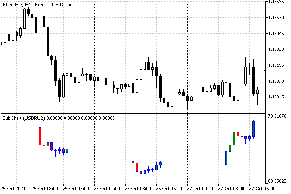
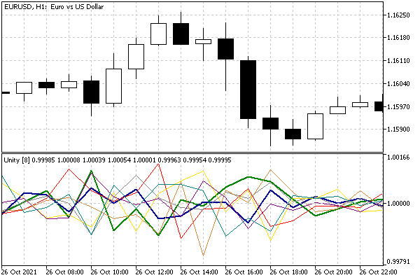

# Multicurrency and multitimeframe indicators

Until now, we have considered indicators that work with quotes or ticks of the current chart symbol. However, sometimes it is necessary to analyze several financial instruments or one instrument that is different from the current one. In such cases, as we saw in the case of tick analysis, standard timeseries passed to the indicator via OnCalculate parameters are not enough. It is necessary to somehow request "foreign" quotes, wait for them to be built, and only then calculate the indicator based on them.

Requesting and building quotes for a timeframe different from the current chart timeframe does not differ from the mechanisms for working with other symbols. Therefore, in this section, we will consider the creation of multicurrency indicators, while multitimeframe indicators can be organized according to a similar principle.

One of the problems that we will need to solve is the synchronization of bars in time. In particular, for different symbols there can be different trading schedules, weekends, and in general, the numbering of bars on the parent chart and in the quotes of the "foreign" symbol may be different.

To begin with, let's simplify the task and limit ourselves to one arbitrary symbol, which may differ from the current one. Quite often, the trader needs to see several charts of different symbols at the same time (for example, the leader and the follower in a correlated pair). Let's create the IndSubChartSimple.mq5 indicator to display a quote of a user-selected symbol in a subwindow.

IndSubChartSimple

To repeat the appearance of the main chart, we will provide in the input parameters not only an indication of the symbol but also the drawing mode: DRAW_CANDLES, DRAW_BARS, DRAW_LINE. The first two require four buffers, and they output all four prices: Open, High, Low, and Close (Japanese candlesticks or bars), and the latter uses a single buffer to show the line at the Close price. To support all modes, we will use the maximum required number of buffers.

```
#property indicator_separate_window
#property indicator_buffers 4
#property indicator_plots   1
#property indicator_type1   DRAW_CANDLES
#property indicator_color1  clrBlue,clrGreen,clrRed // border,bullish,bearish

```

Arrays for buffers are described by price type names.

```
double open[];
double high[];
double low[];
double close[];

```

The display of Japanese candlesticks is enabled by default. In this mode, MQL5 allows you to specify not just one color, but several. In the #property indicator_colorN directive, they are separated by commas. If there are two colors, then the first determines the color of the contours of the candlestick, and the second one determines the filling. If there are three colors, as in our case, then the first one determines the color of the contours, while the second and third determine the body of the bullish and bearish candlesticks, respectively.

In the chapter dedicated to [charts](/en/book/applications/charts), we will get acquainted with the ENUM_CHART_MODE enumeration, which describes three available charting modes.

| ENUM_CHART_MODE elements | ENUM_DRAW_TYPE elements |
| --- | --- |
| CHART_CANDLES | DRAW_CANDLES |
| CHART_BARS | DRAW_BARS |
| CHART_LINE | DRAW_LINE |

They correspond to the drawing modes we have chosen, as we have deliberately chosen the drawing methods that repeat the standard ones. ENUM_CHART_MODE is convenient to use here because it contains only the 3 elements we need, unlike ENUM_DRAW_TYPE, which has many other drawing methods.

Thus, the input variables have the following definitions.

```
input string SubSymbol = ""; // Symbol
input ENUM_CHART_MODE Mode = CHART_CANDLES;

```

A simple function is implemented to translate ENUM_CHART_MODE into ENUM_DRAW_TYPE.

```
ENUM_DRAW_TYPE Mode2Style(const ENUM_CHART_MODE m)
{
   switch(m)
   {
      case CHART_CANDLES: return DRAW_CANDLES;
      case CHART_BARS: return DRAW_BARS;
      case CHART_LINE: return DRAW_LINE;
   }
   return DRAW_NONE;
}

```

The empty string in the SubSymbol input parameter means the current chart symbol. However, since MQL5 does not allow editing input variables, we will have to add a global variable to store the actual working symbol and assign it in the OnInit handler.

```
string symbol;
...
int OnInit()
{
   symbol = SubSymbol;
   if(symbol == "") symbol = _Symbol;
   else
   {
      // making sure the symbol exists and is selected in the Market Watch
      if(!SymbolSelect(symbol, true))
      {
         return INIT_PARAMETERS_INCORRECT;
      }
   }
   ...
}

```

We also need to check if the symbol entered by the user exists and to add it to the Market Watch: this is done by the SymbolSelect function which we will study in the chapter on [symbols](/en/book/automation/symbols).

To generalize the buffers and charts setup, the source code has several helper functions:

- InitBuffer — setting up one buffer
- InitBuffers — setting up the entire set of buffers
- InitPlot — setting up one chart

Separate functions combine several actions that are repeated when registering identical entities. They also open the way for further development of this indicator in the chapter on [charts](/en/book/applications/charts): we will support the interactive change of drawing settings in response to user manipulations with the chart (see the full version of the indicator IndSubChart.mq5 in chapter [Chart display modes](/en/book/applications/charts/charts_mode)).

```
void InitBuffer(const int index, double &buffer[],
   const ENUM_INDEXBUFFER_TYPE style = INDICATOR_DATA,
   const bool asSeries = false)
{
   SetIndexBuffer(index, buffer, style);
   ArraySetAsSeries(buffer, asSeries);
}
   
string InitBuffers(const ENUM_CHART_MODE m)
{
   string title;
   if(m == CHART_LINE)
   {
      InitBuffer(0, close, INDICATOR_DATA, true);
      // hiding all buffers not used for the line chart
      InitBuffer(1, high, INDICATOR_CALCULATIONS, true);
      InitBuffer(2, low, INDICATOR_CALCULATIONS, true);
      InitBuffer(3, open, INDICATOR_CALCULATIONS, true);
      title = symbol + " Close";
   }
   else
   {
      InitBuffer(0, open, INDICATOR_DATA, true);
      InitBuffer(1, high, INDICATOR_DATA, true);
      InitBuffer(2, low, INDICATOR_DATA, true);
      InitBuffer(3, close, INDICATOR_DATA, true);
      title = "# Open;# High;# Low;# Close";
      StringReplace(title, "#", symbol);
   }
   return title;
}

```

Note that when you turn on the line chart mode, only the close array is used. It is assigned index 0. The remaining three arrays are completely hidden from the user due to the INDICATOR_CALCULATIONS property. All four arrays are used in the candlestick and bar modes, and their numbering complies with the OHLC standard, as required by the DRAW_CANDLES and DRAW_BARS drawing types. All arrays are assigned the "serial" property, i.e. indexed from right to left.

The InitBuffers function returns the header for the buffers in the Data Window.

All required plot attributes are set in the InitPlot function.

```
void InitPlot(const int index, const string name, const int style,
   const int width = -1, const int colorx = -1,
   const double empty = EMPTY_VALUE)
{
  PlotIndexSetInteger(index, PLOT_DRAW_TYPE, style);
  PlotIndexSetString(index, PLOT_LABEL, name);
  PlotIndexSetDouble(index, PLOT_EMPTY_VALUE, empty);
  if(width != -1) PlotIndexSetInteger(index, PLOT_LINE_WIDTH, width);
  if(colorx != -1) PlotIndexSetInteger(index, PLOT_LINE_COLOR, colorx);
}

```

The initial setup of a single chart (with index 0) is done using new functions in the OnInit handler.

```
int OnInit()
{
   ...
   InitPlot(0, InitBuffers(Mode), Mode2Style(Mode));
   IndicatorSetString(INDICATOR_SHORTNAME, "SubChart (" + symbol + ")");
   IndicatorSetInteger(INDICATOR_DIGITS, (int)SymbolInfoInteger(symbol, SYMBOL_DIGITS));
     
   return INIT_SUCCEEDED;
}

```

Although the setup is performed only once in this indicator version, it is done dynamically, taking into account the mode input parameter, as opposed to the static setting provided by the #property directives. In the future, in the full version of the indicator, we will be able to call InitPlot many times, changing the external representation of the indicator "on the go".

The buffers are filled in OnCalculate. In the simplest case, when the given symbol coincides with the chart, we can simply use the following implementation.

```
int OnCalculate(const int rates_total, const int prev_calculated,
   const datetime &time[],
   const double &op[], const double &hi[], const double &lo[], const double &cl[],
   const long &[], const long &[], const int &[]) // unused
{
   if(prev_calculated ==0) // needs clarification (see further)
   {
      ArrayInitialize(open, EMPTY_VALUE);
      ArrayInitialize(high, EMPTY_VALUE);
      ArrayInitialize(low, EMPTY_VALUE);
      ArrayInitialize(close, EMPTY_VALUE);
   }
   
   if(_Symbol != symbol)
   {
      // being developed
      ...
   }
   else
   {
      ArraySetAsSeries(op, true);
      ArraySetAsSeries(hi, true);
      ArraySetAsSeries(lo, true);
      ArraySetAsSeries(cl, true);
      for(int i = 0; i < MathMax(rates_total - prev_calculated, 1); ++i)
      {
         open[i] = op[i];
         high[i] = hi[i];
         low[i] = lo[i];
         close[i] = cl[i];
      }
   }
   
   return rates_total;
}

```

However, when processing an arbitrary symbol, the array parameters do not contain the necessary quotes, and the total number of available bars is probably different. Moreover, when placing an indicator on a chart for the first time, the quotes of a "foreign" symbol may not be ready at all if another chart in the neighborhood is not opened for it in advance. Besides, quotes of a third-party symbol will be loaded asynchronously, because of which a new batch of bars may "arrive" at any time, requiring a complete recalculation.

Therefore, let's create variables that control the number of bars on the other symbol (lastAvailable), an editable "clone" of a constant argument prev_calculated, as well as a flag of ready quotes.

```
   static bool initialized; // symbol quotes readiness flag
   static int lastAvailable; // number of bars for a symbol (and the current timeframe)
   int _prev_calculated = prev_calculated; // editable copy of prev_calculated

```

At the beginning of OnCalculate, let's add a check for the simultaneous appearance of more than one bar: we use the lastAvailable variable which we fill based on the iBars(symbol, _Period) value before the previous regular exit from the function, that is, in case of successful calculation. If additional history is loaded, we should reset _prev_calculated and the number of bars to 0, as well as remove the flag of readiness in order to recalculate the indicator.

```
int OnCalculate(const int rates_total, const int prev_calculated,
   const datetime &time[],
   const double &op[], const double &hi[], const double &lo[], const double &cl[],
   const long &[], const long &[], const int &[]) // unused
{
   ...
   if(iBars(symbol, _Period) - lastAvailable > 1)
   {
      // loading additional history or first start
      _prev_calculated = 0;
      initialized = false;
      lastAvailable = 0;
   }
   
   // then everywhere we use a copy of _prev_calculated
   if(_prev_calculated == 0)
   {
      ArrayInitialize(open, EMPTY_VALUE);
      ArrayInitialize(high, EMPTY_VALUE);
      ArrayInitialize(low, EMPTY_VALUE);
      ArrayInitialize(close, EMPTY_VALUE);
   }
   
   if(_Symbol != symbol)
   {
      // request quotes and "wait" till they are ready
      ...
      // main calculation (filling buffers)
      ...
   }
   else
   {
      ... // as is
   } 
   lastAvailable = iBars(symbol, _Period);
   return rates_total;
}

```

The word "wait" in the comment is not accidentally taken in quotation marks. As we remember, we cannot really wait in indicators (so as not to slow down the terminal's interface thread). Instead, if there is not enough data, we should simply exit the function. Thus, "wait" means wait for the next event to be calculated: on the arrival of a tick or in response to a request to update the chart.

The following code will check if the quotes are ready.

```
int OnCalculate(const int rates_total, const int prev_calculated,
   const datetime &time[],
   const double &op[], const double &hi[], const double &lo[], const double &cl[],
   const long &[], const long &[], const int &[]) // unused
{
   ...
   if(_Symbol != symbol)
   {
      if(!initialized)
      {
         Print("Host ", _Symbol, " ", rates_total, " bars up to ", (string)time[0]);
         Print("Updating ", symbol, " ", lastAvailable, " -> ", iBars(symbol, _Period), " / ",
            (iBars(symbol, _Period) > 0 ?
               (string)iTime(symbol, _Period, iBars(symbol, _Period) - 1) : "n/a"),
            "... Please wait");
         if(QuoteRefresh(symbol, _Period, time[0]))
         {
            Print("Done");
            initialized = true;
         }
         else
         {
            // asynchronous request to update the chart
            ChartSetSymbolPeriod(0, _Symbol, _Period);
            return 0; // nothing to show yet
         }
      }
      ...

```

The main work is performed by the special QuoteRefresh function. It receives as arguments the desired symbol, the timeframe, and the time of the very first (oldest) bar on the current chart — we are not interested in earlier dates, but the requested symbol may not have a history for all this depth. That is why it is convenient to hide all the complexities of checks in a separate function.

The function will return true as soon as the data is downloaded and synced to the extent available. We will consider its internal structure in a minute.

When the synchronization is done, we use the iBarShift function to find synchronous bars and copy their OHLC values (functions iOpen, iHigh, iLow, iClose).

```
      ArraySetAsSeries(time, true); // go from present to past
      for(int i = 0; i < MathMax(rates_total - _prev_calculated, 1); ++i)
      {
         int x = iBarShift(symbol, _Period, time[i], true);
         if(x != -1)
         {
            open[i] = iOpen(symbol, _Period, x);
            high[i] = iHigh(symbol, _Period, x);
            low[i] = iLow(symbol, _Period, x);
            close[i] = iClose(symbol, _Period, x);
         }
         else
         {
            open[i] = high[i] = low[i] = close[i] = EMPTY_VALUE;
         }
      }

```

An alternative and, at first glance, more efficient way to copy entire price arrays using Copy functions is not suitable here, because bars with equal indexes can correspond to different timestamps on different symbols. Therefore, after copying, you would have to analyze the dates and move the elements inside the buffers, adjusting them to the time on the current chart.

Since in the [iBarShift](/en/book/applications/timeseries/timeseries_ibarshift) function true is passed as the last parameter, the function will look for an exact match of the time of the bars. If there is no bar in another symbol, we will get -1 and display an empty space (EMPTY_VALUE) on the chart.

After a successful full calculation, new bars will be calculated in an economical mode, i.e. taking into account _prev_calculated and rates_total.

Now let's turn to the QuoteRefresh function. It is a universal and useful function, which is why it is placed in the header file QuoteRefresh.mqh.

At the very beginning, we check if the timeseries of the current symbol and the current timeframe is requested from an indicator-type MQL program. Such requests are prohibited, since the "native" timeseries on which the indicator is running is already being built by the terminal or is ready: requesting it again may lead to looping or blocking. Therefore, we simply return the synchronization flag (SERIES_SYNCHRONIZED) and, if it is not yet ready, the indicator should check the data later (on the next ticks, by timer, or something else).

```
bool QuoteRefresh(const string asset, const ENUM_TIMEFRAMES period,
   const datetime start)
{
   if(MQL5InfoInteger(MQL5_PROGRAM_TYPE) == PROGRAM_INDICATOR
      && _Symbol == asset && _Period == period)
   {
      return (bool)SeriesInfoInteger(asset, period, SERIES_SYNCHRONIZED);
   }
   ...

```

The second check concerns the number of bars: if it is already equal to the maximum allowed on the charts, it makes no sense to continue downloading anything.

```
   if(Bars(asset, period) >= TerminalInfoInteger(TERMINAL_MAXBARS))
   {
      return (bool)SeriesInfoInteger(asset, period, SERIES_SYNCHRONIZED);
   }
   ...

```

The next code part sequentially requests from the terminal the start dates of available quotes:

- by a given timeframe (SERIES_FIRSTDATE)
- without a link to a timeframe (SERIES_TERMINAL_FIRSTDATE) in the local database of the terminal
- without a link to a timeframe (SERIES_SERVER_FIRSTDATE) on the server

If at any stage the requested date is already in the available data area, we get true as a sign of readiness. Otherwise, data is requested from the local database of the terminal or from the server, followed by the construction of a timeseries (all this is done asynchronously and automatically in response to our CopyTime calls; other Copy functions can be used).

```
   datetime times[1];
   datetime first = 0, server = 0;
   if(PRTF(SeriesInfoInteger(asset, period, SERIES_FIRSTDATE, first)))
   {
      if(first > 0 && first <= start)
      {
         // application data exists, it is already ready or is being prepared
         return (bool)SeriesInfoInteger(asset, period, SERIES_SYNCHRONIZED);
      }
      else
      if(PRTF(SeriesInfoInteger(asset, period, SERIES_TERMINAL_FIRSTDATE, first)))
      {
         if(first > 0 && first <= start)
         {
            // technical data exists in the terminal database,
            // initiate the construction of a timeseries or immediately get the desired
            return PRTF(CopyTime(asset, period, first, 1, times)) == 1;
         }
         else
         {
            if(PRTF(SeriesInfoInteger(asset, period, SERIES_SERVER_FIRSTDATE, server)))
            {
               // technical data exists on the server, let's request it
               if(first > 0 && first < server)
                  PrintFormat(
                    "Warning: %s first date %s on server is less than on terminal ",
                     asset, TimeToString(server), TimeToString(first));
              // you can't ask for more than the server has - so fmax
              return PRTF(CopyTime(asset, period, fmax(start, server), 1, times)) == 1;
            }
         }
      }
   }
   
   return false;
}

```

The indicator is ready. Let's compile and run it, for example, on the EURUSD, H1 chart, specifying USDRUB as an additional symbol. The log will show something like this:

```
Host EURUSD 20001 bars up to 2018.08.09 13:00:00
Updating USDRUB 0 -> 14123 / 2014.12.22 11:00:00... Please wait
SeriesInfoInteger(symbol,period,SERIES_FIRSTDATE,first)=false / HISTORY_NOT_FOUND(4401)
Host EURUSD 20001 bars up to 2018.08.09 13:00:00
Updating USDRUB 0 -> 14123 / 2014.12.22 11:00:00... Please wait
SeriesInfoInteger(symbol,period,SERIES_FIRSTDATE,first)=true / ok
Done

```

After the process is complete ("Done" message), the subwindow will show the candles of the other chart.



IndSubChartSimple indicator – DRAW_CANDLES with quotes of a third-party symbol

It is important to note that due to the shortened trading session, meaningful bars for USDRUB occupy only the daily part of each daily interval.

IndUnityPercent

The second indicator that we will create in this section is a real multicurrency (multiasset) indicator IndUnityPercent.mq5. Its idea is to display the relative strength of all independent currencies (assets) included in the given financial instruments. For example, if we trade a basket of two tickers EURUSD and XAUUSD, then the dollar, euro, and gold are taken into account in the basket value — each of these assets has a relative value compared to others.

At each point in time, there are current prices, which are described by the following formulas:

```
EUR / USD = EURUSD
XAU / USD = XAUUSD

```

where the variables EUR, USD, XAU are some independent "values" of assets, and EURUSD and XAUUSD are constants (known quotes).

To find the variables, let's add another equation to the system, limiting the sum of the squares of the variables to one (hence the first word in the name of the indicator - Unity):

```
EUR * EUR + USD * USD + XAU * XAU = 1

```

There can be many more variables, and it is logical to designate them as xi. Note that x0 is the main currency which is common for all instruments and which is required.

Then, in general terms, the formulas for calculating variables will be written as follows (we will omit the process of their derivation):

```
x0 = sqrt(1 / (1 + sum(C(xi, x0)2))), i = 1..n
xi = C(xi, x0) * x0, i = 1..n

```

where n is the number of variables, C(xi,x0) is the quote of the i-th pair. Note that the number of variables is larger than the number of instruments by 1.

Since the quotes involved in the calculation are usually very different (for example, as in the case of EURUSD and XAUUSD) and are expressed only through each other (that is, without reference to any stable base), it makes sense to move from absolute values to percentages changes. Thus, when writing algorithms according to the above formulas, instead of the quote C(xi,x0) we will take the ratio C(xi,x0)[0] / C(xi,x0)[1], where indexes in square brackets mean the current [0] and previous [1] bar. In addition, to speed up the calculation, you can get rid of squaring and taking the square root.

To visualize the lines, we will provide a certain maximum allowable number of currencies and indicator buffers. Of course, it is possible to use only some of them in calculations if the user enters fewer symbols. But you cannot increase the limit dynamically: you will need to change the directives and recompile the indicator.

```
#define BUF_NUM 15
#property indicator_separate_window
#property indicator_buffers BUF_NUM
#property indicator_plots BUF_NUM

```

When implementing this indicator, we will solve one unpleasant problem along the way. Since there will be many buffers of the same type, the standard approach is to extensively encode them by "multiplication" (the undesirable "copy & paste" programming style).

```
double buffer1[];
...
double buffer15[];
   
void OnInit()
{
   SetIndexBuffer(0, buffer1);
   ...
   SetIndexBuffer(14, buffer15);
}

```

This is inconvenient, inefficient, and error-prone. Instead, let's apply OOP. We will create a class that will store an array for the indicator buffer and will be responsible for its uniform setting as our buffers should be the same (except for colors and, possibly, increased thickness for those currencies that make up the symbol of the current chart, but this is tuned later, after the user inputs parameters).

With such a class, we can simply distribute an array of its objects, and the indicator buffers will be automatically connected and configured in the required quantity. Schematically, this approach is illustrated by the following pseudocode.

```
// "engine" code supporting an array of unified indicator buffers
class Buffer
{
   static int count; // global buffer counter
   double array[];   // array for this buffer
   int cursor;       // pointer of assigned element
public:
   // constructor sets up and connects the array
   Buffer()
   {
      SetIndexBuffer(count++, array);
      ArraySetAsSeries(array, ...);
   }
   // overload to set the number of the element of interest
   Buffer *operator[](int index)
   {
      cursor = index;
      return &this;
   }
   // overload to write value to selected element
   double operator=(double x)
   {
      buffer[cursor] = x;
      return x;
   }
   ...
};
   
static int Buffer::count;

```

With operator overloads, we can stick to the familiar syntax for assigning values to elements of a buffer object: buffer[i] = value.

In the indicator code, instead of many lines with descriptions of individual arrays, it will be enough to define one "array of arrays".

```
// indicator code
// construct 15 buffer objects with auto-registration and configuration
Buffer buffers[15];
...

```

The full version of the classes that implement this mechanism is available in the file IndBufArray.mqh. Note that it only supports buffers, not diagrams. Ideally, the set of classes should be extended with new ones, allowing you to create ready-made diagram objects that would occupy the necessary number of buffers in the buffer array according to the type of a particular diagram. We suggest that you study and supplement the file yourself. In particular, the code contains a class managing an array of indicator buffers BufferArray to create "arrays of arrays" with the same property values, such as ENUM_INDEXBUFFER_TYPE type, indexing direction, empty value. We use it in the new indicator as follows:

```
BufferArray buffers(BUF_NUM, true);

```

Here, the required number of buffers is passed in the first parameter of the constructor, and the indicator of indexing as in a timeseries is passed in the second parameter (more on that below).

After this definition, we can use a convenient notation anywhere in the code to set the value of the j-th bar of the i-th buffer (it uses a double overload of the operator [] in the buffer object and also in the array of buffers):

```
buffers[i][j] = value;

```

In the input variables of the indicator, we will allow the user to specify a comma-separated list of symbols and limit the number of bars for calculating on history in order to control the loading and synchronization of a potentially large set of instruments. If you decide to show the entire available history, you should identify and apply the smallest number of bars available for different instruments and control the loading of additional history from the server.

```
input string Instruments = "EURUSD,GBPUSD,USDCHF,USDJPY,AUDUSD,USDCAD,NZDUSD";
input int BarLimit = 500;

```

When starting the program, parse the list of symbols and form a separate Symbols array of size SymbolCount.

```
string Symbols[];
int direction[]; // direct(+1)/reverse(-1) rate to the common currency
int SymbolCount;

```

All symbols must have the same common currency (usually USD) in order to reveal mutual correlations. Depending on whether this common currency in a particular symbol is the base one (in the first place in the pair, if we are talking about Forex) or the quote currency (in the second place in the Forex pair), the calculation uses its direct or reverse quotes (1.0 / rate). This direction will be stored in the Direction array.

Let's view the InitSymbols function which performs the described actions. If the list is successfully parsed, it returns the name of the common currency. The built-in [SymbolInfoString](/en/book/automation/symbols/symbols_info) function allows you to get the base currency and quote currency of any financial instrument: we will study it in the chapter on [financial instruments](/en/book/automation/symbols).

```
string InitSymbols()
{
   SymbolCount = fmin(StringSplit(Instruments, ',', Symbols), BUF_NUM - 1);
   ArrayResize(Symbols, SymbolCount);
   ArrayResize(Direction, SymbolCount);
   ArrayInitialize(Direction, 0);
   
   string common = NULL; // common currency
   
   for(int i = 0; i < SymbolCount; i++)
   {
      // guarantee the presence of the symbol in the Market Review
      if(!SymbolSelect(Symbols[i], true)) 
      {
         Print("Can't select ", Symbols[i]);
         return NULL;
      }
      
      // get the currencies that make up the symbol
      string first, second;
      first = SymbolInfoString(Symbols[i], SYMBOL_CURRENCY_BASE);
      second = SymbolInfoString(Symbols[i], SYMBOL_CURRENCY_PROFIT);
    
      // count the number of inclusions of each currency
      if(first != second)
      {
         workCurrencies.inc(first);
         workCurrencies.inc(second);
      }
      else
      {
         workCurrencies.inc(Symbols[i]);
      }
   }
   ...

```

The loop keeps track of the occurrence of each currency in all instruments using an auxiliary template class MapArray. Such an object is described in the indicator at the global level and requires the connection of the header file MapArray.mqh.

```
#include <MQL5Book/MapArray.mqh>
...
// array of pairs [name; number]
// to calculate currency usage statistics
MapArray<string,int> workCurrencies;
...
string InitSymbols()
{
   ...
}

```

Since this class plays a supporting role, it is not described in detail here. You can view the source code for further details. The bottom line is that when you call its inc method for a new currency name, it is added to the internal array with the initial value of the counter equal to 1, and if the name has already been encountered, the counter is incremented by 1.

Subsequently, we find the common currency as the one with a counter greater than 1. With the correct settings, the remaining currencies should be encountered exactly once. Here is the continuation of the InitSymbols function.

```
   ...   
   // find the common currency based on currency usage statistics
   for(int i = 0; i < workCurrencies.getSize(); i++)
   {
      if(workCurrencies[i] > 1) // counter greater than 1
      {
         if(common == NULL)
         {
            common = workCurrencies.getKey(i); // get the name of the i-th currency
         }
         else
         {
            Print("Collision: multiple common symbols");
            return NULL;
         }
      }
   }
   
   if(common == NULL) common = workCurrencies.getKey(0);
   
   // knowing the common currency, determine the "direction" of each symbol
   for(int i = 0; i < SymbolCount; i++)
   {
      if(SymbolInfoString(Symbols[i], SYMBOL_CURRENCY_PROFIT) == common)
         Direction[i] = +1;
      else if(SymbolInfoString(Symbols[i], SYMBOL_CURRENCY_BASE) == common)
         Direction[i] = -1;
      else
      {
         Print("Ambiguous symbol direction ", Symbols[i], ", defaults used");
         Direction[i] = +1;
      }
   }
   
   return common;
}

```

Having the function InitSymbols ready, we can write OnInit (given with simplifications).

```
int OnInit()
{
   const string common = InitSymbols();
   if(common == NULL) return INIT_PARAMETERS_INCORRECT;
   
   string base = SymbolInfoString(_Symbol, SYMBOL_CURRENCY_BASE);
   string profit = SymbolInfoString(_Symbol, SYMBOL_CURRENCY_PROFIT);
   
   // setting up lines by the number of currencies (number of symbols + 1)
   for(int i = 0; i <= SymbolCount; i++)
   {
      string name = workCurrencies.getKey(i);
      PlotIndexSetString(i, PLOT_LABEL, name);
      PlotIndexSetInteger(i, PLOT_DRAW_TYPE, DRAW_LINE);
      PlotIndexSetInteger(i, PLOT_SHOW_DATA, true);
      PlotIndexSetInteger(i, PLOT_LINE_WIDTH, 1 + (name == base || name == profit));
   }
  
   // hide extra buffers in the Data Window
   for(int i = SymbolCount + 1; i < BUF_NUM; i++)
   {
      PlotIndexSetInteger(i, PLOT_SHOW_DATA, false);
   }
  
   // single level at 1.0
   IndicatorSetInteger(INDICATOR_LEVELS, 1);
   IndicatorSetDouble(INDICATOR_LEVELVALUE, 0, 1.0);
  
   // Name with parameters
   IndicatorSetString(INDICATOR_SHORTNAME,
      "Unity [" + (string)workCurrencies.getSize() + "]");
  
   // accuracy
   IndicatorSetInteger(INDICATOR_DIGITS, 5);
   
   return INIT_SUCCEEDED;
}

```

Now let's get acquainted with the main event handler OnCalculate.

It is important to note that the order of iterating over bars in the main loop is reversed, as in a timeseries, from present to past. This approach is more convenient for multicurrency indicators, because the depth of the history of different symbols can be different, and it makes sense to calculate bars from the current back, up to the first moment when there is no data for any of the symbols. In this case, the early termination of the loop should not be treated as an error — we should return rates_total to display on the chart the values for the most relevant bars that have already been calculated.

However, in this simplified version of IndUnityPercent, we don't do this and use a simpler and more rigid approach: the user must define the unconditional depth of the history query using the BarLimit parameter. In other words, for all symbols, there must be data up to the timestamp of the bar with the BarLimit number on the chart symbol. Otherwise, the indicator will try to download the missing data.

```
int OnCalculate(const int rates_total,
                const int prev_calculated,
                const int begin,
                const double& price[])
{
   if(prev_calculated == 0)
   {
      buffers.empty(); // delegate total cleanup to the BufferArray class
   }
  
   // main loop in the direction "as in a timeseries" from the present to the past
   const int limit = MathMin(rates_total - prev_calculated + 1, BarLimit);
   for(int i = 0; i < limit; i++)
   {
      if(!calculate(i))
      {
         EventSetTimer(1); // give 1 more second to upload and prepare data
         return 0; // let's try to recalculate on the next call
      }
   }
   
   return rates_total;
}

```

The Calculate function (see below) calculates the values for all buffers on the i-th bar. In case of missing data, it will return false, and we will start a timer to give time to build timeseries for all required instruments. In the timer handler, we will send a request to the terminal to update the chart in the usual way.

```
void OnTimer()
{
   EventKillTimer();
   ChartSetSymbolPeriod(0, _Symbol, _Period);
}

```

In the Calculate function, we first determine the date range of the current and previous bar, on which the changes will be calculated.

```
bool Calculate(const int bar)
{
   const datetime time0 = iTime(_Symbol, _Period, bar);
   const datetime time1 = iTime(_Symbol, _Period, bar + 1);
   ...

```

It took two dates to call the next function CopyClose in its version, where the date interval is indicated. In this indicator, we cannot use the option with the number of bars, because any symbol can have arbitrary gaps in bars, different from gaps on other symbols. For example, if there are bars on one symbol t (current) and t-1 (previous), then it is possible to correctly calculate the change Close[t]/Close[t-1]. However, on another symbol, the bar t may be absent, and a request for two bars will return the "nearest" bars (in the past) to the left, and this past may be quite far from the "present" one (for example, correspond to the previous day's trading session if the symbol is not traded around the clock).

To prevent this from happening, the indicator requests quotes strictly in the interval, and if it turns out to be empty for a particular symbol, this means no changes.

At the same time, situations are possible when such a query will return more than two bars, and in this case, the last two (right) bars are always taken as the most relevant ones. For example, when placed on the USDRUB,H1 chart, the indicator will "see" that after the bar at 17:00 of each business day, there is a bar at 10:00 of the next business day. However, for major Forex currency pairs such as EURUSD, there will be 16 evening, night and morning H1 bars between them.

```
bool Calculate(const int bar)
{
   ...
   double w[]; // receiving array of quotes (by bar)
   double v[]; // character changes
   ArrayResize(v, SymbolCount);
   
   // find quote changes for each symbol
   for(int j = 0; j < SymbolCount; j++)
   {
      // try to get at least 2 bars for the j-th symbol,
      // corresponding to two bars of the symbol of the current chart
      int x = CopyClose(Symbols[j], _Period, time0, time1, w);
      if(x < 2)
      {
         // if there are no bars, try to get the previous bar from the past
         if(CopyClose(Symbols[j], _Period, time0, 1, w) != 1)
         {
            return false;
         }
         // then duplicate it as no change indication
         // (in principle, it was possible to write any constant 2 times)
         x = 2;
         ArrayResize(w, 2);
         w[1] = w[0];
      }
   
      // find the reverse course when needed
      if(Direction[j] == -1)
      {
         w[x - 1] = 1.0 / w[x - 1];
         w[x - 2] = 1.0 / w[x - 2];
      }
   
      // calculating changes as a ratio of two values
      v[j] = w[x - 1] / w[x - 2]; // last / previous
   }
   ...

```

When the changes are received, the algorithm works according to the formulas given earlier and writes the values to the indicator buffers.

```
   double sum = 1.0;
   for(int j = 0; j < SymbolCount; j++)
   {
      sum += v[j];
   }
   
   const double base_0 = (1.0 / sum);
   buffers[0][bar] = base_0 * (SymbolCount + 1);
   for(int j = 1; j <= SymbolCount; j++)
   {
      buffers[j][bar] = base_0 * v[j - 1] * (SymbolCount + 1);
   }
   
   return true;
}

```

Let's see how the indicator works with default settings on a set of basic Forex instruments (at the first placement, it may take a noticeable time to receive timeseries if charts were not opened for the instruments).



Multicurrency indicator IndUnityPercent with major Forex currencies

The distance between the lines of two currencies in the indicator window is equal to the change in the corresponding quote in percent (between two consecutive prices Close). Hence the second word in the name of the indicator — Percent.

In the next chapter on the programmatic use of indicators, we will present an advanced version of [IndUnityPercentPro.mq5](/en/book/applications/indicators_use/indicators_standard_use), in which Copy functions will be replaced by calling built-in indicators [iMA](/en/book/applications/indicators_use/indicators_standard), which will allow us to implement smoothing and calculation for an arbitrary type of prices without any extra effort.
