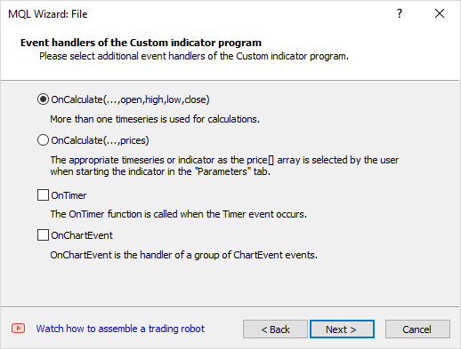
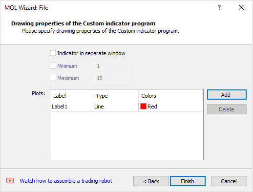

# Creating an indicator draft in the MQL Wizard

So, we have considered the internal structure of indicators and can understand how certain syntactic constructions in the source code affect the external representation and calculation of the indicator. With this level of training, you can begin to deal with someone else's code and modify it to fit your needs. Or you can try to create something of your own. In order not to start from scratch, you can use the MQL Wizard. In particular, it can also be used to create an indicator draft.

To start the Wizard, call the context menu in MetaEditor Navigator for the Indicators branch and run the New file command (Ctrl + N). In the first part of the book, in the section [MQL Wizard and program draft](/en/book/intro/mql_wizard), we created the first script using the Wizard and saw what this step looks like.

In this case (when launched from the context menu), the first step of the Wizard will automatically select the Custom indicator item.

Click Next to go to the second step, where you should specify the file name. Here you can Add indicator input parameters. This step is no different from what happened with the scripts.

In the third step, the Wizard offers to choose one of the OnCalculate handler forms and other optional event handlers.

MQL Wizard: Selecting Event Handlers When Creating an Indicator

The last step allows you to define the part of the chart in which the lines will be displayed: it can be the main window (by default) or a separate subwindow below the chart (if you enable the flag Indicator in a separate window).

MQL Wizard: window selection and list of charts when creating an indicator

Using the Add button, you can list several graphical constructions and set their basic properties.

All these terms are already familiar to us "from the inside", and you can choose one or another option consciously.

Try to generate several versions of indicators with different options enabled and evaluate their impact on the resulting program text.

Of course, having received a draft of the source code, the developer is free to make arbitrary changes, changing any of the aspects set in the Wizard. This is all the more relevant since the range of the Wizard's settings is minimal. In particular, the list of input parameter types is limited to standard MQL5 types, there are no levels, color palettes, and more. As for the additional event handlers, the Wizard offers only [OnTimer](/en/book/applications/timer/timer_ontimer) and [OnChartEvent](/en/book/applications/events/events_onchartevent) leaving behind the scenes [OnBookEvent](/en/book/automation/marketbook/marketbook_events) and [OnDeinit](/en/book/applications/runtime/runtime_oninit_ondeinit). But based on the material in this chapter, you can gradually supplement the draft with everything you need.
