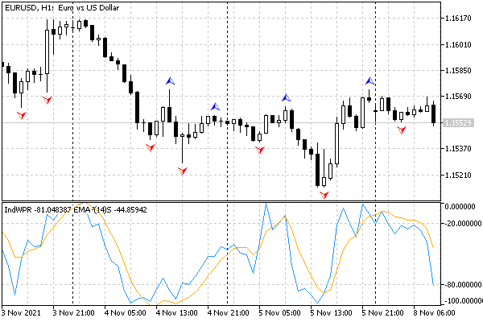
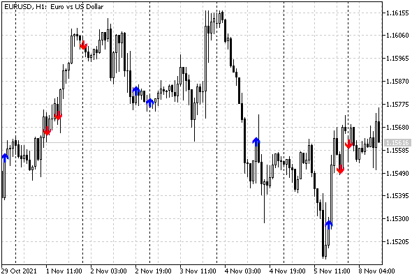

# Getting timeseries data from an indicator: CopyBuffer

An MQL program can read data from the indicator's public buffers by its handle. Recall that in custom indicators, such buffers are arrays specified in the source code in [SetIndexBuffer](/en/book/applications/indicators_make/indicators_setindexbuffer) function calls.

MQL5 API provides the function CopyBuffer for reading buffers; the function has 3 forms.

int CopyBuffer(int handle, int buffer, int offset, int count, double &array[])

int CopyBuffer(int handle, int buffer, datetime start, int count, double &array[])

int CopyBuffer(int handle, int buffer, datetime start, datetime stop, double &array[])

The handle parameter specifies the handle received from the call iCustom or other functions (for further details please see sections about [IndicatorCreate](/en/book/applications/indicators_use/indicators_indicatorcreate) and [built-in indicators](/en/book/applications/indicators_use/indicators_standard)). Parameter buffer sets the index of the indicator buffer from which to request data. The numbering is carried out starting from 0.

Received elements of the requested timeseries get into array set by reference.

The three variants of the function differ in the how they specify the range of timestamps (start/stop) or numbers (offset) and quantity (count) of bars for which the data is obtained. The basics of working with these parameters are fully consistent with what we studied in [Overview of Copy-functions for obtaining arrays of quotes](/en/book/applications/timeseries/timeseries_copy_funcs_overview). In particular, the elements of copied data in offset and count are counted from the present to the past, that is, the starting position equal to 0 means the current bar. Elements in the receiving array are physically arranged from past to present (however, this addressing can be reversed at the logical level using [ArraySetAsSeries](/en/book/common/arrays/arrays_as_series)).

CopyBuffer is an analog of functions for reading built-in timeseries of type Copy Open, CopyClose and others. The main difference is that timeseries with quotes are generated by the terminal itself, while timeseries in indicator buffers are calculated by custom or [built-in indicators](/en/book/applications/indicators_use/indicators_standard). In addition, in the case of indicators, we set a specific pair of symbol and timeframe that define and identify a timeseries in advance, in the handler creation function like iCustom, and in CopyBuffer this information is transmitted indirectly through handle.

When copying an unknown amount of data as a destination array, it is desirable to use a dynamic array. In this case, the CopyBuffer function will distribute the size of the receiving array according to the size of the copied data. If it is necessary to repeatedly copy a known amount of data, then it is better to do this in a statically allocated buffer (local with the modifier of static or fixed size in the global context) to avoid repeated memory allocations.

If the receiving array is an indicator buffer (an array previously registered in the system by the SetIndexBufer function), then the indexing in the timeseries and the receiving buffer are the same (subject to a request for the same symbol/timeframe pair). In this case, it is easy to implement partial filling of the receiver (in particular, this is used to update the last bars, see an example below). If the symbol or timeframe of the requested timeseries does not match the symbol and/or timeframe of the current chart, the function will return no more elements than the minimum number of bars in these two: source and destination.

If an ordinary array (not a buffer) is passed as the array argument, then the function will fill it starting from the first elements, entirely (in the case of dynamic) or partially (in the case of static, with excess size). Therefore, if it is necessary to partially copy the indicator values to an arbitrary location in another array, then for these purposes it is necessary to use an intermediate array, into which the required number of elements is copied, and from there they are transferred to the final destination.

The function returns the number of copied elements or -1 in case of an error, including the temporary absence of ready data.

Since indicators, as a rule, directly or indirectly depend on price timeseries, their calculation starts no earlier than the quotes are synchronized. In this regard, one should take into account [technical features of timeseries organization and storage](/en/book/applications/timeseries/timeseries_storage_tech) in the terminal and be prepared that the requested data will not appear immediately. In particular, we may receive 0 or a quantity less than requested. All such cases should be handled according to the circumstances, such as waiting for a build or reporting a problem to the user.

If the requested timeseries have not yet been built, or they need to be downloaded from the server, then the function behaves differently depending on the type of MQL program from which it is called.  

   

When requesting data that is not yet ready from the indicator, the function will immediately return -1, but the process of loading and building timeseries will be initiated.  

   

When requesting data from an Expert Advisor or a script, the download from the server will be initiated and/or the construction of the required timeseries will start if the data can be built from the local history. The function will return the amount of data that will be ready by the timeout (45 seconds) allocated for the synchronous execution of the function (the calling code is waiting for the function to complete).

Please note that the CopyBuffer function can read data from buffers regardless of their operation mode, INDICATOR_DATA, INDICATOR_COLOR_INDEX, INDICATOR_CALCULATIONS, while the last two are hidden from the user.

It is also important to note that the timeseries shift can be set in the called indicator using the property [PLOT_SHIFT](/en/book/applications/indicators_make/indicators_plotindexsetinteger), and it affects the offset of the read data with CopyBuffer. For example, if the indicator lines are shifted into the future by N bars, then in the parameters CopyBuffer (first form) one must give offset equal to (- N), that is, with a minus, since the current timeseries bar has an index of 0, and the indices of future bars with a shift decrease by one on each bar. In particular, such a situation arises with the [Gator](/en/book/applications/indicators_use/indicators_standard) indicator, because its null chart is shifted forward by the value of the TeethShift parameter, and the first diagram is shifted by the value of the LipsShift parameter. The correction should be made based on the highest one of them. We will see an example in the section [Reading data from charts that have a shift](/en/book/applications/indicators_use/indicators_shifted).

MQL5 does not provide programmatic tools to find the PLOT_SHIFT property of a third-party indicator. Therefore, if necessary, you will have to request this information from the user through an input variable.

We will work with CopyBuffer from the Expert Advisor code in the chapter about [Expert Advisors](/en/book/automation/experts), but for now we will limit ourselves to indicators.

Let's continue to develop an example with an auxiliary indicator IndWPR. This time in version UseWPR3.mq5 we will provide an indicator buffer and fill it with data from IndWPR by using CopyBuffer. To do this, we will apply the directives with the number of buffers and rendering settings.

```
#property indicator_separate_window
#property indicator_buffers 1
#property indicator_plots   1
   
#property indicator_type1   DRAW_LINE
#property indicator_color1  clrBlue
#property indicator_width1  1
#property indicator_label1  "WPR"

```

In the global context, we describe the input parameter with the WPR period, an array for the buffer, and a variable with a descriptor.

```
input int WPRPeriod = 14;
   
double WPRBuffer[];
   
int handle;

```

The OnInit handler practically does not change: only the SetIndexBuffer call was added.

```
int OnInit()
{
   SetIndexBuffer(0, WPRBuffer);
   handle = iCustom(_Symbol, _Period, "IndWPR", WPRPeriod);
   return handle == INVALID_HANDLE ? INIT_FAILED : INIT_SUCCEEDED;
}

```

In OnCalculate, we will copy the data without transformations.

```
int OnCalculate(const int rates_total,
                const int prev_calculated,
                const int begin,
                const double &data[])
{
   // waiting for the calculation to be ready for all bars
   if(BarsCalculated(Handle) != rates_total)
   {
      return prev_calculated;
   }
   
   // copy the entire timeseries of the subordinate indicator or on new bars to our buffer
   const int n = CopyBuffer(handle, 0, 0, rates_total - prev_calculated + 1, WPRBuffer);
   // if there are no errors, our data is ready for all bars rates_total
   return n > -1 ? rates_total : 0;
}

```

By compiling and running UseWPR3, we will actually get a copy of the original WPR, with the exception of the levels adjustment, the accuracy of numbers and the title. This is enough for testing the mechanism, but usually new indicators based on one or more auxiliary indicators offer some idea and data transformation of their own. Therefore, we will develop another indicator that generates buy and sell trading signals (from the position of trading, they should not be considered as a model, as this is only a programming task). The idea of the indicator is shown in the image below.



Indicators IndWPR, IndTripleEMA, IndFractals

We use the WPR exit from the overbought and oversold zones as a recommendation, respectively, to sell and buy. So that the signals do not react to random fluctuations, we apply a triple moving average to WPR and we will check if its value crosses the boundaries of the upper and lower zones.

As a filter for these signals, we will check which fractal was the last one before this moment: a top fractal means a downward price reversal and confirms a sell, and a bottom fractal means an upward reversal and therefore supports a buy. Fractals appear with a lag of a number of bars equal to the order of the fractals.

The new indicator is available in the file UseWPRFractals.mq5.

We need three buffers: two signal buffers and one more for the filter. We could issue the latter in the INDICATOR_CALCULATIONS mode. Instead, let's make it the standard INDICATOR_DATA, but with the DRAW_NONE style — this way it won't get in the way on the chart, but its values will be visible in the Data Window.

Signals will be displayed on the main chart (at Close prices by default), so we use the directive indicator_chart_window. We still can call indicators of the WPR type which are drawn in a separate window, since all subordinate indicators can be calculated without visualization. If necessary, we can plot them, but we will talk about this in the chapter on charts (see [ChartIndicatorAdd](/en/book/applications/charts/charts_indicators)).

```
#property indicator_chart_window
#property indicator_buffers 3
#property indicator_plots   3
// buffer drawing settings
#property indicator_type1   DRAW_ARROW
#property indicator_color1  clrRed
#property indicator_width1  1
#property indicator_label1  "Sell"
#property indicator_type2   DRAW_ARROW
#property indicator_color2  clrBlue
#property indicator_width2  1
#property indicator_label2  "Buy"
#property indicator_type3   DRAW_NONE
#property indicator_color3  clrGreen
#property indicator_width3  1
#property indicator_label3  "Filter"

```

In the input variables, we will provide the ability to specify the WPR period, the averaging (smoothing) period, and the fractal order. These are the parameters of the subordinate indicators. In addition, we introduce the offset variable with the number of the bar on which the signals will be analyzed. The value 0 (default) means the current bar and analysis in tick mode (note: signals on the last bar can be redrawn; some traders do not like this). If we make offset equal to 1, we will analyze the already formed bars, and such signals do not change.

```
input int PeriodWPR = 11;
input int PeriodEMA = 5;
input int FractalOrder = 1;
input int Offset = 0;
input double Threshold = 0.2;

```

The Threshold variable defines the size of overbought and oversold zones as a fraction of ±1.0 (in each direction). For example, if you follow the classic WPR settings with levels -20 and -80 on a scale from 0 to -100, then Threshold should be equal to 0.4.

The following arrays are provided for indicator buffers.

```
double UpBuffer[];   // upper signal means overbought, i.e. selling
double DownBuffer[]; // lower signal means oversold, i.e. buy
double filter[];     // fractal filter direction +1 (up/buy), -1 (down/sell)

```

The indicator handles will be saved in global variables.

```
int handleWPR, handleEMA3, handleFractals;

```

We will perform all the settings, as usual, in OnInit. Since the CopyBuffer function uses indexing from the present to the past, for the uniformity of reading data we set the "series" flag (ArraySetAsSeries) for all arrays.

```
int OnInit()
{
   // binding buffers
   SetIndexBuffer(0, UpBuffer);
   SetIndexBuffer(1, DownBuffer);
   SetIndexBuffer(2, Filter, INDICATOR_DATA); // version: INDICATOR_CALCULATIONS
   ArraySetAsSeries(UpBuffer, true);
   ArraySetAsSeries(DownBuffer, true);
   ArraySetAsSeries(Filter, true);
   
   // arrow signals
   PlotIndexSetInteger(0, PLOT_ARROW, 234);
   PlotIndexSetInteger(1, PLOT_ARROW, 233);
   
   // subordinate indicators
   handleWPR = iCustom(_Symbol, _Period, "IndWPR", PeriodWPR);
   handleEMA3 = iCustom(_Symbol, _Period, "IndTripleEMA", PeriodEMA, 0, handleWPR);
   handleFractals = iCustom(_Symbol, _Period, "IndFractals", FractalOrder);
   if(handleWPR == INVALID_HANDLE
   || handleEMA3 == INVALID_HANDLE
   || handleFractals == INVALID_HANDLE)
   {
      return INIT_FAILED;
   }
   
   return INIT_SUCCEEDED;
}

```

In iCustom calls, attention should be paid to how handleEMA3 is created. Since this average is to be calculated based on the WPR, we pass handleWPR (obtained in the previous iCustom call) as the last parameter, after the actual parameters of the indicator IndTripleEMA. In doing so, we must specify the complete list of input parameters of IndTripleEMA (the parameters in it are int InpPeriodEMA and BEGIN_POLICY InpHandleBegin; we used the second parameter to study the skipping of the initial bars and do not need it now, but we must pass it, so we just set it to 0). If we omitted the second parameter in the call as irrelevant in the current application context, then the handleWPR handle passed would be interpreted in the called indicator as InpHandleBegin. As a result, IndTripleEMA would be applied to the regular Close price.

When we don't need to pass an extra handle, the syntax of the iCustom call allows you to omit an arbitrary number of last parameters, while they will receive the default values from the source code.

In the OnCalculate handler, we wait for WPR indicators and fractals to be ready, and then we calculate signals for the entire history or the last bar using the auxiliary function MarkSignals.

```
int OnCalculate(const int rates_total,
                const int prev_calculated,
                const int begin,
                const double &data[])
{
   if(BarsCalculated(handleEMA3) != rates_total
   || BarsCalculated(handleFractals) != rates_total)
   {
      return prev_calculated;
   }
   
   ArraySetAsSeries(data, true);
   
   if(prev_calculated == 0) // first launch
   {
      ArrayInitialize(UpBuffer, EMPTY_VALUE);
      ArrayInitialize(DownBuffer, EMPTY_VALUE);
      ArrayInitialize(Filter, 0);
      
      // look for signals throughout history
      for(int i = rates_total - FractalOrder - 1; i >= 0; --i)
      {
         MarkSignals(i, Offset, data);
      }
   }
   else // online
   {
      for(int i = 0; i < rates_total - prev_calculated; ++i)
      {
         UpBuffer[i] = EMPTY_VALUE;
         DownBuffer[i] = EMPTY_VALUE;
         Filter[i] = 0;
      }
      
      // looking for signals on a new bar or each tick (if Offset == 0)
      if(rates_total != prev_calculated
      || Offset == 0)
      {
         MarkSignals(0, Offset, data);
      }
   }
   
   return rates_total;
}

```

We are primarily interested in working with the CopyBuffer function hidden in MarkSignals. The values of the smoothed WPR will be read into the wpr[2] array, and fractals will be read into peaks[1] and hollows[1].

```
int MarkSignals(const int bar, const int offset, const double &data[])
{
   double wpr[2];
   double peaks[1], hollows[1];
   ...

```

Then we fill local arrays using three CopyBuffer calls. Note that we don't need direct readings of IndWPR, because it is used in the calculations of IndTripleEMA. We read data into the wpr array via the handleEMA3 handler. It is also important that there are 2 buffers in the fractal indicator, and therefore the CopyBuffer function called twice with different indexes 0 and 1 for arrays peaks and hollows, respectively. Fractal arrays are read with an indent of FractalOrder, because a fractal can only form on a bar that has a certain number of bars on the left and on the right.

```
   if(CopyBuffer(handleEMA3, 0, bar + offset, 2, wpr) == 2
   && CopyBuffer(handleFractals, 0, bar + offset + FractalOrder, 1, peaks) == 1
   && CopyBuffer(handleFractals, 1, bar + offset + FractalOrder, 1, hollows) == 1)
   {
      ...

```

Next, we take from the previous bar of the buffer Filter the previous direction of the filter (at the beginning of the history it is 0, but when an up or down fractal appears, we write +1 or -1 there, this can be seen in the source code just below) and change it accordingly when any new fractal is detected.

```
      int filterdirection = (int)Filter[bar + 1];
      
      // the last fractal sets the reversal movement
      if(peaks[0] != EMPTY_VALUE)
      {
         filterdirection = -1; // sell
      }
      if(hollows[0] != EMPTY_VALUE)
      {
         filterdirection = +1; // buy
      }
   
      Filter[bar] = filterdirection; // remember the current direction

```

Finally, we analyze the transition of the smoothed WPR from the upper or lower zone to the middle zone, taking into account the width of the zones specified in Threshold.

```
      // translate 2 WPR values into the range [-1,+1]
      const double old = (wpr[0] + 50) / 50;     // +1.0 -1.0
      const double last = (wpr[1] + 50) / 50;    // +1.0 -1.0
      
      // bounce from the top down
      if(filterdirection == -1
      && old >= 1.0 - Threshold && last <= 1.0 - Threshold)
      {
         UpBuffer[bar] = data[bar];
         return -1; // sale
      }
      
      // bounce from the bottom up
      if(filterdirection == +1
      && old <= -1.0 + Threshold && last >= -1.0 + Threshold)
      {
         DownBuffer[bar] = data[bar];
         return +1; // purchase
      }
   }
   return 0; // no signal
}

```

Below is a screenshot of the resulting indicator on the chart.



Signal indicator UseWPRFractals based on WPR, EMA3 and fractals
