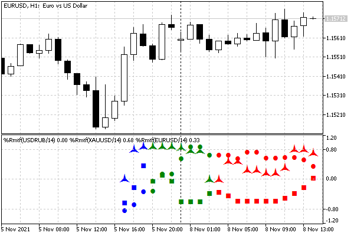
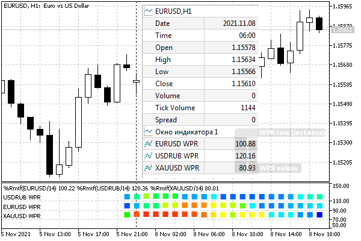

# Support for multiple symbols and timeframes

So far, in all indicator examples, we have created descriptors for the same symbol and timeframe as on the current chart. However, there is no such limitation. We can create auxiliary indicators on any symbols and timeframes. Of course, in this case, it is necessary to wait for the readiness of third-party timeseries, as we did earlier, for example, by timer.

Let's implement the WPR multi-timeframe indicator (see file UseWPRMTF.mq5), which can also be assigned a calculation on an arbitrary symbol (other than the chart).

We will display WPR values of a given period for all standard timeframes from the ENUM_TIMEFRAMES enumeration. The number of timeframes is 21, so the indicator will always be displayed on the last 21 bars. The rightmost zero bar will contain WPR for M1, the next one will contain WPR for M2, and so on up to the 20th bar with WPR for the monthly timeframe. To make it easier to read, we will color the plots in different colors: minute timeframes will be red, hourly green, and daily and older ones will be blue.

Since it will be possible to set a working symbol in the indicator and create several copies for different symbols on the same chart, we will select the DRAW_ARROW drawing style and provide an input parameter for assigning a symbol. In this way, it will be possible to distinguish indications for different symbols. Coloring requires an additional buffer.

```
#property indicator_separate_window
#property indicator_buffers 2
#property indicator_plots   1
   
#property indicator_type1   DRAW_COLOR_ARROW
#property indicator_color1  clrRed,clrGreen,clrBlue
#property indicator_width1  3
#property indicator_label1  "WPR"

```

WPR values are converted to the range [-1,+1]. Let's choose the scale of the subwindow with some margin from the range. Levels with values of ±0.6 correspond to standard -20 and -80 before WPR conversion.

```
#property indicator_maximum    +1.2
#property indicator_minimum    -1.2
   
#property indicator_level1     +0.6
#property indicator_level2     -0.6
#property indicator_levelstyle STYLE_DOT
#property indicator_levelcolor clrSilver
#property indicator_levelwidth 1

```

In input variables: WPR period, working symbol and code of the displayed arrow. When the symbol is left blank, the symbol of the current chart is used.

```
input int WPRPeriod = 14;
input string WorkSymbol = ""; // Symbol
input int Mark = 0;
   
const string _WorkSymbol = (WorkSymbol == "" ? _Symbol : WorkSymbol);

```

For coding convenience, the set of timeframes is listed in the array TF.

```
#define TFS 21
   
ENUM_TIMEFRAMES TF[TFS] =
{
   PERIOD_M1,
   PERIOD_M2,
   PERIOD_M3,
   ...
   PERIOD_D1,
   PERIOD_W1,
   PERIOD_MN1,
};

```

Indicator descriptors for each timeframe are stored in the array Handle.

```
int Handle[TFS];

```

We will configure indicator buffers and obtain handles in OnInit.

```
double WPRBuffer[];
double Colors[];
   
int OnInit()
{
   SetIndexBuffer(0, WPRBuffer);
   SetIndexBuffer(1, Colors, INDICATOR_COLOR_INDEX);
   ArraySetAsSeries(WPRBuffer, true);
   ArraySetAsSeries(Colors, true);
   PlotIndexSetString(0, PLOT_LABEL, _WorkSymbol + " WPR");
   
   if(Mark != 0)
   {
      PlotIndexSetInteger(0, PLOT_ARROW, Mark);
   }
   
   for(int i = 0; i < TFS; ++i)
   {
      Handle[i] = iCustom(_WorkSymbol, TF[i], "IndWPR", WPRPeriod);
      if(Handle[i] == INVALID_HANDLE) return INIT_FAILED;
   }
   
   IndicatorSetInteger(INDICATOR_DIGITS, 2);
   IndicatorSetString(INDICATOR_SHORTNAME,
      "%Rmtf" + "(" + _WorkSymbol + "/" + (string)WPRPeriod + ")");
   
   return INIT_SUCCEEDED;
}

```

Calculation in OnCalculate goes according to the usual scheme: waiting for data to be ready, initialization, filling on new bars. Auxiliary functions IsDataReady and FillData perform direct work with descriptors (see below).

```
int OnCalculate(const int rates_total,
                const int prev_calculated,
                const int begin,
                const double &data[])
{
   // waiting for slave indicators to be ready
   if(!IsDataReady())
   {
      EventSetTimer(1); // if not ready, postpone the calculation
      return prev_calculated;
   }
   if(prev_calculated == 0) // initialization
   {
      ArrayInitialize(WPRBuffer, EMPTY_VALUE);
      ArrayInitialize(Colors, EMPTY_VALUE);
      // constant colors for the latest TFS bars
      for(int i = 0; i < TFS; ++i)
      {
         Colors[i] = i < 11 ? 0 : (i < 18 ? 1 : 2);
      }
   }
   else // preparing a new bar
   {
      for(int i = prev_calculated; i < rates_total; ++i)
      {
         WPRBuffer[i] = EMPTY_VALUE;
         Colors[i] = 0;
      }
   }
   
   if(prev_calculated != rates_total) // new bar
   {
      // clear the label on the oldest bar that moved to the left beyond TFS bars
      WPRBuffer[TFS] = EMPTY_VALUE;
      // update bar coloring
      for(int i = 0; i < TFS; ++i)
      {
         Colors[i] = i < 11 ? 0 : (i < 18 ? 1 : 2);
      }
   }
   
   // copy the data from the subordinate indicators to our buffer
   FillData();
   return rates_total;
}

```

If necessary, we initiate recalculation by timer.

```
void OnTimer()
{
   ChartSetSymbolPeriod(0, _Symbol, _Period);
   EventKillTimer();
}

```

And here are the functions IsDataReady and FillData.

```
bool IsDataReady()
{
   for(int i = 0; i < TFS; ++i)
   {
      if(BarsCalculated(Handle[i]) != iBars(_WorkSymbol, TF[i]))
      {
         Print("Waiting for ", _WorkSymbol, " ", EnumToString(TF[i]));
         return false;
      }
   }
   return true;
}
   
void FillData()
{
   for(int i = 0; i < TFS; ++i)
   {
      double data[1];
      // taking the last actual value (buffer 0, index 0)
      if(CopyBuffer(Handle[i], 0, 0, 1, data) == 1)
      {
         WPRBuffer[i] = (data[0] + 50) / 50;
      }
   }
}

```

Let's compile the indicator and see how it looks on the chart. For example, let's create three copies for EURUSD, USDRUB and XAUUSD.



Three instances of multi-timeframe WPR for different working symbols

During the first calculation, the indicator may require a significant amount of time to prepare timeseries for all timeframes.

In terms of the calculated part, exactly the same indicator UseWPRMTFDashboard.mq5 is designed in the form of a dashboard popular with traders. For each symbol, we set individual vertical indents in the Level parameter of the indicator. This is where the WPR values of all timeframes are displayed as a line of markers, and the values are color-coded. In this version, WPR values are normalized to the range [0..1], so the use of rulers at levels separated by several tens (for example, 20, as in the screenshot below) allows you to place several instances of the indicator in the subwindow without overlaps (80 , 100, 120, etc.). Each copy is used for its own working symbol. Moreover, due to the fact that Level is greater than 1.0, and WPR values are less, they are visible in the values in Data window separately: to the left and to the right of the decimal point.

Labels for label rulers are provided by levels dynamically added in OnInit.



Panel of three line multi-timeframe WPRs for different working symbols

You can explore the source code of UseWPRMTFDashboard.mq5 and compare it with UseWPRMTF.mq5. To generate a palette of color shades, we used the file ColorMix.mqh.

After we complete studying [built-in indicators](/en/book/applications/indicators_use/indicators_standard), including iWPR, we can replace the custom IndWPR by the built-in iWPR.

On the effectiveness and resource intensity of composite indicators   

   

The approach shown above, with the generation of many auxiliary indicators, is not efficient in terms of speed and resource consumption. This is primarily an example of integrating MQL programs and exchanging data between them. But like any technology, it should be used appropriately.  

   

Each of the two created indicators calculates WPR on all bars of the timeseries, and then only the last value is taken into the calling indicator. We waste both memory and processor time.  

   

If the source code of auxiliary indicators is available or the concept of their operation is known, the most optimal way is to locate the calculation algorithm inside the main indicator (or Expert Advisor) and apply it for a limited, immediate history of the minimum required depth.  

   

In some cases, you can do without referring to higher timeframes by performing equivalent calculations on the current timeframe: for example, instead of a price range on 14 daily bars (which requires building a full D1 timeseries), you can take a range on 14 * 24 H1 bars, subject to 24-hour trading and launching the indicator on the H1 chart.  

   

At the same time, when a commercial indicator is used in a trading system (without source code), data can be obtained from it only through open programming interfaces. In this case, creating a handle and then reading data from the indicator buffer via CopyBuffer is the only available option, but at the same time convenient, universal way. It's just that you should always keep in mind that calling API functions is a more "expensive" operation than manipulating your own array inside an MQL program and calling local functions. If you need to keep many terminals open, probably each with a set of such non-optimized MQL programs, and if you have limited resources, then performance is likely to drop.
