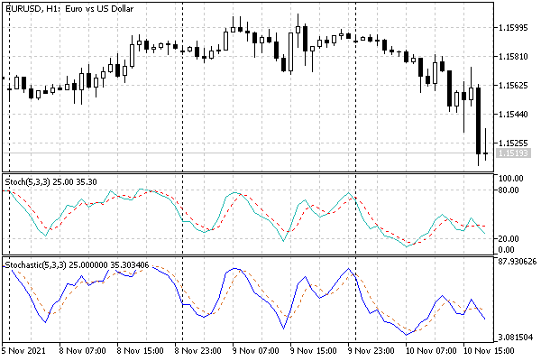
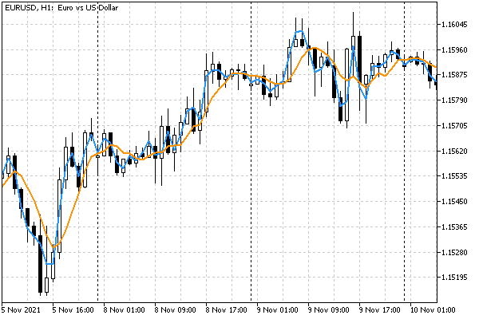
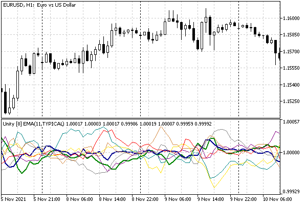

# Using built-in indicators

As a simple introductory example of using the built-in indicator, let's use a call to iStochastic. The prototype of this indicator function is as follows:

int iStochastic(const string symbol, ENUM_TIMEFRAMES timeframe,  

   int Kperiod, int Dperiod, int slowing,  

   ENUM_MA_METHOD method, ENUM_STO_PRICE price)

As we can see, in addition to the standard parameters symbol and time frame, the stochastic has several specific parameters:

- Kperiod – number of bars to calculate the %K line
- Dperiod – primary smoothing period for the %D line
- slowing – secondary smoothing period (deceleration)
- method – method of averaging (smoothing)
- price – method of calculating the stochastic

Let's try to create our own indicator UseStochastic.mq5, which will copy the values of the stochastic into its buffers. Since there are two buffers in the stochastic, we will also reserve two: these are the "main" and "signal" lines.

```
#property indicator_separate_window
#property indicator_buffers 2
#property indicator_plots   2
   
#property indicator_type1   DRAW_LINE
#property indicator_color1  clrBlue
#property indicator_width1  1
#property indicator_label1  "St'Main"
   
#property indicator_type2   DRAW_LINE
#property indicator_color2  clrChocolate
#property indicator_width2  1
#property indicator_label2  "St'Signal"
#property indicator_style2  STYLE_DOT

```

In the input variables, we provide all the required parameters.

```
input int KPeriod = 5;
input int DPeriod = 3;
input int Slowing = 3;
input ENUM_MA_METHOD Method = MODE_SMA;
input ENUM_STO_PRICE StochasticPrice = STO_LOWHIGH;

```

Next, we describe arrays for indicator buffers and a global variable for the descriptor.

```
double MainBuffer[];
double SignalBuffer[];
   
int Handle;

```

We will initialize in OnInit.

```
int OnInit()
{
   IndicatorSetString(INDICATOR_SHORTNAME,
      StringFormat("Stochastic(%d,%d,%d)", KPeriod, DPeriod, Slowing));
   // binding of arrays as buffers
   SetIndexBuffer(0, MainBuffer);
   SetIndexBuffer(1, SignalBuffer);
   // getting the descriptor Stochastic
   Handle = iStochastic(_Symbol, _Period,
      KPeriod, DPeriod, Slowing, Method, StochasticPrice);
   return Handle == INVALID_HANDLE ? INIT_FAILED : INIT_SUCCEEDED;
}

```

Now, in OnCalculate, we need to read data using the CopyBuffer function as soon as the handle is ready.

```
int OnCalculate(const int rates_total,
                const int prev_calculated,
                const int begin,
                const double &data[])
{
   // waiting for the calculation of the stochastic on all bars
   if(BarsCalculated(Handle) != rates_total)
   {
      return prev_calculated;
   }
   
   // copy data to our two buffers
   const int n = CopyBuffer(Handle, 0, 0, rates_total - prev_calculated + 1,
      MainBuffer);
   const int m = CopyBuffer(Handle, 1, 0, rates_total - prev_calculated + 1,
      SignalBuffer);
   
   return n > -1 && m > -1 ? rates_total : 0;
}

```

Note that we are calling CopyBuffer twice: for each buffer separately (0 and 1 in the second parameter). An attempt to read a buffer with a non-existent index, for example, 2, would generate an error and we would not receive any data.

Our indicator is not particularly useful, since it does not add anything to the original stochastic and does not analyze its readings. On the other hand, we can make sure that the lines of the standard terminal indicator and the ones created in MQL5 coincide (levels and precision settings could also be easily added, as we did with completely custom indicators, but then it would be difficult to distinguish a copy from the original).



Standard stochastic and custom based on the iStochastic function

To demonstrate caching of indicators by the terminal, add to the OnInit function a couple of lines.

```
   double array[];
   Print("This is very first copy of iStochastic with such settings=",
      !(CopyBuffer(Handle, 0, 0, 10, array) > 0));

```

Here, we used a trick related to the known features: immediately after the indicator is created, it takes some time to calculate, and it is impossible to read data from the buffer immediately after receiving the handle. This is true for the case of the "cold" start, when the indicator with the specified parameters does not yet exist in the cache, in the terminal's memory. If there is a ready-made analog, then we can instantly access the buffer.

After compiling a new indicator, you should place two copies of it on two charts of the same symbol and timeframe. For the first time, a message with the true flag will be displayed in the log (this is the first copy), and the second time (and subsequent times, if there are many graphs) it will be false. You can also first manually add a standard "Stochastic Oscillator" indicator to the chart (with default settings or those that will then be applied in Use Stochastic) and then run Use Stochastic: we also need to get false.

Now let's try to come up with something original based on a standard indicator. The following indicator UseM1MA.mq5 is designed to calculate average per-bar prices on M5 and higher timeframes (mainly intraday). It accumulates the prices of M1 bars that fall within the range of timestamps of each specific bar on the working (higher) timeframe. This allows you to estimate the effective price of a bar much more accurately than the standard price types (Close, Open, Median, Typical,  Weighted, etc.). Additionally, we will provide for the possibility of averaging such prices over a certain period, but here you should be prepared that a particularly smooth line will not work.

The indicator will be displayed in the main window and contain a single buffer. Settings can be changed using 3 parameters:

```
input uint _BarLimit = 100; // BarLimit
input uint BarPeriod = 1;
input ENUM_APPLIED_PRICE M1Price = PRICE_CLOSE;

```

BarLimit sets the number of bars of the nearest history for calculation. It is important because high timeframe charts can require a very large number of bars when compared to the minute M1 (for example, one D1 day in 24/7 trading is known to contain 1440 M1 bars). This may result in additional data being downloaded and waiting for synchronization. Experiment with the sparing default setting (100 bars of the working timeframe) before setting this parameter to 0, which means no-limit processing.

However, even when setting BarLimit to 0, the indicator is likely to be calculated not for the entire visible history of the older timeframe: if the terminal has a limit on the number of bars in the chart, then it will also affect requests for M1 bars. In other words, the depth of analysis is determined by the time for which the maximum allowed number of bars M1 goes into history.

BarPeriod sets the number of bars of the higher timeframe for which averaging is performed. The default value here is 1, which allows you to see the effective price of each bar separately.

The M1Price parameter specifies the price type used for calculations for M1 bars.

In the global context, an array is described for a buffer, a descriptor and a self-updating flag, which we need to wait for the construction of a timeseries of the "alien" M1 timeframe.

```
double Buffer[];
   
int Handle;
int BarLimit;
bool PendingRefresh;
   
const string MyName = "M1MA (" + StringSubstr(EnumToString(M1Price), 6)
   + "," + (string)BarPeriod + "[" + (string)(PeriodSeconds() / 60) + "])";
const uint P = PeriodSeconds() / 60 * BarPeriod;

```

In addition, the name of the indicator and the averaging period P are formed here. The function PeriodSeconds, which returns the number of seconds inside one bar of the current timeframe, allows you to calculate the number of M1 bars inside one current bar: PeriodSeconds() / 60 (60 seconds is the duration of bar M1).

The usual initialization is done in OnInit.

```
int OnInit()
{
   IndicatorSetString(INDICATOR_SHORTNAME, MyName);
   IndicatorSetInteger(INDICATOR_DIGITS, _Digits);
   
   SetIndexBuffer(0, Buffer);
   
   Handle = iMA(_Symbol, PERIOD_M1, P, 0, MODE_SMA, M1Price);
   
   return Handle != INVALID_HANDLE ? INIT_SUCCEEDED : INIT_FAILED;
}

```

To get the average price on a higher timeframe bar, we apply a simple moving average, calling iMA with MODE_SMA mode.

The OnCalculate function below is given with simplifications. On first run or history change, we clear the buffer and populate the BarLimit variable (it is required because the input variables cannot be edited, and we want to interpret the value 0 as the maximum number of bars available for calculation). During subsequent calls, the buffer elements are cleared only on the last bars, starting from prev_calculated and no more than BarLimit.

```
int OnCalculate(ON_CALCULATE_STD_FULL_PARAM_LIST)
{
   if(prev_calculated == 0)
   {
      ArrayInitialize(Buffer, EMPTY_VALUE);
      if(_BarLimit == 0
      || _BarLimit > (uint)rates_total)
      {
         BarLimit = rates_total;
      }
      else
      {
         BarLimit = (int)_BarLimit;
      }
   }
   else
   {
      for(int i = fmax(prev_calculated - 1, (int)(rates_total - BarLimit));
         i < rates_total; ++i)
      {
         Buffer[i] = EMPTY_VALUE;
      }
   }

```

Before reading data from the created iMA indicator, you need to wait for them to be ready: for this we compare BarsCalculated with the number of bars M1.

```
   if(BarsCalculated(Handle) != iBars(_Symbol, PERIOD_M1))
   {
      if(prev_calculated == 0)
      {
         EventSetTimer(1);
         PendingRefresh = true;
      }
      return prev_calculated;
   }
   ...

```

If the data is not ready, we start a timer to try to read it again in a second.

Next, we get into the main calculation part of the algorithm and therefore we must stop the timer if it is still running. This can happen if the next tick event came faster than 1 second, and iMA M1 already paid off. It would be logical to just call the appropriate function [EventKillTimer](/en/book/applications/timer/timer_event_set). However, there is a nuance in its behavior: it does not clear the event queue for an indicator-type MQL program, and if a timer event is already placed in the queue, then the OnTimer handler will be called once. To avoid unnecessary updating of the graph, we control the process using our own variable Pending Refresh, and here we assign it false.

```
   ...
   Pending Refresh =false;// data is ready, the timer will idle
   ...

```

Here's how it's all organized in the OnTimer handler:

```
void OnTimer()
{
   EventKillTimer();
   if(PendingRefresh)
   {
      ChartSetSymbolPeriod(0, _Symbol, _Period);
   }
}

```

Let's get back to OnCalculate and present the main workflow.

```
   for(int i = fmax(prev_calculated - 1, (int)(rates_total - BarLimit));
      i < rates_total; ++i)
   {
      static double result[1];
      
      // get the last bar M1 corresponding to the i-th bar of the current timeframe
      const datetime dt = time[i] + PeriodSeconds() - 60;
      const int bar = iBarShift(_Symbol, PERIOD_M1, dt);
      
      if(bar > -1)
      {
         // request MA value on M1
         if(CopyBuffer(Handle, 0, bar, 1, result) == 1)
         {
            Buffer[i] = result[0];
         }
         else
         {
            Print("CopyBuffer failed: ", _LastError);
            return prev_calculated;
         }
      }
   }
   
   return rates_total;
}

```

The indicator operation is illustrated by the following image on EURUSD,H1. The blue line corresponds to the default settings. Each value is obtained by averaging PRICE_CLOSE over 60 bars M1. The orange line additionally includes smoothing by 5 bars H1, with M1 PRICE_TYPICAL prices.



Two instances of the UseM1MA indicator on EURUSD,H1

The book presents a simplified version of UseM1MASimple.mq5. We left behind the scenes the specifics of averaging the last (incomplete) bar, processing of empty bars (for which there are no data on M1) and the correct setting of the PLOT_DRAW_BEGIN property, as well as control over the appearance of short-term lags in the calculation of the average when new bars appear. The full version is available in the file UseM1MA.mq5.

As the last example of building indicators based on standard ones, let's analyze the improvement of the indicator IndUnityPercent.mq5, which was presented in the section [Multicurrency and multitimeframe indicators](/en/book/applications/indicators_make/indicators_multisymbol). The first version used Close prices for calculations, getting them with CopyBuffer. In the new version UseUnityPercentPro.mq5, let's replace this method with reading the iMA indicator data. This will allow us to implement new features:

- Average prices over a given period
- Choose the averaging method
- Choose the price type for calculation

Changes in the source code are minimal. We add 3 new parameters and a global array for iMA handles:

```
input ENUM_APPLIED_PRICE PriceType = PRICE_CLOSE;
input ENUM_MA_METHOD PriceMethod = MODE_EMA;
input int PricePeriod = 1;
...   
int Handles[];

```

In the helper function InitSymbols, which is called from OnInit to parse a string with a list of working symbols, we add memory allocation for a new array (its SymbolCount size is determined from the list).

```
string InitSymbols()
{
   SymbolCount = StringSplit(Instruments, ',', Symbols);
   ...
   ArrayResize(Handles, SymbolCount);
   ArrayInitialize(Handles, INVALID_HANDLE);
   ...
   for(int i = 0; i < SymbolCount; i++)
   {
      ...
      Handles[i] = iMA(Symbols[i], PERIOD_CURRENT, PricePeriod, 0,
         PriceMethod, PriceType);
   }
}

```

At the end of the same function, we will create the descriptors of the required subordinate indicators.

In the Calculate function, where the main calculation is performed, we replace calls of the form:

```
CopyClose(Symbols[j], _Period, time0, time1, w);

```

by calls:

```
CopyBuffer(Handles[j], 0, time0, time1, w); // j-th handle, 0-th buffer

```

For clarity, we have also supplemented the short name of the indicator with three new parameters.

```
   IndicatorSetString(INDICATOR_SHORTNAME,
      StringFormat("Unity [%d] %s(%d,%s)", workCurrencies.getSize(),
      StringSubstr(EnumToString(PriceMethod), 5), PricePeriod,
      StringSubstr(EnumToString(PriceType), 6)));

```

Here's what happened as a result.



UseUnityPercentPro multi-symbol indicator with major Forex pairs

Shown here is a basket of 8 major Forex currencies (default setting) averaged over 11 bars and calculated based on the typical price. Two thick lines correspond to the relative value of the currencies of the current chart: EUR is marked in blue and USD is green.
