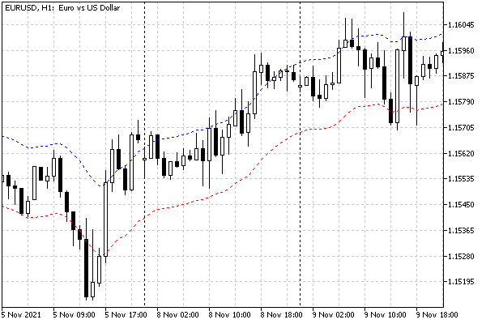

# Advanced way to create indicators: IndicatorCreate

Creating an indicator using the iCustom function or one of those functions that make up a set of built-in indicators requires knowledge of the list of parameters at the coding stage. However, in practice, it often becomes necessary to write programs that are flexible enough to replace one indicator with another.

For example, when optimizing an Expert Advisor in the [tester](/en/book/automation/tester), it makes sense to select not only the period of the moving average, but also the algorithm for its calculation. Of course, if we build the algorithm on a single indicator iMA, you can provide the possibility to specify ENUM_MA_METHOD in its method settings. But someone would probably like to expand the choice by switching between double exponential, triple exponential and fractal moving average. At first glance, this could be done using switch with a call of DEMA, iTEMA, and iFrAMA, respectively. However, what about including custom indicators in this list?

Although the name of the indicator can be easily replaced in the iCustom call, the list of parameters may differ significantly. In the general case, an Expert Advisor may need to generate signals based on a combination of any indicators that are not known in advance, and not just moving averages.

For such cases, MQL5 has a universal method for creating an arbitrary technical indicator using the IndicatorCreate function.

int IndicatorCreate(const string symbol, ENUM_TIMEFRAMES timeframe, ENUM_INDICATOR indicator, int count = 0, const MqlParam &parameters[] = NULL)

The function creates an indicator instance for the specified symbol and timeframe. The indicator type is set using the indicator parameter. Its type is the ENUM_INDICATOR enumeration (see further along) containing identifiers for all [built-in indicators](/en/book/applications/indicators_use/indicators_standard), as well as an option for [iCustom](/en/book/applications/indicators_use/indicators_icustom). The number of indicator parameters and their descriptions are passed, respectively, in the count argument and in the MqlParam array of structures (see below).

Each element of this array describes the corresponding input parameter of the indicator being created, so the content and order of the elements must correspond to the prototype of the built-in indicator function or, in the case of a custom indicator, to the descriptions of the input variables in its source code.

Violation of this rule may result in an error at the program execution stage (see example below) and in the inability to create a handle. In the worst case, the passed parameters will be interpreted incorrectly and the indicator will not behave as expected, but due to the lack of errors, this is not easy to notice. The exception is passing an empty array or not passing it at all (because the arguments count and parameters are optional): in this case, the indicator will be created with default settings. Also, for custom indicators, you can omit an arbitrary number of parameters from the end of the list.

The MqlParam structure is specially designed to pass input parameters when creating an indicator using IndicatorCreate or to obtain information about the parameters of a third-party indicator (performed on the chart) using [IndicatorParameters](/en/book/applications/indicators_use/indicators_parameters).

```
struct MqlParam 
{ 
   ENUM_DATATYPE type;          // input parameter type
   long          integer_value; // field for storing an integer value
   double        double_value;  // field for storing double or float values
   string        string_value;  // field for storing a value of string type
};

```

The actual value of the parameter must be set in one of the fields integer_value, double_value, string_value, according to the value of the first type field. In turn, the type field is described using the ENUM_DATATYPE enumeration containing identifiers for all [built-in MQL5 types](/en/book/basis/builtin_types).

| Identifier | Data type |
| --- | --- |
| TYPE_BOOL | bool |
| TYPE_CHAR | char |
| TYPE_UCHAR | uchar |
| TYPE_SHORT | short |
| TYPE_USHORT | ushort |
| TYPE_COLOR | color |
| TYPE_INT | int |
| TYPE_UINT | uint |
| TYPE_DATETIME | datetime |
| TYPE_LONG | long |
| TYPE_ULONG | ulong |
| TYPE_FLOAT | float |
| TYPE_DOUBLE | double |
| TYPE_STRING | string |

If any indicator parameter has an enumeration type, you should use the TYPE_INT value in the type field to describe it.

The ENUM_INDICATOR enumeration used in the third parameter IndicatorCreate to indicate the indicator type contains the following constants.

| Identifier | Indicator |
| --- | --- |
| IND_AC | Accelerator Oscillator |
| IND_AD | Accumulation/Distribution |
| IND_ADX | Average Directional Index |
| IND_ADXW | ADX by Welles Wilder |
| IND_ALLIGATOR | Alligator |
| IND_AMA | Adaptive Moving Average |
| IND_AO | Awesome Oscillator |
| IND_ATR | Average True Range |
| IND_BANDS | Bollinger Bands® |
| IND_BEARS | Bears Power |
| IND_BULLS | Bulls Power |
| IND_BWMFI | Market Facilitation Index |
| IND_CCI | Commodity Channel Index |
| IND_CHAIKIN | Chaikin Oscillator |
| IND_CUSTOM | Custom indicator |
| IND_DEMA | Double Exponential Moving Average |
| IND_DEMARKER | DeMarker |
| IND_ENVELOPES | Envelopes |
| IND_FORCE | Force Index |
| IND_FRACTALS | Fractals |
| IND_FRAMA | Fractal Adaptive Moving Average |
| IND_GATOR | Gator Oscillator |
| IND_ICHIMOKU | Ichimoku Kinko Hyo |
| IND_MA | Moving Average |
| IND_MACD | MACD |
| IND_MFI | Money Flow Index |
| IND_MOMENTUM | Momentum |
| IND_OBV | On Balance Volume |
| IND_OSMA | OsMA |
| IND_RSI | Relative Strength Index |
| IND_RVI | Relative Vigor Index |
| IND_SAR | Parabolic SAR |
| IND_STDDEV | Standard Deviation |
| IND_STOCHASTIC | Stochastic Oscillator |
| IND_TEMA | Triple Exponential Moving Average |
| IND_TRIX | Triple Exponential Moving Averages Oscillator |
| IND_VIDYA | Variable Index Dynamic Average |
| IND_VOLUMES | Volumes |
| IND_WPR | Williams Percent Range |

It is important to note that if the IND_CUSTOM value is passed as the indicator type, then the first element of the parameters array must have the type field with the value TYPE_STRING, and the string_value field must contain the name (path) of the custom indicator.

If successful, the IndicatorCreate function returns a handle of the created indicator, and in case of failure it returns INVALID_HANDLE. The error code will be provided in [_LastError](/en/book/common/environment/env_last_error).

Recall that in order to test MQL programs that create custom indicators whose names are not known at the compilation stage (which is also the case when using IndicatorCreate), you must explicitly bind them using the directive:

```
#property tester_indicator "indicator_name.ex5"

```

This allows the tester to send the required auxiliary indicators to the testing agents but limits the process to only indicators known in advance.

Let's look at a few examples. Let's start with a simple application IndicatorCreate as an alternative to already known functions, and then, to demonstrate the flexibility of the new approach, we will create a universal wrapper indicator for visualizing arbitrary built-in or custom indicators.

The first example of UseEnvelopesParams1.mq5 creates an embedded copy of the Envelopes indicator. To do this, we describe two buffers, two plots, arrays for them, and input parameters that repeat the iEnvelopes parameters.

```
#property indicator_chart_window
#property indicator_buffers 2
#property indicator_plots   2
   
// drawing settings
#property indicator_type1   DRAW_LINE
#property indicator_color1  clrBlue
#property indicator_width1  1
#property indicator_label1  "Upper"
#property indicator_style1  STYLE_DOT
   
#property indicator_type2   DRAW_LINE
#property indicator_color2  clrRed
#property indicator_width2  1
#property indicator_label2  "Lower"
#property indicator_style2  STYLE_DOT
   
input int WorkPeriod = 14;
input int Shift = 0;
input ENUM_MA_METHOD Method = MODE_EMA;
input ENUM_APPLIED_PRICE Price = PRICE_TYPICAL;
input double Deviation = 0.1; // Deviation, %
   
double UpBuffer[];
double DownBuffer[];
   
int Handle; // handle of the subordinate indicator

```

The handler OnInit could look like this if you use the function iEnvelopes.

```
int OnInit()
{
   SetIndexBuffer(0, UpBuffer);
   SetIndexBuffer(1, DownBuffer);
   
   Handle = iEnvelopes(WorkPeriod, Shift, Method, Price, Deviation);
   return Handle == INVALID_HANDLE ? INIT_FAILED : INIT_SUCCEEDED;
}

```

The buffer bindings will remain the same, but to create a handle, we will now go the other way. Let's describe the MqlParam array, fill it in and call the IndicatorCreate function.

```
int OnInit()
{
   ...
   MqlParam params[5] = {};
   params[0].type = TYPE_INT;
   params[0].integer_value = WorkPeriod;
   params[1].type = TYPE_INT;
   params[1].integer_value = Shift;
   params[2].type = TYPE_INT;
   params[2].integer_value = Method;
   params[3].type = TYPE_INT;
   params[3].integer_value = Price;
   params[4].type = TYPE_DOUBLE;
   params[4].double_value = Deviation;
   Handle = IndicatorCreate(_Symbol, _Period, IND_ENVELOPES,
      ArraySize(params), params);
   return Handle == INVALID_HANDLE ? INIT_FAILED : INIT_SUCCEEDED;
}

```

Having received the handle, we use it in OnCalculate to fill two of its buffers.

```
int OnCalculate(const int rates_total,
                const int prev_calculated,
                const int begin,
                const double &data[])
{
   if(BarsCalculated(Handle) != rates_total)
   {
      return prev_calculated;
   }
   
   const int n = CopyBuffer(Handle, 0, 0, rates_total - prev_calculated + 1, UpBuffer);
   const int m = CopyBuffer(Handle, 1, 0, rates_total - prev_calculated + 1, DownBuffer);
      
   return n > -1 && m > -1 ? rates_total : 0;
}

```

Let's check how the created indicator UseEnvelopesParams1 looks on the chart.



UseEnvelopesParams1 indicator

Above was a standard but not very elegant way to populate properties. Since the IndicatorCreate call may be required in many projects, it makes sense to simplify the procedure for the calling code. For this purpose, we will develop a class entitled MqlParamBuilder (see file MqlParamBuilder.mqh). Its task will be to accept parameter values using some methods, determine their type, and add appropriate elements (correctly filled structures) to the array.

MQL5 does not fully support the concept of the Run-Time Type Information (RTTI). With it, programs can ask the runtime for descriptive meta-data about their constituent parts, including variables, structures, classes, functions, etc. The few built-in features of MQL5 that can be classified as RTTI are operators [typename](/en/book/basis/expressions/operators_sizeof_typename) and [offsetof](/en/book/oop/structs_and_unions/structs_pack_dll). Because typename returns the name of the type as a string, let's build our type autodetector on strings (see file RTTI.mqh).

```
template<typename T>
ENUM_DATATYPE rtti(T v = (T)NULL)
{
   static string types[] =
   {
      "null",     //               (0)
      "bool",     // 0 TYPE_BOOL=1 (1)
      "char",     // 1 TYPE_CHAR=2 (2)
      "uchar",    // 2 TYPE_UCHAR=3 (3)
      "short",    // 3 TYPE_SHORT=4 (4)
      "ushort",   // 4 TYPE_USHORT=5 (5)
      "color",    // 5 TYPE_COLOR=6 (6)
      "int",      // 6 TYPE_INT=7 (7)
      "uint",     // 7 TYPE_UINT=8 (8)
      "datetime", // 8 TYPE_DATETIME=9 (9)
      "long",     // 9 TYPE_LONG=10 (A)
      "ulong",    // 10 TYPE_ULONG=11 (B)
      "float",    // 11 TYPE_FLOAT=12 (C)
      "double",   // 12 TYPE_DOUBLE=13 (D)
      "string",   // 13 TYPE_STRING=14 (E)
   };
   const string t = typename(T);
   for(int i = 0; i < ArraySize(types); ++i)
   {
      if(types[i] == t)
      {
         return (ENUM_DATATYPE)i;
      }
   }
   return (ENUM_DATATYPE)0;
}

```

The template function rtti uses typename to receive a string with the name of the template type parameter and compares it with the elements of an array containing all built-in types from the ENUM_DATATYPE enumeration. The order of enumeration of names in the array corresponds to the value of the enumeration element, so when a matching string is found, it is enough to cast the index to type (ENUM_DATATYPE) and return it to the calling code. For example, call to rtti(1.0) or rtti<double> () will give the value TYPE_DOUBLE.

With this tool, we can return to working on MqlParamBuilder. In the class, we describe the MqlParam array of structures and the n variable which will contain the index of the last element to be filled.

```
class MqlParamBuilder
{
protected:
   MqlParam array[];
   int n;
   ...

```

Let's make the public method for adding the next value to the list of parameters a template one. Moreover, we implement it as an overload of the operator '<<' , which returns a pointer to the "builder" object itself. This will allow to write multiple values to the array in one line, for example, like this: builder << WorkPeriod << PriceType << SmoothingMode.

It is in this method that we increase the size of the array, get the working index n to fill, and immediately reset this n-th structure.

```
...
public:
   template<typename T>
   MqlParamBuilder *operator<<(T v)
   {
 // expand the array
      n = ArraySize(array);
      ArrayResize(array, n + 1);
      ZeroMemory(array[n]);
      ...
      return &this;
   }

```

Where there is an ellipsis, the main working part will follow, that is, filling in the fields of the structure. It could be assumed that we will directly determine the type of the parameter using a self-made rtti. But you should pay attention to one nuance. If we write instructions array[n].type = rtti(v), it will not work correctly for enumerations. Each enumeration is an independent type with its own name, despite the fact that it is stored in the same way as integers. For enumerations, the function rtti will return 0, and therefore, you need to explicitly replace it with TYPE_INT.

```
      ...
      // define value type
      array[n].type = rtti(v);
      if(array[n].type == 0) array[n].type = TYPE_INT; // imply enum
      ...

```

Now we only need to put the v value to one of the three fields of the structure: integer_value of type long (note, long is a long integer, hence the name of the field), double_value of type double or string_value of type string. Meanwhile, the number of built-in types is much larger, so it is assumed that all integral types (including int, short, char, color, datetime, and enumerations) must fall into the field integer_value, float values must fall in field double_value, and only for the string_value field has is an unambiguous interpretation: it is always string.

To accomplish this task, we implement several overloaded assign methods: three with specific types of float, double, and string, and one template for everything else.

```
class MqlParamBuilder
{
protected:
   ...
   void assign(const float v)
   {
      array[n].double_value = v;
   }
   
   void assign(const double v)
   {
      array[n].double_value = v;
   }
   
   void assign(const string v)
   {
      array[n].string_value = v;
   }
   
   // here we process int, enum, color, datetime, etc. compatible with long
   template<typename T>
   void assign(const T v)
   {
      array[n].integer_value = v;
   }
   ...

```

This completes the process of filling structures, and the question remains of passing the generated array to the calling code. This action is assigned to a public method with an overload of the operator '>>', which has a single argument: a reference to the receiving array MqlParam.

```
   // export the inner array to the outside
   void operator>>(MqlParam &params[])
   {
      ArraySwap(array, params);
   }

```

Now that everything is ready, we can work with the source code of the modified indicator UseEnvelopesParams2.mq5. Changes compared to the first version concern only filling of the MqlParam array in the OnInit handler. In it, we describe the "builder" object, send all parameters to it via '<<' and return the finished array via '>>'. All is done in one line.

```
int OnInit()
{
   ...
   MqlParam params[];
   MqlParamBuilder builder;
   builder << WorkPeriod << Shift << Method << Price << Deviation >> params;
   ArrayPrint(params);
   /*
       [type] [integer_value] [double_value] [string_value]
   [0]      7              14        0.00000 null            <- "INT" period
   [1]      7               0        0.00000 null            <- "INT" shift
   [2]      7               1        0.00000 null            <- "INT" EMA
   [3]      7               6        0.00000 null            <- "INT" TYPICAL
   [4]     13               0        0.10000 null            <- "DOUBLE" deviation
   */

```

For control, we output the array to the log (the result for the default values is shown above).

If the array is not completely filled, IndicatorCreate call will end with an error. For example, if you pass only 3 parameters out of 5 required for Envelopes, you will get error 4002 and an invalid handle.

```
   Handle = PRTF(IndicatorCreate(_Symbol, _Period, IND_ENVELOPES, 3, params));
   // Error example:
   // indicator Envelopes cannot load [4002]   
   // IndicatorCreate(_Symbol,_Period,IND_ENVELOPES,3,params)=
      -1 / WRONG_INTERNAL_PARAMETER(4002)

```

However, a longer array than in the indicator specification is not considered an error: extra values are simply not taken into account.

Note that when the value types differ from the expected parameter types, the system performs an implicit cast, and this does not raise obvious errors, although the generated indicator may not work as expected. For example, if instead of Deviation we send a string to the indicator, it will be interpreted as the number 0, as a result of which the "envelope" will collapse: both lines will be aligned on the middle line, relative to which the indent is made by the size of Deviation (in percentages). Similarly, passing a real number with a fractional part in a parameter where an integer is expected will cause it to be rounded.

But we, of course, leave the correct version of the IndicatorCreate call and get a working indicator, just like in the first version.

```
   ...
   Handle = PRTF(IndicatorCreate(_Symbol, _Period, IND_ENVELOPES,
      ArraySize(params), params));
   // success:
   // IndicatorCreate(_Symbol,_Period,IND_ENVELOPES,ArraySize(params),params)=10 / ok
   return Handle == INVALID_HANDLE ? INIT_FAILED : INIT_SUCCEEDED;
}

```

By the look of it, the new indicator is no different from the previous one.
