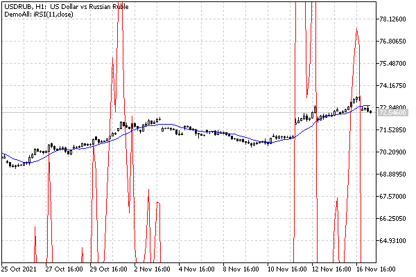

# Flexible creation of indicators with IndicatorCreate

After getting acquainted with a new way of creating indicators, let's turn to a task that is closer to reality. IndicatorCreate is usually used in cases where the called indicator is not known in advance. Such a need, for example, arises when writing universal Expert Advisors capable of trading on arbitrary signals configured by the user. And even the names of the indicators can be set by the user.

We are not yet ready to develop Expert Advisors, and therefore we will study this technology using the example of a wrapper indicator UseDemoAll.mq5, capable of displaying the data of any other indicator.

The process should look like this. When we run UseDemoAll on the chart, a list appears in the properties dialog where we should select one of the built-in indicators or a custom one, and in the latter case, we will additionally need to specify its name in the input field. In another string parameter, we can enter a list of parameters separated by commas. Parameter types will be determined automatically based on their spelling. For example, a number with a decimal point (10.0) will be treated as a double, a number without a dot (15) as an integer, and something enclosed in quotes ("text") as a string.

These are just basics settings of UseDemoAll, but not all possible. We will consider other settings later.

Let's take the ENUM_INDICATOR enumeration as the basis for the solution: it already has elements for all types of indicators, including custom ones (IND_CUSTOM). To tell the truth, in its pure form, it does not fit for several reasons. First, it is impossible to get metadata about a specific indicator from it, such as the number and types of arguments, the number of buffers, and in which window the indicator is displayed (main or subwindow). This information is important for the correct creation and visualization of the indicator. Second, if we define an input variable of type ENUM_INDICATOR so that the user can select the desired indicator, in the properties dialog this will be represented by a drop-down list, where the options contain only the name of the element. Actually, it would be desirable to provide hints for the user in this list (at least about parameters). Therefore, we will describe our own enumeration IndicatorType. Recall that MQL5 allows for each element to specify a comment on the right, which is shown in the interface.

In each element of the IndicatorType enumeration, we will encode not only the corresponding identifier (ID) from ENUM_INDICATOR, but also the number of parameters (P), the number of buffers (B) and the number of the working window (W). The following macros have been developed for this purpose.

```
#define MAKE_IND(P,B,W,ID) (int)((W << 24) | ((B & 0xFF) << 16) | ((P & 0xFF) << 8) | (ID & 0xFF))
#define IND_PARAMS(X)   ((X >> 8) & 0xFF)
#define IND_BUFFERS(X)  ((X >> 16) & 0xFF)
#define IND_WINDOW(X)   ((uchar)(X >> 24))
#define IND_ID(X)       ((ENUM_INDICATOR)(X & 0xFF))

```

The MAKE_IND macro takes all of the above characteristics as parameters and packs them into different bytes of a single 4-byte integer, thus forming a unique code for the element of the new enumeration. The remaining 4 macros allow you to perform the reverse operation, that is, to calculate all the characteristics of the indicator using the code.

We will not provide the whole IndicatorType enumeration here, but only a part of it. The full source code can be found in the file AutoIndicator.mqh.

```
enum IndicatorType
{
   iCustom_ = MAKE_IND(0, 0, 0, IND_CUSTOM), // {iCustom}(...)[?]
   
   iAC_ = MAKE_IND(0, 1, 1, IND_AC), // iAC( )[1]*
   iAD_volume = MAKE_IND(1, 1, 1, IND_AD), // iAD(volume)[1]*
   iADX_period = MAKE_IND(1, 3, 1, IND_ADX), // iADX(period)[3]*
   iADXWilder_period = MAKE_IND(1, 3, 1, IND_ADXW), // iADXWilder(period)[3]*
   ...
   iMomentum_period_price = MAKE_IND(2, 1, 1, IND_MOMENTUM), // iMomentum(period,price)[1]*
   iMFI_period_volume = MAKE_IND(2, 1, 1, IND_MFI), // iMFI(period,volume)[1]*
   iMA_period_shift_method_price = MAKE_IND(4, 1, 0, IND_MA), // iMA(period,shift,method,price)[1]
   iMACD_fast_slow_signal_price = MAKE_IND(4, 2, 1, IND_MACD), // iMACD(fast,slow,signal,price)[2]*
   ...
   iTEMA_period_shift_price = MAKE_IND(3, 1, 0, IND_TEMA), // iTEMA(period,shift,price)[1]
   iVolumes_volume = MAKE_IND(1, 1, 1, IND_VOLUMES), // iVolumes(volume)[1]*
   iWPR_period = MAKE_IND(1, 1, 1, IND_WPR) // iWPR(period)[1]*
};

```

The comments, which will become elements of the drop-down list visible to the user, indicate prototypes with named parameters, the number of buffers in square brackets, and star marks of those indicators that are displayed in their own window. The identifiers themselves are also made informative, because they are the ones that are converted to text by the function [EnumToString](/en/book/common/conversions/conversions_enums) that is used to output messages to the log.

The parameter list is particularly important, as the user will need to enter the appropriate comma-separated values into the input variable reserved for this purpose. We could also show the types of the parameters, but for simplicity, it was decided to leave only the names with a meaning, from which the type can also be concluded. For example, period, fast, slow are integers with a period (number of bars), method is the averaging method ENUM_MA_METHOD, price is the price type ENUM_APPLIED_PRICE, volume is the volume type ENUM_APPLIED_VOLUME.

For the convenience of the user (so as not to remember the values of the enumeration elements), the program will support the names of all enumerations. In particular, the sma identifier denotes MODE_SMA, ema denotes MODE_EMA, and so on. Price close will turn into PRICE_CLOSE, open will turn into PRICE_OPEN, and other types of prices will behave alike, by the last word (after underlining) in the enumeration element identifier. For example, for the list of iMA indicator parameters (iMA_period_shift_method_price), you can write the following line: 11,0,sma,close. Identifiers do not need to be quoted. However, if necessary, you can pass a string with the same text, for example, a list 1.5,"close" contains the real number 1.5 and the string "close".

The indicator type, as well as strings with a list of parameters and, optionally, a name (if the indicator is custom) are the main data for the AutoIndicator class constructor.

```
class AutoIndicator
{
protected:
   IndicatorTypetype;       // selected indicator type
   string symbols;          // working symbol (optional)
   ENUM_TIMEFRAMES tf;      // working timeframe (optional)
   MqlParamBuilder builder; // "builder" of the parameter array
   int handle;              // indicator handle
   string name;             // custom indicator name
   ...
public:
   AutoIndicator(const IndicatorType t, const string custom, const string parameters,
      const string s = NULL, const ENUM_TIMEFRAMES p = 0):
      type(t), name(custom), symbol(s), tf(p), handle(INVALID_HANDLE)
   {
      PrintFormat("Initializing %s(%s) %s, %s",
         (type == iCustom_ ? name : EnumToString(type)), parameters,
         (symbol == NULL ? _Symbol : symbol), EnumToString(tf == 0 ? _Period : tf));
      // split the string into an array of parameters (formed inside the builder)
      parseParameters(parameters);
      // create and store the handle
      handle = create();
   }
   
   int getHandle() const
   {
      return handle;
   }
};

```

Here and below, some fragments related to checking the input data for correctness are omitted. The full source code is included with the book.

The process of analyzing a string with parameters is entrusted to the method parseParameters. It implements the scheme described above with recognition of value types and their transfer to an the MqlParamBuilder object, which we met in the previous example.

```
   int parseParameters(const string &list)
   {
      string sparams[];
      const int n = StringSplit(list, ',', sparams);
      
      for(int i = 0; i < n; i++)
      {
         // normalization of the string (remove spaces, convert to lower case)
         StringTrimLeft(sparams[i]);
         StringTrimRight(sparams[i]);
         StringToLower(sparams[i]);
   
         if(StringGetCharacter(sparams[i], 0) == '"'
         && StringGetCharacter(sparams[i], StringLen(sparams[i]) - 1) == '"')
         {
            // everything inside quotes is taken as a string
            builder << StringSubstr(sparams[i], 1, StringLen(sparams[i]) - 2);
         }
         else
         {
            string part[];
            int p = StringSplit(sparams[i], '.', part);
            if(p == 2) // double/float
            {
               builder << StringToDouble(sparams[i]);
            }
            else if(p == 3) // datetime
            {
               builder << StringToTime(sparams[i]);
            }
            else if(sparams[i] == "true")
            {
               builder << true;
            }
            else if(sparams[i] == "false")
            {
               builder << false;
            }
            else // int
            {
               int x = lookUpLiterals(sparams[i]);
               if(x == -1)
               {
                  x = (int)StringToInteger(sparams[i]);
               }
               builder << x;
            }
         }
      }
      
      return n;
   }

```

The helper function lookUpLiterals provides conversion of identifiers to standard enumeration constants.

```
   int lookUpLiterals(const string &s)
   {
      if(s == "sma") return MODE_SMA;
      else if(s == "ema") return MODE_EMA;
      else if(s == "smma") return MODE_SMMA;
      else if(s == "lwma") return MODE_LWMA;
      
      else if(s == "close") return PRICE_CLOSE;
      else if(s == "open") return PRICE_OPEN;
      else if(s == "high") return PRICE_HIGH;
      else if(s == "low") return PRICE_LOW;
      else if(s == "median") return PRICE_MEDIAN;
      else if(s == "typical") return PRICE_TYPICAL;
      else if(s == "weighted") return PRICE_WEIGHTED;
   
      else if(s == "lowhigh") return STO_LOWHIGH;
      else if(s == "closeclose") return STO_CLOSECLOSE;
   
      else if(s == "tick") return VOLUME_TICK;
      else if(s == "real") return VOLUME_REAL;
      
      return -1;
   }

```

After the parameters are recognized and saved in the object's internal array MqlParamBuilder, the create method is called. Its purpose is to copy the parameters to the local array, supplement it with the name of the custom indicator (if any), and call the IndicatorCreate function.

```
   int create()
   {
      MqlParam p[];
      // fill 'p' array with parameters collected by 'builder' object
      builder >> p;
      
      if(type == iCustom_)
      {
         // insert the name of the custom indicator at the very beginning
         ArraySetAsSeries(p, true);
         const int n = ArraySize(p);
         ArrayResize(p, n + 1);
         p[n].type = TYPE_STRING;
         p[n].string_value = name;
         ArraySetAsSeries(p, false);
      }
      
      return IndicatorCreate(symbol, tf, IND_ID(type), ArraySize(p), p);
   }

```

The method returns the received handle.

Of particular interest is how an additional string parameter with the name of the custom indicator is inserted at the very beginning of the array. First, the array is assigned an indexing order "as in timeseries" (see [ArraySetAsSeries](/en/book/common/arrays/arrays_as_series)), as a result of which the index of the last (physically, by location in memory) element becomes equal to 0, and the elements are counted from right to left. Then the array is increased in size and the indicator name is written to the added element. Due to reverse indexing, this addition does not occur to the right of existing elements, but to the left. Finally, we return the array to its usual indexing order, and at index 0 is the new element with the string that was just the last.

Optionally, the AutoIndicator class can form an abbreviated name of the built-in indicator from the name of an enumeration element.

```
   ...
   string getName() const
   {
      if(type != iCustom_)
      {
         const string s = EnumToString(type);
         const int p = StringFind(s, "_");
         if(p > 0) return StringSubstr(s, 0, p);
         return s;
      }
      return name;
   }
};

```

Now everything is ready to go directly to the source code UseDemoAll.mq5. But let's start with a slightly simplified version UseDemoAllSimple.mq5.

First of all, let's define the number of indicator buffers. Since the maximum number of buffers among the built-in indicators is five (for Ichimoku), we take it as a limiter. We will assign the registration of this number of arrays as buffers to the class already known to us, BufferArray (see the section [Multicurrency and multitimeframe indicators](/en/book/applications/indicators_make/indicators_multisymbol), example IndUnityPercent).

```
#define BUF_NUM 5
   
#property indicator_chart_window
#property indicator_buffers BUF_NUM
#property indicator_plots   BUF_NUM
   
#include <MQL5Book/IndBufArray.mqh>
 
BufferArray buffers(5);

```

It is important to remember that an indicator can be designed either to be displayed in the main window or in a separate window. MQL5 does not allow combining two modes. However, we do not know in advance which indicator the user will choose, and therefore we need to invent some kind of "workaround". For now, let's place our indicator in the main window, and we'll deal with the problem of a separate window later.

Purely technically, there are no obstacles to copying data from indicator buffers with the property indicator_separate_window into their buffers displayed in the main window. However, it should be kept in mind that the range of values of such indicators often does not coincide with the scale of prices, and therefore it is unlikely that you will be able to see them on the chart (the lines will be somewhere far beyond the visible area, at the top or bottom), although the values are still will be output to Data window.

With the help of input variables, we will select the indicator type, the name of the custom indicator, and the list of parameters. We will also add variables for the rendering type and line width. Since buffers will be connected to work dynamically, depending on the number of buffers of the source indicator, we do not describe buffer styles statically using directives and will do this in OnInit via calls of built-in Plot functions.

```
input IndicatorType IndicatorSelector = iMA_period_shift_method_price; // Built-in Indicator Selector
input string IndicatorCustom = ""; // Custom Indicator Name
input string IndicatorParameters = "11,0,sma,close"; // Indicator Parameters (comma,separated,list)
input ENUM_DRAW_TYPE DrawType = DRAW_LINE; // Drawing Type
input int DrawLineWidth = 1; // Drawing Line Width

```

Let's define a global variable to store the indicator descriptor.

```
int Handle;

```

In the OnInit handler, we use the AutoIndicator class presented earlier, for parsing an input data, preparing the MqlParam array and obtaining a handle based on it.

```
#include <MQL5Book/AutoIndicator.mqh>
   
int OnInit()
{
   AutoIndicator indicator(IndicatorSelector, IndicatorCustom, IndicatorParameters);
   Handle = indicator.getHandle();
   if(Handle == INVALID_HANDLE)
   {
      Alert(StringFormat("Can't create indicator: %s",
         _LastError ? E2S(_LastError) : "The name or number of parameters is incorrect"));
      return INIT_FAILED;
   }
   ...

```

To customize the plots, we describe a set of colors and get the short name of the indicator from the AutoIndicator object. We also calculate the number of used n buffers of the built-in indicator using the IND_BUFFERS macro, and for any custom indicator (which is not known in advance), for lack of a better solution, we will include all buffers. Further, in the process of copying data, unnecessary CopyBuffer calls will simply return an error, and such arrays can be filled with empty values.

```
   ...
   static color defColors[BUF_NUM] = {clrBlue, clrGreen, clrRed, clrCyan, clrMagenta};
   const string s = indicator.getName();
   const int n = (IndicatorSelector != iCustom_) ? IND_BUFFERS(IndicatorSelector) : BUF_NUM;
   ...

```

In the loop, we will set the properties of the charts, taking into account the limiter n: the buffers above it are hidden.

```
   for(int i = 0; i < BUF_NUM; ++i)
   {
      PlotIndexSetString(i, PLOT_LABEL, s + "[" + (string)i + "]");
      PlotIndexSetInteger(i, PLOT_DRAW_TYPE, i < n ? DrawType : DRAW_NONE);
      PlotIndexSetInteger(i, PLOT_LINE_WIDTH, DrawLineWidth);
      PlotIndexSetInteger(i, PLOT_LINE_COLOR, defColors[i]);
      PlotIndexSetInteger(i, PLOT_SHOW_DATA, i < n);
   }
   
   Comment("DemoAll: ", (IndicatorSelector == iCustom_ ? IndicatorCustom : s),
      "(", IndicatorParameters, ")");
   
   return INIT_SUCCEEDED;
}

```

In the upper left corner of the chart, the comment will display the name of the indicator with parameters.

In the OnCalculate handler, when the handle data is ready, we read them into our arrays.

```
int OnCalculate(ON_CALCULATE_STD_SHORT_PARAM_LIST)
{
   if(BarsCalculated(Handle) != rates_total)
   {
      return prev_calculated;
   }
   
   const int m = (IndicatorSelector != iCustom_) ? IND_BUFFERS(IndicatorSelector) : BUF_NUM;
   for(int k = 0; k < m; ++k)
   {
      // fill our buffers with data form the indicator with the 'Handle' handle
      const int n = buffers[k].copy(Handle,
         k, 0, rates_total - prev_calculated + 1);
         
      // in case of error clean the buffer
      if(n < 0)
      {
         buffers[k].empty(EMPTY_VALUE, prev_calculated, rates_total - prev_calculated);
      }
   }
   
   return rates_total;
}

```

The above implementation is simplified and matches the original file UseDemoAllSimple.mq5. We will deal with its extension further, but for now we will check the behavior of the current version. The following image shows 2 instance of the indicator: blue line with default settings (iMA_period_shift_method_price, options "11,0,sma,close"), and the red iRSI_period_price with parameters "11 close".



Two instances of the UseDemoAllSimple indicator with iMA and iRSI readings

The USDRUB chart was intentionally chosen for demonstration, because the values of the quotes here more or less coincide with the range of the RSI indicator (which should have been displayed in a separate window). On most charts of other symbols, we would not notice the RSI. If you only care about programmatic access to values, then this is not a big deal, but if you have visualization requirements, this is a problem that should be solved.

So, you should somehow provide a separate display of the indicators intended for the subwindow. Basically, there is a popular request from the MQL developers community to enable the display of graphics both in the main window and in a subwindow at the same time. We will present one of the solutions, but for this you need to first get acquainted with some of the new features.
