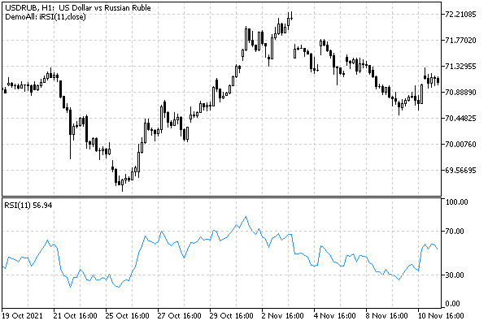

# Combining output to main and auxiliary windows

Let's return to the problem of displaying graphics from one indicator in the main window and in a subwindow, since we encountered it when developing the example UseDemoAllSimple.mq5. There we found out that the indicators intended for a separate window are not suitable for visualization on the main chart, and indicators for the main window do not have additional windows. There are several alternative approaches:

- Implement a parent indicator for a separate window and display charts there and use it in the main window to display data of type [graphic objects](/en/book/applications/objects). This is bad, because data from objects cannot be read the same way as from a timeseries, and many objects consume extra resources.
- Develop your own virtual panel (class) for the main window and, with the correct scale, represent there timeseries which should be displayed in the subwindow.
- Use several indicators, at least one for the main window and one for the subwindow, and exchange data between them via shared memory (DLL required), [resources](/en/book/advanced/resources) or [database](/en/book/advanced/sqlite).
- Duplicate calculations (use common source code) in indicators for the main window and subwindow.

We will present one of the solutions which goes beyond a single MQL program: we need an additional indicator with the indicator_separate_window property. We actually already have it since we create its calculated part by requesting a handle. We only need to somehow display it in a separate subwindow.

In the new (full) version of UseDemoAll.mq5, we will analyze the metadata of the indicator requested to be created in the corresponding IndicatorType enumeration element. Recall that, among other things, the working window of each type of built-in indicator is encoded there. When an indicator requires a separate window, we will create one using special MQL5 functions, which we have yet to learn.

There is no way to get information about the working window for custom indicators. So, let's add the IndicatorCustomSubwindow input variable, in which the user can specify that a subwindow is required.

```
input bool IndicatorCustomSubwindow = false; // Custom Indicator Subwindow

```

In OnInit, we hide the buffers intended for the subwindow.

```
int OnInit()
{
   ...
   const bool subwindow = (IND_WINDOW(IndicatorSelector) > 0)
      || (IndicatorSelector == iCustom_ && IndicatorCustomSubwindow);
   for(int i = 0; i < BUF_NUM; ++i)
   {
      ...
      PlotIndexSetInteger(i, PLOT_DRAW_TYPE,
         i < n && !subwindow ? DrawType : DRAW_NONE);
   }
   ...

```

After this setup, we will have to use a couple of functions that apply not only to working with indicators, but also with charts. We will study them in detail in the corresponding chapter, while an introductory overview is presented in the [previous section](/en/book/applications/indicators_use/indicators_chart_review).

One of the functions ChartIndicatorAdd allows you to add the indicator specified by the handle to the window, and not only to the main part, but also to the subwindow. We will talk about chart identifiers and window numbering in the chapter on [charts](/en/book/applications/charts), and for now it is enough to know that the next ChartIndicatorAdd function call adds an indicator with the handle to the current chart, to a new subwindow.

```
 inthandle = ...// get indicator handle, iCustom or IndicatorCreate
 
                    // set the current chart (0)
                    // |
                    // |     set the window number to the current number of windows
                    // |                          |
                    // |                          | passing the descriptor
                    // |                          |                       |
                    // v                          v                       v
   ChartIndicatorAdd(  0, (int)ChartGetInteger(0, CHART_WINDOWS_TOTAL), handle); 

```

Knowing about this possibility, we can think about calling ChartIndicatorAdd and pass to it the handle of a ready-made subordinate indicator.

The second function we need is ChartIndicatorName. It returns the short name of the indicator by its handle. This name corresponds to the [INDICATOR_SHORTNAME](/en/book/applications/indicators_make/indicators_caption_digits) property set in the indicator code and may differ from the file name. The name will be required to clean up after itself, that is, to remove the auxiliary indicator and its subwindow, after deleting or reconfiguring the parent indicator.

```
string subTitle = "";
   
int OnInit()
{
   ...
   if(subwindow)
   {
      // show a new indicator in the subwindow
      const int w = (int)ChartGetInteger(0, CHART_WINDOWS_TOTAL);
      ChartIndicatorAdd(0, w, Handle);
      // save the name to remove the indicator in OnDeinit
      subTitle = ChartIndicatorName(0, w, 0);
   }
   ...
}

```

In the OnDeinit handler, we use the saved subTitle to call another function which we will study later — ChartIndicatorDelete. It removes the indicator with the name specified in the last argument from the chart.

```
void OnDeinit(const int)
{
   Print(__FUNCSIG__, (StringLen(subTitle) > 0 ? " deleting " + subTitle : ""));
   if(StringLen(subTitle) > 0)
   {
      ChartIndicatorDelete(0, (int)ChartGetInteger(0, CHART_WINDOWS_TOTAL) - 1,
         subTitle);
   }
}

```

It is assumed here that only our indicator works on the chart, and only in a single instance. In a more general case, all subwindows should be analyzed for correct deletion, but this would require a few more functions from those that will be presented in the chapter on [charts](/en/book/applications/charts), so we restrict ourselves to a simple version for the time being.

If now we run UseDemoAll and select an indicator marked with an asterisk (that is, the one that requires a subwindow) from the list, for example, RSI, we will see the expected result: RSI in a separate window.



RSI in the subwindow created by the UseDemoAll indicator
