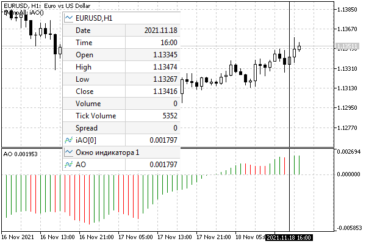
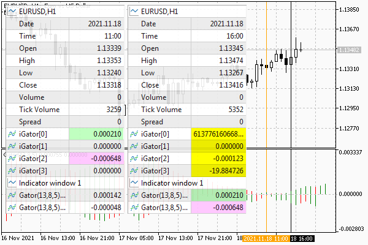
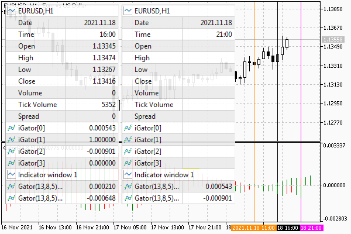

# Reading data from charts that have a shift

Our new indicator UseDemoAll is almost ready. We only need to consider one more point.

In the subordinate indicator, some charts can have an offset set by the [PLOT_SHIFT](/en/book/applications/indicators_make/indicators_plotindexsetinteger) property. For example, with a positive shift, the timeseries elements are shifted into the future and displayed to the right of the bar with index 0. Their indexes, oddly enough, are negative. As you move to the right, the numbers decrease more and more: -1, -2, -3, etc. This addressing also affects the CopyBuffer function. When we use the first form of CopyBuffer, the offset parameter set to 0 refers to the element with the current time in the timeseries. But if the timeseries itself is shifted to the right, we will get data starting from the element numbered N, where N is the shift value in the source indicator. At the same time, the elements located in our buffer to the right of index N will not be filled with data, and "garbage" will remain in them.

To demonstrate the problem, let's start with an indicator without a shift: Awesome Oscillator fits perfectly to this requirement. Recall that UseDemoAll copies all values to its arrays, and although they are not visible on the chart due to different price scales and indicator readings, we can check against Data Window. Wherever we move the mouse cursor on the chart, the indicator values in the subwindow in the Data Window and in UseDemoAll buffers will match. For example, in the image below, you can clearly see that on the hourly bar at 16:00 both values are equal to 0.001797.



AO indicator data in UseDemoAll buffers

Now, in UseDemoAll settings, we select the iGator (Gator Oscillator) indicator. For simplicity, clear the field with Gator parameters, so that it will be built with its default parameters. In this case, the histogram shift is 5 bars (forward), which is clearly seen on the chart.



Gator indicator data in UseDemoAll buffers without correction for future shift

The black vertical line marks the 16:00 hour bar. However, the Gator indicator values in the Data Window and in our arrays read from the same indicator are different. Yellow color UseDemoAll highlights buffers containing garbage.

If we examine the data moving 5 bars into  the past, at 11:00 (orange vertical line), we will find there the values that Gator outputs at 16:00. The pairwise correct values of the upper and lower histograms are highlighted in green and pink, respectively.

To solve this problem, we have to add to UseDemoAll an input variable for the user to specify a chart shift, and then make a correction for it when calling CopyBuffer.

```
input int IndicatorShift = 0; // Plot Shift
...
int OnCalculate(ON_CALCULATE_STD_SHORT_PARAM_LIST)
{
   ...
   for(int k = 0; k < m; ++k)
   {
      const int n = buffers[k].copy(Handle, k,
         -IndicatorShift, rates_total - prev_calculated + 1);
      ...
   }
}

```

Unfortunately, it is impossible to find the PLOT_SHIFT property for a third-party indicator from MQL5.

Let's check how introducing a shift of 5 fixes the situation with the Gator indicator (with default settings).



Gator indicator data in UseDemoAll buffers after adjusting for future shift

Now the readings of UseDemoAll at the 16:00 bar correspond to the actual data from Gator from the virtual future 5 bars ahead (lilac vertical line at 21:00).

You may wonder why only 2 buffers are displayed in the Gator window while our one has 4. The point is that the color histogram of Gator uses one additional buffer for color encoding. But there are only two colors, red and green, and we see them in our arrays as 0 or 1.
