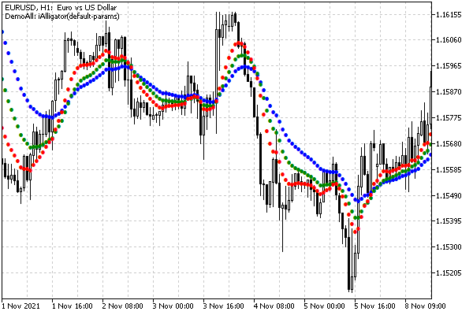

# Deleting indicator instances: IndicatorRelease

As mentioned in the introductory part of this chapter, the terminal maintains a reference counter for each created indicator and leaves it in operation for as long as at least one MQL program or chart uses it. In an MQL program, a sign of the need for an indicator is a valid handle. Usually, we ask for a handle during initialization and use it in algorithms until the end of the program.

At the moment the program is unloaded, all created unique handles are automatically released, that is, their counters are decremented by 1 (and if they reach zero, those indicators are also unloaded from memory). Therefore, there is no need to explicitly release the handle.

However, there are situations when a sub-indicator becomes unnecessary during program operation. Then the useless indicator continues to consume resources. Therefore, you must explicitly release the handle with IndicatorRelease.

bool IndicatorRelease(int handle)

The function deletes the specified indicator handle and unloads the indicator itself if no one else uses it. Unloading occurs with a slight delay.

The function returns an indicator of success (true) or errors (false).

After the call of IndicatorRelease, the handle passed to it becomes invalid, even though the variable itself retains its previous value. An attempt to use such a handle in other indicator functions like CopyBuffer will fail with error 4807 (ERR_INDICATOR_WRONG_HANDLE). To avoid misunderstandings, it is desirable to assign the value INVALID_HANDLE to the corresponding variable immediately after the handle is freed.

However, if the program then requests a handle for a new indicator, that handle will most likely have the same value as the previously released one but will now be associated with the new indicator's data.

When working in the strategy tester, the IndicatorRelease function is not performed.

To demonstrate the application of IndicatorRelease, let's prepare a special version of UseDemoAllLoop.mq5, which will periodically recreate an auxiliary indicator in a cycle from the list, which will include only indicators for the main window (for clarity).

```
IndicatorType MainLoop[] =
{
   iCustom_,
   iAlligator_jawP_jawS_teethP_teethS_lipsP_lipsS_method_price,
   iAMA_period_fast_slow_shift_price,
   iBands_period_shift_deviation_price,
   iDEMA_period_shift_price,
   iEnvelopes_period_shift_method_price_deviation,
   iFractals_,
   iFrAMA_period_shift_price,
   iIchimoku_tenkan_kijun_senkou,
   iMA_period_shift_method_price,
   iSAR_step_maximum,
   iTEMA_period_shift_price,
   iVIDyA_momentum_smooth_shift_price,
};
   
const int N = ArraySize(MainLoop);
int Cursor = 0; // current position inside the MainLoop array
      
const string IndicatorCustom = "LifeCycle";

```

The first element of the array contains one custom indicator as an exception, LifeCycle from the section [Features of starting and stopping programs](/en/book/applications/runtime/runtime_lifecycle) of different types. Although this indicator does not display any lines, it is appropriate here because it displays messages in the log when its OnInit/OnDeinit handlers are called, which will allow you to track its life cycle. Life cycles of other indicators are similar.

In the input variables, we will leave only the rendering settings. The default output of DRAW_ARROW labels is optimal for displaying different types of indicators.

```
input ENUM_DRAW_TYPE DrawType = DRAW_ARROW; // Drawing Type
input int DrawLineWidth = 1; // Drawing Line Width

```

To recreate indicators "on the go", let's run 5 second [timer](/en/book/applications/timer) in OnInit, and the entire previous initialization (with some modifications described below) will be moved to the OnTimer handler.

```
int OnInit()
{
   Comment("Wait 5 seconds to start looping through indicator set");
   EventSetTimer(5);
   return INIT_SUCCEEDED;
}
   
IndicatorType IndicatorSelector; // currently selected indicator type
   
void OnTimer()
{
   if(Handle != INVALID_HANDLE && ClearHandles)
   {
      IndicatorRelease(Handle);
      /*
      // descriptor is still 10, but is no longer valid
      // if we uncomment the fragment, we get the following error
      double data[1];
      const int n = CopyBuffer(Handle, 0, 0, 1, data);
      Print("Handle=", Handle, " CopyBuffer=", n, " Error=", _LastError);
      // Handle=10 CopyBuffer=-1 Error=4807 (ERR_INDICATOR_WRONG_HANDLE)
      */
   }
   IndicatorSelector = MainLoop[Cursor];
   Cursor = ++Cursor % N;
   
   // create a handle with default parameters
   // (because we pass an empty string in the third argument of the constructor)
   AutoIndicator indicator(IndicatorSelector,
      (IndicatorSelector == iCustom_ ? IndicatorCustom : ""), "");
   Handle = indicator.getHandle();
   if(Handle == INVALID_HANDLE)
   {
      Print(StringFormat("Can't create indicator: %s",
         _LastError ? E2S(_LastError) : "The name or number of parameters is incorrect"));
   }
   else
   {
      Print("Handle=", Handle);
   }
   
   buffers.empty(); // clear buffers because a new indicator will be displayed
   ChartSetSymbolPeriod(0,NULL,0); // request a full redraw
   ...
   // further setup of diagrams - similar to the previous one
   ...
   Comment("DemoAll: ", (IndicatorSelector == iCustom_ ? IndicatorCustom : s),
      "(default-params)");
}

```

The main difference is that the type of the currently created indicator IndicatorSelector now it is not set by the user but is sequentially selected from the MainLoop array at the Cursor index. Each time the timer is called, this index increases cyclically, that is, when the end of the array is reached, we jump to its beginning.

For all indicators, the line with parameters is empty. This is done to unify their initialization. As a result, each indicator will be created with its own defaults.

At the beginning of the OnTimer handler, we call IndicatorRelease for the previous handle. However, we have provided an input variable ClearHandles to disable the given if operator branch and see what happens if you do not clean the handles.

```
input bool ClearHandles = true;

```

By default, ClearHandles is equal to true, that is, the indicators will be deleted as expected.

Finally, another additional setting is the lines with clearing buffers and requesting a complete redrawing of the chart. Both are needed, because we have replaced the slave indicator that supplies the displayed data.

The OnCalculate handler has not changed.

Let's run UseDemoAllLoop with default settings. The following entries will appear in the log (only the beginning is shown):

```
UseDemoAllLoop (EURUSD,H1) Initializing LifeCycle() EURUSD, PERIOD_H1
UseDemoAllLoop (EURUSD,H1) Handle=10
LifeCycle      (EURUSD,H1) Loader::Loader()
LifeCycle      (EURUSD,H1) void OnInit() 0 DEINIT_REASON_PROGRAM
UseDemoAllLoop (EURUSD,H1) Initializing iAlligator_jawP_jawS_teethP_teethS_lipsP_lipsS_method_price() EURUSD, PERIOD_H1
UseDemoAllLoop (EURUSD,H1) iAlligator_jawP_jawS_teethP_teethS_lipsP_lipsS_method_price requires 8 parameters, 0 given
UseDemoAllLoop (EURUSD,H1) Handle=10
LifeCycle      (EURUSD,H1) void OnDeinit(const int) DEINIT_REASON_REMOVE
LifeCycle      (EURUSD,H1) Loader::~Loader()
UseDemoAllLoop (EURUSD,H1) Initializing iAMA_period_fast_slow_shift_price() EURUSD, PERIOD_H1
UseDemoAllLoop (EURUSD,H1) iAMA_period_fast_slow_shift_price requires 5 parameters, 0 given
UseDemoAllLoop (EURUSD,H1) Handle=10
UseDemoAllLoop (EURUSD,H1) Initializing iBands_period_shift_deviation_price() EURUSD, PERIOD_H1
UseDemoAllLoop (EURUSD,H1) iBands_period_shift_deviation_price requires 4 parameters, 0 given
UseDemoAllLoop (EURUSD,H1) Handle=10
...

```

Note that we get the same handle "number" (10) every time because we free it before creating a new handle.

It is also important that the LifeCycle indicator unloaded shortly after we freed it (assuming it was not added to the same chart by itself, because then its reference count would not be reset to zero).

The image below shows the moment when our indicator renders Alligator data.



UseDemoAllLoop in the Alligator demo step

If you change the ClearHandles value to false, we will see a completely different picture in the log. Handle numbers will now constantly increase, indicating that the indicators remain in the terminal and continue to work, consuming resources in vain. In particular, no deinitialization message is received from the LifeCycle indicator.

```
UseDemoAllLoop (EURUSD,H1) Initializing LifeCycle() EURUSD, PERIOD_H1
UseDemoAllLoop (EURUSD,H1) Handle=10
LifeCycle      (EURUSD,H1) Loader::Loader()
LifeCycle      (EURUSD,H1) void OnInit() 0 DEINIT_REASON_PROGRAM
UseDemoAllLoop (EURUSD,H1) Initializing iAlligator_jawP_jawS_teethP_teethS_lipsP_lipsS_method_price() EURUSD, PERIOD_H1
UseDemoAllLoop (EURUSD,H1) iAlligator_jawP_jawS_teethP_teethS_lipsP_lipsS_method_price requires 8 parameters, 0 given
UseDemoAllLoop (EURUSD,H1) Handle=11
UseDemoAllLoop (EURUSD,H1) Initializing iAMA_period_fast_slow_shift_price() EURUSD, PERIOD_H1
UseDemoAllLoop (EURUSD,H1) iAMA_period_fast_slow_shift_price requires 5 parameters, 0 given
UseDemoAllLoop (EURUSD,H1) Handle=12
UseDemoAllLoop (EURUSD,H1) Initializing iBands_period_shift_deviation_price() EURUSD, PERIOD_H1
UseDemoAllLoop (EURUSD,H1) iBands_period_shift_deviation_price requires 4 parameters, 0 given
UseDemoAllLoop (EURUSD,H1) Handle=13
UseDemoAllLoop (EURUSD,H1) Initializing iDEMA_period_shift_price() EURUSD, PERIOD_H1
UseDemoAllLoop (EURUSD,H1) iDEMA_period_shift_price requires 3 parameters, 0 given
UseDemoAllLoop (EURUSD,H1) Handle=14
UseDemoAllLoop (EURUSD,H1) Initializing iEnvelopes_period_shift_method_price_deviation() EURUSD, PERIOD_H1
UseDemoAllLoop (EURUSD,H1) iEnvelopes_period_shift_method_price_deviation requires 5 parameters, 0 given
UseDemoAllLoop (EURUSD,H1) Handle=15
...
UseDemoAllLoop (EURUSD,H1) Initializing iVIDyA_momentum_smooth_shift_price() EURUSD, PERIOD_H1
UseDemoAllLoop (EURUSD,H1) iVIDyA_momentum_smooth_shift_price requires 4 parameters, 0 given
UseDemoAllLoop (EURUSD,H1) Handle=22
UseDemoAllLoop (EURUSD,H1) Initializing LifeCycle() EURUSD, PERIOD_H1
UseDemoAllLoop (EURUSD,H1) Handle=10
UseDemoAllLoop (EURUSD,H1) Initializing iAlligator_jawP_jawS_teethP_teethS_lipsP_lipsS_method_price() EURUSD, PERIOD_H1
UseDemoAllLoop (EURUSD,H1) iAlligator_jawP_jawS_teethP_teethS_lipsP_lipsS_method_price requires 8 parameters, 0 given
UseDemoAllLoop (EURUSD,H1) Handle=11
UseDemoAllLoop (EURUSD,H1) Initializing iAMA_period_fast_slow_shift_price() EURUSD, PERIOD_H1
UseDemoAllLoop (EURUSD,H1) iAMA_period_fast_slow_shift_price requires 5 parameters, 0 given
UseDemoAllLoop (EURUSD,H1) Handle=12
UseDemoAllLoop (EURUSD,H1) Initializing iBands_period_shift_deviation_price() EURUSD, PERIOD_H1
UseDemoAllLoop (EURUSD,H1) iBands_period_shift_deviation_price requires 4 parameters, 0 given
UseDemoAllLoop (EURUSD,H1) Handle=13
UseDemoAllLoop (EURUSD,H1) Initializing iDEMA_period_shift_price() EURUSD, PERIOD_H1
UseDemoAllLoop (EURUSD,H1) iDEMA_period_shift_price requires 3 parameters, 0 given
UseDemoAllLoop (EURUSD,H1) Handle=14
UseDemoAllLoop (EURUSD,H1) void OnDeinit(const int)
...

```

When the index in the loop over the array of indicator types reaches the last element and circles from the beginning, the terminal will start returning handles of already existing indicators to our code (the same values: handle 22 is followed by 10 again).
