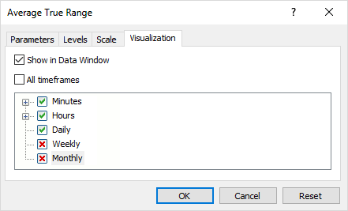

# Getting the number and visibility of windows/subwindows

Using the ChartGetInteger function, an MQL program can find the number of windows on a chart (including subwindows), as well as their visibility.

| Identifier | Description | Value type |
| --- | --- | --- |
| CHART_WINDOWS_TOTAL | Total number of chart windows, including indicator subwindows (r/o) | int |
| CHART_WINDOW_IS_VISIBLE | Subwindow visibility, the 'window' parameter is the subwindow number (r/o) | bool |

Some subwindows can be hidden if the indicators placed in them are disabled on the current timeframe in the Properties dialog, on the Visualization tab. It is impossible to reset all flags: due to the nature of storage of [tpl templates](/en/book/applications/charts/charts_tpl), such a state is interpreted as the enabling of all timeframes. Therefore, if the user wants to hide the subwindow for some time, it is necessary to leave at least one enabled flag on the most rarely used timeframe.



Setting indicator visibility on different timeframes

It should be noted that there are no standard tools in MQL5 for programmatic determination of the state and switching of specific flags. The easiest way to simulate such control is to save the tpl template and analyze it, with possible subsequent editing and loading (see section [Working with tpl templates](/en/book/applications/charts/charts_tpl)).

In the new version of the script ChartList4.mq5, we output the number of subwindows (one window, which is the main one, is always present), a sign of chart activity, a sign of a chart object, and a Windows handle.

```
      const int win = (int)ChartGetInteger(id, CHART_WINDOWS_TOTAL);
      const string header = StringFormat("%d %lld %s %s %s %s %s %s %lld",
         count, id, ChartSymbol(id), PeriodToString(ChartPeriod(id)),
         (win > 1 ? "#" + (string)(win - 1) : ""), (id == me ? " *" : ""),
         (ChartGetInteger(id, CHART_BRING_TO_TOP, 0) ? "active" : ""),
         (ChartGetInteger(id, CHART_IS_OBJECT) ? "object" : ""),
         ChartGetInteger(id, CHART_WINDOW_HANDLE));
      ...
      for(int i = 0; i < win; i++)
      {
         const bool visible = ChartGetInteger(id, CHART_WINDOW_IS_VISIBLE, i);
         if(!visible)
         {
            Print("  ", i, "/Hidden");
         }
      }

```

Here's what the result might be.

```
Chart List
N, ID, Symbol, TF, #subwindows, *active, Windows handle
0 132358585987782873 EURUSD M15 #1    68030
1 132360375330772909 EURUSD H1  * active  68048
 [S] ChartList4
2 132544239145024745 XAUUSD H1     395756
3 132544239145024732 USDRUB D1     395768
4 132544239145024744 EURUSD H1 #2    461286
  2/Hidden
Total chart number: 5, with MQL-programs: 1
Experts: 0, Scripts: 1

```

On the first chart (index 0) there is one subwindow (#1). There are two subwindows (#2) on the last chart, and the second one is currently hidden. Later, in the section [Managing indicators on the chart](/en/book/applications/charts/charts_indicators), we will present the full version of ChartList.mq5, where we include in the report information about the indicators located in the subwindows and the main window.

Attention! A chart inside a [chart object](/en/book/applications/objects/objects_chart) always has the CHART_WINDOW_IS_VISIBLE property equal to true, even if object visualization is disabled on the current timeframe or on all timeframes.
