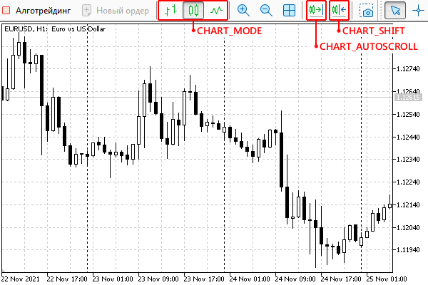

# Chart display modes

Four properties from the ENUM_CHART_PROPERTY_INTEGER enumeration describe chart display modes. All these properties are available for reading through ChartGetInteger, and for recording through ChartSetInteger, which allows you to change the appearance of the chart.

| Identifier | Description | Value type |
| --- | --- | --- |
| CHART_MODE | Chart type (candles, bars, or line) | ENUM_CHART_MODE |
| CHART_FOREGROUND | Price chart in the foreground | bool |
| CHART_SHIFT | Price chart indent mode from the right edge | bool |
| CHART_AUTOSCROLL | Automatic scrolling to the right edge of the chart | bool |

There is a special enumeration ENUM_CHART_MODE for the CHART_MODE mode in MQL5. Its elements are shown in the following table.

| Identifier | Description | Value |
| --- | --- | --- |
| CHART_BARS | Display as bars | 0 |
| CHART_CANDLES | Display as Japanese candlesticks | 1 |
| CHART_LINE | Display as a line drawn at Close prices | 2 |

Let's implement the script ChartMode.mq5, which will monitor the state of the modes and print messages to the log when changes are detected. Since the property processing algorithms are of a general nature, we will put them in a separate header file ChartModeMonitor.mqh, which we will then connect to different tests.

Let's lay the foundation in an abstract class ChartModeMonitorInterface: it provides overloaded get- and set- methods for all types. Derived classes will have to directly check the properties to the required extent by overriding the virtual method snapshot.

```
class ChartModeMonitorInterface
{
public:
   long get(const ENUM_CHART_PROPERTY_INTEGER property, const int window = 0)
   {
      return ChartGetInteger(0, property, window);
   }
   double get(const ENUM_CHART_PROPERTY_DOUBLE property, const int window = 0)
   {
      return ChartGetDouble(0, property, window);
   }
   string get(const ENUM_CHART_PROPERTY_STRING property)
   {
      return ChartGetString(0, property);
   }
   bool set(const ENUM_CHART_PROPERTY_INTEGER property, const long value, const int window = 0)
   {
      return ChartSetInteger(0, property, window, value);
   }
   bool set(const ENUM_CHART_PROPERTY_DOUBLE property, const double value)
   {
      return ChartSetDouble(0, property, value);
   }
   bool set(const ENUM_CHART_PROPERTY_STRING property, const string value)
   {
      return ChartSetString(0, property, value);
   }
   
   virtual void snapshot() = 0;
   virtual void print() { };
   virtual void backup() { }
   virtual void restore() { }
};

```

The class also has reserved methods: print, for example, to output to a log, backup to save the current state, and restore to recover it. They are declared not abstract, but with an empty implementation, since they are optional.

It makes sense to define certain classes for properties of different types as a single template inherited from ChartModeMonitorInterface and accepting parametric value (T) and enumeration (E) types. For example, for integer properties, you would need to set T=long and E=ENUM_CHART_PROPERTY_INTEGER.

The object contains the data array to store [key,value] pairs with all requested properties. It has a generic type MapArray<K,V>, which we introduced earlier for the indicator IndUnityPercent in the chapter [Multicurrency and multitimeframe indicators](/en/book/applications/indicators_make/indicators_multisymbol). Its peculiarity lies in the fact that in addition to the usual access to array elements by numbers, addressing by key can be used.

To fill the array, an array of integers is passed to the constructor, while the integers are first checked for compliance with the identifiers of the given enumeration E using the detect method. All correct properties are immediately read through the get call, and the resulting values are stored in the map along with their identifiers.

```
#include <MQL5Book/MapArray.mqh>
   
template<typename T,typename E>
class ChartModeMonitorBase: public ChartModeMonitorInterface
{
protected:
   MapArray<E,T> data; // array-map of pairs [property, value]
   
   // the method checks if the passed constant is an enumeration element,
   // and if it is, then add it to the map array
   bool detect(const int v)
   {
      ResetLastError();
      EnumToString((E)v); // resulting string is not used
      if(_LastError == 0) // it only matters if there is an error or not
      {
         data.put((E)v, get((E)v));
         return true;
      }
      return false;
   }
 
public:
   ChartModeMonitorBase(int &flags[])
   {
      for(int i = 0; i < ArraySize(flags); ++i)
      {
         detect(flags[i]);
      }
   }
   
   virtual void snapshot() override
   {
      MapArray<E,T> temp;
      // collect the current state of all properties
      for(int i = 0; i < data.getSize(); ++i)
      {
         temp.put(data.getKey(i), get(data.getKey(i)));
      }
      
      // compare with previous state, display differences
      for(int i = 0; i < data.getSize(); ++i)
      {
         if(data[i] != temp[i])
         {
            Print(EnumToString(data.getKey(i)), " ", data[i], " -> ", temp[i]);
         }
      }
      
      // save for next comparison
      data = temp;
   }
   ...
};

```

The snapshot method iterates through all the elements of the array and requests the value for each property. Since we want to detect changes, the new data is first stored in a temporary map array temp. Then arrays data and temp are compared element by element, and for each difference, a message is displayed with the name of the property, its old and new value. This simplified example uses only the journal. However, if necessary, the program can call some application functions that adapt the behavior to the environment.

Methods print, backup, and restore are implemented as simply as possible.

```
template<typename T,typename E>
class ChartModeMonitorBase: public ChartModeMonitorInterface
{
protected:
   ...
   MapArray<E,T> store; // backup
public:
   ...
   virtual void print() override
   {
      data.print();
   }
   virtual void backup() override
   {
      store = data;
   }
   
   virtual void restore() override
   {
      data = store;
      // restore chart properties
      for(int i = 0; i < data.getSize(); ++i)
      {
         set(data.getKey(i), data[i]);
      }
   }

```

A combination of methods backup/restore allows you to save the state of the chart before starting experiments with it, and after the completion of the test script, restore everything as it was.

Finally, the last class in the file ChartModeMonitor.mqh is ChartModeMonitor. It combines three instances of ChartModeMonitorBase, created for the available combinations of property types. They have an array of m pointers to the base interface ChartModeMonitorInterface. The class itself is also derived from it.

```
#include <MQL5Book/AutoPtr.mqh>
   
#define CALL_ALL(A,M) for(int i = 0, size = ArraySize(A); i < size; ++i) A[i][].M
   
class ChartModeMonitor: public ChartModeMonitorInterface
{
   AutoPtr<ChartModeMonitorInterface> m[3];
   
public:
   ChartModeMonitor(int &flags[])
   {
      m[0] = new ChartModeMonitorBase<long,ENUM_CHART_PROPERTY_INTEGER>(flags);
      m[1] = new ChartModeMonitorBase<double,ENUM_CHART_PROPERTY_DOUBLE>(flags);
      m[2] = new ChartModeMonitorBase<string,ENUM_CHART_PROPERTY_STRING>(flags);
   }
   
   virtual void snapshot() override
   {
      CALL_ALL(m, snapshot());
   }
   
   virtual void print() override
   {
      CALL_ALL(m, print());
   }
   
   virtual void backup() override
   {
      CALL_ALL(m, backup());
   }
   
   virtual void restore() override
   {
      CALL_ALL(m, restore());
   }
};

```

To simplify the code, the CALL_ALL macro is used here, which calls the specified method for all objects from the array, and does this taking into account the overloaded operator [] in the class AutoPtr (it is used to dereference a smart pointer and get a direct pointer to the "protected" object).

The destructor is usually responsible for freeing objects, but in this case, it was decided to use the AutoPtr array (this class was discussed in the section [Object type templates](/en/book/oop/templates/templates_objects)). This guarantees the automatic deletion of dynamic objects when the m array is freed normally.

A more complete version of the monitor with support for subwindow numbers is provided in the file ChartModeMonitorFull.mqh.

Based on the ChartModeMonitor class, you can easily implement the intended script ChartMode.mq5. Its task is to check the state of a given set of properties every half a second. Now we are using an infinite loop and Sleep here, but soon we will learn how to react to events on the charts in a different way: due to notifications from the terminal.

```
#include <MQL5Book/ChartModeMonitor.mqh>
   
void OnStart()
{
   int flags[] =
   {
      CHART_MODE, CHART_FOREGROUND, CHART_SHIFT, CHART_AUTOSCROLL
   };
   ChartModeMonitor m(flags);
   Print("Initial state:");
   m.print();
   m.backup();
   
   while(!IsStopped())
   {
      m.snapshot();
      Sleep(500);
   }
   m.restore();
}

```

Run the script on any chart and try to change modes using the tool buttons. This way you can access all elements except for CHART_FOREGROUND, which can be switched from the properties dialog (the Common tab, flag Chart on top).



Toolbar buttons for switching chart modes

For example, the following log was created by switching the display from candles to bars, from bars to lines, and back to candles, and then enabling indentation and auto-scrolling to the beginning.

```
Initial state:
    [key] [value]
[0]     0       1
[1]     1       0
[2]     2       0
[3]     4       0
CHART_MODE 1 -> 0
CHART_MODE 0 -> 2
CHART_MODE 2 -> 1
CHART_SHIFT 0 -> 1
CHART_AUTOSCROLL 0 -> 1

```

A more practical example of using the CHART_MODE property is an improved version of the indicator IndSubChart.mq5 (we discussed its simplified version IndSubChartSimple.mq5 in the section [Multicurrency and multitimeframe indicators](/en/book/applications/indicators_make/indicators_multisymbol)). The indicator is designed to display quotes of a third-party symbol in a subwindow, and earlier we had to request a display method (candles, bars, or lines) from the user through an input parameter. Now the parameter is no longer needed because we can automatically switch the indicator to the mode that is used in the main window.

The current mode is stored in the global variable mode and is assigned first during initialization.

```
ENUM_CHART_MODE mode = 0;
   
int OnInit()
{
   ...
   mode = (ENUM_CHART_MODE)ChartGetInteger(0, CHART_MODE);
   ...
}

```

Detection of a new mode is best done in a specially designed event handler OnChartEvent, which we will study in a separate [chapter](/en/book/applications/events). At this stage, it is important to know that with any change in the chart, the MQL program can receive notifications from the terminal if the code describes a function with this predefined prototype (name and list of parameters). In particular, its first parameter contains an event identifier that describes its meaning. We are still interested in the chart itself, and so we check if eventId is equal to CHARTEVENT_CHART_CHANGE. This is necessary because the handler is also capable of tracking graphical objects, keyboard, mouse, and arbitrary user messages.

```
void OnChartEvent(const int eventId,
                 // parameters not used here
                  const long &, const double &, const string &)
{
   if(eventId == CHARTEVENT_CHART_CHANGE)
   {
      const ENUM_CHART_MODE newmode = (ENUM_CHART_MODE)ChartGetInteger(0, CHART_MODE);
      if(mode != newmode)
      {
         const ENUM_CHART_MODE oldmode = mode;
         mode = newmode;
         // change buffer bindings and rendering type on the go
         InitPlot(0, InitBuffers(mode), Mode2Style(mode));
         // TODO: we will auto-adjust colors later
         // SetPlotColors(0, mode);
         if(oldmode == CHART_LINE || newmode == CHART_LINE)
         {
            // switching to or from CHART_LINE mode requires updating the entire chart,
            // because the number of buffers changes
            Print("Refresh");
            ChartSetSymbolPeriod(0, _Symbol, _Period);
         }
         else
         {
           // when switching between candles and bars, it is enough
           // just redraw the chart in a new manner,
           // because data doesn't change (previous 4 buffers with values)
            Print("Redraw");
            ChartRedraw();
         }
      }
   }
}

```

You can test the new indicator yourself by running it on the chart and switching the drawing methods.

These are not all the improvements made in IndSubChart.mq5. A little later, in the section on [chart colors](/en/book/applications/charts/charts_color), we will show the automatic adjustment of graphics to the chart color scheme.
