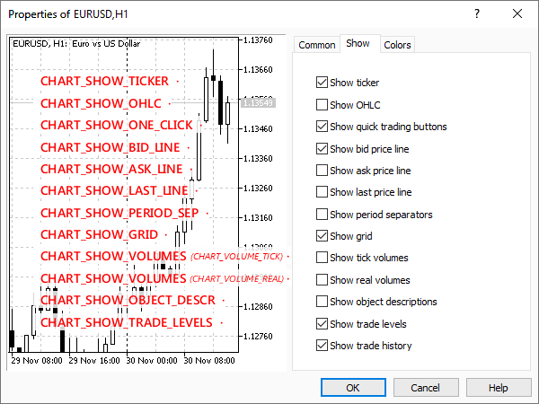

# Managing the visibility of chart elements

A large set of properties in ENUM_CHART_PROPERTY_INTEGER controls the visibility of chart elements. Almost all of them are of boolean type: true corresponds to showing the element, and false corresponds to hiding it. The exception is CHART_SHOW_VOLUMES, which uses the ENUM_CHART_VOLUME_MODE enumeration (see below).

| Identifier | Description | Value type |
| --- | --- | --- |
| CHART_SHOW | General price chart display. If set to false, then rendering of any price chart attributes is disabled and all padding along the chart edges is eliminated: time and price scales, quick navigation bar, calendar event markers, trade icons, indicator and bar tooltips, indicator subwindows, volume histograms, etc. | bool |
| CHART_SHOW_TICKER | Show symbol ticker in the upper left corner. Disabling the ticker automatically disables OHLC (CHART_SHOW_OHLC) | bool |
| CHART_SHOW_OHLC | Show the OHLC values in the upper left corner. Enabling OHLC automatically enables the ticker (CHART_SHOW_TICKER) | bool |
| CHART_SHOW_BID_LINE | Show the Bid value as a horizontal line | bool |
| CHART_SHOW_ASK_LINE | Show the Ask value as a horizontal line | bool |
| CHART_SHOW_LAST_LINE | Show the Last value as a horizontal line | bool |
| CHART_SHOW_PERIOD_SEP | Show vertical separators between adjacent periods | bool |
| CHART_SHOW_GRID | Show grid on the chart | bool |
| CHART_SHOW_VOLUMES | Show volumes on a chart | ENUM_CHART_VOLUME_MODE |
| CHART_SHOW_OBJECT_DESCR | Show text descriptions of objects (descriptions are not shown for all types of objects) | bool |
| CHART_SHOW_TRADE_LEVELS | Show trading levels on the chart (levels of open positions, Stop Loss, Take Profit and pending orders) | bool |
| CHART_SHOW_DATE_SCALE | Show the date scale on the chart | bool |
| CHART_SHOW_PRICE_SCALE | Show the price scale on the chart | bool |
| CHART_SHOW_ONE_CLICK | Show the quick trading panel on the chart ("One click trading" option) | bool |



Flags in the settings dialog for some ENUM_CHART_PROPERTY_INTEGER properties

Some of these properties are available for the user from the chart context menu, while some are only available from the settings dialog. There are also settings that can only be changed from MQL5, in particular, the display of the vertical (CHART_SHOW_DATE_SCALE) and horizontal (CHART_SHOW_DATE_SCALE) scales, as well as the visibility of the entire chart (CHART_SHOW). The last case should be especially noted, because turning off rendering is the ideal solution for creating your own program interface using [graphical resources](/en/book/advanced/resources) and [graphical objects](/en/book/applications/objects), which are always rendered, regardless of the value of CHART_SHOW.

The book comes with the script ChartBlackout.mq5, which toggles CHART_SHOW mode from current to reverse on every run.

```
void OnStart()
{
   ChartSetInteger(0, CHART_SHOW, !ChartGetInteger(0, CHART_SHOW));
}

```

Thus, you can apply it on a normal chart to completely clear the window, and then apply it again to restore the previous appearance.

The aforementioned ENUM_CHART_VOLUME_MODE enumeration contains the following members.

| Identifier | Description | Value |
| --- | --- | --- |
| CHART_VOLUME_HIDE | Volumes are hidden | 0 |
| CHART_VOLUME_TICK | Tick volumes | 1 |
| CHART_VOLUME_REAL | Trading volumes (if any) | 2 |

Similar to the script ChartMode.mq5, we implement a visibility monitor for chart elements in the script ChartElements.mq5. The main difference lies in the different sets of controlled flags.

```
void OnStart()
{
   int flags[] =
   {
      CHART_SHOW,
      CHART_SHOW_TICKER, CHART_SHOW_OHLC,
      CHART_SHOW_BID_LINE, CHART_SHOW_ASK_LINE, CHART_SHOW_LAST_LINE,
      CHART_SHOW_PERIOD_SEP, CHART_SHOW_GRID,
      CHART_SHOW_VOLUMES,
      CHART_SHOW_OBJECT_DESCR,
      CHART_SHOW_TRADE_LEVELS,
      CHART_SHOW_DATE_SCALE, CHART_SHOW_PRICE_SCALE,
      CHART_SHOW_ONE_CLICK
   };
   ...

```

In addition, after creating a backup of the settings, we intentionally disable the time scales and prices programmatically (when the script ends, it will restore them from the backup).

```
   ...
   m.backup();
   
   ChartSetInteger(0, CHART_SHOW_DATE_SCALE, false); 
   ChartSetInteger(0, CHART_SHOW_PRICE_SCALE, false);
   ... 
}

```

The following is a fragment of the log with comments about the actions taken. The first two entries appeared exactly because the scales were disabled in the MQL code after the initial backup was created.

```
CHART_SHOW_DATE_SCALE 1 -> 0 // disabled the time scale in the MQL5 code
CHART_SHOW_PRICE_SCALE 1 -> 0 // disabled the price scale in the MQL5 code
CHART_SHOW_ONE_CLICK 0 -> 1 // disabled "One click trading"
CHART_SHOW_GRID 1 -> 0 // disable "Grid"
CHART_SHOW_VOLUMES 0 -> 2 // showed real "Volumes"
CHART_SHOW_VOLUMES 2 -> 1 // showed "Tick volumes"
CHART_SHOW_TRADE_LEVELS 1 -> 0 // disabled "Trade levels"

```
