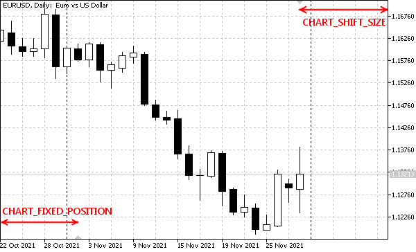

# Horizontal shifts

Another nuance of displaying charts is the horizontal indents from the left and right edges. They work slightly differently but are described in the same enumeration ENUM_CHART_PROPERTY_DOUBLE and use the type double.

| Identifier | Description |
| --- | --- |
| CHART_SHIFT_SIZE | The indent of the zero bar from the right edge in percentages (from 10 to 50). Active only when the CHART_SHIFT mode is on. The shift is indicated on the chart by a small inverted gray triangle on the top frame, on the right side of the window. |
| CHART_FIXED_POSITION | The location of the fixed position of the chart from the left edge in percent (from 0 to 100). A fixed chart position is indicated by a small gray triangle on the horizontal time axis and is shown only if automatic scrolling to the right when a new tick arrives is disabled (CHART_AUTOCROLL). A bar that is in a fixed position stays in the same place when you zoom in and out. By default, the triangle is in the very corner of the chart (bottom left). |



Visual representation of horizontal padding properties

We have the ChartShifts.mq5 script to check access to these properties, which works similarly to ChartMode.mq5 and differs only in the set of controlled properties.

```
void OnStart()
{
   int flags[] =
   {
      CHART_SHIFT_SIZE, CHART_FIXED_POSITION
   };
   ChartModeMonitor m(flags);
   ...
}

```

Dragging a fixed position label (lower left) with the mouse results in this logging output.

```
Initial state:
    [key]  [value]
[0]     3 21.78771
[1]    41 17.87709
CHART_FIXED_POSITION 17.87709497206704 -> 26.53631284916201
CHART_FIXED_POSITION 26.53631284916201 -> 27.93296089385475
CHART_FIXED_POSITION 27.93296089385475 -> 28.77094972067039
CHART_FIXED_POSITION 28.77094972067039 -> 50.0

```
