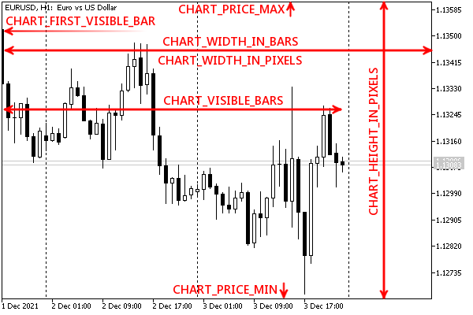

# Horizontal scale (by time)

To determine the scale and number of bars along the horizontal axis, use the group of integer properties from ENUM_CHART_PROPERTY_INTEGER. Among them, only CHART_SCALE is editable.

| Identifier | Description |
| --- | --- |
| CHART_SCALE | Scale (0 to 5) |
| CHART_VISIBLE_BARS | Number of bars currently visible on the chart (can be less than CHART_WIDTH_IN_BARS due to CHART_SHIFT_SIZE indent) (r/o) |
| CHART_FIRST_VISIBLE_BAR | Number of the first visible bar on the chart. The numbering goes from right to left, as in a timeseries. (r/o) |
| CHART_WIDTH_IN_BARS | Chart width in bars (potential capacity, extreme bars on the left and right may be partially visible) (r/o) |
| CHART_WIDTH_IN_PIXELS | Chart width in pixels (r/o) |



ENUM_CHART_PROPERTY_INTEGER properties on a chart

We are all ready to implement the next test script ChartScaleTime.mq5, which allows you to analyze changes in these properties.

```
void OnStart()
{
   int flags[] =
   {
      CHART_SCALE,
      CHART_VISIBLE_BARS,
      CHART_FIRST_VISIBLE_BAR,
      CHART_WIDTH_IN_BARS,
      CHART_WIDTH_IN_PIXELS
   };
   ChartModeMonitor m(flags);
   ...
}

```

Below is a part of the log with comments about the actions taken.

```
Initial state:
    [key] [value]
[0]     5       4
[1]   100      35
[2]   104      34
[3]   105      45
[4]   106     715
                                 // 1) changed the scale to a smaller one:
CHART_SCALE 4 -> 3              // - the value of the "scale" property has changed
CHART_VISIBLE_BARS 35 -> 69        // - increased the number of visible bars
CHART_FIRST_VISIBLE_BAR 34 -> 68 // - the number of the first visible bar has increased
CHART_WIDTH_IN_BARS 45 -> 90 // - increased the potential number of bars
                                 // 2) disabled padding at the right edge
CHART_VISIBLE_BARS 69 -> 89 // - the number of visible bars has increased
CHART_FIRST_VISIBLE_BAR 68 -> 88 // - the number of the first visible bar has increased
                                 // 3) reduced the window size
CHART_VISIBLE_BARS 89 -> 86 // - number of visible bars decreased
CHART_WIDTH_IN_BARS 90 -> 86 // - the potential number of bars has decreased
CHART_WIDTH_IN_PIXELS 715 -> 680 // - decreased width in pixels
                                 // 4) clicked the "End" button to move to the current time
CHART_VISIBLE_BARS 86 -> 85 // - number of visible bars decreased
CHART_FIRST_VISIBLE_BAR 88 -> 84 // - the number of the first visible bar has decreased

```
