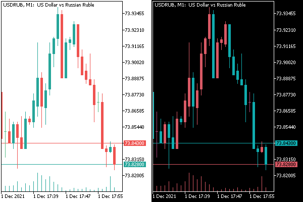

# Colors

An MQL program can recognize and change colors to display all chart elements. The corresponding properties are part of the ENUM_CHART_PROPERTY_INTEGER enumeration.

| Identifier | Description |
| --- | --- |
| CHART_COLOR_BACKGROUND | Chart background color |
| CHART_COLOR_FOREGROUND | Color of axes, scales, and OHLC lines |
| CHART_COLOR_GRID | Grid color |
| CHART_COLOR_VOLUME | Color of volumes and position opening levels |
| CHART_COLOR_CHART_UP | The color of the up bar, the shadow, and the edging of the body of a bullish candle |
| CHART_COLOR_CHART_DOWN | The color of the down bar, the shadow, and the edging of the body of a bearish candle |
| CHART_COLOR_CHART_LINE | The color of the chart line and of the contours of Japanese candlesticks |
| CHART_COLOR_CANDLE_BULL | Bullish candlestick body color |
| CHART_COLOR_CANDLE_BEAR | Bearish candlestick body color |
| CHART_COLOR_BID | Bid price line color |
| CHART_COLOR_ASK | Ask price line color |
| CHART_COLOR_LAST | Color of the last traded price line (Last) |
| CHART_COLOR_STOP_LEVEL | Color of stop order levels (Stop Loss and Take Profit) |

As an example of working with these properties, let's create a script — ChartColorInverse.mq5. It will change all the colors of the graph to inverse, that is, for the bit representation of the color in the format [RGB](/en/book/basis/builtin_types/colors) XOR ('^',[XOR](/en/book/basis/expressions/operators_bitwise)). Thus, after restarting the script on the same chart, its settings will be restored.

```
#define RGB_INVERSE(C) ((color)C ^ 0xFFFFFF)
   
void OnStart()
{
   ENUM_CHART_PROPERTY_INTEGER colors[] =
   {
      CHART_COLOR_BACKGROUND,
      CHART_COLOR_FOREGROUND,
      CHART_COLOR_GRID,
      CHART_COLOR_VOLUME,
      CHART_COLOR_CHART_UP,
      CHART_COLOR_CHART_DOWN,
      CHART_COLOR_CHART_LINE,
      CHART_COLOR_CANDLE_BULL,
      CHART_COLOR_CANDLE_BEAR,
      CHART_COLOR_BID,
      CHART_COLOR_ASK,
      CHART_COLOR_LAST,
      CHART_COLOR_STOP_LEVEL
   };
   
   for(int i = 0; i < ArraySize(colors); ++i)
   {
      ChartSetInteger(0, colors[i], RGB_INVERSE(ChartGetInteger(0, colors[i])));
   }
}

```

The following image combines the images of the chart before and after applying the script.



Inverting chart colors from an MQL program

Now let's finish editing IndSubChart.mq5. We need to read the colors of the main chart and apply them to our indicator chart. There is a function for these purposes: SetPlotColors, whose call was commented out in the OnChartEvent handler (see the last example in the section [Chart Display Modes](/en/book/applications/charts/charts_mode)).

```
void SetPlotColors(const int index, const ENUM_CHART_MODE m)
{
   if(m == CHART_CANDLES)
   {
      PlotIndexSetInteger(index, PLOT_COLOR_INDEXES, 3);
      PlotIndexSetInteger(index, PLOT_LINE_COLOR, 0, (int)ChartGetInteger(0, CHART_COLOR_CHART_LINE));  // rectangle
      PlotIndexSetInteger(index, PLOT_LINE_COLOR, 1, (int)ChartGetInteger(0, CHART_COLOR_CANDLE_BULL)); // up
      PlotIndexSetInteger(index, PLOT_LINE_COLOR, 2, (int)ChartGetInteger(0, CHART_COLOR_CANDLE_BEAR)); // down
   }
   else
   {
      PlotIndexSetInteger(index, PLOT_COLOR_INDEXES, 1);
      PlotIndexSetInteger(index, PLOT_LINE_COLOR, (int)ChartGetInteger(0, CHART_COLOR_CHART_LINE));
   }
}

```

In this new function, we get, depending on the chart drawing mode, either the color of the contours and bodies of bullish and bearish candlesticks, or the color of the lines, and apply the colors to the charts. Of course, do not forget to call this function during initialization.

```
int OnInit()
{
   ...
   mode = (ENUM_CHART_MODE)ChartGetInteger(0, CHART_MODE);
   InitPlot(0, InitBuffers(mode), Mode2Style(mode));
   SetPlotColors(0, mode);
   ...
}

```

The indicator is ready. Try running it in the window and changing the colors in the chart properties dialog. The chart should automatically adapt to the new settings.
