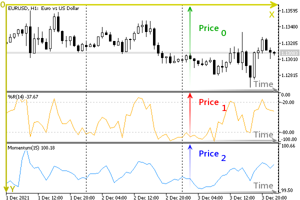

# Translation of screen coordinates to time/price and vice versa

The presence of different principles for measuring the working space of the chart leads to the need to recalculate the units of measurement among themselves. There are two functions for this.

bool ChartTimePriceToXY(long chartId, int window, datetime time, double price, int &x, int &y)

bool ChartXYToTimePrice(long chartId, int x, int y, int &window, datetime &time, double &price)

The ChartTimePriceToXY function converts chart coordinates from time/price representation (time/price) to X and Y coordinates in pixels (x/y). The ChartXYToTimePrice function performs the reverse operation: it converts the X and Y coordinates into time and price values.

Both functions require the chart ID to be specified in the first parameter chartId. In addition to this, the number of the window subwindow is passed in ChartTimePriceToXY (it should be within the number of windows). If there are several subwindows, each of them has its own timeseries and a scale along the vertical axis (conditionally called "price" with the price parameter).

The window parameter is the output in the ChartXYToTimePrice function. The function fills this parameter along with time and price. This is because pixel coordinates are common to the entire screen, and the origin x/y can fall into any subwindow.



Time, price, and screen coordinates

Functions return true upon successful completion.

Please note that the visible rectangular area that corresponds to quotes or screen coordinates is limited in both coordinate systems. Therefore, situations are possible when, with specific initial data, the received time, prices, or pixels will be out of the visibility area. In particular, negative values can also be obtained. We will look at an interactive recalculation example in the chapter on [events on charts](/en/book/applications/events).

In the previous section, we saw how you can find out where an MQL program was launched. Although physically there is only one end drop point, its representation in quotation and screen coordinates, as a rule, contains a calculation error. Two new functions for converting pixels into price/time and vice versa will help us to make sure of this.

The modified script is called ChartXY.mq5. It can be roughly divided into 3 stages. In the first stage, we derive the coordinates of the drop point, as before.

```
void OnStart()
{
   const int w1 = PRTF(ChartWindowOnDropped());
   const datetime t1 = PRTF(ChartTimeOnDropped());
   const double p1 = PRTF(ChartPriceOnDropped());
   const int x1 = PRTF(ChartXOnDropped());
   const int y1 = PRTF(ChartYOnDropped());
   ...

```

In the second stage, we try to transform the screen coordinates x1 and y1 during (t2) and price (p2), and compare them with those obtained from OnDropped functions above.

```
   int w2;
   datetime t2;
   double p2;
   PRTF(ChartXYToTimePrice(0, x1, y1, w2, t2, p2));
   Print(w2, " ", p2, " ", t2);
   PRTF(w1 == w2 && t1 == t2 && p1 == p2);
   ...

```

Then we perform the inverse transformation: we use the obtained quotation coordinates t1 and p1 to calculate screen coordinates -x2 and y2 and also compare with the original values x1 and y1.

```
   int x2, y2;
   PRTF(ChartTimePriceToXY(0, w1, t1, p1, x2, y2));
   Print(x2, " ", y2);
   PRTF(x1 == x2 && y1 == y2);
   ...

```

As we will see later in the example log, all of the above checks will fail (there will be slight discrepancies in the values). So we need a third step.

Let's recalculate the screen and quote coordinates with the suffix 2 in the variable names and save them in the variables with the new suffix 3. Then we compare all the values from the first and third stages with each other.

```
   int w3;
   datetime t3;
   double p3;
   PRTF(ChartXYToTimePrice(0, x2, y2, w3, t3, p3));
   Print(w3, " ", p3, " ", t3);
   PRTF(w1 == w3 && t1 == t3 && p1 == p3);
   
   int x3, y3;
   PRTF(ChartTimePriceToXY(0, w2, t2, p2, x3, y3));
   Print(x3, " ", y3);
   PRTF(x1 == x3 && y1 == y3);
}

```

Let's run the script on the XAUUSD, H1 chart. Here is the original point data.

```
ChartWindowOnDropped()=0 / ok
ChartTimeOnDropped()=2021.11.22 18:00:00 / ok
ChartPriceOnDropped()=1797.7 / ok
ChartXOnDropped()=234 / ok
ChartYOnDropped()=280 / ok

```

Converting pixels to quotes gives the following results.

```
ChartXYToTimePrice(0,x1,y1,w2,t2,p2)=true / ok
0 1797.16 2021.11.22 18:30:00
w1==w2&&t1==t2&&p1==p2=false / ok

```

There are differences in both time and price. Backcounting is also not perfect in terms of accuracy.

```
ChartTimePriceToXY(0,w1,t1,p1,x2,y2)=true / ok
232 278
x1==x2&&y1==y2=false / ok

```

The loss of precision occurs due to the quantization of the values on the axes according to the units of measurement, in particular pixels and points.

Finally, the last step proves that the errors obtained above are not function artifacts, because round-robin recalculation leads to the original result.

```
ChartXYToTimePrice(0,x2,y2,w3,t3,p3)=true / ok
0 1797.7 2021.11.22 18:00:00
w1==w3&&t1==t3&&p1==p3=true / ok
ChartTimePriceToXY(0,w2,t2,p2,x3,y3)=true / ok
234 280
x1==x3&&y1==y3=true / ok

```

In pseudocode, this can be expressed by the following equalities:

```
ChartTimePriceToXY(ChartXYToTimePrice(XY)) = XY
ChartXYToTimePrice(ChartTimePriceToXY(TP)) = TP

```

Applying the ChartTimePriceToXY function to ChartXYToTimePrice work results will give the original coordinates. The same is true for transformations in the other direction: applying ChartXYToTimePrice to the results of ChartTimePriceToXY will give a match.

Thus, one should carefully consider the implementation of algorithms that use recalculation functions if they are subject to increased accuracy requirements.

Another example of using ChartWindowOnDropped will be given in the script ChartIndicatorMove.mq5 in the section [Managing indicators on the chart](/en/book/applications/charts/charts_indicators).
