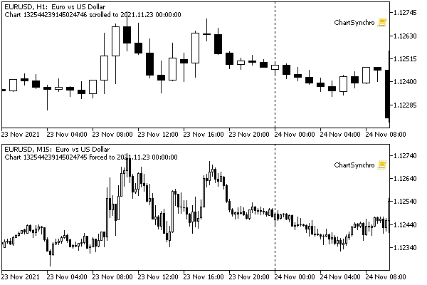

# Scrolling charts along the time axis

MetaTrader 5 users are familiar with the quick chart navigation panel, which opens by double-clicking in the left corner of the timeline or by pressing the Space or Input keys. A similar possibility is also available programmatically by using the ChartNavigate function.

bool ChartNavigate(long chartId, ENUM_CHART_POSITION position, int shift = 0)

The function shifts the chartId chart by the specified number of bars relative to the predefined chart position specified by the position parameter. It is of ENUM_CHART_POSITION enumeration type with the following elements.

| Identifier | Description |
| --- | --- |
| CHART_BEGIN | Chart beginning (oldest prices) |
| CHART_CURRENT_POS | Current position |
| CHART_END | Chart end (latest prices) |

The shift parameter sets the number of bars by which the chart should be shifted. A positive value shifts the chart to the right (towards the end), and a negative value shifts the chart to the left (towards the beginning).

The function returns true if successful or false as a result of an error.

To test the function, let's create a simple script ChartNavigate.mq5. With the help of input variables, the user can choose a starting point and a shift in bars.

```
#property script_show_inputs
 
input ENUM_CHART_POSITION Position = CHART_CURRENT_POS;
input int Shift = 0;
   
void OnStart()
{
   ChartSetInteger(0, CHART_AUTOSCROLL, false);
   const int start = (int)ChartGetInteger(0, CHART_FIRST_VISIBLE_BAR);
   ChartNavigate(0, Position, Shift);
   const int stop = (int)ChartGetInteger(0, CHART_FIRST_VISIBLE_BAR);
   Print("Moved by: ", stop - start, ", from ", start, " to ", stop);
}

```

The log displays the number of the first visible bar before and after the move.

A more practical example would be the script ChartSynchro.mq5, which allows you to synchronously scroll through all charts it is running on, in response to the user manually scrolling through one of the charts. Thus, you can synchronize windows of different timeframes of the same instrument or analyze parallel price movements on different instruments.

```
void OnStart()
{
   datetime bar = 0; // current position (time of the first visible bar)
  
   conststring namePosition =__FILE__;// global variable name
  
   ChartSetInteger(0,CHART_AUTOSCroll,false); // disable autoscroll
  
   while(!IsStopped())
   {
      const bool active = ChartGetInteger(0, CHART_BRING_TO_TOP);
      const int move = (int)ChartGetInteger(0, CHART_FIRST_VISIBLE_BAR);
   
      // the active chart is the leader, and the rest are slaves
      if(active)
      {
         const datetime first = iTime(_Symbol, _Period, move);
         if(first != bar)
         {
            // if the position has changed, save it in a global variable
            bar = first;
            GlobalVariableSet(namePosition, bar);
            Comment("Chart ", ChartID(), " scrolled to ", bar);
         }
      }
      else
      {
         const datetime b = (datetime)GlobalVariableGet(namePosition);
      
         if(b != bar)
         {
            // if the value of the global variable has changed, adjust the position
            bar = b;
            const int difference = move - iBarShift(_Symbol, _Period, bar);
            ChartNavigate(0, CHART_CURRENT_POS, difference);
            Comment("Chart ", ChartID(), " forced to ", bar);
         }
      }
    
      Sleep(250);
   }
   Comment("");
}

```

Alignment is performed by the date and time of the first visible bar (CHART_FIRST_VISIBLE_BAR). The script in a loop checks this value and, if it works on an active chart, writes it to a global variable. Scripts on other charts read this variable and adjust their position accordingly with ChartNavigate. The parameters specify the relative movement of the chart (CHART_CURRENT_POS), and the number of bars to move is defined as the difference between the current number of the first visible bar and the one read from the global variable.

The following image shows the result of synchronizing the H1 and M15 charts for EURUSD.



An example of the script for synchronizing chart positions

After we get familiar with the system [events on charts](/en/book/applications/events), we will convert this script into an indicator and get rid of the infinite loop.
