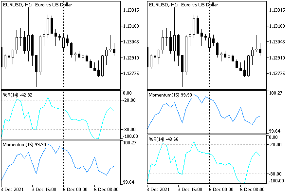

# Managing indicators on the chart

As we have already found out, charts are the execution and visualization environment for indicators. Their close connection finds additional confirmation in the form of a whole group of built-in functions that provide control over indicators on charts. In one of the previous chapters, we already completed [an overview of these features](/en/book/applications/indicators_use/indicators_chart_review). Now we are ready to consider them in detail after getting acquainted with the charts.

All functions are united by the fact that the first two parameters are unified: this is the chart identifier (chartId) and window number (window). Zero values of the parameters denote the current chart and the main window, respectively.

int ChartIndicatorsTotal(long chartId, int window)

The function returns the number of all indicators attached to the specified chart window. It can be used to enumerate all the indicators attached to a given chart. The number of all chart windows can be obtained from the property [CHART_WINDOWS_TOTAL](/en/book/applications/charts/charts_count_visibility) using the function ChartGetInteger.

string ChartIndicatorName(long chartId, int window, int index)

The function returns the indicator's short name by the index in the list of indicators located in the specified chart window. The short name is the name specified in the property [INDICATOR_SHORTNAME](/en/book/applications/indicators_make/indicators_caption_digits) by the function IndicatorSetString (if it is not set, then by default it is equal to the name of the indicator file).

int ChartIndicatorGet(long chartId, int window, const string shortname)

It returns the handle of the indicator with the specified short name in the specific chart window. We can say that the identification of the indicator in the function ChartIndicatorGet is made exactly by the short name, and therefore it is recommended to compose it in such a way that it contains the values of all input parameters. If this is not possible for one reason or another, there is another way to identify an indicator instance through the list of its parameters, which can be obtained by a given descriptor using the [IndicatorParameters](/en/book/applications/indicators_use/indicators_parameters) function.

Getting a handle from a function ChartIndicatorGet increases the internal counter for using this indicator. The terminal execution system keeps loaded all indicators whose counter is greater than zero. Therefore, an indicator that is no longer needed must be explicitly freed by calling [IndicatorRelease](/en/book/applications/indicators_use/indicators_indicatorrelease). Otherwise, the indicator will remain idle and consume resources.

bool ChartIndicatorAdd(long chartId, int window, int handle)

The function adds an indicator with the descriptor passed in the last parameter to the specified chart window. The indicator and chart must have the same combination of symbol and timeframe. Otherwise, the error ERR_CHART_INDICATOR_CANNOT_ADD (4114) will occur.

To add an indicator to a new window, the window parameter must be by one greater than the index of the last existing window, that is, equal to the [CHART_WINDOWS_TOTAL](/en/book/applications/charts/charts_count_visibility) property received via the ChartGetInteger call. If the parameter value exceeds the value of ChartGetInteger(ID,CHART_WINDOWS_TOTAL), a new window and indicator will not be created.

If an indicator is added to the main chart window, which should be drawn in a separate subwindow (for example, a built-in iMACD or a custom indicator with the specified property #property indicator_separate_window), then such an indicator may seem invisible, although it will be present in the list of indicators. This usually means that the values of this indicator do not fall within the displayed range of the price chart. The values of such an "invisible" indicator can be observed in the Data window and read using functions from other MQL programs.

Adding an indicator to a chart increases the internal counter of its use due to its binding to the chart. If the MQL program keeps its descriptor and it is no longer needed, then it is worth deleting it by calling IndicatorRelease. This will actually decrease the counter, but the indicator will remain on the chart.

bool ChartIndicatorDelete(long chartId, int window, const string shortname)

The function removes the indicator with the specified short name from the window with the window number on the chart with chartId. If there are several indicators with the same short name in the specified chart subwindow, the first one in order will be deleted.

If other indicators are calculated using the values of the removed indicator on the same chart, they will also be removed.

Deleting an indicator from a chart does not mean that its calculated part will also be deleted from the terminal memory if the descriptor remains in the MQL program. To free the indicator handle, use the [IndicatorRelease](/en/book/applications/indicators_use/indicators_indicatorrelease) function.

The ChartWindowFind function returns the number of the subwindow where the indicator is located. There are 2 forms designed to search for the current indicator on its chart or an indicator with a given short name on an arbitrary chart with the chartId identifier.

int ChartWindowFind()

int ChartWindowFind(long chartId, string shortname)

The second form can be used in scripts and Experts Advisors.

As a first example demonstrating these functions, let's consider the full version of the script ChartList.mq5. We created and gradually refined it in the previous sections, up to the section [Getting the number and visibility of windows/subwindows](/en/book/applications/charts/charts_count_visibility). Compared to ChartList4.mq5 presented there, we will add input variables to be able to list only charts with MQL programs and suppress the display of hidden windows.

```
input bool IncludeEmptyCharts = true;
input bool IncludeHiddenWindows = true;

```

With the default value (true) the IncludeEmptyCharts parameter instructs to include all charts into the list, including empty ones. The IncludeHiddenWindows parameter sets the display of hidden windows by default. These settings correspond to the previous scripting logic ChartListN.

To calculate the total number of indicators and indicators in subwindows, we define the indicators and subs variables.

```
void ChartList()
{
   ...
   int indicators = 0, subs = 0;
   ...

```

The working loop over the windows of the current chart has undergone major changes.

```
void ChartList()
{
      ...
      for(int i = 0; i < win; i++)
      {
         const bool visible = ChartGetInteger(id, CHART_WINDOW_IS_VISIBLE, i);
         if(!visible && !IncludeHiddenWindows) continue;
         if(!visible)
         {
            Print("  ", i, "/Hidden");
         }
         const int n = ChartIndicatorsTotal(id, i);
         for(int k = 0; k < n; k++)
         {
            if(temp == 0)
            {
               Print(header);
            }
            Print("  ", i, "/", k, " [I] ", ChartIndicatorName(id, i, k));
            indicators++;
            if(i > 0) subs++;
            temp++;
         }
      }
      ...

```

Here we have added ChartIndicatorsTotal and ChartIndicatorName calls. Now the list will mention MQL programs of all types: [E] — Expert Advisors, [S] — scripts, [I] — indicators.

Here is an example of the log entries generated by the script for the default settings.

```
Chart List
N, ID, Symbol, TF, #subwindows, *active, Windows handle
0 132358585987782873 EURUSD M15 #1    133538
  1/0 [I] ATR(11)
1 132360375330772909 EURUSD D1     133514
2 132544239145024745 EURUSD M15   *   395646
 [S] ChartList
3 132544239145024732 USDRUB D1     395688
4 132544239145024744 EURUSD H1 #2  active  2361730
  1/0 [I] %R(14)
  2/Hidden
  2/0 [I] Momentum(15)
5 132544239145024746 EURUSD H1     133584
Total chart number: 6, with MQL-programs: 3
Experts: 0, Scripts: 1, Indicators: 3 (main: 0 / sub: 3)

```

If set both input parameters to false, we get a reduced list.

```
Chart List
N, ID, Symbol, TF, #subwindows, *active, Windows handle
0 132358585987782873 EURUSD M15 #1    133538
  1/0 [I] ATR(11)
2 132544239145024745 EURUSD M15   * active  395646
 [S] ChartList
4 132544239145024744 EURUSD H1 #2    2361730
  1/0 [I] %R(14)
Total chart number: 6, with MQL-programs: 3
Experts: 0, Scripts: 1, Indicators: 2 (main: 0 / sub: 2)

```

As a second example, let's consider an interesting script ChartIndicatorMove.mq5.

When running several indicators on a chart, we often may need to change the order of the indicators. MetaTrader 5 does not have built-in tools for this, which forces you to delete some indicators and add them again, while it is important to save and restore the settings. The ChartIndicatorMove.mq5 script provides an option to automate this procedure. It is important to note that the script transfers only indicators: if you need to change the order of subwindows along with graphical objects (if they are inside), then you should use [tpl templates](/en/book/applications/charts/charts_tpl).

The basis of operation of ChartIndicatorMove.mq5 is as follows. When the script is applied to a chart, it determines to which window/subwindow it was added, and starts listing the indicators found there to the user with a request to confirm the transfer. The user can agree, or continue the listing.

The direction of movement, up or down, is set in the MoveDirection input variable. The DIRECTION enumeration will describe it.

```
#property script_show_inputs
   
enum DIRECTION
{
   Up = -1,
   Down = +1,
};
   
input DIRECTION MoveDirection = Up;

```

To transfer the indicator not to the neighboring subwindow but to the next one, that is, to actually swap the subwindows with indicators in places (which is usually required), we introduce the jumpover input variable.

```
input bool JumpOver = true;

```

The loop through the indicators of the target window obtained from ChartWindowOnDropped starts in OnStart.

```
void OnStart()
{
   const int w = ChartWindowOnDropped();
   if(w == 0 && MoveDirection == Up)
   {
      Alert("Can't move up from window at index 0");
      return;
   }
   const int n = ChartIndicatorsTotal(0, w);
   for(int i = 0; i < n; ++i)
   {
      ...
   }
}

```

Inside the loop, we define the name of the next indicator, display a message to the user, and move the indicator from one window to another using a sequence of the following manipulations:

- Get the handle by calling ChartIndicatorGet.
- Add it to the window above or below the current one via ChartIndicatorAdd, in accordance with the selected direction, and when moving down, a new subwindow can be automatically created.
- Remove the indicator from the previous window with ChartIndicatorDelete.
- Release the descriptor, because we no longer need it in the program.

```
      ...
      const string name = ChartIndicatorName(0, w, i);
      const string caption = EnumToString(MoveDirection);
      const int button = MessageBox("Move '" + name + "' " + caption + "?",
         caption, MB_YESNOCANCEL);
      if(button == IDCANCEL) break;
      if(button == IDYES)
      {
         const int h = ChartIndicatorGet(0, w, name);
         ChartIndicatorAdd(0, w + MoveDirection, h);
         ChartIndicatorDelete(0, w, name);
         IndicatorRelease(h);
         break;
      }
      ...

```

The following image shows the result of swapping subwindows with indicators WPR and Momentum. The script was launched by dropping it on the top sub-window with the WPR indicator, the direction of movement was chosen downward (Down), jump (JumpOver) was enabled by default.



Swapping Indicators in subwindows

Please note that if you move the indicator from the subwindow to the main window, its charts will most likely not be visible due to the values going beyond the displayed price range. If this happened by mistake, you can use the script to transfer the indicator back to the subwindow.
