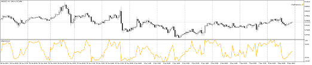

# Saving a chart image

In MQL programs, it often becomes necessary to document the current state of the program itself and the trading environment. As a rule, for this purpose, the output of various analytical or financial indicators to the journal is used, but some things are more clearly represented by the image of the graph, for example, at the time of the transaction. The MQL5 API includes a function that allows you to save a chart image to a file.

bool ChartScreenShot(long chartId, string filename, int width, int height,  

   ENUM_ALIGN_MODE alignment = ALIGN_RIGHT)

The function takes a snapshot of the specified chart in GIF, PNG, or BMP format depending on the extension in the line with the name of the file filename (maximum 63 characters). The screenshot is placed in the directory MQL5/Files.

Parameters width and height set the width and height of the image in pixels.

Parameter alignment affects what part of the graph will be included in the file. The value ALIGN_RIGHT (default) means that the snapshot is taken for the most recent prices (this can be thought of as the terminal silently making a transition on pressing End before the snapshot). The ALIGN_LEFT value ensures that bars are hit on the image, starting from the first bar visible on the left at the moment. Thus, if you need to take a screenshot of a chart from a certain position, you must first position the chart manually or using the ChartNavigate function.

The ChartScreenShot function returns true in case of success.

Let's test the function in the script ChartPanorama.mq5. Its task is to save a copy of the chart from the current left visible bar up to the current time. By first shifting the beginning of the graph back to the desired depth of history, you can get a fairly extended panorama. In this case, you do not need to think about what width of the image to choose. However, keep in mind that a story that is too long will require a huge image, potentially exceeding the capabilities of the graphics format or software.

The height of the image will automatically be determined equal to the current height of the chart.

```
void OnStart()
{
   // the exact width of the price scale is not known, we take it empirically
   const int scale = 60;
   
   // calculating the total height, including gaps between windows
   const int w = (int)ChartGetInteger(0, CHART_WINDOWS_TOTAL);
   int height = 0;
   int gutter = 0;
   for(int i = 0; i < w; ++i)
   {
      if(i == 1)
      {
         gutter = (int)ChartGetInteger(0, CHART_WINDOW_YDISTANCE, i) - height;
      }
      height += (int)ChartGetInteger(0, CHART_HEIGHT_IN_PIXELS, i);
   }
   
   Print("Gutter=", gutter, ", total=", gutter * (w - 1));
   height += gutter * (w - 1);
   Print("Height=", height);
   
   // calculate the total width based on the number of pixels in one bar,
   // and also including chart offset from the right edge and scale width
   const int shift = (int)(ChartGetInteger(0, CHART_SHIFT) ?
      ChartGetDouble(0, CHART_SHIFT_SIZE) * ChartGetInteger(0, CHART_WIDTH_IN_PIXELS) / 100 : 0);
   Print("Shift=", shift);
   const int pixelPerBar = (int)MathRound(1.0 * ChartGetInteger(0, CHART_WIDTH_IN_PIXELS)
      / ChartGetInteger(0, CHART_WIDTH_IN_BARS));
   const int width = (int)ChartGetInteger(0, CHART_FIRST_VISIBLE_BAR) * pixelPerBar + scale + shift;
   Print("Width=", width);
   
   // write a file with a picture in PNG format
   const string filename = _Symbol + "-" + PeriodToString() + "-panorama.png";
   if(ChartScreenShot(0, filename, width, height, ALIGN_LEFT))
   {
      Print("File saved: ", filename);
   }
}

```

We could also use the ALIGN_RIGHT mode, but then we would have to force the offset from the right edge to be disabled, because it is recalculated for the image, depending on its size, and the result will look completely different from what it looks like on the screen (the indent on the right will become too large, since it is specified as a percentage of the width).

Below is an example of the log after running the script on the chart XAUUSD,H1.

```
Gutter=2, total=2
Height=440
Shift=74
Width=2086
File saved: XAUUSD-H1-panorama.png

```

Taking into account navigation to a not very distant history, the following screenshot was obtained (represented as a 4-fold reduced copy).



Chart Panorama
