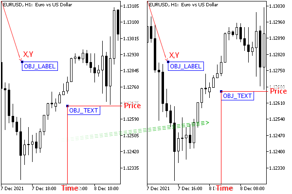

# Object types and features of specifying their coordinates

As we know from the chapter on [charts](/en/book/applications/charts), there are two coordinate systems in the window: screen (pixel) coordinates and quote (time and price) coordinates. In this regard, the total set of supported types of objects is divided into two large groups: those objects that are linked to the screen, and those that are linked to the price chart. The first ones always remain in place relative to one of the corners of the window (which corner is the reference one is determined by the user or programmer in the object properties). The latter are scrolled along with the working area of the window.

The following image shows two objects with text labels for comparison: one attached to the screen (OBJ_LABEL), and the other to the price chart (OBJ_TEXT). Their types, given in brackets, as well as the properties by which coordinates are set, we will study in the relevant sections of this chapter. It is important to note that when scrolling the price chart, the text OBJ_TEXT moves synchronously with it, while the inscription OBJ_LABEL remains in the same place.

Two different coordinate systems for objects

Also, the objects differ in the number of anchor points. For example, a single price label ("arrow") requires one time/price point, and a trend line requires two such points. There are object types with more anchor points, such as Equidistant Channels, Triangles, or Elliott Waves.

When an object is selected (for example, in the Object List dialog, by double-clicking or single-clicking on the chart, depending on the Charts tab / Select objects with a single mouse click option), its anchor points are indicated by small squares in a contrasting color. It is the anchor points that are used to drag the object and to change its size and orientation.

All supported object types are described in the ENUM_OBJECT enumeration. You can read it in its entirety in the MQL5 documentation. We will consider its elements gradually, in parts.
