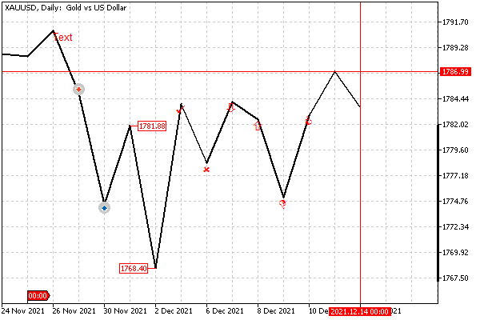

# Creating objects

To create an object, a certain minimum set of attributes is required that is common to all types. Additional properties specific to each type can be set or changed later on an already existing object. The required attributes include the identifier of the chart where the object should be created, the name of the object, the number of the window/subwindow, and two coordinates for the first anchor point: time and price.

Even though there is a group of objects positioned in screen coordinates, creating them still requires you to pass two values, usually zero because they aren't used.

In general, a prototype of the ObjectCreate function looks as follows:

bool ObjectCreate(long chartId, const string name, ENUM_OBJECT type, int window,  

   datetime time1, double price1, datetime time2 = 0, double price2 = 0, ...)

A value of 0 for chartId implies the current chart. The name parameter parameter must be unique within the entire chart, including subwindows, and should not exceed 63 characters.

We have given in the previous sections object types for the type parameter: these are the elements of the ENUM_OBJECT enumeration.

As we know, the numbering of windows/subwindows for the window parameter starts from 0, which means the main chart window. If a larger index is specified for a subwindow, it must exist, as otherwise, the function will terminate with an error and return false.

Just to remind you, the returned success flag (true) only indicates that the command to create the object has been successfully placed in the queue. The result of its execution is not immediately known. This is the flip side of the asynchronous call, which is employed to enhance performance.

To check the execution result, you can use the [ObjectFind](/en/book/applications/objects/objects_find) function or any [ObjectGet functions](/en/book/applications/objects/objects_properties_get_set), which query the properties of an object. But you should keep in mind that such functions wait for the execution of the entire queue of chart commands and only then return the actual result (the state of the object). This process may take some time, during which the MQL program code will be suspended. In other words, the functions for checking the state of objects are synchronous, unlike the functions for creating and modifying objects.

Additional anchor points, starting with the second one, are optional. The allowed number of anchor points, up to 30, is provided for future use, and no more than 5 are used in current object types.

It is important to note that the call to the ObjectCreate function with the name of an already existing object simply changes the anchor point(s) (if the coordinates have been changed since the previous call). This is convenient to use for writing unified code without branching into conditions based on the presence or absence of an object. In other words, an unconditional ObjectCreate call guarantees the existence of the object, if we do not care whether it existed before or not. However, there is a nuance. If, when calling ObjectCreate, the object type or the subwindow index is different from an already existing object, the relevant data remains the same, while no errors occur.

When calling ObjectCreate, you can leave all anchor points with default values (null), provided that ObjectSet functions with the appropriate OBJPROP_TIME and OBJPROP_PRICE properties are called after this instruction.

The order in which anchor points are specified can be important for some object types. For channels such as OBJ_REGRESSION (Linear Regression Channel) and OBJ_STDDEVCHANNEL (Standard Deviation Channel), it is mandatory for the conditions time1<time2 to be met. Otherwise, the channel will not be built normally, although the object will be created without errors.

As an example of the function, let's take the ObjectSimpleShowcase.mq5 script which creates several objects of different types on the last bars of the chart, requiring a single anchor point.

All examples of working with objects will use the ObjectPrefix.mqh header file, which contains a string definition with a common prefix for object names. Thus, it will be more convenient for us, if necessary, to clear the charts from "its own" objects.

```
const string ObjNamePrefix = "ObjShow-";

```

In the OnStart function, an array is defined containing object types.

```
void OnStart()
{
   ENUM_OBJECT types[] =
   {
      // straight lines
      OBJ_VLINE, OBJ_HLINE,
      // labels (arrows and other signs)
      OBJ_ARROW_THUMB_UP, OBJ_ARROW_THUMB_DOWN,
      OBJ_ARROW_UP, OBJ_ARROW_DOWN,
      OBJ_ARROW_STOP, OBJ_ARROW_CHECK,
      OBJ_ARROW_LEFT_PRICE, OBJ_ARROW_RIGHT_PRICE,
      OBJ_ARROW_BUY, OBJ_ARROW_SELL,
      // OBJ_ARROW, // see the ObjectWingdings.mq5 example
      
      // text
      OBJ_TEXT,
      // event flag (like in a calendar) at the bottom of the window
      OBJ_EVENT,
   };

```

Next, in the loop through its elements, we create objects in the main window, passing the time and closing price of the i-th bar.

```
   const int n = ArraySize(types);
   for(int i = 0; i < n; ++i)
   {
      ObjectCreate(0, ObjNamePrefix + (string)iTime(_Symbol, _Period, i), types[i],
         0, iTime(_Symbol, _Period, i), iClose(_Symbol, _Period, i));
   }
   
   PrintFormat("%d objects of various types created", n);
}

```

Here's the possible result from running the script.



Objects of simple types at the closing points of the last bars

The drawing of lines by the Close price and the grid display are enabled in this example. We will learn how to adjust the size, color, and other attributes of objects later. In particular, the anchor points of most icons are located by default in the middle of the top side, so they are visually offset under the line. However, the sell icon is above the line because the anchor point is always in the middle of the bottom side.

Please note that objects created programmatically are not displayed by default in the list of objects in the dialog of the same name. To see them there, click the All button.
