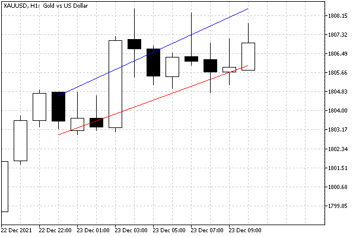

# Price and time coordinates

For objects of the types that exist in the quotes coordinate system, the MQL5 API supports a couple of properties for specifying time and price bindings. In the event that an object has several anchor points, properties require the specification of a modifier parameter containing the index of the anchor point when calling the ObjectSet and ObjectGet functions.

| Identifier | Description | Value type |
| --- | --- | --- |
| OBJPROP_TIME | Time coordinate | datetime |
| OBJPROP_PRICE | Price coordinate | double |

These properties are available for absolutely all objects, but it makes no sense to set or read them for objects with [screen coordinates](/en/book/applications/objects/objects_screen_coordinates).

To demonstrate how to work with coordinates, let's analyze the bufferless indicator ObjectHighLowChannel.mq5. For a given segment of bars, it draws two trend lines. Their start and end points on the time axis coincide with the first and last bar of the segment, and along the price axis, the values are calculated differently for each of the lines: the highest and lowest High prices are used for the upper line and the highest and lowest Low prices are used for the lower line. As the chart updates, our impromptu channel should move with prices.

The range of bars is set using two input variables: the number of the initial bar BarOffset and the number of bars BarCount. By default, the lines are drawn at the most recent prices, because bar offset = 0.

```
input int BarOffset = 0;
input int BarCount = 10;
   
const string Prefix = "HighLowChannel-";

```

Objects have a common name prefix "HighLowChannel-".

In the OnCalculate handler, we monitor the emergence of new bars over the iTime time of the 0-th bar. As soon as the bar is formed, the prices are analyzed on the specified segment, the maximum and minimum values of the prices of each of the two types (MODE_HIGH, MODE_LOW) are taken and the auxiliary function DrawFigure is called for them, and this is where the work with objects takes place: the creation and modification of coordinates.

```
int OnCalculate(const int rates_total,
                const int prev_calculated,
                const int begin,
                const double &price[])
{
   static datetime now = 0;
   if(now != iTime(NULL, 0, 0))
   {
      const int hh = iHighest(NULL, 0, MODE_HIGH, BarCount, BarOffset);
      const int lh = iLowest(NULL, 0, MODE_HIGH, BarCount, BarOffset);
      const int ll = iLowest(NULL, 0, MODE_LOW, BarCount, BarOffset);
      const int hl = iHighest(NULL, 0, MODE_LOW, BarCount, BarOffset);
   
      datetime t[2] = {iTime(NULL, 0, BarOffset + BarCount), iTime(NULL, 0, BarOffset)};
      double ph[2] = {iHigh(NULL, 0, fmax(hh, lh)), iHigh(NULL, 0, fmin(hh, lh))};
      double pl[2] = {iLow(NULL, 0, fmax(ll, hl)), iLow(NULL, 0, fmin(ll, hl))};
    
      DrawFigure(Prefix + "Highs", t, ph, clrBlue);
      DrawFigure(Prefix + "Lows", t, pl, clrRed);
   
      now = iTime(NULL, 0, 0);
   }
   return rates_total;
}

```

And here is the DrawFigure function itself.

```
bool DrawFigure(const string name, const datetime &t[], const double &p[],
   const color clr)
{
   if(ArraySize(t) != ArraySize(p)) return false;
   
   ObjectCreate(0, name, OBJ_TREND, 0, 0, 0);
   
   for(int i = 0; i < ArraySize(t); ++i)
   {
      ObjectSetInteger(0, name, OBJPROP_TIME, i, t[i]);
      ObjectSetDouble(0, name, OBJPROP_PRICE, i, p[i]);
   }
   
   ObjectSetInteger(0, name, OBJPROP_COLOR, clr);
   return true;
}

```

After the ObjectCreate call that guarantees the existence of an object, the appropriate ObjectSet functions for OBJPROP_TIME and OBJPROP_PRICE are called at all anchor points (two in this case).

The image below shows the result of the indicator.



Channel on two trend lines at High and Low prices

You can run the indicator in the visual tester to see how the line coordinates change on the go.
