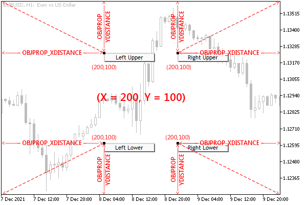
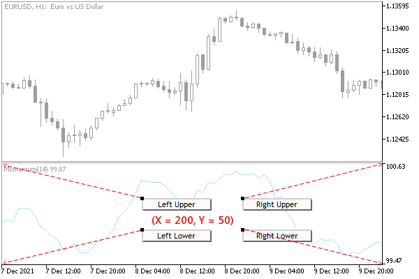

# Anchor window corner and screen coordinates

For objects that use a coordinate system in the form of points (pixels) on the chart, you must select one of the four corners of the window, relative to which the values along the horizontal X-axis and vertical Y-axis will be counted to the anchor point on the object. These aspects are controlled by the properties in the following table.

| Identifier | Description | Type |
| --- | --- | --- |
| OBJPROP_CORNER | Chart corner for anchoring the graphic object | ENUM_BASE_CORNER |
| OBJPROP_XDISTANCE | Distance in pixels along the X-axis from the anchor corner | int |
| OBJPROP_YDISTANCE | Distance in pixels along the Y-axis from the anchor corner | int |

Valid options for OBJPROP_CORNER are summarized in the ENUM_BASE_CORNER enumeration.

| Identifier | Coordinate center location |
| --- | --- |
| CORNER_LEFT_UPPER | Upper left corner of the window |
| CORNER_LEFT_LOWER | Lower left corner of the window |
| CORNER_RIGHT_LOWER | Lower right corner of the window |
| CORNER_RIGHT_UPPER | Upper right corner of the window |

The default is the top left corner.

The following figure shows four Button objects with the same size and distance from the anchor corner in the window. Each of these objects differs only in the binding angle itself. Recall that buttons have one anchor point which is always located in the upper left corner of the button.



Arrangement of objects bound to different corners of the main window

All four objects are currently selected on the chart, so their anchor points are highlighted in a contrasting color.

When we talk about window corners, we mean the specific window or subwindow in which the object is located and not the entire chart. In other words, in objects in subwindows, the Y coordinate is measured from the top or bottom border of this subwindow.

The following illustration shows similar objects in a subwindow, snapped to the corners of the subwindow.



Location of objects with binding to different corners of the subwindow

Using the ObjectCornerLabel.mq5 script the user can test the movement of a text inscription, for which the anchor angle in the window is specified in the input parameter Corner.

```
#property script_show_inputs
   
input ENUM_BASE_CORNER Corner = CORNER_LEFT_UPPER;

```

The coordinates change periodically and are displayed in the text of the inscription itself. Thus, the inscription moves in the window and, when it reaches the border, bounces off it. The object is created in the window or subwindow where the script was dropped by the mouse.

```
void OnStart()
{
   const int t = ChartWindowOnDropped();
   const string legend = EnumToString(Corner);
   
   const string name = "ObjCornerLabel-" + legend;
   int h = (int)ChartGetInteger(0, CHART_HEIGHT_IN_PIXELS, t);
   int w = (int)ChartGetInteger(0, CHART_WIDTH_IN_PIXELS);
   int x = w / 2;
   int y = h / 2;
   ...

```

For correct positioning, we find the dimensions of the window (and then check if they have changed) and find the middle for the initial placement of the object: the variables with the coordinates x and y.

Next, we create and set up an inscription, without coordinates yet. It is important to note that we enable the ability to select an object (OBJPROP_SELECTABLE) and select it (OBJPROP_SELECTED), as this allows us to see the anchor point on the object itself, to which the distance from the window corner (coordinate center) is measured. These two properties are described in more detail in the section on [Object state management](/en/book/applications/objects/objects_state).

```
   ObjectCreate(0, name, OBJ_LABEL, t, 0, 0);
   ObjectSetInteger(0, name, OBJPROP_SELECTABLE, true);
   ObjectSetInteger(0, name, OBJPROP_SELECTED, true);
   ObjectSetInteger(0, name, OBJPROP_CORNER, Corner);
   ...

```

In the variables px and py, we will record the increments of coordinates for motion emulation. The coordinate modification itself will be performed in an infinite loop until it is interrupted by the user. The iteration counter will allow periodically, at every 50 iterations, to change the direction of movement at random.

```
   int px = 0, py = 0;
   int pass = 0;
   
   for( ;!IsStopped(); ++pass)
   {
      if(pass % 50 == 0)
      {
         h = (int)ChartGetInteger(0, CHART_HEIGHT_IN_PIXELS, t);
         w = (int)ChartGetInteger(0, CHART_WIDTH_IN_PIXELS);
         px = rand() * (w / 20) / 32768 - (w / 40);
         py = rand() * (h / 20) / 32768 - (h / 40);
      }
   
      // bounce off window borders so object doesn't hide
      if(x + px > w || x + px < 0) px = -px;
      if(y + py > h || y + py < 0) py = -py;
      // recalculate label positions
      x += px;
      y += py;
      
      // update the coordinates of the object and add them to the text
      ObjectSetString(0, name, OBJPROP_TEXT, legend
         + "[" + (string)x + "," + (string)y + "]");
      ObjectSetInteger(0, name, OBJPROP_XDISTANCE, x);
      ObjectSetInteger(0, name, OBJPROP_YDISTANCE, y);
   
      ChartRedraw();
      Sleep(100);
   }
   
   ObjectDelete(0, name);
}

```

Try running the script multiple times, specifying different anchor corners.

In the next section, we'll augment this script by also controlling the anchor point on the object.
