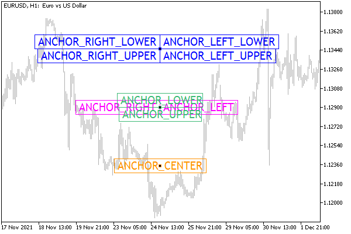

# Defining anchor point on an object

Some types of objects allow you to select an anchor point. The types that fall into this category include text label (OBJ_TEXT) and bitmap image (OBJ_BITMAP) linked to quotes, as well as caption (OBJ_LABEL) and panel with image (OBJ_BITMAP_LABEL), positioned in screen coordinates.

To read and set the anchor point, use the functions ObjectGetInteger and ObjectSetInteger with the OBJPROP_ANCHOR property.

All point selection options are collected in the ENUM_ANCHOR_POINT enumeration.

| Identifier | Anchor point location |
| --- | --- |
| ANCHOR_LEFT_UPPER | In the upper left corner |
| ANCHOR_LEFT | Left center |
| ANCHOR_LEFT_LOWER | In the lower left corner |
| ANCHOR_LOWER | Bottom center |
| ANCHOR_RIGHT_LOWER | In the lower right corner |
| ANCHOR_RIGHT | Right center |
| ANCHOR_RIGHT_UPPER | In the upper right corner |
| ANCHOR_UPPER | Top center |
| ANCHOR_CENTER | Strictly in the center of the object |

The points are clearly shown in the image below, where several label objects are applied to the chart.



OBJ_LABEL text objects with different anchor points

The upper group of four labels has the same pair of coordinates (X,Y), however, due to anchoring to different corners of the object, they are located on different sides of the point. A similar situation is in the second group of four text labels, however, there the anchoring is made to the midpoints of different sides of the objects. Finally, the caption is shown separately at the bottom, anchored in its center, so that the point is inside the object.

The button (OBJ_BUTTON), rectangular panel (OBJ_RECTANGLE_LABEL), input field (OBJ_EDIT), and chart object (OBJ_CHART) have a fixed anchor point in the upper left corner (ANCHOR_LEFT_UPPER).

Some graphical objects of the group of single price marks (OBJ_ARROW, OBJ_ARROW_THUMB_UP, OBJ_ARROW_THUMB_DOWN, OBJ_ARROW_UP, OBJ_ARROW_DOWN, OBJ_ARROW_STOP, OBJ_ARROW_CHECK) have two ways of anchoring their coordinates, specified by identifiers of another enumeration ENUM_ARROW_ANCH OR.

| Identifier | Anchor point location |
| --- | --- |
| ANCHOR_TOP | Top center |
| ANCHOR_BOTTOM | Bottom center |

The rest of the objects in this group have predefined anchor points: the buy (OBJ_ARROW_BUY) and sell (OBJ_ARROW_SELL) arrows are respectively in the middle of the upper and lower sides, and the price labels (OBJ_ARROW_RIGHT_PRICE, OBJ_ARROW_LEFT_PRICE) are on the left and right.

Similar to the script ObjectCornerLabel.mq5 from the previous section, let's create the script ObjectAnchorLabel.mq5. In the new version, in addition to moving the inscription, we will randomly change the anchor point on it.

The corner of the window for anchoring will be selected, as before, by the user when the script is launched.

```
input ENUM_BASE_CORNER Corner = CORNER_LEFT_UPPER;

```

We will display the name of the angle on the chart as a comment.

```
void OnStart()
{
   Comment(EnumToString(Corner));
   ...

```

In an infinite loop, one of 9 possible anchor point values is generated at selected times.

```
   ENUM_ANCHOR_POINT anchor = 0;
   for( ;!IsStopped(); ++pass)
   {
      if(pass % 50 == 0)
      {
        ...
         anchor = (ENUM_ANCHOR_POINT)(rand() * 9 / 32768);
         ObjectSetInteger(0, name, OBJPROP_ANCHOR, anchor);
      }
      ...

```

The name of the anchor point becomes the text content of the label, along with the current coordinates.

```
      ObjectSetString(0, name, OBJPROP_TEXT, EnumToString(anchor)
         + "[" + (string)x + "," + (string)y + "]");

```

The rest of the code snippets remained largely unchanged.

After compiling and running the script, notice how the inscription changes its position relative to the current coordinates (x, y) depending on the selected anchor point.

For now, we control and prevent the anchor point itself from going outside the window. However, the object has some dimensions, and therefore it may turn out that most of the inscription is cut off. In the future, after studying the relevant properties, we will deal with this problem (see the ObjectSizeLabel.mq5 example in the section on [Determining object width and height](/en/book/applications/objects/objects_width_height)).
