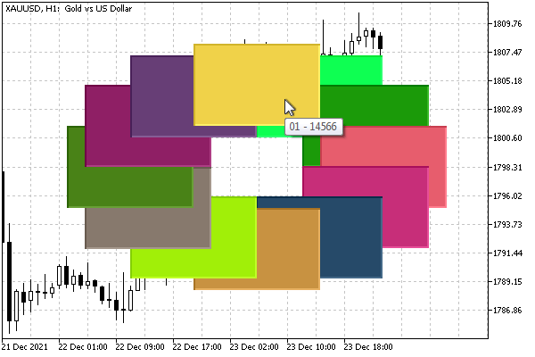

# Priority of objects (Z-Order)

Objects on the chart provide not only the presentation of information but also interaction with the user and MQL programs through events, which will be discussed in detail in the [next chapter](/en/book/applications/events). One of the event sources is the mouse pointer. The chart is able, in particular, to track the movement of the mouse and pressing its buttons.

If an object is under the mouse, specific event handling can be performed for it. However, objects can overlap each other (when their coordinates overlap, taking into account [sizes](/en/book/applications/objects/objects_width_height)). In this case, the OBJPROP_ZORDER integer property comes into play. It sets the priority of the graphical object to receive mouse events. When objects overlap, only one object, whose priority is higher than the rest will receive the event.

By default, when an object is created, its Z-order is zero, but you can increase it if necessary.

It's important to note that Z-order only affects the handling of mouse events, not the drawing of objects. Objects are always drawn in the order they were added to the chart. This can be a source of misunderstanding. For example, a tooltip may not be displayed for an object that is visually on top of another because the overlapped object has a higher Z-priority (see example).

In the ObjectZorder.mq5 script we will create 12 objects of type OBJ_RECTANGLE_LABEL, placing them in a circle, like on a clock face. The order of adding objects corresponds to hours: from 1 to 12. For clarity, all rectangles will get a random color (for the OBJPROP_BGCOLOR property, see the [next section](/en/book/applications/objects/objects_color_style)), as well as random priority. By moving the mouse over objects, the user will be able to determine which object it belongs to by means of a tooltip.

For the convenience of setting the properties of objects, we define the special class ObjectBuilder, derived from Object Selector.

```
#include "ObjectPrefix.mqh"
#include <MQL5Book/ObjectMonitor.mqh>
   
class ObjectBuilder: public ObjectSelector
{
protected:
   const ENUM_OBJECT type;
   const int window;
public:
   ObjectBuilder(const string _id, const ENUM_OBJECT _type,
      const long _chart = 0, const int _win = 0):
      ObjectSelector(_id, _chart), type(_type), window(_win)
   {
      ObjectCreate(host, id, type, window, 0, 0);
   }
   
   // changing the name and chart is prohibited
   virtual void name(const string _id) override = delete;
   virtual void chart(const long _chart) override = delete;
};

```

Fields with identifiers of the object (id) and chart (host) are already in the ObjectSelector class. In the derivative, we add an object type (ENUM_OBJECT type) and a window number (int window). The constructor calls ObjectCreate.

Setting and reading properties is fully inherited as a group of get and set methods from ObjectSelector.

As in the previous test scripts, we determine the window where the script is dropped, the dimensions of the window, and the coordinates of the middle.

```
void OnStart()
{
   const int t = ChartWindowOnDropped();
   int h = (int)ChartGetInteger(0, CHART_HEIGHT_IN_PIXELS, t);
   int w = (int)ChartGetInteger(0, CHART_WIDTH_IN_PIXELS);
   int x = w / 2;
   int y = h / 2;
   ...

```

Since the object type OBJ_RECTANGLE_LABEL supports explicit pixel dimensions, we calculate the width of dx and height of dy of each rectangle as a quarter window. We use them to set the OBJPROP_XSIZE and OBJPROP_YSIZE properties discussed in the section on [Determining object width and height](/en/book/applications/objects/objects_width_height).

```
   const int dx = w / 4;
   const int dy = h / 4;
   ...

```

Next, in the loop, we create 12 objects. Variables px and py contain the offset of the next "mark" on the "dial" relative to the center (x, y). The priority of z is chosen randomly. The name of the object and its tooltip (OBJPROP_TOOLTIP) include a string like "XX - YYY", XX is the number of the "hour" (the position on the dial is from 1 to 12), YYY is the priority.

```
   for(int i = 0; i < 12; ++i)
   {
      const int px = (int)(MathSin((i + 1) * 30 * M_PI / 180) * dx) - dx / 2;
      const int py = -(int)(MathCos((i + 1) * 30 * M_PI / 180) * dy) - dy / 2;
      
      const int z = rand();
      const string text = StringFormat("%02d - %d", i + 1, z);
   
      ObjectBuilder *builder =
         new ObjectBuilder(ObjNamePrefix + text, OBJ_RECTANGLE_LABEL);
      builder.set(OBJPROP_XDISTANCE, x + px).set(OBJPROP_YDISTANCE, y + py)
      .set(OBJPROP_XSIZE, dx).set(OBJPROP_YSIZE, dy)
      .set(OBJPROP_TOOLTIP, text)
      .set(OBJPROP_ZORDER, z)
      .set(OBJPROP_BGCOLOR, (rand() << 8) | rand());
      delete builder;
   }

```

After the ObjectBuilder constructor is called, for the new builder object the calls to the overloaded set method for different properties are chained (the set method returns a pointer to the object itself).

Since the MQL object is no longer needed after the creation and configuration of the graphical object, we immediately delete builder.

As a result of the script execution, approximately the following objects will appear on the chart.



Object overlay and Z-order priority tooltips

The colors and priorities will be different each time you run it, but the visual overlay of the rectangles will always be the same, in the order of creation from 1 at the bottom to 12 at the top (here we mean the overlay of objects, not the fact that 12 is located at the top of the watch face ).

In the image, the mouse cursor is positioned in a place where two objects exist, that is, 01 (fluorescent lime green) and 12 (sandy). In this case, the tooltip for object 01 is visible, although visually object 12 is displayed on top of object 01. This is because 01 was randomly generated with a higher priority than 12.

Only one tooltip is displayed at a time, so you can check the priority relationship by moving the mouse cursor to other areas where there is no object overlap and the information in the tooltip belongs to the single object under the cursor.

When we learn about mouse event handling in the next chapter, we can improve on this example and test the effect of Z-order on mouse clicks on objects.

To delete the created objects, you can use the ObjectCleanup1.mq5 script.
