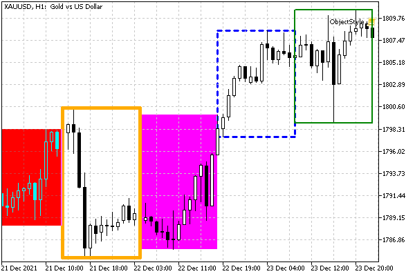
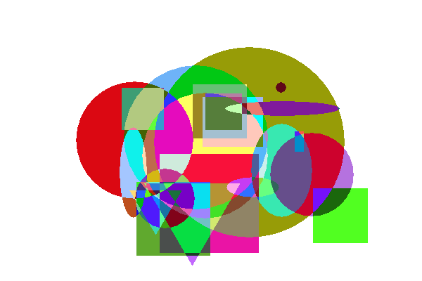

# Object display settings: color, style, and frame

The appearance of objects can be changed using a variety of properties, which we'll explore in this section, starting with color, style, line width, and borders. Other formatting aspects such as font, skew, and text alignment will be covered in the following sections.

All properties from the table below have types that are compatible with integers and therefore are managed by the functions ObjectGetInteger and ObjectSetInteger.

| Identifier | Description | Property type |
| --- | --- | --- |
| OBJPROP_COLOR | The color of the line and the main element of the object (for example, font or fill) | color |
| OBJPROP_STYLE | Line style | ENUM_LINE_STYLE |
| OBJPROP_WIDTH | Line thickness in pixels | int |
| OBJPROP_FILL | Filling an object with color (for OBJ_RECTANGLE, OBJ_TRIANGLE, OBJ_ELLIPSE, OBJ_CHANNEL, OBJ_STDDEVCHANNEL, OBJ_REGRESSION) | bool |
| OBJPROP_BACK | Object in the background | bool |
| OBJPROP_BGCOLOR | Background color for OBJ_EDIT, OBJ_BUTTON, OBJ_RECTANGLE_LABEL | color |
| OBJPROP_BORDER_TYPE | Frame type for rectangular panel OBJ_RECTANGLE_LABEL | ENUM_BORDER_TYPE |
| OBJPROP_BORDER_COLOR | Frame color for input field OBJ_EDIT and button OBJ_BUTTON | color |

Unlike most objects with lines (separate vertical and horizontal, trend, cyclic, channels, etc.), where the OBJPROP_COLOR property defines the color of the line, for the OBJ_BITMAP_LABEL and OBJ_BITMAP images it defines the frame color, and OBJPROP_STYLE defines the frame drawing type.

We have already met the ENUM_LINE_STYLE enumeration, used for OBJPROP_STYLE, in the chapter on indicators, in the section on [Plot settings](/en/book/applications/indicators_make/indicators_plotindexsetinteger).

It is necessary to distinguish the fill performed by the foreground color OBJPROP_COLOR from the background color OBJPROP_BGCOLOR. Both are supported by different groups of object types, which are listed in the table.

The OBJPROP_BACK property requires a separate explanation. The fact is that objects and indicators are displayed on top of the price chart by default. The user can change this behavior for the entire chart by going to the Setting dialog of the chart, and further to the Shared bookmark, the Chart on top option. This flag also has a software counterpart, the CHART_FOREGROUND property (see [Chart display modes](/en/book/applications/charts/charts_mode)). However, sometimes it is desirable to remove not all objects, but only selected ones, into the background. Then for them, you can set OBJPROP_BACK to true. In this case, the object will be overlapped even by the grid and period separators, if they are enabled on the chart.

When the OBJPROP_FILL fill mode is enabled, the color of the bars falling inside the shape depends on the OBJPROP_BACK property. By default, with OBJPROP_BACK equal to false, bars overlapping the object are drawn in inverted color with respect to OBJPROP_COLOR (the inverted color is obtained by switching all bits in the color value to the opposite ones, for example, 0x00FF7F is obtained for 0xFF0080). With OBJPROP_BACK equal to true, bars are drawn in the usual way, since the object is displayed in the background, "under" the chart (see an example below).

The ENUM_BORDER_TYPE enumeration contains the following elements:

| Identifier | Appearance |
| --- | --- |
| BORDER_FLAT | Flat |
| BORDER_RAISED | Convex |
| BORDER_SUNKEN | Concave |

When the border is flat (BORDER_FLAT), it is drawn as a line with color, style, and width according to the properties OBJPROP_COLOR, OBJPROP_STYLE, OBJPROP_WIDTH. The convex and concave versions imitate volume chamfers around the perimeter in shades of OBJPROP_BGCOLOR.

When the border color OBJPROP_BORDER_COLOR is not set (default, which corresponds to clrNone), the input field is framed by a line of the main color OBJPROP_COLOR, and a three-dimensional frame with chamfers in shades of OBJPROP_BGCOLOR is drawn around the button.

To test the new properties, consider the ObjectStyle.mq5 script. In it, we will create 5 rectangles of the OBJ_RECTANGLE type, i.e., with reference to time and prices. They will be evenly spaced across the entire width of the window, highlighting the range between the maximum price High and minimum price Low in each of the five time periods. For all objects, we will adjust and periodically change the line color, style, and thickness, as well as the filling and display option behind the chart.

Let's use again the helper class ObjectBuilder, derived from the Object Selector. In contrast to the previous section, we add to ObjectBuilder a destructor in which we will call ObjectDelete.

```
#include <MQL5Book/ObjectMonitor.mqh>
#include <MQL5Book/AutoPtr.mqh>
   
class ObjectBuilder: public ObjectSelector
{
...
public:
   ~ObjectBuilder()
   {
      ObjectDelete(host, id);
   }
   ...
};

```

This will make it possible to assign to this class not only the configuration of objects but also their automatic removal upon completion of the script.

In the OnStart function, we find out the number of visible bars and the index of the first bar, and also calculate the width of one rectangle in bars.

```
#define OBJECT_NUMBER 5
   
void OnStart()
{
   const string name = "ObjStyle-";
   const int bars = (int)ChartGetInteger(0, CHART_VISIBLE_BARS);
   const int first = (int)ChartGetInteger(0, CHART_FIRST_VISIBLE_BAR);
   const int rectsize = bars / OBJECT_NUMBER;
   ...

```

Let's reserve an array of smart pointers for objects to ensure the call of ObjectBuilder destructors.

```
   AutoPtr<ObjectBuilder> objects[OBJECT_NUMBER];

```

Define a color palette and create 5 rectangle objects.

```
   color colors[OBJECT_NUMBER] = {clrRed, clrGreen, clrBlue, clrMagenta, clrOrange};
   
   for(int i = 0; i < OBJECT_NUMBER; ++i)
   {
      // find the indexes of the bars that determine the range of prices in the i-th time subrange
      const int h = iHighest(NULL, 0, MODE_HIGH, rectsize, i * rectsize);
      const int l = iLowest(NULL, 0, MODE_LOW, rectsize, i * rectsize);
      // create and set up an object in the i-th subrange
      ObjectBuilder *object = new ObjectBuilder(name + (string)(i + 1), OBJ_RECTANGLE);
      object.set(OBJPROP_TIME, iTime(NULL, 0, i * rectsize), 0);
      object.set(OBJPROP_TIME, iTime(NULL, 0, (i + 1) * rectsize), 1);
      object.set(OBJPROP_PRICE, iHigh(NULL, 0, h), 0);
      object.set(OBJPROP_PRICE, iLow(NULL, 0, l), 1);
      object.set(OBJPROP_COLOR, colors[i]);
      object.set(OBJPROP_WIDTH, i + 1);
      object.set(OBJPROP_STYLE, (ENUM_LINE_STYLE)i);
      // save to array
      objects[i] = object;
   }
   ...

```

Here, for each object, the coordinates of two anchor points are calculated; the initial color, style, and line width are set.

Next, in an infinite loop, we change the properties of objects. When ScrollLock is on, the animation can be paused.

```
   const int key = TerminalInfoInteger(TERMINAL_KEYSTATE_SCRLOCK);
   int pass = 0;
   int offset = 0;
   
   for( ;!IsStopped(); ++pass)
   {
      Sleep(200);
      if(TerminalInfoInteger(TERMINAL_KEYSTATE_SCRLOCK) != key) continue;
      // change color/style/width/fill/background from time to time
      if(pass % 5 == 0)
      {
         ++offset;
         for(int i = 0; i < OBJECT_NUMBER; ++i)
         {
            objects[i][].set(OBJPROP_COLOR, colors[(i + offset) % OBJECT_NUMBER]);
            objects[i][].set(OBJPROP_WIDTH, (i + offset) % OBJECT_NUMBER + 1);
            objects[i][].set(OBJPROP_FILL, rand() > 32768 / 2);
            objects[i][].set(OBJPROP_BACK, rand() > 32768 / 2);
         }
      }
      ChartRedraw();
   }

```

Here's what it looks like on a chart.



OBJ_RECTANGLE rectangles with different display settings

The left-most red rectangle has its fill mode turned on and is in the foreground. So, the bars inside it are displayed in contrasting bright blue (clrAqua, also commonly known as cyan, which is the inverted clrRed). The purple rectangle also has a fill, but with a background option, so the bars in it are displayed in a standard way.

Please note that the orange rectangle completely covers the bars at the beginning and end of its sub-range due to the large width of the lines and display on top of the chart.

When the fill is on, the line width is not taken into account. When the border width is greater than 1, some broken line styles are not applied.

ObjectShapesDraw

For the second example of this section, remember the hypothetical shape-drawing program we sketched out in Part 3 when we learned OOP. Our progress stopped at the fact that in the virtual drawing method (and it was called draw) we could only print a message to the log that we were drawing a specific shape. Now, after getting acquainted with graphic objects, we have the opportunity to implement drawing.

Let's take the [Shapes5stats.mq5](/en/book/oop/classes_and_interfaces/classes_namespace_context) script as a starting point. The updated version will be called ObjectShapesDraw.mq5.

Recall that in addition to the base class Shape we have described several classes of shapes: Rectangle, Ellipse, Triangle, Square, Circle. All of them successfully overlay graphic objects of types OBJ_RECTANGLE, OBJ_ELLIPSE, OBJ_TRIANGLE. But there are some nuances.

All specified objects are bound to time and price coordinates, while our drawing program assumes unified X and Y axes with point positioning. In this regard, we will need to set up a graph for drawing in a special way and use the [ChartXYToTimePrice](/en/book/applications/charts/charts_coordinates) function to recalculate screen points in time and price.

In addition, OBJ_ELLIPSE and OBJ_TRIANGLE objects allow arbitrary rotation (in particular, the small and large radius of an ellipse can be rotated), while OBJ_RECTANGLE always has its sides oriented horizontally and vertically. To simplify the example, we restrict ourselves to the standard position of all shapes.

In theory, the new implementation should be viewed as a demonstration of graphical objects, and not a drawing program. A more correct approach for full-fledged drawing, devoid of the restrictions that graphic objects impose (since they are intended for other purposes in general - like chart marking), is using [graphic resources](/en/book/advanced/resources). Therefore, we will return to rethinking the drawing program in the chapter on resources.

In the new Shape class, let's get rid of the nested structure Pair with object coordinates: this structure served as a means to demonstrate several principles of OOP, but now it is easier to return the original description of the fields int x, y directly to the class Shape. We will also add a field with the name of the object.

```
class Shape
{
   ...
protected:
   int x, y;
   color backgroundColor;
   const string type;
   string name;
   
   Shape(int px, int py, color back, string t) :
      x(px), y(py),
      backgroundColor(back),
      type(t)
   {
   }
   
public:
   ~Shape()
   {
      ObjectDelete(0, name);
   }
   ...

```

The name field will be required to set the properties of a graphical object, as well as to remove it from the chart, which is logical to do in the destructor.

Since different types of shapes require a different number of points or characteristic sizes, we will add the setup method, in addition to the draw virtual method, into the Shape interface:

```
virtual void setup(const int &parameters[]) = 0;

```

Recall that in the script we have implemented a nested class Shape::Registrator, which was engaged in counting the number of shapes by type. The time has come to entrust it with something more responsible to work as a factory of shapes. The "factory" classes or methods are good because they allow you to create objects of different classes in a unified way.

To do this, we add to Registrator a method for creating a shape with the parameters that include the mandatory coordinates of the first point, a color, and an array of additional parameters (each shape will be able to interpret it according to its own rules, and in the future, read from or write to a file).

```
virtual Shape *create(const int px, const int py, const color back,
         const int &parameters[]) = 0;

```

The method is abstract virtual because certain types of shapes can only be created by derived registrar classes described in descendant classes of Shape. To simplify the writing of derived logger classes, we introduce a template class MyRegistrator with an implementation of the create method suitable for all cases.

```
template<typename T>
class MyRegistrator : public Shape::Registrator
{
public:
   MyRegistrator() : Registrator(typename(T))
   {
   }
   
   virtual Shape *create(const int px, const int py, const color back,
      const int &parameters[]) override
   {
      T *temp = new T(px, py, back);
      temp.setup(parameters);
      return temp;
   }
};

```

Here we call the constructor of some previously unknown shape T, adjust it by calling setup and return an instance to the calling code.

Here's how it's used in the Rectangle class, which has two additional parameters for width and height.

```
class Rectangle : public Shape
{
   static MyRegistrator<Rectangle> r;
   
protected:
   int dx, dy; // dimensions (width, height)
   
   Rectangle(int px, int py, color back, string t) :
      Shape(px, py, back, t), dx(1), dy(1)
   {
   }
   
public:
   Rectangle(int px, int py, color back) :
      Shape(px, py, back, typename(this)), dx(1), dy(1)
   {
      name = typename(this) + (string)r.increment();
   }
   
   virtual void setup(const int &parameters[]) override
   {
      if(ArraySize(parameters) < 2)
      {
         Print("Insufficient parameters for Rectangle");
         return;
      }
      dx = parameters[0];
      dy = parameters[1];
   }
   ...
};
   
static MyRegistrator<Rectangle> Rectangle::r;

```

When creating a shape, its name will contain not only the class name (typename), but also the ordinal number of the instance, calculated in the r.increment() call.

Other classes of shapes are described similarly.

Now it's time to look into the draw method for Rectangle. In it, we translate a pair of points (x,y) and (x + dx, y + dy) into time/price coordinates using ChartXYToTimePrice and create an OBJ_RECTANGLE object.

```
   void draw() override
   {
      // Print("Drawing rectangle");
      int subw;
      datetime t;
      double p;
      ChartXYToTimePrice(0, x, y, subw, t, p);
      ObjectCreate(0, name, OBJ_RECTANGLE, 0, t, p);
      ChartXYToTimePrice(0, x + dx, y + dy, subw, t, p);
      ObjectSetInteger(0, name, OBJPROP_TIME, 1, t);
      ObjectSetDouble(0, name, OBJPROP_PRICE, 1, p);
   
      ObjectSetInteger(0, name, OBJPROP_COLOR, backgroundColor);
      ObjectSetInteger(0, name, OBJPROP_FILL, true);
   }

```

Of course, don't forget to set the color to OBJPROP_COLOR and the fill to OBJPROP_FILL.

For the Square class, nothing needs to be changed as such: it is enough just to set dx and dy equal to each other.

For the Ellipse class, two additional options, dx and dy, determine the small and large radii plotted relative to the center (x,y). Accordingly, in the method draw we calculate 3 anchor points and create an OBJ_ELLIPSE object.

```
class Ellipse : public Shape
{
   static MyRegistrator<Ellipse> r;
protected:
   int dx, dy; // large and small radii 
   ...
public:
   void draw() override
   {
      // Print("Drawing ellipse");
      int subw;
      datetime t;
      double p;
      
      // (x, y) center
      // p0: x + dx, y
      // p1: x - dx, y
      // p2: x, y + dy
      
      ChartXYToTimePrice(0, x + dx, y, subw, t, p);
      ObjectCreate(0, name, OBJ_ELLIPSE, 0, t, p);
      ChartXYToTimePrice(0, x - dx, y, subw, t, p);
      ObjectSetInteger(0, name, OBJPROP_TIME, 1, t);
      ObjectSetDouble(0, name, OBJPROP_PRICE, 1, p);
      ChartXYToTimePrice(0, x, y + dy, subw, t, p);
      ObjectSetInteger(0, name, OBJPROP_TIME, 2, t);
      ObjectSetDouble(0, name, OBJPROP_PRICE, 2, p);
      
      ObjectSetInteger(0, name, OBJPROP_COLOR, backgroundColor);
      ObjectSetInteger(0, name, OBJPROP_FILL, true);
   }
};
   
static MyRegistrator<Ellipse> Ellipse::r;

```

Circle is a special case of an ellipse with equal radii.

Finally, only equilateral triangles are supported at this stage: the size of the side is contained in an additional field dx. You are invited to learn their methoddraw in the source code independently.

The new script will, as before, generate a given number of random shapes. They are created by the function addRandomShape.

```
Shape *addRandomShape()
{
   const int w = (int)ChartGetInteger(0, CHART_WIDTH_IN_PIXELS);
   const int h = (int)ChartGetInteger(0, CHART_HEIGHT_IN_PIXELS);
   
   const int n = random(Shape::Registrator::getTypeCount());
   
   int cx = 1 + w / 4 + random(w / 2), cy = 1 + h / 4 + random(h / 2);
   int clr = ((random(256) << 16) | (random(256) << 8) | random(256));
   int custom[] = {1 + random(w / 4), 1 + random(h / 4)};
   return Shape::Registrator::get(n).create(cx, cy, clr, custom);
}

```

This is where we see the use of the factory method create, called on a randomly selected registrar object with the number n. If we decide to add other shape classes later, we won't need to change anything in the generation logic.

All shapes are placed in the central part of the window and have dimensions no larger than a quarter of the window.

It remains to consider directly the calls to the addRandomShape function, and the special schedule setting we have already mentioned.

To provide a "square" representation of points on the screen, set the CHART_SCALEFIX_11 mode. In addition, we will choose the densest (compressed) scale along the time axis CHART_SCALE (0), because in it one bar occupies 1 horizontal pixel (maximum accuracy). Finally, disable the display of the chart itself by setting CHART_SHOW to false.

```
void OnStart()
{
   const int scale = (int)ChartGetInteger(0, CHART_SCALE);
   ChartSetInteger(0, CHART_SCALEFIX_11, true);
   ChartSetInteger(0, CHART_SCALE, 0);
   ChartSetInteger(0, CHART_SHOW, false);
   ChartRedraw();
   ...

```

To store the shapes, let's reserve an array of smart pointers and fill it with random shapes.

```
#define FIGURES 21
...
void OnStart()
{
   ...
   AutoPtr<Shape> shapes[FIGURES];
   
   for(int i = 0; i < FIGURES; ++i)
   {
      Shape *shape = shapes[i] = addRandomShape();
      shape.draw();
   }
   
   ChartRedraw();
   ...

```

Then we run an infinite loop until the user stops the script, in which we slightly move the shapes using the move method.

```
   while(!IsStopped())
   {
      Sleep(250);
      for(int i = 0; i < FIGURES; ++i)
      {
         shapes[i][].move(random(20) - 10, random(20) - 10);
         shapes[i][].draw();
      }
      ChartRedraw();
   }
   ...

```

In the end, we restore the chart settings.

```
   // it's not enough to disable CHART_SCALEFIX_11, you need CHART_SCALEFIX
   ChartSetInteger(0, CHART_SCALEFIX, false);
   ChartSetInteger(0, CHART_SCALE, scale);
   ChartSetInteger(0, CHART_SHOW, true);
}

```

The following screenshot shows what a graph with the shapes drawn might look like.



The specifics of drawing objects is the "multiplication" of colors in those places where they overlap.

Because the Y-axis goes up and down, all the triangles are upside down, but that's not critical, because we're going to redo the resource-based paint program anyway.
